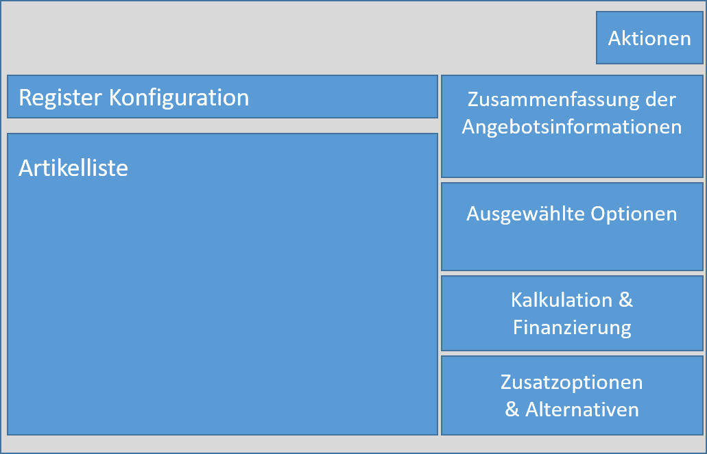
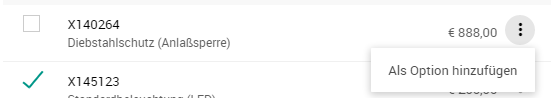
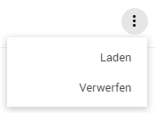

# Vertriebsclient Konfigurator (Zusatzmodul)

## Allgemein

Der Konfigurator ermöglicht dem Anwender vordefinierte Konfigurationen für Produkte fehlerfrei als Angebot erstellen zu können um schnell und direkt beim Kunden vor Ort über Machbarkeit und Preis Auskunft zu geben. 
Zusätzlich zu den ergänzenden Optionen, die zum Standard Produkt hinzugewählt werden können, kann der Anwender Vorschläge in Form von Optionen oder Alternativen im Angebot aufführen. 
Der Konfigurator unterstützt den Anwender abhängig von Produktgruppe, Produkt und gewählten Optionen über Einschlüsse, Ausschlüsse sowie Hinweisfälle. 

## Layout Konfigurator

### Register Konfiguration

***Artikelliste*** enthält alle zum Produkt hinterlegten Artikel. Diese werden zwecks Übersicht in Artikelgruppen im Form einer Ziehharmonika ein- und ausgeblendet dargestellt. 

Die Hierarchie ist dabei folgendermaßen aufgebaut:

0. Standardausstattung

1. Artikelkategorie 1

   1. Artikelgruppe 2

      -> gewählte Option aus der Artikelgruppe

In jeder Artikelgruppe sind hinter dem weitere Varianten von Optionen hinterlegt, die jedoch erst nach der Selektion angezeigt werden.

**Hinweis: **Im ersten Reiter *Standardausstattung* werden die vorgegebenen Optionen der Standardausführung von gewählten Produkt aufgelistet und können von den ausgewählten Optionen wieder abgewählt werden (siehe Kapitel *ausgewählte Optionen löschen*), wodurch der Artikel aus der Standardausstattung verschwindet. 

***Aktionen*** im Bereich der Schnellzugriffsleiste enthalten mehrere Funktionen, die im Kapitel *Aktionen* detailliert erläutert werden:

- *Neue Angebotsposition:* Neue Angebotspositionen hinzuzufügen
- *Vorschau* von konfigurierter, sowie kalkulierter Preisauskunft
- *Speichern:* Konfiguration als Angebot zu speichern
- *Senden:* Preisauskunft per Mail zu versenden
- *Laden:* gespeichertes Angebot zu laden
- *Auftrag anlegen:* das Angebot direkt in Auftrag zu überführen

Die ***Zusammenfassung der Angebotsinformationen*** enthält die Produktgruppen-, & Produktbezeichnung, Kundenname, Projektname, Angebotsnummer.

Unter ***ausgewählten*** ***Optionen*** wird die Liste der ausgewählten Artikel zum Basisprodukt angezeigt und in der Kalkulation den summiert Preis von Basispreis mit ausgewählten Optionen, sowie den Mehrpreis der ausgewählten Zusatzkomponenten dargestellt. 

### Register Kalkulation

Im Gegensatz zum Register Konfiguration werden anstatt der Artikelliste die Kalkulationsparameter abgebildet, um finale Preisauskünfte z.B. je nach Rabatt und Anzahlung zu kalkulieren. Mehr siehe Kapitel *Kalkulation*.

## Konfiguration

### Einstieg in eine Konfiguration

Eine Konfiguration ist eine von drei möglichen Auftragserfassungsarten im L-mobile Vertriebsclient (Details, siehe Kapitel: *Vertrieb - Angebote*). Das Erfassen von Konfigurationen erfolgt immer im Rahmen eines Angebots (mit Auftragserfassungsart Konfiguration). Eine Konfiguration lässt sich über mehrere Wege starten:

- Direkteinstieg im Hauptmenü *Konfiguration*

  Bedingung: keine

- Projektakte - Register Angebote - *Neues Angebot* (Typ Konfiguration)

  Bedingung: keine

- Firmenakte - Register Angebote - *Neues Angebot* (Typ Konfiguration)
  Bedingung: Ein Projekt muss vorhanden sein

- Hauptmenü Vertrieb - Angebote - *Neues Angebot* (Typ Konfiguration) 

  Bedingung: Ein Projekt und dazugehörige Firma müssen vorhanden sein, dabei kann ein Projekt mehrere Angebote unabhängig vom Produkt und Angebotstyp haben.

**Hinweis:** Die Basisdaten des konfigurierten Angebots werden automatisch gefüllt, wenn das zu konfigurierende Angebot mit Auftragserfassungsart Konfiguration aus einem Projekt initiiert wird. Sofern die Konfiguration aus dem Direkteinstieg gestartet wurde, müssen die Daten manuell beim Speichern ausgefüllt werden.

### Neues Angebot im Konfigurator erstellen

Die Konfiguration beginnt mit der Auswahl von Produkt. Hierfür wird man in hierarchischer Reihenfolge über die Produktgruppen zum Produkt geführt. 

Je nach Konfigurator Konzept werden die Produkte kundenspezifisch entweder

- mit Bildvorschau 

  

- oder in Listenansicht dargestellt. 

  

**Hinweis:** Der Produktgruppen-Pfad wird im Kopf dargestellt (z.B. Start / Baumaschinen / Radlager) und ermöglicht schnellere Navigation bei der Auswahl des richtigen Produktes. Ist das Produkt ausgewählt erscheint die Konfigurationsmaske, siehe Kapitel *Layout Konfigurator*.

### Auswahl von Optionen

Die Optionen-Artikel werden über die Artikelkategorie (z.B. *1. Basis*), sowie Artikelgruppe (z.B. *Elektronisches Zubehör*) gruppiert angelegt. 

Über die Schaltflächelassen sich neue Optionen zur jeweiligen Artikelkategorie und Artikelgruppe hinzufügen, sofern ein Artikel hinterlegt wurde. 

Es erscheint das Auswahlfenster für Optionen.

Mit Aktivieren des Kästchens wird die Option gewählt oder des Menü-Punktes *Als Option hinzufügen* lässt sich die Option selektieren und mit der Schaltfläche *Übernehmen* in das Angebot ergänzen.

**Hinweis:** Wenn viele Artikel innerhalb von Artikelgruppe hinterlegt sind, lässt sich durch die Eingabe der Artikelnummer oder der Artikelbezeichnung die Liste eingrenzen. Mit %-Zeichen lässt sich auch Volltext-Suche durchführen (z.B. **%schutz** -> Ergebnis: Diebstahl**schutz**, Regen**schutz** usw.)

### Hinweise bei Konfiguration

Die Artikel aus Standardausstattung werden im Auswahlfenster mit blauen Hinweistext *Standardausstattung* gekennzeichnet. 

### Ausschlüsse Optionen

Nach der Auswahl von bestimmten Artikeln, können andere Artikel ausgeschlossen werden. So kann beispielsweise eine Baumaschine nicht gleichzeitig zwei Antriebsmotoren gleichzeitig haben - daher wird der Artikel eindeutig mit *Verboten durch Artikeln* gekennzeichnet.

 

Sollte der Anwender dennoch die verbotene Option selektieren und auf *Übernehmen* klicken, erscheint eine Warnmeldung. Bestätigt der Anwender erneut mit *Übernehmen* werden die den Verbot verursachenden Optionen aus dem Angebot rausgenommen.

### Einschlüsse Optionen

Einschlüsse Optionen die für das Produkt oder eine ausgewählte Option vorgegeben sind, werden mit *Artikel wird benötigt* gekennzeichnet und können nicht abgewählt werden. Ist eine Option eingeschlossen, kann diese nicht abgewählt werden und es erscheint wie bei den Einschlüssen ein Hinweis darauf, welche Option den Einschluss verursacht.

### Optionalen Optionen mit Mehrpreiskalkulation

Wünscht sich der Kunde einen Artikel der mit einer Preisauskunft optional angeboten werden soll (z.B. "Was kostet es, wenn man noch Winterreifen dazukauft"), so kann diese in der ausgewählten Optionsliste über die Schaltfläche  und *Als Option hinzufügen*.

Daraufhin wird unterhalb von Angebotssumme die optionale Option hinzugefügt.

### Alternative zur Option hinzufügen

Möchte der Kunde eine Preisauskunft für eine Alternative Optionswahl (z.B. "Was kostet es, wenn man Sommerreifen statt Winterreifen kauft").  lässt sich in der ausgewählten Optionsliste über die Schaltfläche  und *Alternative hinzufügen*, um eine Alternative auszuwählen. 

Es erscheint eine Benachrichtigung, dass der Anwender sich im Modus für Alternativauswahl befindet. 

Nun wählt man eine alternative Option aus und bestätigt diese mit *Übernehmen*.

Es erscheint daraufhin der Aufpreis, sofern sich der Kunde für die teurere/günstigere Alternative entscheidet in der Auswahlliste.

Sobald man mit der Auswahl der Alternativen fertig ist, lässt sich der Modus durch *Beenden* abbrechen. 

**Hinweis:** Alternativen können zu jeder Option berechnet werden.

### Ausgewählte Optionen Löschen

Zum Löschen von ausgewählten Optionen, optionalen Optionen, oder Alternativen gehe man über die Schaltfläche  auf *Entfernen*

## Kalkulation

### Allgemein

Sobald die Konfiguration bzw. das Angebot erfolgreich erstellt worden ist, lässt sich das Angebot kalkulieren. 

Die Kalkulation beinhaltet folgende Kalkulationsparameter:

- **Standardkonfiguration** zeigt den Preis für das Standardprodukt bzw. Standardmaschine.
- **Abzgl. Standardausstattung** ist der Abzug für die abgewählten Standardkomponenten bei der Konfiguration.
- **Zwischensumme** berechnet den Preis von Standardmaschine abzüglich der abgewählten Standardkomponenten.
- **Zzgl. Zusatzausstattung** ist der Preis für die hinzugewählten Optionen in der Konfiguration. Optionale Optionen und Alternativen werden hierbei nicht berücksichtigt.
- **Zusätzliche Parameter** können in der Kalkulation mitberücksichtigt werden. Mehr Informationen, siehe *Hinzufügen von Zusätzlichen Parametern.*
- **Einstandspreis** ist der kalkulierte Preis aus Angebotspreis der Angebotskonfiguration und den zusätzlichen Parametern.
- **Verkaufspreis** ist der von Vertriebsmitarbeiter angebotene Preis an den Kunden.
- **Marge** und **Marge in %** ist die Berechnung der abzüglichen Marge vom Verkaufspreis gegenüber dem Einstandspreis. Dabei wird der Verlust rot gekennzeichnet und Gewinn schwarz.

### Hinzufügen von Zusätzlichen Parametern

Der Anwender kann bei der Erstellung von Angebot flexibel weitere Parameter in der Kalkulation mitberücksichtigen:

- **Gutschrift** wirkt sich Einstandspreis-mindernd und wird u.a. für Anzahlung oder Inzahlungnahme für Altmaschinen genutzt.
- **Skonto** wirkt sich Einstandspreis-mindernd aus und wird i.d.R. bei günstigen Zahlungsbedingungen gewährt.
- **Sonstige Kosten** wirken sich Einstandspreis-erhöhend aus und werden u.a. bei zusätzlichen Kundenwünschen aufgepreist. (z.B. schnellere Lieferzeit)

Für Hinzufügen zusätzlicher Parameter wählt man zuerst den Typ (z.B. Gutschrift) aus und klickt auf die Schaltfläche *Hinzufügen*. Es öffnet sich das Bearbeitungsmenü mit Bemerkungstext und Betrag. Nach der Eingabe von Betrag, wird der Einstandspreis automatisch aktualisiert.

Durch erneute Auswahl von Typ und Klicken auf *Hinzufügen* können weitere zusätzliche Parameter ergänzt werden.

## Aktionen 

### Allgemein

Anwender hat in der Konfigurations- und Kalkulationsansicht mit Hilfe von Aktionen in der Schnellzugriffsleiste folgende Funktionen auszuführen:

- *Neue Angebotsposition:* Neue Angebotspositionen hinzuzufügen

- *Vorschau* von konfigurierter, sowie kalkulierter Preisauskunft

- *Speichern:* Konfiguration als Angebot zu speichern

- *Senden:* Preisauskunft per Mail zu versenden

- *Laden:* gespeichertes Angebot zu laden

- *Auftrag anlegen:* das Angebot direkt in Auftrag zu überführen

  

### Angebotsvorschau und Versand von Preisinformation

Die Angebotsvorschau ist eine unverbindliche Preisauskunft mit der Übersicht der wichtigsten Eckdaten. 

Es enthält folgende Informationen:

- **Rechnungsadresse**: Adresse des Kunden und das dazugehörige Projekt. Sofern der Kunde oder das Projekt nicht ausgewählt sind, bleibt dieser Bereich leer. Diese Adresse wird beim Abspeichern von Angebot optional angeboten.
- **Datum**: ist das Erstellungsdatum von Angebot.
- **Kundennummer** von Kunden, sofern dieser im Angebot hinterlegt ist.
- **Ansprechpartner und dessen E-Mail Adresse:** Ansprechpartner beim Projekt bzw. Angebot.
- **Anschreiben Text** wird automatisch erstellt und ist fix.
- **Liste von Optionen** enthält alle Positionen aus den gewählten Optionen ohne Alternativen. Dabei werden die einzelnen Preisbeträge nicht dargestellt.
- **Gesamtpreis** ist der Verkaufspreis
- **Zusatzoptionen** sind die optionalen Optionen, die der Kunde zusätzlich bestellen kann.

Mit der Option lässt sich die Angebotsvorschau drucken.

Sofern der Anwender mit der Angebotsvorschau zufrieden ist, lässt sich über Schnellzugriffs-Aktion ***Senden*** das Dokument als PDF an seinen Ansprechpartner per E-Mail verschicken. Die E-Mail Adresse muss vorher unter Schnellzugriffs-Aktion ***Speichern*** hinterlegt sein.

**Hinweis:** Angebotsvorschau lässt sich auch ohne Kunde und Projektangaben anzeigen und drucken. Dabei ist das Versenden nicht möglich.

### Angebot speichern

Über den Schnellzugriff ***Aktion -> Speichern***  kann eine neue Konfiguration abgespeichert werden und bereits gespeicherte Konfigurationen aktualisiert werden. Das Abspeichern von Konfigurationen kann mit oder ohne Kundenangabe erfolgen. 

**Hinweis:** Felder Kontaktperson, Lieferadresse, Rechnungsadresse, Projekt erfordern vorher die Auswahl von Kunde und zeigen bei der Eingabe der Daten Vorschläge, die ausgewählt werden müssen.

### Bestehendes Angebot laden

Über die Schnellzugriffs-Aktion ***Laden*** kann eine bestehende Konfiguration geladen werden. Der Anwender erhält dabei die Übersicht über alle seine Angebote, sowie deren Konfigurationen.

Über die Schaltfläche lassen sich die Angebote laden oder löschen. 

Wenn die vorherige Konfiguration nicht abgespeichert wurde und man versucht ein bestehendes Angebot zu laden, wird man nochmals vom System hingewiesen, dass mit *Verwerfen* alle Änderungen der vorherigen Konfiguration verworfen werden. 

**Hinweis:** Bevor man neue Konfigurationen lädt oder neu erstellt - immer erst die offene Konfiguration abspeichern.

### Angebot in Auftrag überführen

Sofern der Kunde mit dem Angebot einverstanden ist, lässt sich das Angebot in einen Auftrag überführen. Der Kunde kann dabei die finale Entscheidung aus der gewählten Alternativen und Optionen selektieren und seine Unterschrift setzen. Mit der Schaltfläche ***Anlegen*** wird der Auftrag erstellt. Dieser Auftrag lässt sich anschließend nicht mehr ändern bzw. löschen.

