## PDF-Checklisten

Neben den normalen Checklisten, unterstützt unsere Produkt auch das Hochladen von PDF-Dateien als Checklisten. Diese PDFs können analog zu den Checklisten erstellt und verwendet werden. Außerdem ist es möglich die PDF so zu bearbeiten, sodass sie später automatisch mit Werten befüllt und unterschrieben werden kann.

### Erstellen der Standard PDF

Um die oben genannten Funktionalitäten zu erreichen, muss die PDF-Checklist vor dem Hochladen bearbeitet werden. Dazu kann z.B. [Adobe Acrobat Pro] (https://www.adobe.com/de/acrobat/acrobat-pro.html)

verwendet werden. Acrobat Pro ist eine Drittanbieter Software, für deren Nutzung zusätzliche Kosten

aufkommen. Grundsätzlich ist es egal was für ein Tool Sie zur PDF bearbeitung verwenden, wichtig ist das Sie die Möglichkeit haben Felder zu Erstellen und deren Name Attribut zu ändern.

### Bereits bestehende PDF bearbeiten

Um die PDF zu bearbeiten, öffnen Sie Acrobat Pro und klicken auf **open file**. Wählen Sie die zu

bearbeitende Datei aus.

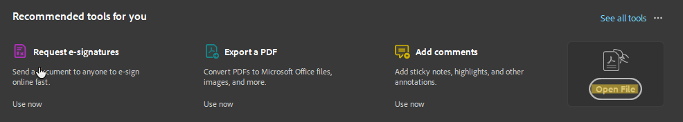

### Neue PDF erstellen

1. Um eine neue PDF Datei zu erstellen, klicken sie unter **All Tools** auf **Create a PDF**.

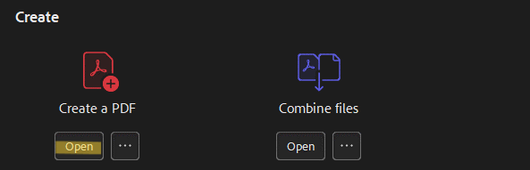

2.Wählen Sie **Blank page** aus und klicken Sie auf **Create**.

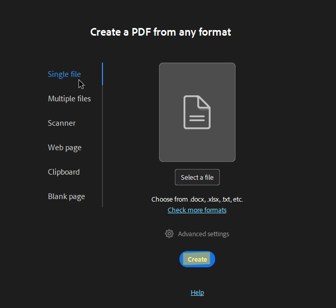

3. Nun können Sie die erstellte PDF bearbeiten.

#### Definieren der zu befüllenden Felder

Um später die PDF-Checkliste in Einsatz automatisch mit den entsprechenden Werten befüllen zu können, müssen diese zuvor definiert werden.

1.	Sollten Sie bereits bearbeitbare Felder in Ihrer PDF haben, Lösen Sie diese von der PDF.

2.  Falls nicht, Erstellen Sie ein neues Feld.

3.	Dazu klicken Sie links im All tools Menü auf **Prepare a form**

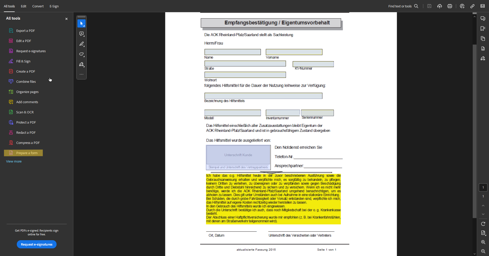

4. Wählen Sie ihr gewünschtes Inputfeld aus:

    - Text field  eignet sich für einzeilige Eingaben

    - Image field eigenet sich für Bilder

    - Checkbox  erzeugt eine Checkbox

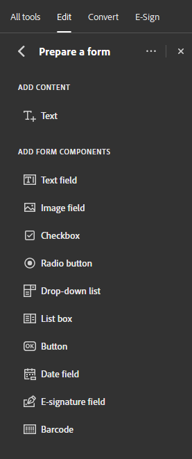

5.	Ziehen Sie das Feld genau dorthin, wo später der Text stehen soll.

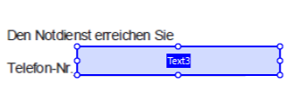

6.	Um das Feld später automatisch zu Befüllen, Wählen Sie das Feld aus und klicken auf Properties.

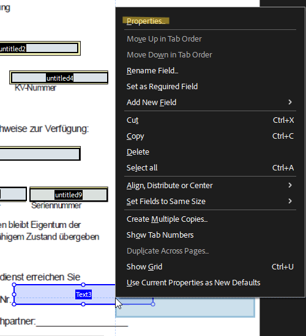

Setzen Sie das **Name**-Feld auf den gewünschten Wert, z.B. serviceOrder_Company_Name um später das Feld automatisch mit dem Firmennamen zu befüllen.

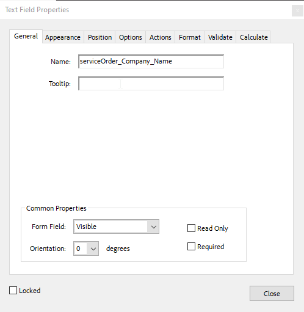

 # 7. Die folgenden Werte werden momentan unterstützt:

| Wert                                 | Placeholder für das Name-Attribut        |
| :----------------------------------- | ---------------------------------------- |
| aktuelles Datum                      | Date                                     |
| aktuelle Uhrzeit                     | Time                                     |
| aktuelles Datum und aktuelle Uhrzeit | Date_And_Time                            |
| Create Date / Issue Date             | dispatch_CreateDate                      |
| User                                 | dispatch_CreateUser                      |
| Datum                                | dispatch_Date                            |
| Diagnosis                            | dispatch_Diagnosis                       |
| Name des Technikers                  | dispatch_Username                        |
| Email des Technikers                 | dispatch_DispatchedUser_Email            |
| Vorname des Technikers               | dispatch_DispatchedUser_FirstName        |
| Nachname des Technikers              | dispatch_DispatchedUser_LastName         |
| Letztes Status Update                | dispatch_DispatchedUser_LastStatusUpdate |
| Dauer                                | dispatch_Duration                        |
| Serviceauftragsnummer                | dispatch_OrderId                         |
| Hintergrundinfo                      | serviceOrder_BackgroundInfo              |
| Stadt                                | serviceOrder_City                        |
| Name der Firma / des Kunden          | serviceOrder_Company_Name                |
| Stadt der Firma / des Kunden         | serviceOrder_Company_addresses_0_City    |
| Straße der Firma                     | serviceOrder_Company_addresses_0_Street  |
| Postleizahl des Kunden               | serviceOrder_Company_addresses_0_ZipCode |
| Fehlermeldung                        | serviceOrder_ErrorMessage                |
| Verursacher                          | serviceOrder_InitiatorPerson             |
| Kaufdatum                            | serviceOrder_PurchaseDate                |
| Auftragsnummer                       | serviceOrder_OrderNo                     |
| Störungsdatum                        | serviceOrder_CreateDate                  |
Um weitere Felder von Dispatches zu verwenden, muss folgende Struktur verwendet werden:

`dispatch_<Name der Spalte aus der Datenbank>` , z. B.: dispatch_ErrorCode

Wichtig dabei ist, auf die Groß- und Kleinschreibung zu achten.

Um weitere Felder von Arbeitseinsätzen zu verwenden, muss folgende Struktur verwendet werden:

`serviceOrder_<Name der Spalte aus der Datenbank>` , z. B.: serviceOrder_Status Wichtig dabei ist, auf die Groß- und Kleinschreibung zu achten.

Um weitere Felder von Installationen zu verwenden, muss folgende Struktur verwendet werden:

`serviceOrder_Installation<Name der Spalte aus der Datenbank>` , z. B.: serviceOrder_Installation_Sta- tus

Wichtig dabei ist, auf die Groß- und Kleinschreibung zu achten.

8. Drücken Sie **Close** um die Änderungen zu speichern.

9.	Wiederholen Sie dieses Vorgehen, für alle Felder, die später bearbeitbar sein sollen.

#### Erstellen eines Unterschriften-Feldes

Um später die PDF unterschreiben zu können, muss das Unterschriften Feld gekennzeichnet/erstellt werden.

1. Wählen Sie auf der linken Seite **Button**.

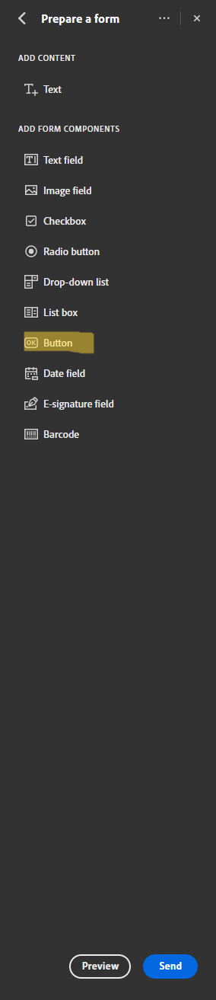

2.	Ziehen Sie den Button genau dorthin, wo später die Unterschrift sein soll. Der Button wird dann nach dem Unterschreiben mit der Unterschrift ersetzt.

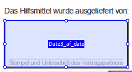

3. Nun öffnen sie die Eigenschaften des Buttons (gleich wie bei einem Textfeld, vgl. oben)

4. Ändern Sie den Wert des Name-Attributs: **Placeholder-Unterschrift <Name des Unterzeichners>** ,

    also z.B Placeholder-Unterschrift Kunde.

5. Wählen Sie die Eigenschaften **Read Only** und **Visible** aus.

6. Ändern Sie das Placeholder-Attribut auf einen beliebigen Wert, z.B. Unterschrift Kunde.

7. Speichern Sie die Änderungen mit **Close**.

 
8. Erstellen Sie wie oben bereits beschrieben ein neues Textfeld, welches genau über dem Reset-Button liegt

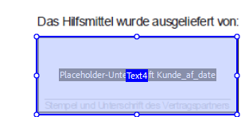

9. Nennen Sie das Name-Attribut des Text-Feldes um: **Unterschrift 'Name des Unterzeichners'**, z.B. Unterschrift Kunde

10. Achten Sie darauf, dass der Name des Unterzeichners bei dem Reset Button und dem Textfeld ge-

    nau gleich sind.

11. Speichern Sie ihre Änderungen mit Close.

12. Wiederholen Sie die Schritte 1-12 falls Sie weitere Unterschriftenfelder erzeugen möchten. Achten

    Sie darauf, dass alle Unterschriftenfelder einen anderen „Name des Unterzeichners“ besitzen.

Es ist eine unbegrenzte Anzahl an Unterschriften möglich.

 
#### 2.3 SYNCHRONISATION VON FELDERN

Die Synchronisation von Feldern, ist nur relevant, wenn Sie eine PDF-Checkliste mit mehreren Sprachen

erstellen möchten. Falls Sie z.B. die gleiche PDF in deutscher und in englischer Version haben, ist es

sinnvoll eine PDF-Checkliste mit zwei Sprachen zu erstellen und zu jeder Sprache die passende PDF

hochzuladen. Um später im Einsatz dann nicht PDFs doppelt ausfüllen zu müssen, haben Sie die Mög-

lichkeit Felder zu Synchronisieren, d.h. sobald Sie z.B. in der deutschen PDF ein Feld ändern, dasselbe

Feld in der englischen PDF automatisch geändert wird.

Um dies zu erreichen, sind folgende Schritte nötig.

1. Wählen sie in der ersten PDF ein Feld (Textfeld, Checkbox) zur Synchronisation aus.

2. Ändern Sie das **Name** - Attribut auf eine eindeutige, noch nicht wo anders verwendete eindeutige Zahl

3. Speichern Sie die Änderungen mit Close

4. Wählen Sie in der zweiten PDF das Feld aus, dass mit dem der ersten PDF synchron sein soll.

5. Ändern Sie auch hier das Name-Attribut des Felds auf dieselbe Zahl wie in der ersten PDF, also die 1

6. Speichern Sie die Änderungen mit Close

7. Wiederholen Sie dies für alle Felder die synchronisiert werden sollen (Verwenden Sie am besten auf-

    steigende Zahlen, also für die ersten beiden Felder die 1, für die nächsten 2 die 2, usw...)

#### 2.4 SPEICHERN DER PDF

Nachdem Sie alle Felder erstellt und bearbeitet haben, können Sie die PDF speichern, indem Sie auf den

Speicher-Button gehen.

### Erstellen einer neuen PDF-Checkliste

Sie können in der Anwendung nun ihre Standard PDF hochladen. Erstellen Sie eine neue DynamicForm und wählen Sie als Kategorie "PDF-Checkliste" (vgl. Erstellen einer neuen Checkliste). Das Erstellen einer PDF-Checkliste ist sowohl im Backend, als auch in L-mobile Field möglich. Folgend wird das Erstellen im Field betrachtet.

1. Navigieren Sie zu <b>Stammdaten → Dynamische Formulare</b>  

2. Fügen Sie eine Checkliste hinzu, indem Sie auf den den Button rechts unten klicken.

3. Wählen Sie als Kategorie "PDF Checkliste aus"  → Speichern Sie das dynamische Formular

4. Auf der rechten Seite haben Sie die Möglichkeit, eine PDF hochzuladen.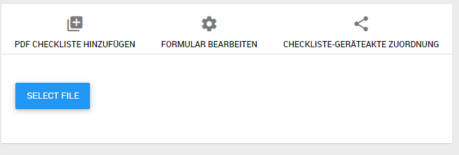 

5. Sobald Sie eine PDF hochgeladen haben, erscheint diese auf der linken Seite. 

6. Über das Menü können Sie die hochgeladene PDF ansehen oder wieder entfernen

7. Sie können auch für mehrere Sprachen unterschiedliche PDFs hochladen.

8. Vergessen Sie nicht die Checkliste zur Nutzung freizugeben (Formular bearbeiten → Status → Freigegeben )

9. <b>Speichern Sie die PDF-Checkliste</b>

