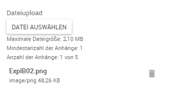

# Dynamische Formulare {#crmdynamicforms}
Mit dynamischen Formularen kann man sich individuelle Eingabemöglichkeiten erschaffen, die z.B. im Rahmen von Servicearbeiten oder weiteren Prozessen Verwendung finden.

## Formulare verwalten {#crmdynamicforms-formulare-verwalten}
Die Formularverwaltung erreicht man über den Menüpunkt _Stammdaten_ → _Dynamische Formulare_. Dort können Sie bestehende Formular anschauen, neue Formulare anlegen oder bereits bestehende Formulare bearbeiten.

### Formulare anlegen {#crmdynamicforms-formulare-anlegen}

Neue Formulare können in der Formularliste über die Plus-Schaltfläche angelegt werden.

Bei der Anlage wird festgelegt, um welche Art von dynamischem Formular es sich handelt. Durch unser Standardprodukt stehen "Checkliste" für Serviceauftrags- Checklisten und "Besuchsbericht" für Besuchsbericht- Checklisten, sowie "Erweiterungsformulare" zur Verfügung. Dies ist ausschlaggebend dafür, wo das neu erstellte Formular zur Auswahl steht.

### Formulare löschen {#crmdynamicforms-formulare-loeschen}

Desweiteren kann das dynamische Formular auch aus der Liste heraus über das Kontextmenü der einzelnen Einträge gelöscht werden.

### Formulare bearbeiten {#crmdynamicforms-formulare-bearbeiten}

Man gelangt über einen Klick auf den Titel des Formulars in den Editor. 

Im Kontextbereich des Editors befindet sich das dynamische Formular. In der Seitenleiste kann das dynamische Formular gespeichert, angesehen und exportiert werden. Darunter befindet sich der Baukasten für das dynamische Formular. Unter "Formular bearbeiten" können die allgemeinen Informationen, sowie der Status pro Sprache bearbeitet werden.
Im Reiter *Felder hinzufügen* kann man neue Felder per Drag and Drop in das Formular ziehen. Wenn man nun die Eigenschaften eines Felds bearbeiten möchte, wählt man dieses im Editor aus. In der Sidebar wird sich der Tab "Feld bearbeiten" automatisch öffnen.

> **Bearbeiten von veröffentlichten Formularen:** Beim Bearbeiten von bereits veröffentlichten Formularen wird besonders um Vorsicht gebeten. Für die Erstellung des PDF's wird das aktuelle Formular verwendet. Daher wird empfohlen nur fehlende Felder zu ergänzen und bestehende nicht zu verändern. Die Verwendung von Versionen wird empfohlen.

 

### Mehrsprachigkeit

Die dynamischen Formulare unterstützen Mehrsprachigkeit. Dazu kann man in der Seitenleiste im Editor der dynamischen Formulare eine Sprache hinzufügen. Jede dieser Sprachen beinhalted einen eigenen Status (Entwurf, Freigegeben oder Archiviert). Welche Sprache des Formulars bearbeitet wird ist in der Kopfzeile des Kontextbereiches auswählbar.

 

### Formularelemente
Im Bezug auf die Element Zeilenlänge: Die Checkliste ist in 4 Spalten unterteilt. Ist ein Element Groß, also 4 Spalten lang nimmt dieses die gesamte Breite der Checkliste ein. Hat man ein Mittleres Element (2 Spalten) so kann entweder noch Mittleres oder zwei kleine Elemente mit jeweils einer Spalte folgen. Sind alle 4 Spalten voll, oder passt das folgende Element nicht mehr in die verbleibende Breite, so wird eine neue Zeile angefangen.

Extra CSS-Klassen: Diese dienen für die Anpassung der Checkliste. Mit Hilfe dieser Klassen können Design und Layout verändert werden. Eine Übersicht befindet sich im Kapitel [Optionen zur Layoutgestaltung](#crmdynamicforms-layout-gestaltung).

#### Datum
Mit dem _Datum_ Element kann die ausfüllende Person einen Zeitpunkt festhalten. Folgende Parameter stehen zur Verfügung:

Parameter | Erläuterung
- | -
Feldbezeichnung | Name und Zweck des Datums
Benötigt | Dieses Element wird ausgefüllt zum Abschließen der Liste benötigt
Element Zeilenlänge | Legt die Größe des Elements fest.
Extra CSS-Klassen | Zum Hinzufügen von Klassen für die Anpassung. Siehe oben.
Hinweis | Hier können zusätzliche Informationen zum Feld hinterlegt werden.

 

#### Checkbox-Liste
Die Checkbox-Liste ist ein Element, in dem mehrere Optionen abgehakt werden können.

Parameter | Erläuterung
- | -
Feldbezeichnung | Name und Zweck der Checkbox-Liste
Benötigt | Dieses Element wird ausgefüllt zum Abschließen der Liste benötigt
Randomisiert | Die Reihenfolge der Optionen wird zufällig dargestellt, um Unachtsamkeiten zu verhindern
Auswahl min./max. | Legt ein Minimum / Maximum an ausgewählten Optionen fest.
Optionen | Hier können Optionen hinzugefügt und entfernt werden
Element Zeilenlänge | Legt die Größe des Elements fest.
Layout | Legt das Layout der Optionen untereinander fest. 
Extra CSS-Klassen | Zum Hinzufügen von Klassen für die Anpassung. Siehe oben.
Hinweis | Hier können zusätzliche Informationen zum Feld hinterlegt werden.

 

#### Dropdown-Liste

In der Dropdown-Liste kann nur eine Option gewählt werden. Dieses Element bietet sich an, um eine bessere Übersichtlicht zu gewähren.

Parameter | Erläuterung
- | -
Feldbezeichnung | Name und Zweck der Dropdown-Liste
Benötigt | Dieses Element wird ausgefüllt zum Abschließen der Liste benötigt
Randomisiert | Die Reihenfolge der Optionen wird zufällig dargestellt, um Unachtsamkeiten zu verhindern
Optionen | Hier können Optionen hinzugefügt und entfernt werden
Element Zeilenlänge | Legt die Größe des Elements fest.
Element Größe | Legt die Größe unabhängig der Elementgröße fest.
Extra CSS-Klassen | Zum Hinzufügen von Klassen für die Anpassung. Siehe oben.
Hinweis | Hier können zusätzliche Informationen zum Feld hinterlegt werden.

 

#### Options-Liste

Die Options-Liste bietet in einem anderen Layout den gleichen Funktionsumfang wie die Dropdownliste. In der Optionsliste werden allerdings alle Optionen aufgelistet dargestellt. Es kann auch nur eine Option ausgewählt werden.

Parameter | Erläuterung
- | -
Feldbezeichnung | Name und Zweck der Options-Liste
Benötigt | Dieses Element wird ausgefüllt zum Abschließen der Liste benötigt
Randomisiert | Die Reihenfolge der Optionen wird zufällig dargestellt, um Unachtsamkeiten zu verhindern
Optionen | Hier können Optionen hinzugefügt und entfernt werden
Element Zeilenlänge | Legt die Größe des Elements fest.
Layout | Legt die Größe unabhängig der Elementgröße fest.
Extra CSS-Klassen | Zum Hinzufügen von Klassen für die Anpassung. Siehe oben.
Hinweis | Hier können zusätzliche Informationen zum Feld hinterlegt werden.

 

#### Zeit

Mit dem Zeit Element kann eine Uhrzeit in Stunde und Minute festgehalten werden.

Parameter | Erläuterung
- | -
Feldbezeichnung | Name und Zweck der Zeit
Benötigt | Dieses Element wird ausgefüllt zum Abschließen der Liste benötigt
Element Zeilenlänge | Legt die Größe des Elements fest.
Extra CSS-Klassen | Zum Hinzufügen von Klassen für die Anpassung. Siehe oben.
Hinweis | Hier können zusätzliche Informationen zum Feld hinterlegt werden.

 

#### Anzahl

Mit diesem Feld kann eine beliebige Zahl, zum Beispiel die Menge an eingefülltem Öl, dokumentiert werden.

Parameter | Erläuterung
- | -
Feldbezeichnung | Name und Zweck der Anzahl
Benötigt | Dieses Element wird ausgefüllt zum Abschließen der Liste benötigt
Wert min/max | Hier kann der Bereich der Zahl eingeschränkt werden.
Element Zeilenlänge | Legt die Größe des Elements fest.
Element Größe | Legt die Größe unabhängig der Elementgröße fest.
Extra CSS-Klassen | Zum Hinzufügen von Klassen für die Anpassung. Siehe oben.
Hinweis | Hier können zusätzliche Informationen zum Feld hinterlegt werden.

 

#### Mehrzeiliger Text

In diesem Feld kann ein mehrzeiliger Text eingegeben werden. 

Parameter | Erläuterung
- | -
Feldbezeichnung | Name und Zweck des mehrzeiligen Textes
Benötigt | Dieses Element wird ausgefüllt zum Abschließen der Liste benötigt
Länge min/max | Hier kann die minimale und maximale Anzahl an Zeichen festgelegt werden.
Element Zeilenlänge | Legt die Größe des Elements fest.
Element Größe | Legt die Größe unabhängig der Elementgröße fest.
Extra CSS-Klassen | Zum Hinzufügen von Klassen für die Anpassung. Siehe oben.
Hinweis | Hier können zusätzliche Informationen zum Feld hinterlegt werden.

 

#### Einzeiliger Text

In diesem Feld kann ein einzeiliger Text eingegeben werden. 

Parameter | Erläuterung
- | -
Feldbezeichnung | Name und Zweck des einzeiligen Textes
Benötigt | Dieses Element wird ausgefüllt zum Abschließen der Liste benötigt
Länge min/max | Hier kann die minimale und maximale Anzahl an Zeichen festgelegt werden.
Element Zeilenlänge | Legt die Größe des Elements fest.
Element Größe | Legt die Größe unabhängig der Elementgröße fest.
Extra CSS-Klassen | Zum Hinzufügen von Klassen für die Anpassung. Siehe oben.
Hinweis | Hier können zusätzliche Informationen zum Feld hinterlegt werden.

 

#### Sektion

Kann verwendet werden um Inhalte innerhalb einer Seite zu trennen.

Parameter | Erläuterung
- | -
Feldbezeichnung | Überschrift der Sektion
Extra CSS-Klassen | Zum Hinzufügen von Klassen für die Anpassung. Siehe oben.

#### Seitentrenner

Trennt die Seiten und Inhalte.

Parameter | Erläuterung
- | -
Feldbezeichnung | Name und Zweck des Seitentrenners
Extra CSS-Klassen | Zum Hinzufügen von Klassen für die Anpassung. Siehe oben.

 

#### Text

Der Text dient zur reinen Information. Hier können vom Benutzer keine Eingaben getätigt werden.

Parameter | Erläuterung
- | -
Feldbezeichnung | Name und Zweck des Textes
Extra CSS-Klassen | Zum Hinzufügen von Klassen für die Anpassung. Siehe oben.
Element Zeilenlänge | Legt die Größe des Elements fest.

 

#### Bild

Das Bild dient wie auch das Text-Element zur reinen Information. Vom Benutzer können keine Eingaben getätigt werden.

Parameter | Erläuterung
- | -
Feldbezeichnung | Name bzw. Überschrift des Bildes
Datei | Hier kann das anzuzeigende Bild hochgeladen werden. Die maximale Dateigröße pro Bild wird im Eintrag *MaxFileLengthInKb* in der *appSettings.config* festgelegt.
Extra CSS-Klassen | Zum Hinzufügen von Klassen für die Anpassung. Siehe oben.
Element Zeilenlänge | Legt die Größe des Elements fest.

#### Dateiupload
Das Element _Dateiupload_ ermöglicht es Dateien wie Bilder oder PDF-Dokumente an ein Dynamisches Formular zu hängen. Dazu stehen die folgenden Einstellungsmöglichkeiten zur Verfügung.

Parameter | Erläuterung
- | -
Mindestanzahl Anhänge | Bestimmt die Anzahl an Anhängen welche mindestens erforderlich sind um das dynamische Formular im Client abzuschließen. Dieser Parameter ersetzt die von anderen Elementen bekannte Einstellung _Benötigt_.
Höchstzahl Anhänge | Bestimmt die maximale Anzahl an Anhängen welche im Client angehängt werden können.
Maximale Bildbreite und -höhe | Beim Anhang von Bildern kann anhand dieser Einstellung eine Automatische Skalierung durchgeführt werden. Das Seitenverhältnis der angehangenen Bildes wird beibehalten.
Maximale Dateigröße | Anhänge deren Größe diesen Wert überschreiten werden mit einer Warnung im Client ignoriert. Diese Einstellung gilt nur für Anhänge welche keine Bilder sind. Dateigrößen von Bildern können nur indirekt über die Auflösung limitiert werden.
Hinweis | Der Hinweis ist den Formular-Designer bestimmt und wird nicht im Client angezeigt.

##### Ansicht im Client
Im Client besteht das Element _Dateiupload_ aus einem Dateiauswahl-Button und Hinweistexten entsprechend der Konfiguration. Falls eine Mindestanzahl an Dateien konfiguriert wurde wird das Element beim Abschluss validiert.

    
    
Ansicht Dateiupload im Client

    
    
Validierung des Elements im Client

##### Ansicht im PDF
Im PDF werden Bilder mit Bildunterschrift und Trenner eingebettet angezeigt. Andere Dateien werden als Auflistung der Dateinamen aufgeführt. Beim Versand des Einsatzberichts werden diese Dateien als Attachment an die Email angehangen. Weiterhin können alle angehangenen Dateien einzeln im SMS heruntergeladen werden.

    
    
Eingebettetes Bild im PDF

    
    
Auflistung Dateien im PDF

    
    
Auflistung Dateien im SMS

#### Unterschrift mit Bestätigung {#crmdynamicforms-formulare-elements-signature}

Auf Grund der neuen Datenschutzgrundverordnung ([GDPR/DSGVO](https://www.eugdpr.org/)), vom 25 Mai 2018, wurde die "Unterschrift mit Bestätigung" eingeführt.

##### Konfiguration

Dieses Element steht abhängig vom Eintrag *DynamicFormElement/SignaturePad/Show/PrivacyPolicy* aus der *appSettings.config* zur Verfügung.

##### Dynamisches Formular Editor
Wenn dieses Element durch die app.config freigeschaltet wurde, steht dieses im Editor zur Verfügung. 

##### Mobiler Client
Im mobilen Client kann dieses Element mit einer Checkliste eines Serviceauftrags verwendet werden. Die Bearbeitung belibt im vergleich zur regulären Unterschrift unverändert. Der Benutzer, sowie der Kunde kann jedoch hier die Datenschutzerklärung aufrufen. Der Kunde hat hier die Option diese als gelesen und verstanden zu markieren. 

Die Datenschutzerklärung kann mit dem daruter befindlichen Button angezeigt und ausgeblendet werden.

##### Datenschutzerklärung
Wurde die Datenschutzerklärung akzeptiert, so wird diese auf einer neuen Seite dem PDF der Checkliste hinzugefügt.

### Optionen zur Layoutgestaltung {#crmdynamicforms-layout-gestaltung}

Über die Site-Einstellungen können im Reiter *Bericht* Kopf- und Fußzeile der generierten Berichte angepasst werden. Es kann hier zum einen ein Logo, wie z.B. das eigene Firmenlogo, hochgeladen werden, welches dann im Berichtskopf jeder Seite angedruckt wird. Außerdem kann benutzerdefinierter Text für die Fußzeile eingetragen werden, welcher dann auch auf jeder Seite des Berichts erscheint.

Darüberhinaus stehen eine Reihe an CSS Klassen, welche das Aussehen der einzelnen Formularelemente beeinflussen, zur individuellen Gestaltung der Druckausgabe zur Verfügung und können im Formulardesigner im Feld *Extra CSS Klassen* angegeben werden:

CSS Klasse | Beschreibung
--- | ---
*well-sm* | leichte Hervorhebung durch zusätzlichen Abstand zu allen Seiten
*well-lg* | starke Hervorhebung durch zusätzlichen Abstand zu allen Seiten
*text-warning* | Text in Gelbtönen
*text-danger* | Text in Rottönen
*text-info* | Text in Blautönen
*text-success* | Text in Grüntönen

### Regeln

Jedem einzelnen Formularelement können bei Bedarf eine beliebige Anzahl an Regeln hinterlegt werden, welche abhängig von den bereits erfassten Antworten ein Ein- und Ausblenden einzelner Elemente oder das Überspringen von kompletten Abschnitten ermöglichen. Dies ermöglicht es ein Formular auch ohne Programmierkenntnisse mit komplexer Logik zu versehen. Die Auswertung der definierten Regeln findet bei der Erfassung der Antworten in Echtzeit statt, d.h. die angebotenen Elemente passen sich dynamisch an.

Soll die Sichtbarkeit eines bestimmten Elements abhängig von anderen Elementen gemacht werden, kann die Regelverwaltung dafür über die entsprechende Schaltfläche aufgerufen werden. Dies ist auch für Sektionen möglich, wobei die Regeln dann die Sichtbarkeit aller Elemente innerhalb dieser Sektion beeinflussen.

In diesem Formular werden alle Regeln, die für das ausgewählte Formularelement erstellt wurden angezeigt, und es können weitere über die *Regel erstellen* Schaltfläche hinzugefügt werden.
Es kann festgelegt werden, ob das Formularelement nur angezeigt wird, wenn eine der Regeln erfüllt ist und in allen anderen Fällen ausgeblendet wird, oder ob die Regeln steuern, dass ein Feld ausgeblendet wird.
Weitere Bedingungen einer Regel können über die grüne (+) Schaltfläche hinzugefügt, bestehende über die rote (-) Schaltfläche entfernt werden.
Werden mehrere Bedingungen für eine Regel festgelegt kann pro Regel definiert werden, ob alle der Bedingungen oder nur mindestens eine der Bedingungen erfüllt sein muss, damit die Regel die Sichtbarkeit des Elements beeinflusst.

Für jede Bedingung einer Regel wird zunächst aus einer Auswalhliste ein anderes Formularelement ausgewählt, dessen Wert die Sichtbarkeit des aktuellen Elements beeinflussen soll.

Im nächsten Schritt wird ein Filter aus einer Auswahlliste gewählt. Die hier zur Verfügung stehenden Filtermöglichkeiten sind abhängig vom gewählten Formularelement. Während bei Elementen, in welche Zahlen eingetragen werden können, Filter wie "größer als" oder "kleiner als" zur Verfügung stehen, ist bei Textelementen beispielsweise eine Auswahl von "beginnt mit" oder "enthält" möglich.

Schließlich wird abhängig vom gewählten Formularelement ein Filterwert aus einer Auswahlliste gewählt oder in ein Eingabefeld eingetragen.

### Wichtige Informationen {#crmdynamicforms-wichtige-informationen}

Shortcuts
- Speichern der Formularansicht (Strg + S)
- Löschen des aktiven Formularelementes (ENTF)



