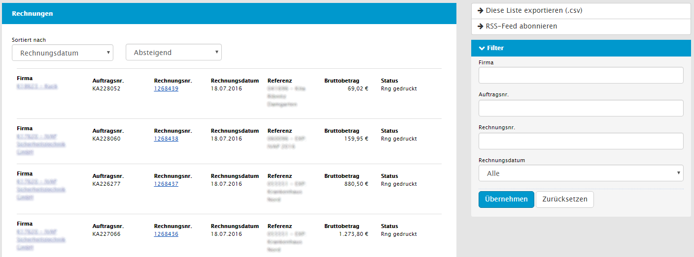

# ERP Zusatzmodul {#crmerpextension}
Das ERP Modul verschafft innerhalb des CRM einen Überblick aller Umsatzzahlen und Belegen wie z.B. Kundenaufträge, Rechnungen, Lieferscheine oder Gutschriften, welche im ERP System vorhanden sind.

## Belege {#crmerpextension-belege}
Das Modul fügt in die Kontextinformationen der Firmen einen neuen Bereich *ERP Belege* hinzu, in welchem die Anzahl der verfügbaren Belege gruppiert nach Art der Belege dargestellt wird.

Diese verweisen jeweils auf eine Ansicht, in der weitere Details zu den Belegen eingesehen werden können.

Die eindeutigen Nummern der Belege, z.B. die Rechnungsnummer verweist jeweils auf das ERP System, sodass hier die Möglichkeit besteht die Belege direkt im ERP System zu öffnen. Diese Listenansicht ist außerdem über das Hauptmenü über den Menüpunkt "ERP Belege" erreichbar.

## Umsatz- und Absatzzahlen {#crmerpextension-umsatz-und-absatzzahlen}

Ein weiterer Bereich, den das Modul in die Kontextinformationen der Firmen hinzufügt, sind die *Umsatz- und Absatzzahlen*, gruppiert nach Artikelgruppe.

Dargestellt werden hier die Zahlen des laufenden Jahres, sowie der vergangenen zwei Jahre. Über die Schaltfläche *Zeige Stk* bzw. *Zeige EUR* kann zwischen Absatz- und Umsatzzahlen umgeschaltet werden. Die Artikelgruppen verweisen jeweils auf eine Detailansicht, in der die Zahlen der einzelnen Artikel dieser Artikelgruppe zu sehen sind.

## Allgemeine Informationen {#crmerpextension-allgemeine-informationen}

Auch in den Kontextinformationen der Firmen wird der Bereich *Hintergrundinformationen* ergänzt um zusätzliche Informationen aus dem ERP-System.

