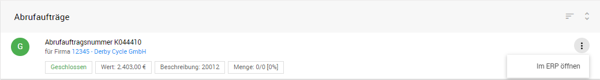

## Mobiler Vertrieb

### Listenansicht

ERP Belege lassen sich je nach Schnittstellenspezifikation aus dem ERP System auslesen und synchronisieren. Diese ermöglichen dem Mitarbeiter eine schnelle Übersicht über kaufmännische Kundenaktivitäten und Eckdaten zu Belegen:

- Abrufaufträge (Abrufauftragsnummer, Firma, Auftragsstatus, Auftragsvolumen, Beschreibung, Warenmenge)
- Gutscheine (Gutschriftnummer, Firma, Status, Gutschriftbetrag, zugehörige Auftragsnummer)
- Lieferscheine (Lieferscheinnummer, Firma, Status, zugehörige Auftragsnummer, Lieferscheindatum)
- Rechnungen (Rechnungsnummer, Firma, Status, Rechnungsbetrag, zugehörige Auftragsnummer, Lieferscheindatum)
- Kundenaufträge (Kundenauftragsnummer, Firma, Status, Auftragswert, Beschreibung, Druckdatum)
- Angebote (Angebotsnummer, Firma, Status, Angebotswert, Angebotsdatum, zugehörige Auftragsnummer)

Über die Schaltfläche  und *Im ERP öffnen* kann der Anwender die Details zum Beleg-Vorgang im ERP System öffnen.

