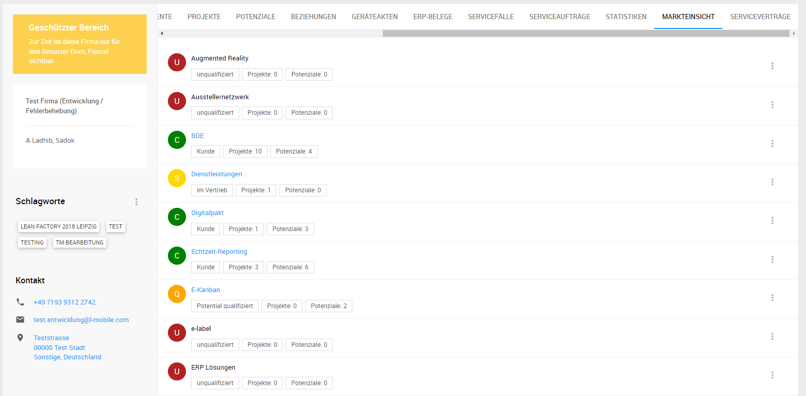
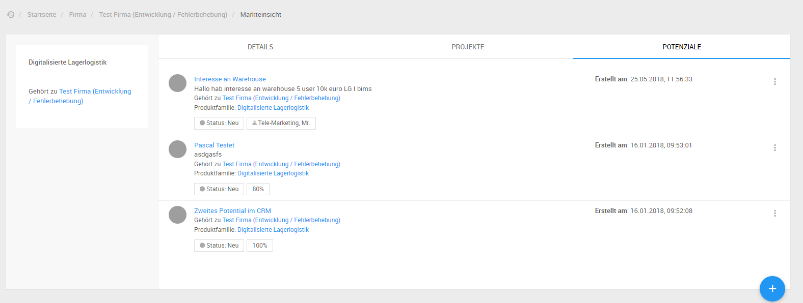

# Markteinsicht

Das Modul Markteinsicht bietet eine Übersicht der Potenziale und Projekte einer Firma, gruppiert nach Produktfamilien.

Im Reiter Markteinsicht in den Firmendetails befindet sich hierfür eine Liste aller Produktfamilien, sowie die Anzahl der offenen und gewonnenen Potenziale und Projekte.

Sobald Potenziale oder Projekte zu einer Produktfamilie existieren, kann die Detailseite der Markteinsicht aufgerufen werden, um eine Liste der Potenziale und Projekte zu dieser Produktfamilie anzuzeigen.

