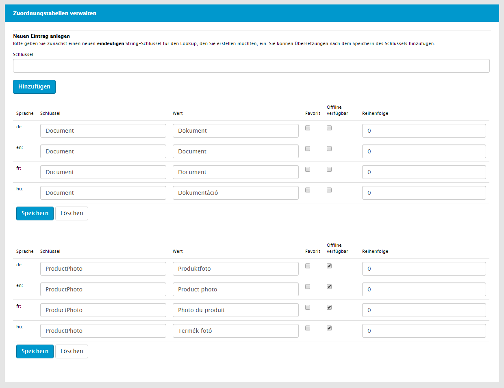
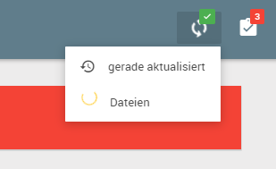
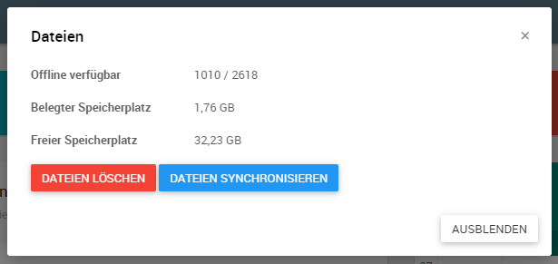
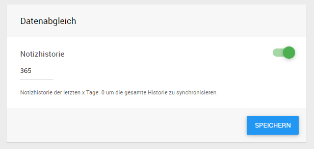
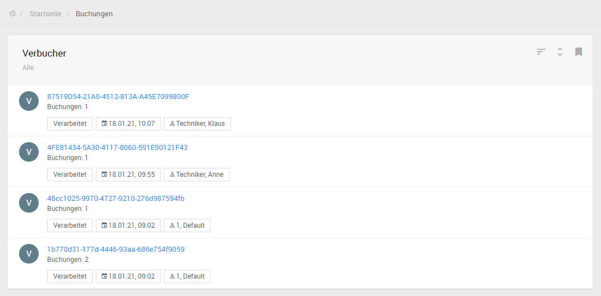
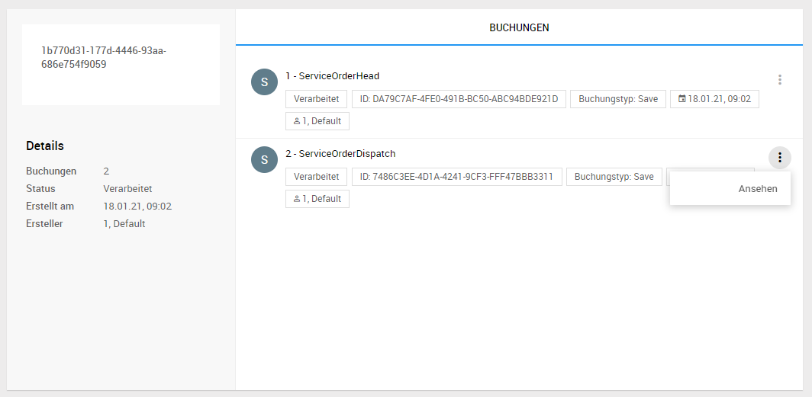

# Offline (Zusatzmodul)

Das Modul Crm.Offline bietet die Möglichkeiten Daten auf mobile Endgeräte zu replizieren um unterwegs auch mit eingeschränkter oder sogar komplett ohne Internetverbindung weiterarbeiten zu können.

## Dokumente

Neben den benötigten Anwendungs- und Nutzdaten ist es möglich beliebige Dateien und Dokumente offline auf den Geräten zur Verfügung zu stellen.
Hierzu muss in der Verwaltung der Dokumentenkategorien der Haken bei *Offline verfügbar* für die entsprechenden Kategorien gesetzt werden.

Im Client zeigt ein Indikator den aktuellen Online- und Synchronisierungsstatus an.

Hierüber kann auch entweder eine Synchronisierung der Daten angestoßen werden, oder der Dialog zur Dokumentensynchronisierung geöffnet werden.

Hier befindet sich eine kurze Übersicht der offline verfügbaren Dateien und die Möglichkeit entweder die Dateisynchronisierung zu pausieren oder fortzusetzen sowie die Möglichkeit alle offline gespeicherten Dateien zu bereinigen.

## Notizhistorie

Um die Dauer der Erstsynchronisierung und den erforderlichen Speicherplatz auf den Geräten möglichst gering zu halten ist die offline verfügbare Notizhistorie standardmäßig auf 120 Tage limitiert. Diese Limitierung kann bei Bedarf unter *Meine Infos* angepasst oder deaktiviert werden.

Die hier eingestellten Werte werden pro Gerät abgespeichert, die Erstsyncrhonisierung auf einem neuen Gerät wird somit wieder eingeschränkt.

Die Notizhistorie kann beispielsweise verwendet werden, um als Servicetechniker eine Geräteaktenhistorie einzusehen, da durch automatisch generierte Notizen festgehalten wird wann Serviceeinsätze abgeschlossen wurden.

## Verbucher

Arbeitet ein Benutzer im Offlinemodus, werden auf dem Gerät sogenannte Buchungen generiert, welche Operationen auf Datensätze beschreiben und bei der Synchronisierung zusammengefasst in Transaktionen an den Server gesendet werden.

Mit entsprechender Berechtigung können diese Transaktionen dann über den Menüpunkt *Buchungen* aufgelistet werden.

Der Administrator hat hier die Möglichkeit sich alle Details zu den Buchungen anzeigen zu lassen und fehlerhafte Buchungen ggf. zu korrigieren.

