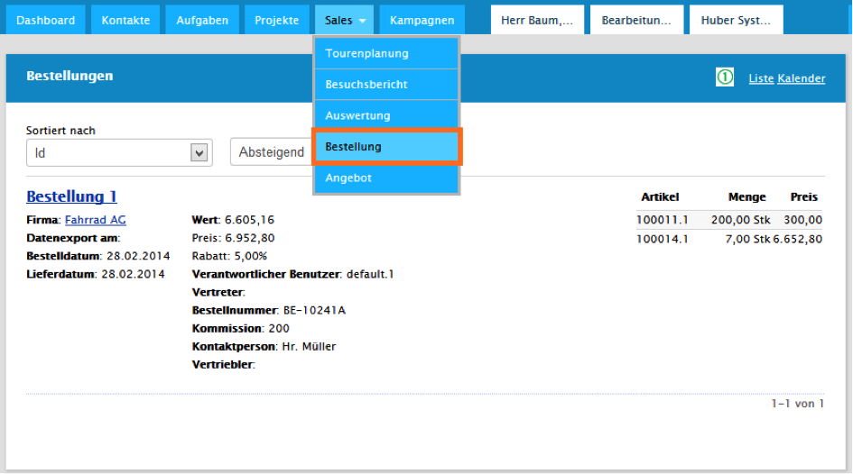

# Auftrag / Angebot (Zusatzmodul)

Das Auftrags- und Angebotsmodul bietet die Möglichkeit auf einfache Art Angebote oder Aufträge vor Ort zu erstellen und direkt vom Kunden unterschreiben zu lassen. Optimal kann hier die Verwendung von Tablets  parallel zur Präsentation und Bestellaufnahme erfolgen.

## Angebot anlegen

In der Firmenansicht lassen sich Angebote erstellen. Zu finden ist die Funktionalität unter _Angebot anlegen_ in den Kontextfunktionen. Je nach Einstellung können Angebote für Interessenten, Kunden oder über das ERP angelegte Debitoren erstellt werden. Ausschlaggebend dazu ist eine Erweiterung am Lookup _Firmentyp_, ob an einer Firma Angebote und Aufträge angelegt werden können

Der Editor zum Anlegen von Angeboten entspricht weitgehend dem der Aufträge. Er unterscheidet sich in Aufbau nur durch das Fehlen der Felder der Unterschrift. Nach der Erstellung wird man identisch zum Bestellvorgang in die Details weitergeleitet.

## Angebotsübersicht

Zu finden ist die Angebotsübersicht unter den Menüpunkten _Vertrieb - Angebot_. Diese Übersicht ist ebenso wie die Liste der Aufträge als Liste und Kalender darstellbar. Die Liste lässt sich auch in den Outlookkalender exportieren.

## Auftrag anlegen

Um für einen Kunden eine Auftrag anzulegen befindet sich in den Firmendetails des Kunden die Funktion _Auftrag anlegen_ in den Kontextfunktionen. Zu beachten dabei ist, dass diese Funktion nur für Firmen verfügbar ist, welche als Kunde im CRM gepflegt sind und eine Kundennummer besitzen. Durch diese Funktion wird man zum Editor zum Anlegen von Aufträge weitergeleitet.

Der Editor unterteilt sich in zwei Hauptabschnitte. Die Kontaktinformationen und die Bestellpositionen. In den Kontaktinformationen sind Kundennummer und die Adresse der Hauptfirma (Standardadresse) vorgegeben. Rechnungsadresse sowie auch die Lieferadresse lassen sich separiert in den darunter liegenden Dropdown Listen auswählen. Diese sind mit einem roten Stern als Pflichtfeld gekennzeichnet. Rechts über der Adressenauswahl befindet sich Bestellnummer, Kommission, Bestelldatum und Lieferdatum. Im unteren Teil der Kontaktinformationen lässt sich frei der Namen einer Kontaktperson, welche zum Beispiel die Bestellung in Auftrag gegeben hat, eingeben.

Der untere Teil des Bestelleditors beinhaltet die Bestellpositionen. Hier werden die Artikel, welche im Zusatzmodul Artikel angelegt werden, selektiert. Das geschieht über die Eingabe der Artikelnummer **(1)**. Zur erleichterten Bedienung werden während der Eingabe Vorschläge durch eine Autovervollständigung angezeigt, welche auch ausgewählt werden können. Neben einer Beschreibung, Anzahl und Stückpreis lässt sich auch auf die einzelnen Positionen ein absoluter oder prozentualer Rabatt **(2)** geben. Unter den Auftragspositionen befindet sich auf der rechten Seite eine Aufsummierung. Auch hier lässt sich nochmal auf den Gesamtpreis **(3)** ein Rabatt geben. Links von der Aufsummierung befinden sich zwei Beschreibungsfelder, eine extern sichtbare Beschreibung und eine interne Beschreibung. Während die einfache Beschreibung der Kunde sehen kann ist die _private_ Beschreibung nur für Mitarbeiter der eigenen Firma einsehbar. In diesem können zum Beispiel interne Besonderheiten zur Auftrag des Kunden enthalten sein, damit die Kommunikation zwischen Kunde und anderen Mitarbeitern reibungslos funktioniert. Direkt unter diesen Beschreibungsfeldern befindet sich das Eingabefeld für eine Unterschrift des Kunden. Dazu ist ein Klick auf _Hier unterschreiben_ **(4)** ausreichend. Daraufhin kann der Kunde unterschreiben, während die Auftrag ausgeblendet wird.

#### Baumansicht

Neben der Listenansicht gibt es unter den Tabs die Baumansicht. In dieser werden die Artikel gemäß der Artikelgruppen unterteilt. Über den Button _Hinzufügen_ werden neue Liefertermine in die unten befindliche Liste hinzugefügt.

#### Auftragsübersicht

Ein weiterer Tab ist die Auftragsübersicht. In dieser sind alle Positionen zusammengerechnet und ohne Editor einsehbar. Hier können die Rechnungssummen und Mengen kompakt überprüft werden.

Nach dem Speichern des Auftrags wird man in die Auftragsdetails weitergeleitet. In diesen lassen sich Korrekturen an dem Auftrag vornehmen. Soll diese Auftrag geschlossen werden setzt man das Häkchen bei _Auftrag abschließen_ und speichert erneut. Ist jedoch eine Auftrag falsch angelegt oder überflüssig kann diese auch in den Details wieder gelöscht werden.

### Setartikel

Werden Setartikel zu einem Angebot oder Auftrag hinzugefügt, steht für diese Positionen die Aktion *Setartikel auflösen* zur Verfügung, um die einzelnen Artikel, aus denen diese Vertriebseinheit besteht, aufzulisten. Diese werden dann als Unterpositionen des Setartikels dargestellt und sorgen dadurch für mehr Transparenz im Vertrieb.

### Zubehör

Ist für einen Artikel in einem Angebot oder Auftrag Zubehör vorhanden (siehe [Artikelbeziehungen](#crmarticle-artikelbeziehungen)), so erscheint bei dessen Position die Aktion *Zubehör anzeigen*. Diese Aktion öffnet eine Listenansicht dieser Zubehörartikel, mit der Möglichkeit diese direkt als Unterposition zum Angebot oder Auftrag hinzuzufügen.

## Aufträge - Übersicht
In die Auftragsübersicht gelangt man über die Menüpunkte _Vertrieb - Auftrag_. Dort werden alle Aufträge aufgelistet und sind filterbar. Die Darstellung kann entweder in einer Liste oder auch in einem Kalender erfolgen. Die Auswahl dazu befindet sich oben rechts in der Liste **(1)**.

Des weiteren lassen sich die Aufträge auch in den Outlookkalender exportieren. Dazu ist die Option _Kalender abonnieren_ **(1)** zuständig. Diese befindet sich rechts oberhalb des Filters in der Bestellübersicht.

## Konfiguration {#crmorder-konfiguration}

| Parameter | Beschreibung | Gültige Werte | Standardwert |
| --- | --- | --- | --- |
| OffersEnabled | Funktionalitäten zu Angeboten | true / false | false |
| OrderItemDiscountEnabled | Rabatte auf Positionsebene | true / false | true |
| OrderDeliveryAddressEnabled | Lieferadressen im Auftrag | true / false | true |
| OrderBillingAddressEnabled | Rechnungsadressen im Auftrag | true / false | false |
| OrderComissionEnabled | Komissionsnummer | true / false | false |
| OrderSignatureEnabled | Unterschriftserfassung | true / false | false |
| OrderPrivateDescriptionEnabled | Interne Bemerkung | true / false | false |
| OrderBarcodeEnabled | Barcodeerfassung | true / false | false |
| PDFHeaderMargin | Höhe der Kopfzeile im Auftrags PDF in cm | Dezimalzahl >= 0 | 1.5 |
| PDFFooterMargin | Höhe der Fußzeile im Auftrags PDF in cm | Dezimalzahl >= 0 | 5.1 |
| PDFFooterTextPush | Abstand der Fußzeile im Auftrags PDF in cm | Dezimalzahl >= 0 | 25.5 |
| ValidToDefaultTimespan | Standard-Gültigkeitsdauer für Angebote in Tagen | Ganzzahl > 0 | 30 |

## Berechtigungen {#crmorder-berechtigungen}

- **Auftrag:** Auftrag anlegen
- **Auftrag:** Auftrag abschließen
- **Auftrag:** Auftrag versenden
- **Auftrag:** Auftragsübersicht
- **Auftrag:** Baumansicht
- **Auftrag:** Listenansicht
- **Firma:** Reiter Aufträge

