## Mobiler Vertrieb

### Listenansicht Aufträge

In der Listenansicht *Aufträge* werden alle Aufträge angezeigt. Die Listenansicht enthält u.a. die Auftragsnummer und Auftragsdatum, als auch die zugehörige Firma, sowie Angebot mit dessen Angebotsnummer, Auftragsvolumen und Auftragsstatus. Die Sortierung erfolgt durch die beiden Schaltflächen  wobei man das sortierende Feld bestimmen kann und die Reihenfolge nach auf- / absteigend. Mit der Schaltfläche lässt sich der Filter für offene und geschlossene Aufträge einstellen.

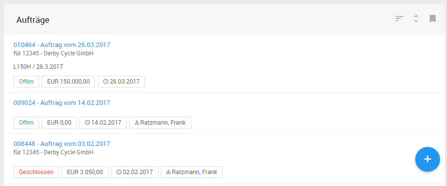

Mit Hilfe der Suchparameter in der Schnellzugriffsleiste  lässt sich im Popup Fenster und ermöglicht unter anderem nach Auftragsnummer, Verantwortlicher, Ansprechpartner usw. zu filtern.

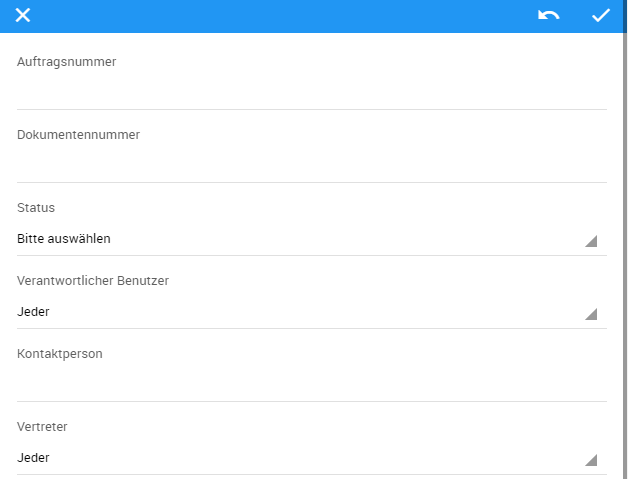

#### Neue Aufträge anlegen

Aufträge lassen sich auf drei Arten anlegen:

1. Über die Listenansicht im Hauptmenü *Vertrieb -> Aufträge*
2. Über die Registerakte mit Listenansicht aus einer Firma oder einem Projekt
3. Aus einem Angebot (der Vertriebsclient Konfigurator ermöglicht dem Anwender die vordefinierte Konfiguration für Produkte auf Basis von Produktgruppen - siehe Kapitel *Konfigurator -> Aktionen -> Angebot in Auftrag überführen*)  

Mit * gezeichneten Felder sind Pflichtfelder.

in der Listenansicht lassen sich je nach Rechteeinstellung des Anwenders über die Schaltfläche neue Aufträge anlegen.

### Auftragsakte

#### Layout

Die Auftragsakte entspricht der Ansicht im Konfigurator (siehe Konfigurator -> Layout)

Abweichend zum Konfigurator hat der Anwender in der Auftragsakte Angaben zur Auftragsnummer, sowie abweichende Aktionen zur Auswahl

hat in der Konfigurations- und Kalkulationsansicht mit Hilfe von Aktionen in der Schnellzugriffsleiste folgende Funktionen auszuführen:

- *Abschließen:* Auftrag wird abgeschlossen.
- *Vorschau:* von konfigurierter, sowie kalkulierter Preisauskunft
- *Speichern:* Auftrag wird aktualisiert
- *Senden:* Auftrag wird als PDF per Mail an die hinterlegte Email Adresse beim Erstellen von Auftrag versendet
- *Laden:* gespeicherte Aufträge können geladen werden

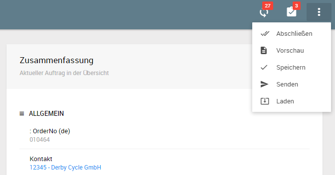

#### Auftragsvorschau

Anders als in Angebotsvorschau werden in der Auftragsvorschau die Auftragsnummer, sowie der Einstandspreis angezeigt. 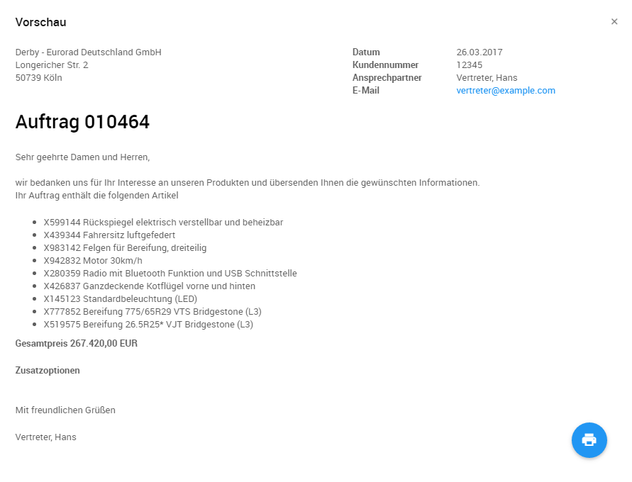

## Mobiler Vertrieb

### Listenansicht Angebote

In der Listenansicht *Angebote* werden alle Angebote angezeigt. Die Listenansicht enthält u.a. die Angebotsnummer und Angebotsdatum, als auch die zugehörige Firma und Verantwortlicher, sowie Angebotsvolumen. Die Sortierung erfolgt durch die beiden Schaltflächen  wobei man das sortierende Feld bestimmen kann und die Reihenfolge nach auf- / absteigend. 

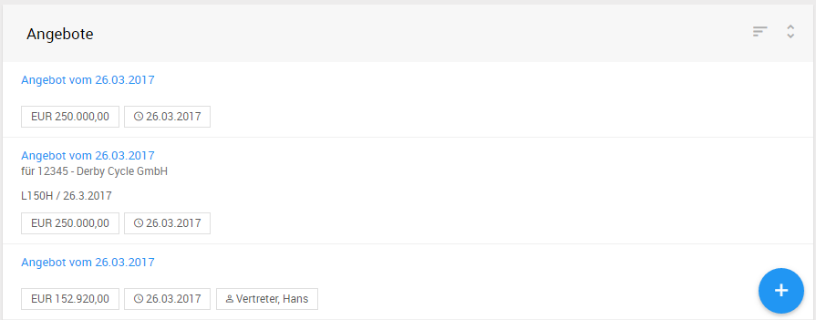

Mit Hilfe der Suchparameter  in der Schnellzugriffsleiste  öffnet sich das Popup Fenster und ermöglicht unter anderem nach Angebotsnummer, Verantwortlicher, Ansprechpartner usw. gefiltert werden.

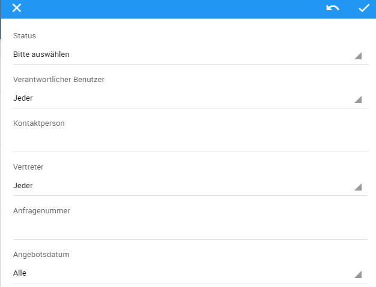

### Auftragserfassungsarten bei Angebotserstellung

Es gibt insgesamt drei unterschiedliche Auftragserfassungsarten:

- **Einzellieferung:** Erstellen von Angebot unabhängig von Produkt und Produktgruppen anhand von einzelnen Positionen aus dem Artikelstamm im Rahmen von einer Lieferung
- **Mehrfachlieferung:** Erstellen von Angebot unabhängig von Produkt und Produktgruppen anhand von einzelnen Positionen aus dem Artikelstamm im Rahmen von mehreren Lieferungen
- **Konfiguration:** Erstellen von Angebot auf Basis von Produkt und Produktgruppen (siehe Kapitel *Konfiguration*)

**Hinweis:** Die Basisdaten des Angebots werden automatisch gefüllt, wenn die Konfiguration aus einem Projekt initiiert wird. Sofern die Konfiguration aus dem Direkteinstieg gestartet wurde müssen die Daten manuell beim Speichern ausgefüllt werden.

#### Auftragserfassungsarten Einzellieferung

Beim Anlegen von Einzellieferung können die Positionen durch die Schaltfläche hinzugefügt werden.

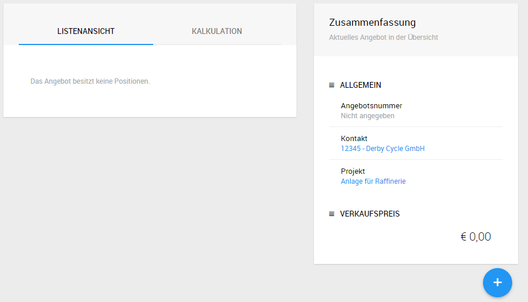

Die Artikel können durch die auto-complete Funktion schnell gefunden werden. Nach der Auswahl und der Mengen Eingabe sowie weiterer Parameter kann die Position durch die Schaltfläche  als Position übernommen werden.

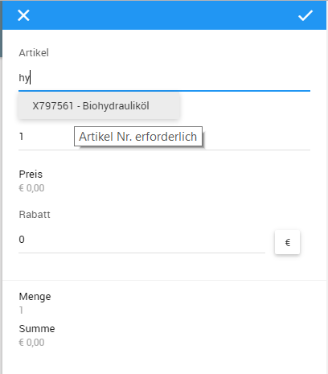

Der Verkaufspreis wird automatisch aktualisiert. Die Positionen lassen sich anschließend mit den Schaltflächen nachbearbeiten oder  löschen. Mehr Details zu Angebotsfuktionalität, siehe Kapitel *Konfigurator -> Aktionen.*

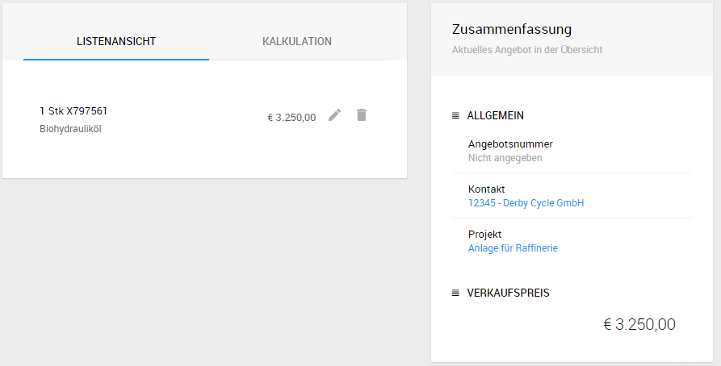

#### Auftragserfassungsart Mehrfachlieferung

Die Auftragserfassungsart Mehrfachlieferungen entspricht der Angebotserstellung von Einzellieferung unterscheidet sich jedoch durch zwei Merkmale:

- Auswahl von Positionen über die Baumansicht 
- Terminierung des Lieferdatums

**Zu Baumansicht:** Mit Hilfe der Baumansicht kann der Anwender den Artikel nach Artikelgruppe (z.B. Eigenmarke) finden oder durch die Eingabe in das Volltext-Suchfeld (%-Zeichen nicht notwendig).

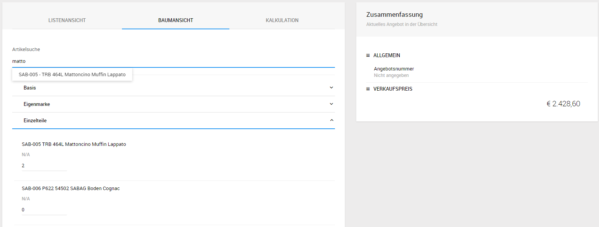

Nach Eingabe der Menge von dem gewünschten Artikel wird die Position automatisch in der Listenansicht dargestellt. Anschließend kann das Lieferdatum für den Artikel nachträglich bearbeitet.

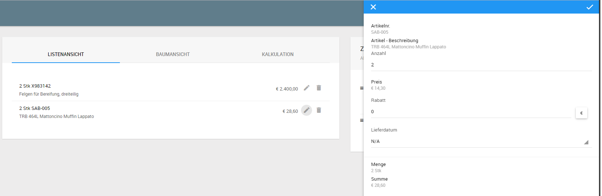

#### Auftragserfassungsarten Konfiguration

siehe Kapitel *Konfiguration*

### Neue Angebote erstellen 

Das Erstellen von Angeboten kann über unterschiedliche Wege gehen:

- Direkteinstieg im Hauptmenü *Konfiguration* (nur für Auftragserfassungsart Konfiguration)

  Bedingung: keine

- Projektakte Listenansicht - Register Angebote - *Neues Angebot* 

  Bedingung: keine

  Hinweis: Ein Projekt kann mehrere produktunabhängige Angebote enthalten. 

- Firmenakte Listenansicht  - Register Angebote - *Neues Angebot* 
  Bedingung: Ein Projekt muss vorhanden sein

- Hauptmenü Listenansicht Vertrieb - Angebote - *Neues Angebot* 

  Bedingung: Ein Projekt und dazugehörige Firma müssen vorhanden sein

in der Listenansicht lassen sich je nach Rechteeinstellung des Anwenders über die Schaltfläche neue Angebote anlegen. Beim Anlegen des Angebots aus der Listenansicht sind Felder Kontaktperson, Lieferadresse, Rechnungsadresse, Projekt Pflichtfelder und erfordern vorher die Auswahl von Kunde. Bei der Eingabe der Daten werden durch die auto-complete Funktionalität die Daten vorgeschlagen und müssen ausgewählt werden.

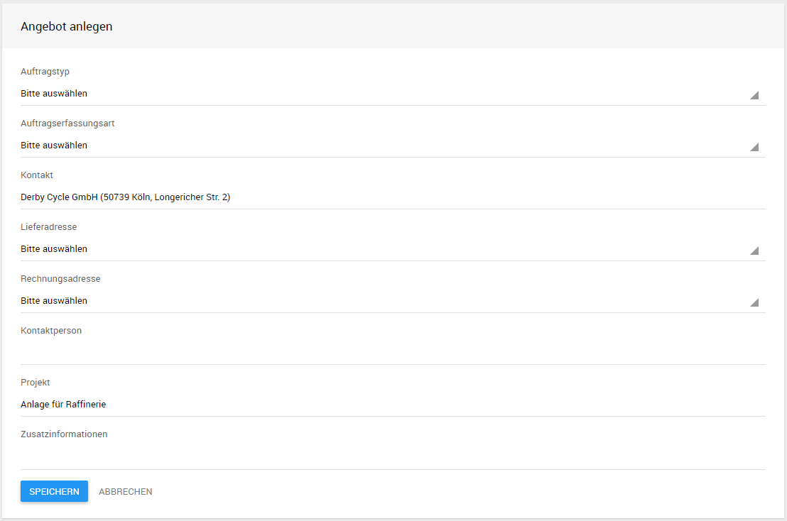

Besonders zu beachten sind Felder Auftragstyp und Auftragserfassungsart.

**Hinweis:** Mehr zur Kalkulation von Angeboten, sowie zu einzelnen Aktionen aus der Angebotsmaske, siehe Kapitel *Konfigurator - Kalkulation* bzw. *Konfigurator - Aktionen*.

