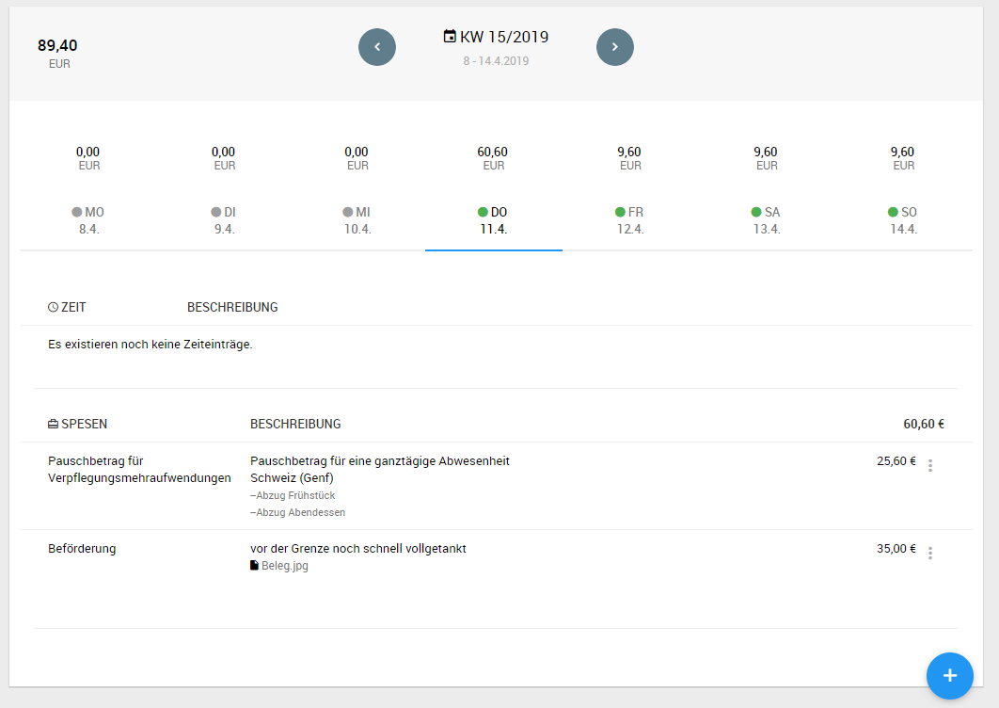
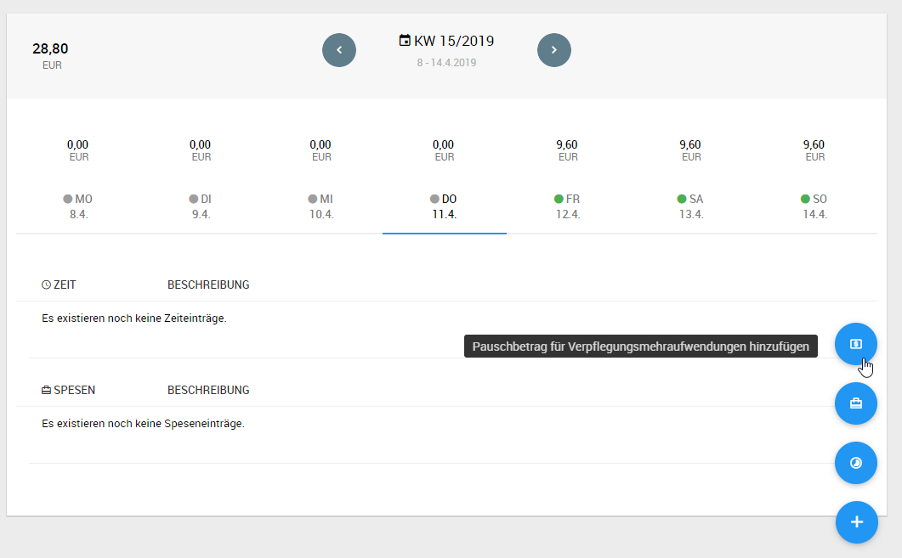
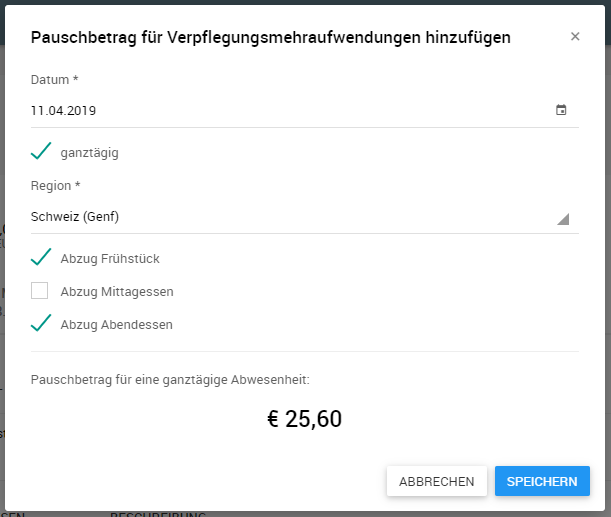
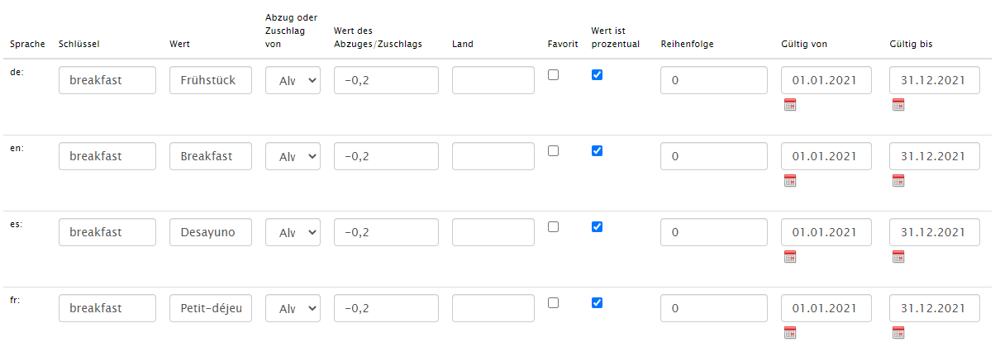

# Verpflegungpauschalen bei Auslandsreisen

Über ein Zusatzmodul kann die Erfassung von Verpflegungspauschalen bei Auslandsreisen gemäß § 9 EStG aktiviert werden.

## Übersicht in der Zeittafel

Über den Menüpunkt *Zeittafel* im Hauptmenü gelangt der Benutzer zur Zeittafel, wo neben auftragsbezogenen Daten, Nebenzeiten und Spesen  auch die eingetragenen Verpflegungspauschalen wochenweise dargestellt werden.

Von hier aus können über die Plus-Schaltfläche auch neue Pauschbeträge eingetragen werden.

## Erfassung und Bearbeitung von Pauschbeträgen

In der Maske zur Erfassung neuer Pauschbeträge wird zunächst das Datum und die Region des Aufenthalts eingetragen. Weiterhin kann die Checkbox *ganztägig* aktiviert werden, welche zusammen mit der Region die Tagespauschale bestimmt. Wurde für den Vortag bereits eine Verpflegungspauschale eingetragen werden die entsprechenden Werte vorbelegt.

Die erfassten Beträge werden zusammen mit den restlichen Zeiten und Spesen abgeschlossen und erscheinen auf den Spesenberichten als zusätzliche Einträge.

### Erstellen von individuelle Abzügen und/oder Zuschüssen

Es ist möglich individuelle Abzüge/Zuschüsse für verschiedene Leistungen zu definieren. Dazu erstellen Sie im Backend einen neuen Eintrag in der Lookup-Tabelle PerDiemAllowanceAdjustment.

Dabei Spielen folgende Spalten eine Rolle:
- Schlüssel: allgemeiner Name der Leistung
- Wert: jeweiliger Wert für die Sprache
- Abzug oder Zuschlag von: Je nach Auswahl (Immer, ganzer Tag, halber Tag) wird der Abzug/Zuschlag angezeigt
- Land: Land, für welches dieser Abzug/Zuschuss gelten soll. Ist dieses Feld leer, gilt der Eintrag für alle Länder. Möchte man z.B. einen Eintrag nur für Deutschland erstellen, funktioniert das mit folgendem Wert: 2021-DE (vgl. Per Diem Allowances)
- Wert des Abzugs/Zuschusses
- Wert ist prozentual: ist dieses Feld ausgewählt, wird der Wert prozentual abgezogen/hinzugefügt
- Gültig von/bis: bestimmt den Gültigkeitszeitraum, in dem der Abzug/Zuschuss verfügbar ist

Im Beispiel bedeutet der Eintrag, dass man für ein Frühstück (in allen Ländern) 20% vom Pauschalbetrag abgezogen wird.