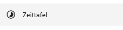

# Nebenzeiten- und Spesenerfassung {#crmperdiem}

Zusätzlich zu auftragsbezogenen Daten bietet L-mobile für Benutzer auch die Möglichkeit Nebenzeiten oder Spesen zu erfassen, welche nicht direkt zum Auftrag verrechnet werden können. Dadurch kann der Benutzer seine Woche lückenlosen dokumentieren. Die erfassten Daten können somit als Übersicht für die Spesenabrechnung oder Übernahme in das Kostenmodul des ERP genutzt werden. In Kombination mit dem Modul Techniker Client werden Ausgaben direkt auf dem Endgerät erfasst und in das L-mobile SMS synchronisiert.

## Zeittafel

Über den Menüpunkt *Zeittafel*  im Hauptmenü gelangt der Benutzer zur Zeittafel.

Auf dieser Übersichtsseite werden neben auftragsbezogenen Daten auch die Nebenzeiten und Spesen wochenweise dargestellt. 

Im Kopfbereich der Zeittafel wird die Summe der gemeldeten Zeiten und Spesen der gewählten Woche angezeigt. Auch über den Reitern für die einzelnen Tage wird eine Summe der gemeldeten Daten dieses Tages angezeigt. Durch auswählen eines Tages wird die darunter dargestellte detaillierte Liste der Tageseinträge aktualisiert. Schon durch eine farbliche Markierung kann ohne vorherigen Wechsel des Tages erkannt werden ob zu einem Tag bereits Daten erfasst wurden.

Für Benutzer mit entsprechenden Berechtigungen lässt sich die Ansicht dort außerdem für einen anderen Benutzer umschalten.

### Navigation durch die Zeit

Um die aktuell dargestellte Woche zu wechseln stehen die Pfeilschaltflächen im Kopfbereich zur Verfügung, die zur vorherigen bzw. nächsten Woche wechseln.

Um schneller einen größeren Zeitsprung zu machen, kann auf die aktuelle Woche geklickt werden, wodurch sich ein Kalender öffnet, in dem der gewünschte Tag ausgewählt werden kann.

## Erfassung und Bearbeitung von Nebenzeiten

Über die Plus-Schaltfläche kann die Erfassung eines neuen Zeiteintrages gestartet werden.

In der sich daraufhin folgenden Maske wird der aktuell in der Zeittafel gewählte Tag vorbelegt, kann aber bei Bedarf im Feld *Datum* verschoben werden.

Die Nebenzeitentypen die zur Auswahl stehen sind konfigurierbar und umfassen im Standard:

- Fortbildung
- Krankheit
- Reisezeit
- Rüstzeit
- Sonstige
- Standzeit
- Tanken
- Urlaub
- Verkaufsunterstützung

Über die Felder *Von* und *Bis* kann der Zeitraum der Tätigkeit eingetragen werden. Hierbei findet im Hintergrund ein Abgleich mit bereits erfassten Zeiten statt, sodass Überschneidungen verhindert werden können. Sofern es sich um ein ganztägiges Ereignis handelt kann alternativ zur Uhrzeit die Checkbox *ganztägig* aktiviert werden. Optional kann zuletzt noch ein Freitext als Beschreibung eingetragen werden, welcher in der Zeittafel und später im Wochenbericht angezeigt wird.

## Erfassung und Bearbeitung von Spesen

Über die Plus-Schaltfläche kann außerdem die Erfassung eines neuen Speseneintrages gestartet werden.

Auch in der sich hierbei öffnenden Maske wird der aktuell in der Zeittafel gewählte Tag vorbelegt, kann aber bei Bedarf im Feld *Datum* verschoben werden.

Wie auch bei den Nebenzeiten sind die Spesentypen die zur Auswahl stehen konfigurierbar. Im Standard umfassen diese:

- Verpflegung
- Übernachtung
- Fracht
- Beförderung
- Sonstiges

Neben dem Betrag und der Währung kann optional eine beliebige Datei als Anhang hinzugefügt werden, beispielsweise ein Foto eines Kaufbelegs. Optional kann zuletzt noch ein Freitext als Beschreibung eingetragen werden, welcher in der Zeittafel und später im Wochenbericht angezeigt wird.

### Bearbeiten und Löschen von Einträgen

Sofern Nebenzeiten oder Spesen noch nicht abgeschlossen wurden stehen in deren Kontextmenüs Aktionen zum Bearbeiten und Löschen zur Verfügung.

Die Bearbeitungsmasken sind hierbei identisch zu den Masken zur Anlage neuer Einträge.

### Navigation zu Aufträgen

Bei auftragsbezogenen Zeiten befindet sich in dessen Kontextmenü eine Aktion um in die Detailansicht des entsprechenden Einsatzen zu springen.

## (Wochen-)Berichtsabschluss

Über die Pfeil-Schaltfläche kann ein Bericht abgeschlossen werden.

Hierfür öffnet sich ein Dialog in dem der abzuschließende Zeitraum ausgewählt werden kann. Je nach Konfiguration können im Feld *Typ* verschiedene Zeitbereiche ausgewählt werden. 

Wird ein wöchentlicher Bericht erstellt, werden alle Kalenderwochen angezeigt, welche noch nicht abgeschlossen wurden, in denen aber Einträge erfasst wurden.

Mehr Kontrolle über den Zeitraum erlaubt der benutzerdefinierte Modus bei dem man über die Felder *Von* und *Bis* jeweils einen beliebigen Tag wählen kann.

Nachdem der Zeitraum gewählt wurde erscheint eine kurze Übersicht aller Einträge welche in diesem Bericht enthalten sein werden.

Je nach Konfiguration steht zuletzt noch eine Auswahl des Status zur Verfügung, in den der Bericht versetzt werden soll.

Wird der Status *Geschlossen* gewählt, wird vom Server unmittelbar ein Bericht über den gewählten Zeitraum generiert und an den in der Anwendungskonfiguration hinterlegten Empfängerkreis versendet.

Wählt der Außendienstmitarbeiter den Status *Schließen anfordern* werden die Einträge innerhalb des Zeitraums zwar abgeschlossen, d.h. diese können von ihm nicht mehr weiterbearbeitet oder gelöscht werden, der Innendienst hat jedoch die Möglichkeit diese zu kontrollieren und muss den Zeitraum erst manuell freigeben, bevor der Bericht generiert und versendet wird. Hierfür steht dem Innendienst in der Zeittafel eine Liste der noch offenen Berichte zur Verfügung. Alternativ kann hier zur Nachverfolgung die Filterung auf geschlossene Berichte geändert werden.

Nach Abschluss eines Berichts kann ein automatischer E-Mail-Versand als PDF an den Innendienst konfiguriert werden.

Die Berichtseinträge können von hier aus über eine Auswahl des Zeitraums nachbearbeitet werden und über das Kontextmenü kann jeweils der Berichtstatus gesetzt werden. Es besteht weiterhin die Möglichkeit eine Vorschau der Berichte zu öffnen, oder die bereits abgeschlossenen Berichte abzurufen.

