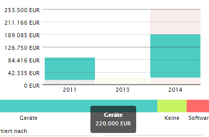
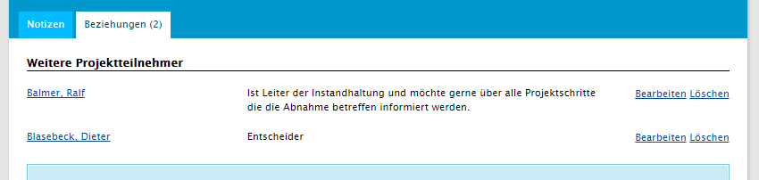

# Projekte (Zusatzmodul)

Mit dem Modul Projekte haben Sie die Möglichkeit den Verkaufsprozess zu strukturieren. Projekte fassen die im Verkausprozess angefallenen Informationen zusammen. Darüber hinaus können weiterführende Informationen wie z.B. Projektpreis, Deckungsbeitrag, Verantwortliche Benutzer, Fälligkeit uvm. gespeichert werden.

## Projektliste

Die Menge aller Projekte kann in der Projekliste nach verschiedenen Kriterien ausgewertet werden.  Dabei können Informationen wie Projekttyp, verantwortlicher Benutzer, Fälligkeits-Datum oder Status-Datum genutzt werden um einen Ausblick über die anstehenden Projekte zu erhalten. 

## Projektliste - Feldfilter

Die Projektliste fasst die vorhandenen Informationen kompakt zusammen. Mit Hilfe des Filter kann die Auswahl eingeschränkt werden. Dabei stehen die häufigsten Optionen zur Filterung bereit. Die Liste kann mit Hilfe der Lesezeichen, Tags und der Feldfilter durchsucht werden.

## Projektliste – Diagramme

Im Diagramm der Projektliste werden alle im Filter enthaltenen Projekte grafisch aufbereitet.

Das Diagramm stellt Projekt-Kategorien, Fälligkeits- oder Status-Datum sowie dem Wert dar. Im Säulendiagramm werden Zeitraum-bezogene Werte sowie die Anteile der verschiedenen Kategorien am Gesamtvolumen dargestellt. 

Im Stapeldiagramm wird der Anteil der jeweiligen Projektkategorie am Gesamtumsatz (aller gefilterten Projekte) angezeigt. Alternativ lassen sich beide Diagramme auf den gewichteten Projektwert umschalten. 

Details zu den einzelnen Segmenten erhält man in dem man die Maus über dem gewünschten Element positioniert.

## Projektliste – Kartendarstellung

Mit Hilfe der Kartenansicht können Projekte der geladenen Seite dargestellt werden. Bei aktiver Suchfunktion kann die Ergebnisliste auf den Kartenausschnitt eingeschränkt werden.

## Projektliste – Kontextfunktionen

Als primäre Aktion in der Projektliste wird die Anlage von neuen Projekten angeboten. Desweiteren: 

- CSV-Export der Ergebnisliste
- RSS-Feed exportieren
- ICS Kalenderabonement exportieren

Bei allen Exporten werden aktive Filter berücksichtigt.

## Firmendetails - Kontextinformationen Projektliste

Bei aktivem Projektmodul steht in den Firmendetails ein neues Element in den Kontextinformationen bereit. Dort werden alle Projekte der angezeigten Firma gruppiert nach Status ausgegeben. Zu jedem Projekt werden wesentliche Informationen wie Fälligkeitsdatum, Name und Wert angezeigt. Mit dem Verweis kann man die Projektdetails öffnen. 

Für jede Projektgruppe wird eine Summe berechnet.

## Neues Projekt anlegen

Bei der Anlage von neuen Projekten aus der Projektliste müssen die wesentlichen Informationen des Projekt erfasst werden:

- Eindeutiger Name
- Firma mit Vorschlagsliste
- Wert
- Fälligkeitsdatum
- Kontaktherkunft

Darüber hinaus können Informationen wie Deckungsbeitrag, Währung, Kategorie und weiterführende Informationen eingetragen werden. Der Verantwortliche Benutzer wird mit dem angemeldeten Benutzer vorbelegt und kann bei Bedarf angepasst werden.

----

**Hinweis** Bei der Anlage eines Projektes aus einer Firma wird das Feld Firma im Formular vorbelegt. Die Zuordnung zur Firma kann nur bei der Neu-Anlage vergeben werden.

----

## Projektdetails {#project-details}

Die Detailansicht eines Projektes liefert die wichtigen Informationen zum Projekt in der Kopfdarstellung. Hier kann der Projektstatus, die Bewertung direkt verändert werden. Informationen wie z.B. der Verweis auf die Firma sind verknüpft.

## Projektstatus

Der Projektstatus ordnet das Projekt in eine der angegebenen Situationen ein. In der Standard-Konfiguration unterscheidet das System in offene, gewonnene und verlorene Projekte. Durch Auswahle eines der Segmente mit der Maus wird der Projektstatus entsprechend verändert. 

Veränderungen des Projektstatus werden in der Notizliste protokolliert.

Bei der Änderung des Projektstatus auf __Verloren__ muss ein Grund eingetragen werden. Dieser kann mit einer Wertehilfe befüllt werden. Darüber hinaus kann ein Wettbewerber referenziert sowie eine Beschreibung der Umstände des Verlusts eingetragen werden.

----

**Hinweis** Der Projektstatus wird aus einer Zuordnungstabelle gefüllt. Daher ist es möglich in der Projektkonfiguration weitere Status anzulegen, z.B. um einen feiner strukturierten Vertriebsprozess abzubilden:

- Angebot erstellt
- Angebot abgegeben
- Preisverhandlung
  etc.

----

## Projektbewertung

Neben dem Projektstatus besteht die Möglichkeit der Projektbewertung über ein 5-Punkte Schema. Ändert man den Status auf Gewonnen wird die Bewertung automatisch auf den höchsten Wert gesetzt. Bei verloren auf den niedrigsten. Die Bewertung kann verwendet werden um eine subjektive Einschätzung der Chancen im Projekt auszudrücken. Mit Hilfe der Projektbewertung können die Wertangaben in den Auswertungen gewichtet werden.

## Projektbeziehungen

In den Projektbeziehungen können weitere für das Projekt relevante Kontakte (Firmen oder Personen) eingetragen werden. Die Beziehungen können mit Hilfe einer Zuordnungstabelle klassifiziert sowie um einen beschreibenden Text ergänzt werden.

## Projekt E-Mail Dropbox

Für Projekte besteht die Möglichkeit E-Mail Nachrichten direkt dem gewünschten Projekt zuzuordnen. Zu diesem Zweck wird für jedes Projekt eine individuelle E-Mail Dropbox Adresse erzeugt. Wird der Verweis im Projekt genutzt um die Nachrichten zu erstellen überträgt das System diese Adresse automatisch in den BCC Bereich der erstellten Nachricht.

## Potenziale

Potenziale stellen die Vorstufe eines Vertriebsprojektes dar und befinden sich unter dem Hauptmenüpunkt *Vertrieb*.

### Potenzialliste

In der Potenzialliste werden alle im System angelegten Potenziale mit ihren wichtigsten Daten, wie deren Status und Wahrscheinlichkeit, angezeigt.

Von dort können die Details eines bestimmten Potenzials angezeigt werden, oder es kann über die Plus-Schaltfläche ein neues Potenzial angelegt werden.

### Potenzialdetails

In den Potenzialdetails können die grundlegenden Daten wie der Status geändert werden und es stehen weitere Reiter für potenzialbezogene Notizen, Aufgaben und Kontaktbeziehungen zur Verfügung.

Über die Aktion *Umwandeln zu Projekt* kann ein Projekt mit den Daten aus dem Potenzial erstellt werden.

Im Reiter *Projekte* befindet sich eine Liste der so aus dem Potenzial hervorgegangenen Projekte.

