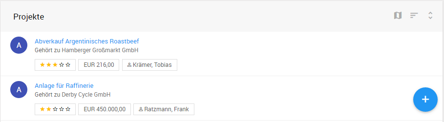
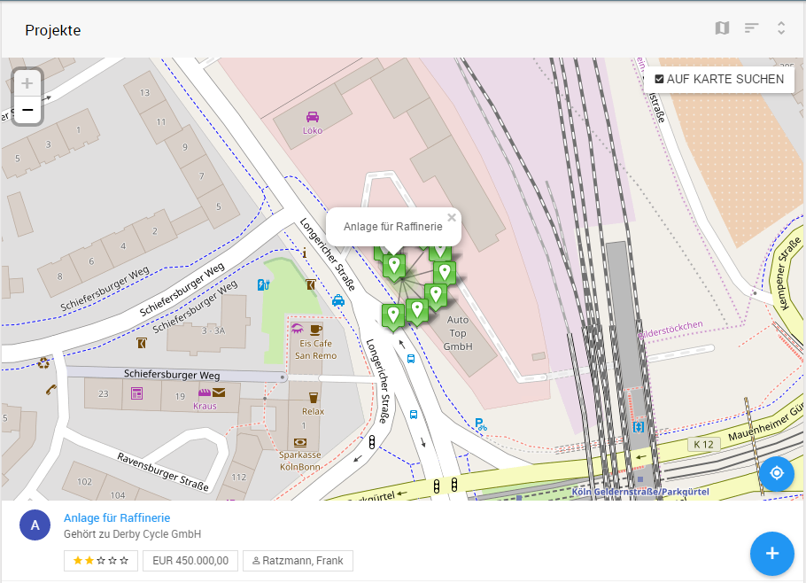
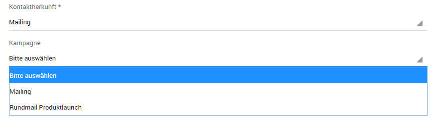
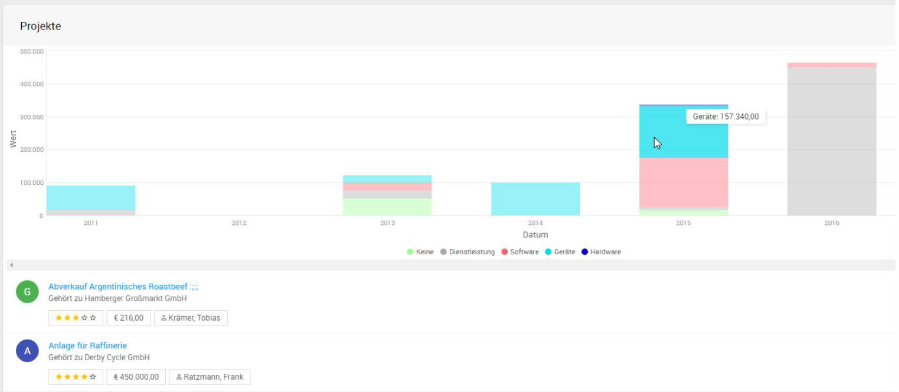
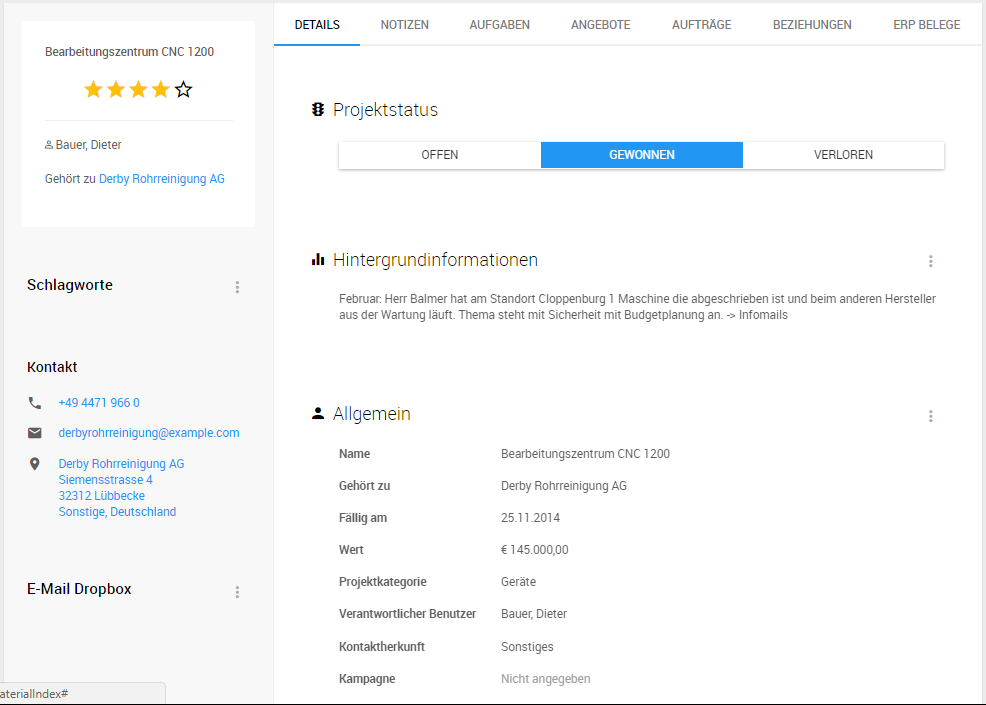
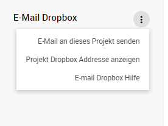
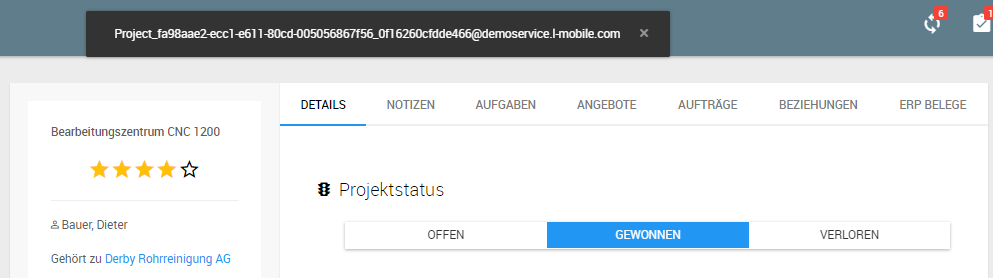

## Mobiler Vertrieb

### Listenansicht

In der Listenansicht *Projekte* werden alle Projekte angezeigt und können mit Hilfe der Filterparameter   im Popup Fenster in der Schnellzugriffsleiste unter anderem nach Projektname /-nummer, Firma, Kategorie, Datum/Zeitraum, Schlagwort uvm. eingegrenzt werden.

Die Listenansicht enthält u.a. den Projektnamen, Bewertung durch Sterne über Erfolgsaussicht, Projektvolumen, sowie den Ansprechpartner. Zusätzlich wird durch das Kürzel-Icon  der aktuelle Projektstatus abgebildet. 

Der Projektstatus ist standardmäßig wie folgt abgebildet:

- Qualifizieren (Q)
- Präsentation (P)
- Angebot (A)
- Konzept (K)
- Gewonnen (G) / Verloren (V) / Eingestellt (E)

Die Sortierung der Projektliste erfolgt durch die beiden Schaltflächen  wobei man das sortierende Feld bestimmen kann und die Reihenfolge nach auf- / absteigend. 

Sortierung kann nach folgenden Kriterien erfolgen:

- Kategorie
- Projekt erstellt/fällig am
- Projektname
- Bewertung
- Projektstatus
- Status-Datum
- Projektwert

#### Kartendarstellung

Über die Schaltfläche lässt sich äquivalent zu *Listenansicht Firmen* die Kartendarstellung aktivieren. Dadurch werden die Projekte anhand der hinterlegten Standard-Adresse der zugehörigen Firma auf der Karte angezeigt. Zur Übersicht werden naheliegende Firmen in Gruppen mit Angabe der Firmenzahl dargestellt. Durch Anklicken des Gruppenzeichens wird die Ansicht auf den Gruppenbereich gezoomt. Durch wird man zum eigenen Standort zurückgeführt.

Mit der Aktivierung der Schaltfläche *AUF KARTE SUCHEN* (äquivalent zu Umkreissuche) wird die Projekt-Liste unterhalb der Karte ausschließlich auf die Projekte der sichtbaren Firmen-Standorte eingeschränkt.

#### Neues Projekt anlegen

in der Listenansicht lassen sich je nach Rechteeinstellung des Anwenders über die Schaltfläche neue Projekte anlegen. Mit * gezeichneten Felder sind Plichtfelder. 

**zu Kontaktherkunft & Kampagnen:** 

Durch die Auswahl von Kontaktherkunft werden auch die vorhandenen Kampagnen angezeigt, die mit dem äquivalenten Kampagnentyp hinterlegt wurden. 

#### Statistik zu Projektwert

Über die Schaltfläche Statistik  wir die leistungsstarke Auswertungsvisualisierung möglich und in Kombination mit den Filterparametern  (z.B. Eingrenzen auf Kunde, verantwortlichen Mitarbeiter, Verkaufsgebiet) kann der Anwender den Projektwert über den Zeitraum und Projektkategorie einstellen.

### Projektakte

Die Projektakte ist äquivalent zur Firmenakte strukturiert. Sie enthält im Vergleich zur Firmenakte nur die Register *Details, Notizen, Aufgaben, Angebote, Aufträge, Beziehungen und ERP-Belege*. Die Erstellung von Notizen und Aufgaben in der Projektakte ordnet sich hierarchisch zum Projekt und der zugehörigen Firma ein. 

Ergänzend zu Projektname, verantwortlichen Benutzer und der zugehörigen Firma kann der Anwender die *Bewertung der Erfolgsaussicht* anhand der Sterne beurteilen (1=schlecht, 5=hervorragend).

Der *Projektstatus* lässt sich durch das Anwenden der Schaltfläche umstellen und beinhaltet 5 Stufen von Qualifiziert bis Gewonnen/Verloren/Eingestellt.

#### **Projekt-Dropbox:** 

Zu jedem Projekt lässt sich eine Dropbox-Emailadresse generieren und für ein- und ausgehende Emails hinterlegen. Diese Emails, die an diese Dropbox Emailadresse gehen, werden automatisch mit dem Projekt verknüpft und in den Notizen angezeigt. 

 Über die Schaltfläche *Projekt Dropbox Adresse anzeigen* lässt sich die automatisch generierte Emailadresse einblenden.

1. Archivierung von ausgehenden Emails:

   Die E-Mail-Adresse für das Dropbox Projektpostfach beim Versenden der Email an Kunden in bcc-Empfänger kopieren und versenden.

2. Archivierung von eingehenden Emails:

   Eingehende Emails können archiviert werden indem man die empfangene Email an die Dropbox Email-Adresse weiterleitet.

**TIPP:**  Bei großen Projekten mit intensiven Kommunikationsbedarf lohnt es sich die Dropbox Emailadresse als Kontakt im Mailprogramm (z.B. Outlook) zu hinterlegen.
