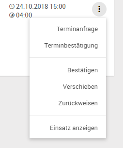

# Arbeitsvorrat {#crmservice-arbeitsvorrat}

Unter dem Menüpunkt *Serviceaufträge* im mobilen Client kann der Techniker seinen *Arbeitsvorrat* finden, in dem sich alle für ihn freigegebenen und noch nicht abgeschlossenen Arbeitseinsätze befinden.

Zudem gibt es die Untermenüpunkte *Vorgeplante Einsätze* mit Serviceaufträgen welche sich gerade in der Planung befinden und *Offene Aufträge* mit weiteren, zur Planung bereitstehenden Serviceaufträgen. Der Punkt *Geschlossene Einsätze* enthält die zuletzt vom Techniker abgeschlossenen Serviceeinsätze und kann beispielsweise zur Recherche verwendet werden.

## Erstellung von Arbeitseinsätzen

Diese Arbeitseinsätze können über mehrere Wege im Arbeitsvorrat des Technikers landen:

- Auftragserstellung, Zuweisung und Freigabe durch die Disposition in SMS und Plantafel
- Erstellung eines Einsatzes aus der Liste der offenen Aufträge durch den Techniker im mobilen Client
- Erstellung eines Ad-hoc Auftrags durch den Techniker im mobilen Client

~~~~
flowchart-source

st=>start: Servicefall
e=>end: Arbeitseinsatz 
am mobilen Client
c3=>condition: Offene Aufträge?
c1=>condition: Disposition 
mit SMS
c2=>condition: Disposition 
mit Plantafel
c4=>condition: bevorzugter Techniker 
oder Benutzergruppe
op2=>operation: Einsatz in 
SMS-Auftragsmaske
op3=>operation: Einsatz in Plantafel
opt5=>operation: Einsatz aus Liste 
offener Aufträge 
im Mobilen Client
opt4=>operation: Ad-Hoc Auftrag mit Einsatz 
im Mobilen Client

st->c3
c3(yes,right)->c4
c4(no,right)->c1
c3(no)->opt4
c1(yes,mit bevorzugen Techniker)->op2(right)
c1(no,right)->c2
c2(yes)->op3
c4(yes)->opt5
op2->e
op3->e
opt4->e
opt5->e

~~~~

### Erstellung eines AdHoc Auftrags
Durch Aufruf des Menüpunkt *AdHoc Auftrag* kann im mobilen Client ein neuer Serviceauftrag zusammen mit einem zugehörigen Einsatz erzeugt werden.

Per Volltextsuche kann die Firma bei der der Auftrag stattfindet gewählt werden. Weiterhin kann das Serviceobjekt, die Geräteakte und der Verursacher über eine Suche ausgewählt werden:
-  *Kunde* ist der Besitzer des Objekts zu dem der Auftrag erstellt wird (z.B. eine kaputte Maschine)
- Ein *Serviceobjekt* kann mehrere Geräteakten bündeln, dieses Feld ist optional
- Eine *Geräteakte* kann das Objekt sein zu dem der Auftrag erstellt wird, dieses Feld ist optional
- Der *Verursacher* ist derjenige der den Auftrag initiiert hat, dieses Feld ist ebenfalls optional

Die Art der Auftrags kann ausgewählt werden und eine kurze Fehlermeldung muss eingegeben werden.

Im nächsten Schritt wird der Standort, bzw. die Adresse des Einsatzes festgelegt. Diese kann ausgewählt werden und füllt sich aus den bereits festgelegten Informationen wie Kunde, Serviceobjekt und Geräteakte. Es besteht auch die Möglichkeit die Adresse manuell festzulegen.

Die Adressen werden nach folgende Priorität vorausgewählt (die erste gefundene Adresse gewinnt):

1. Standardadresse Service Objekt
2. erste Adresse Service Objekt
3. Adresse Geräteakte
4. Standardadresse Firma
5. erste Adresse Firma

Im letzten Schritt werden Datum und Uhrzeit des geplanten Einsatzes, sowie die geplante Dauer eingetragen.

Nach dem Speichern gelangt man direkt zu den Einsatzdetails.

## Mobile Einsatzplanung {#crmservice-mobile-einsatzplanung}

Abhängig von den Berechtigungen des Technikers steht ihm eine mobile Einsatzplanung zur Verfügung, bei der er sich aus den zur Planung freigegebenen Serviceaufträgen bedienen kann, die entweder ihm direkt oder seiner Benutzergruppe zugewiesen wurden. Über den Menüpunkt *Offene Aufträge* ist eine Liste dieser Serviceaufträge einsehbar.

Es ist möglich diese Liste zu filtern (z.B. nach Priorität oder Auftragsart) und die Sortierung zu verändern. Außerdem ist es möglich eine Karte einzublenden, auf der die Serviceaufträge angezeigt werden, um offene Aufträge in einem bestimmten Umkreis einfach finden zu können.

Über das Kontextmenü der einzelnen Aufträge hat man die Möglichkeit sich den Serviceauftrag anzuzeigen, wobei eine schreibgeschützte Ansicht der Auftragsdetails geöffnet wird (siehe [Einsatzdetails](#crmservice-dispatch-details)).

Kann ein Auftrag ohne Serviceeinsatz abgeschlossen werden (z.B. durch Klärung des Problems am Telefon), kann dieser über die Aktion *Schließen* technisch abgeschlossen werden. In diesem Fall wird der Techniker aufgefordert einen Grund für den Abschluss einzutragen.

Soll nun ein Einsatz für einen Auftrag geplant werden, kann hierfür über die Aktion *Einsatz planen* ein Dialog zur Terminierung geöffnet werden.

Neben Datum, Uhrzeit und geplanter Dauer gibt es hier die Möglichkeit den Einsatz sofort freizugeben. Je nachdem ob es sich bei dem Einsatz erstmal nur um eine grobe Vorplanung handelt, bei der der Termin noch beispielsweise mit dem Kunden abgestimmt werden muss, oder ob der Termin bis auf weiteres fest steht, kann die Checkbox *Sofort freigeben* ausgewählt werden. Wird ein Einsatz sofort freigegeben landet der erstellte Einsatz im Arbeitsvorrat des Technikers, andernfalls ist er über den Menüpunkt *Vorgeplante Einsätze* zu finden.

Um eine einfache Terminfindung zu ermöglichen, bietet der angezeigte Kalender einen kurzen Überblick über alle anderen geplanten Termine. Hierbei besteht die Möglichkeit über einen Klick auf einen anderen Termin den aktuellen Einsatz als Anschlusstermin einzuplanen, oder über einen Klick auf einen freien Bereich im Kalender den Einsatz dorthin zu verschieben.

In der Liste der vorgeplanten Einsätze stehen im Kontextmenü der einzelnen Einsätze Funktionen zur Terminabsprache mit dem Kunden und zur weiteren Terminierung zur Verfügung. Außerdem können von dort über den Menüpunkt *Einsatz anzeigen* die Einsatzdetails schreibgeschützt geöffnet werden.

Soll für einen Einsatz eine Terminanfrage stattfinden, öffnet sich über die Aktion ein Dialog in der alle relevanten Ansprechpartner für den gewählten Auftrag inkl. deren Kontaktdaten aufgelistet werden.

Von hier aus kann bei Auswahl einer Telefonnummer die Telefon-App des Mobilgeräts geöffnet werden, oder das installierte E-Mail Programm bei Auswahl einer E-Mail Adresse. Ein im System hinterlegter Betreff und E-Mail-Text wird vorbelegt. Um dem Kunden ein bereits vorgeplanten Termin zu bestätigen, kann über die Aktion *Terminbestätigung* ein ähnlicher Dialog geöffnet werden.

Auch hier finden sich die relevanten Ansprechpartner, jedoch unterscheiden sich die vorbelegten Texte der E-Mail.

## Übersicht Arbeitsvorrat

Im Navigationsbereich *Arbeitsvorrat* sieht der Techniker die ihm durch Disposition freigegebenen und die sich in Bearbeitung befindlichen Arbeitseinsätze mit den wichtigsten Eckdaten (Firma, Auftragsnummer, Auftragstyp, Einsatzbeginn, Einsatzdauer, Priorität und Fehlerbeschreibung). 
Ungelesene Einsätze werden mit Fettschrift hervorgehoben. 

Die Liste lässt sich filtern und umsortieren und die Einsätze können alternativ in einem Kalender oder in einer Karte angezeigt werden.

## Einsatzbearbeitung{#crmservice-dispatch-details}

Der Techniker erhält im Register *Details* alle auftragsrelevanten Informationen zum Einsatz und somit eine Entscheidungsgrundlage für *Annahme* oder *Zurückweisung* des Auftragseinsatzes sowie Kontaktinformationen und die Anschrift des Einsatzortes.

### Annahme oder Zurückweisung

Bevor die Erfassung von Daten im Einsatz stattfinden kann muss dieser zunächst in Bearbeitung gesetzt werden. Zuvor ist der Einsatz größtenteils schreibgeschützt, es können lediglich interne Notizen hinzugefügt werden.

Ist eine Bearbeitung nicht möglich oder erforderlich kann der Einsatz alternativ zurückgewiesen werden. 

Im Fall einer Zurückweisung kann der Techniker einen Grund auswählen und bei Bedarf diesen Grund im Freitext *Bemerkung* näher erläutern.

Nach dem Bestätigen durch *Speichern* wird ein Workflow gestartet:

- Der Disponent erhält eine Ablehnungs-Email mit der Begründung des Technikers. 
- Der Arbeitseinsatz wird gleichzeitig auf Status "zurückgewiesen" gesetzt.

Wird der Auftrag durch *Auftrag bearbeiten* angenommen, kann begonnen werden Daten zu erfassen. Die Datenerfassung kann in beliebiger Reihenfolge erfolgen.

Wird der Einsatz unterschrieben, können je nach Einstellung noch bestimmte Zeitarten erfasst, sowie Berichtsempfänger definiert werden.

~~~~
flowchart-source

start=>start: Einsatz bearbeiten
end=>end: Einsatz abschließen

opData=>operation: Daten erfassen
opDataSigned=>operation: Daten erfassen

cnMaterial=>condition: Material & Kosten?
opMaterial=>operation: Material & Kosten melden

cnTimes=>condition: Zeiten?
opTimes=>operation: Zeiten melden

cnChecklists=>condition: Checklisten?
opChecklists=>operation: Checklisten ausfüllen

cnNotes=>condition: Notizen?
opNotes=>operation: Notizen erfassen

cnSignature=>condition: Einsatz unterschreiben?
opSignature=>operation: Unterschrift

cnTimesSigned=>condition: Zeiten?
opTimesSigned=>operation: Zeiten melden

cnReportRecipients=>condition: Berichtsempfänger?
opReportRecipients=>operation: Berichtsempfänger definieren

cnSignatureDelete=>condition: Unterschrift löschen?
opSignatureDelete=>

cnCloseDispatch=>condition: Einsatz abschließen?

start->cnMaterial

cnMaterial(yes,right)->opData(right)->cnMaterial
cnMaterial(no)->cnTimes

cnTimes(yes,right)->opData(right)->cnMaterial
cnTimes(no)->cnChecklists

cnChecklists(yes,right)->opData(right)->cnMaterial
cnChecklists(no)->cnNotes

cnNotes(yes,right)->opData(right)->cnMaterial
cnNotes(no)->cnSignature

cnSignature(yes,bottom)->opSignature->cnTimesSigned
cnSignature(no,right)->cnMaterial

cnTimesSigned(yes,right)->opDataSigned(right)->cnTimesSigned
cnTimesSigned(no)->cnReportRecipients

cnReportRecipients(yes,right)->opDataSigned(right)->cnTimesSigned
cnReportRecipients(no)->cnSignatureDelete

cnSignatureDelete(yes,right)->cnMaterial
cnSignatureDelete(no)->cnCloseDispatch

cnCloseDispatch(yes)->end
cnCloseDispatch(no)->cnTimesSigned
~~~~

### Jobs

Jobs können verwendet werden um komplexe Aufträge zu strukturieren, wenn diese mehrere Tätigkeiten oder Tätigkeiten an verschiedenen Geräteakten umfassen. Im Reiter Jobs sind diese aufgelistet.

Der aktuelle Job wird hierbei grün hervorgehoben. Über das Kontextmenü der Jobs kann der aktuelle Job gewechselt werden. Dies wirkt sich auf die Sortierung und die Vorbelegung bei der Erfassung von jobbezogenen Daten aus.

### Geräteakte(n)

Der Reiter *Geräteakte* bzw *Geräteakten* bietet eine ausführliche Zusammenfassung zur Maschine bzw. Anlage, wie genaue Bezeichnung, Seriennummer, Standort, Inbetriebnahme-Datum, oder Hintergrundinformationen.

### Zeitmeldungen

Im Reiter *Zeitmeldungen* befinden sich alle vom Techniker zu diesem Einsatz erfassten auftragsbezogenen Zeitmeldungen, ggf. gruppiert nach Job.

Durch die Plus-Schaltfläche können weitere Zeitmeldungen erfasst werden.

Das Datum lässt sich 7 Tage in die Vergangenheit und nicht in die Zukunft eintragen.

Die *Dienstleistungsart* lässt sich aus Liste der bestehenden Dienstleistungsartikel auswählen und in den Bemerkungsfeldern genauer beschreiben. 

Das *Kilometer* Feld ist sichtbar wenn die ausgewählte Artikelnummer in der Einstellung _ItemNosWithKilometerSelection_ enthalten ist. Der Techniker kann dort die Reiseentfernung eintragen.

*Interne Bemerkungen* sind hierbei nur für interne Anwender sichtbar.

Die *Dauer* der Zeitmeldung wird automatisch aus Anfangs und Endzeit errechnet.

**Hinweis:** Bei der Zeiteingabe wird geprüft, ob sich diese mit bestehenden Zeitmeldungen aus dem *Arbeitsvorrat*, wie auch den *Nebenzeiten* überschneiden.

Wird eine Überschneidung erkannt, so wird diese bei der Zeiteingabe angezeigt.

### Material

Im Reiter *Material* befindet sich eine Übersicht aller vorgeplanten und ungeplanten Materialpositionen des Auftrags, sowie die erfassten Zusatzkosten.

Nicht vorgeplantes Material kann hier über das Kontextmenü bearbeitet oder gelöscht werden.

#### Ungeplantes Material

Durch die Plus-Schaltfläche kann weiteres, ungeplantes Material als Position hinzugefügt werden.

Aus der *Artikelliste* kann der passende Artikel mit Hilfe einer Volltextsuche über Artikelnummer und -bezeichnung gefiltert und ausgewählt werden.

Wenn der Techniker sich eine Nachbestückung des Artikels für sein mobiles Lagers wünscht, kann er die Schaltfläche zum *Nachbestückungsauftrag hinzufügen* aktivieren. Weiterführende Informationen hierzu finden Sie im Kapitel [Nachbestückungsaufträge](#replenishment-order).

#### Geplantes Material

Die bereits in der Material-Liste angezeigt Artikel wurden durch die Disposition vor Freigabe des Einsatzes dem Auftrag als *Soll-Menge* eingeplant. 

Der Techniker kann nun beim Aufrufen des vorgegebenen Artikels die verbrauchte IST-Menge eintragen, sowie externe und interne Bemerkungen einfügen. Externe Bemerkungen werden im Servicebericht des Kunden angezeigt. 

Interne Bemerkungen sind nur für SMS Anwender sichtbar. Durch *Speichern* wird die Änderung aktualisiert.

#### Austausch von seriennummerpflichtigen Artikeln

Bei seriennummerpflichtigen Artikeln wird automatisch die *alte Seriennummer* des ersetzten Artikels (sofern vorhanden), sowie die *neue Seriennummer* abgefragt. 

Alternativ zur ausgetauschten Seriennummer kann der Grund für das Fehlen dieser gewählt werden. Beispielsweise könnte diese nicht vorhanden oder nicht mehr lesbar sein.

Die verbauten Seriennummern können später im SMS nachverfolgt werden und erscheinen auf den Serviceberichten.

### Checklisten

Mit *Checklisten* kann der Techniker systematisch eine Arbeitsabfolge durchführen und diese protokollieren. Diese befinden sich im gleichnamigen Reiter und sind dort abhängig von ihrem Bearbeitungsstatus farblich markiert.

Um eine noch nicht abgeschlossene Checkliste auszufüllen muss im Kontextmenü des Eintrags die Aktion *Bearbeiten* gewählt werden.

Es öffnet sich ein Dialog zur Checklistenbearbeitung. Je nachdem, wie die Checkliste in SMS zusammengestellt wurde stehen hier mehrere Feldarten zur Verfügung:

- Textfelder
- Dorpdown-Felder
- Auswahllisten
- uvm.

Ist die Bearbeitung der Checkliste abgeschlossen kann die Checkbox *Checkliste abschließen* vor dem Speichern ausgewählt werden. Andernfalls wird diese zwischengespeichert um die Bearbeitung zu einem späteren Zeitpunkt fortzuführen. Abgeschlossene Checklisten können anschließend nicht weiter bearbeitet werden.

Über die Kontextaktion *Vorschau* können bereits ausgefüllte Checklisten in einer Druckvorschau angezeigt werden. 

Über die Druckerschaltfläche kann bei Bedarf der Druckdialog des Mobilgeräts aufgerufen werden.

Der Techniker hat außerdem die Möglichkeit selbst weitere im System definierte Checklisten zum Auftrag hinzuzufügen. Der Dialog hierfür kann über die Plus-Schaltfläche aufgerufen werden.

Für die Auswahl der Checkliste steht eine Volltextsuche zur Verfügung. 

Selbst hinzugefügte Checklisten können vom Techniker über das Kontextmenü auch wieder gelöscht werden.

### Dokumente

Im Einsatzreiter *Dokumente* hat der Techniker Zugriff auf auftragsrelevante Dokumente, wie zum Beispiel technische Zeichnungen. 

Vom Endgerät kompatible Dokumente lassen sich durch Aufruf über das Kontextmenü entweder öffnen oder herunterladen.

Gängige Formate sind:

- PDF
- MS Office Dokumente
- Bilder

### Notizen

Mit Hilfe von *Notizen* kann der Techniker einsatzrelevante Informationen von der Disposition erhalten.

Notizen können auch Datei-Anhänge, sowie Web-Links enthalten.

Im Feldeinsatz kann der Techniker eigene Notizen mit Dokumenten (z.B. Beweisbilder) durch *Hinzufügen* erfassen.

### Berichtsempfänger

Der Techniker kann über die Aktion *Empfänger* die E-Mail Empfänger bestimmen, die zusätzlich zu Standard-Empfängern (Disposition, Techniker) den Bericht ebenfalls erhalten.

Hierzu wählt man die vorgeschlagene Kontaktperson aus der Ansprechpartnerliste der Auftragsakte oder man gibt auf Wunsch im Freitext-Feld eine abweichende E-mail Adresse ein.

### Unterschrift

Mit der Aktion *Unterschrift* bestätigt der Kunde den Servicebericht als Arbeitsnachweis. 

Hierzu wählt man die vorgeschlagene *Kontaktperson* oder gibt im Freitext eine abweichende Person ein, die das Dokument signiert. Die Unterschrift lässt sich direkt auf dem freien Eingabefeld unterschreiben. Bei Bedarf lässt sich die Unterschrift *löschen* und neu zeichnen. 

**Hinweis:** Sobald man mit *Speichern* bestätigt, wird die Unterschrift verbindlich gesetzt. Änderungen am Einsatz sind danach nicht mehr möglich. Um Änderungen nachträglich durchzuführen muss die Unterschrift wieder gelöscht und nach Erfassung der zusätzlichen Daten erneut vom Kunden bestätigt werden. 

#### Datenschutzerklärung{#dispatch-privacy-policy}

Um den Datenschutz der Kunden gemäß der am 25. Mai 2018 in Kraft getretenen Verordnung zum Datenschutz ([GDPR/DSGVO](https://www.eugdpr.org/)) sicherzustellen, ist es möglich eine Datenschutzerklärung im System zu hinterlegen, die bei der Unterschriftserfassung eingeblendet werden kann. Der Kunde muss zusätzlich zur Unterschrift bestätigen diese zu Akzeptieren indem die entsprechende Checkbox in der Erfassungsmaske ausgewählt wird. In diesem Fall wird die Datenschutzerklärung auch als Anhang zum Servicebericht angefügt.

### Berichtsvorschau

Nach abgeschlossener Arbeit hat der Kunde direkt vor Ort die Möglichkeit über die Vorschau-Schaltfläche den Servicebericht mit den auftragsrelevanten Daten anzusehen und diesen mit seiner Unterschrift zu bestätigen. 

In diesem Format wird auch der anschließende Service-Bericht als .PDF generiert und automatisch an die ausgewählten Personen versendet. Das geschieht dann beim Auslösen des Einsatzabschluss. 

International tätige Techniker können die für die Vorschau verwendete Sprache problemlos über die Sprachauswahl oberhalb des Berichts umschalten.

### Einsatzabschluss

Über die Pfeil-Schaltfläche kann der Auftrag teilweise, oder komplett abgeschlossen werden.

Hierfür hat der Techniker mehrere Status-Möglichkeiten für den Abschluss:

- *Abgeschlossen (Folgeeinsatz erforderlich):* Der Auftrag wird in Status "Teilweise abgeschlossen" gesetzt, sodass ein Folgeeinsatz durch denselben oder einen weiteren Techniker notwendig sowie möglich ist. Der Techniker kann den Folgeeinsatz mit einem eingeblendeten Textfeld, *Erforderliche Tätigkeiten*, begründen.
- *Abgeschlossen:* Der Auftrag wird technisch abgeschlossen

Beim Aktivieren des Felds *Folgeauftrag* wird ein weiteres Freitextfeld *Bemerkungen* eingeblendet. Hier kann der Techniker mit einer Notiz die Disposition über Bedarf für Folgeaufträge informieren. Diese Notiz erhält der Disponent ebenfalls in der Email-Benachrichtigung bei Auftragsabschluss.