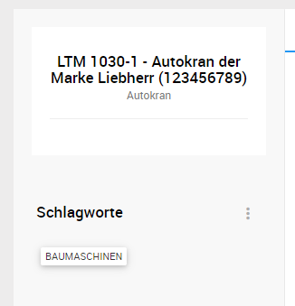
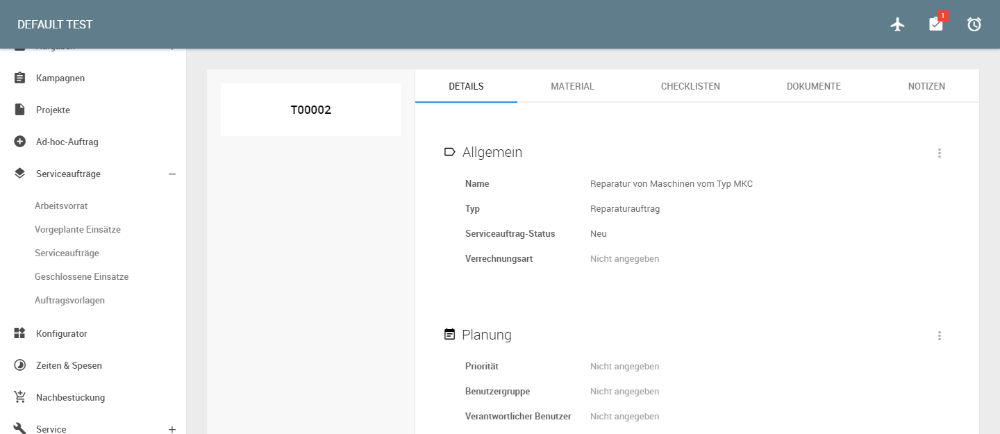
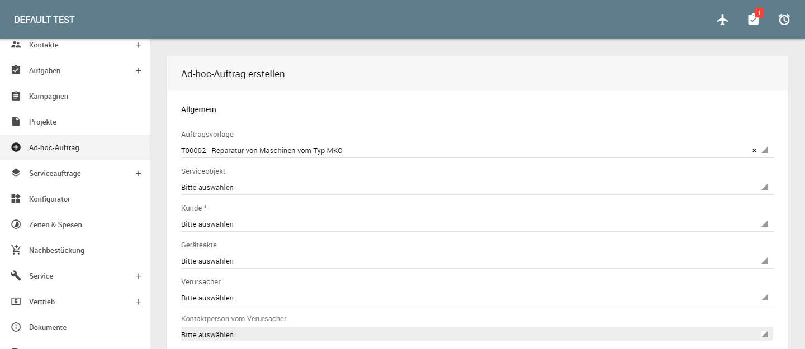

# Service Management {#crmservice}

Das L-mobile Service Management System enthält die wesentlichen Funktionen zur Verwaltung einer komplexen Serviceorganisation. Dazu gehört die Verwaltung der wesentlichen Stammdaten (Kunden und Kontakte, Serviceobjekte und Geräteakten, Wartungsverträge, Material und Dienstleistungen) sowie die Steuerung des Servicepersonals im Rahmen von Servicefällen, Aufträgen und Einsätzen.
Die im Rahmen des Serviceprozesses notwendigen Tätigkeiten werden durch Workflows unterstützt. Die dabei entstehenden oder erfassten Bewegungsdaten werden bei den entsprechenden Elementen dokumentiert. Ergänzt wird das zentrale Service Management System (SMS) durch bestimmte Auswertungsmöglichkeiten und weitere Informationshilfen.

Mit Hilfe des SMS und seiner Komponenten lassen sich verschiedene Prozesse modellieren:

- Aufbau und Verwaltung von Kunden/Kontakten mit Beziehungen und Kommunikationshistorie 
- Aufbau und Verwaltung von Geräteakten/Installationen mit Historie sowie deren Zusammenfassung zu Serviceobjekten
- Verwaltung von Serviceverträgen und Vereinbarungen
- Erstellung und Bearbeitung von Checklisten und Prüfprotokollen
- Abbildung von Helpdesk Anwendungen zur Erstellung von Servicefällen und Serviceaufträgen
- Personaleinsatzplanung von Mitarbeitern und Subunternehmern
- Dokumentation und Nachbearbeitung der Rückmeldungen von Arbeitsergebnissen im Serviceeinsatz

## Überblick

~~~~
flowchart-source

start=>start: Start
end=>end: Ende

ioImport=>inputoutput: Datenimport
opPostProcessing=>operation: Nachbearbeitung
ioExport=>inputoutput: Datenexport
ioReport=>inputoutput: Berichtversand

cnOrderDispatch=>condition: Aufträge & Einsätze
cnOrderOpen=>condition: Auftrag offen?
srOrderCreate=>subroutine: Auftrag erzeugen
srDispatchCreate=>subroutine: Einsatz erzeugen
srDispatchEdit=>subroutine: Einsatz bearbeiten
opDispatchClose=>operation: Einsatz abschließen
cnOrderComplete=>condition: Auftrag 
abgeschlossen?
opOrderClose=>operation: Auftrag abschließen

cnTimeManagement=>condition: Zeiterfassung
opTimeManagement=>operation: Arbeitszeiten erfassen

cnTimeEntryExpense=>condition: Nebenzeiten & Spesen
opTimeEntryExpense=>operation: Nebenzeiten & Spesen 
erfassen
cnTimeEntryExpenseCloseWeek=>condition: Woche abschließen?
opTimeEntryExpenseReport=>operation: Nebenzeitenbericht 
Spesenbericht

cnReplenishment=>condition: Nachbestückung
opReplenishment=>operation: Material erfassen
cnReplenishmentOrderCreate=>condition: Nachbestückungs-
auftrag erzeugen?
opReplenishmentOrderCreate=>operation: Nachbestückungsauftrag

start->ioImport->cnOrderDispatch

cnOrderDispatch(yes)->cnOrderOpen
cnOrderDispatch(no)->cnTimeEntryExpense
cnOrderOpen(yes)->srDispatchCreate->srDispatchEdit->opDispatchClose->cnOrderComplete
cnOrderOpen(no,bottom)->srOrderCreate->srDispatchCreate
cnOrderComplete(yes)->opOrderClose->opPostProcessing
cnOrderComplete(no)->srDispatchCreate

cnTimeEntryExpense(yes)->opTimeEntryExpense
cnTimeEntryExpense(no)->cnReplenishment
opTimeEntryExpense->cnTimeEntryExpenseCloseWeek
cnTimeEntryExpenseCloseWeek(yes)->opTimeEntryExpenseReport->opPostProcessing
cnTimeEntryExpenseCloseWeek(no)->opTimeEntryExpense(left)

cnReplenishment(yes)->opReplenishment
cnReplenishment(no)->cnTimeManagement
opReplenishment->cnReplenishmentOrderCreate
cnReplenishmentOrderCreate(yes)->opReplenishmentOrderCreate->opPostProcessing
cnReplenishmentOrderCreate(no)->opReplenishment

cnTimeManagement(yes)->opTimeManagement->opPostProcessing
cnTimeManagement(no)->opPostProcessing

opPostProcessing->ioExport
ioExport->ioReport
ioReport->end
~~~~

## Menübereich Service: Übersicht

Innerhalb der Anwendungsnavigation befinden sich die Service-Menüpunkte. Dahinter befinden sich die einzelnen Bereiche der Serviceabwicklung, die für Ihre Anwendung und Ihren Benutzer freigeschaltet wurden. Diese werden in den folgenden Kapitelabschnitten im Detail beschrieben.

## Stammdaten im Service Management {#crmservice-stammdaten-im-service-management}

Die Grundlage für die effiziente Abwicklung der täglichen Serviceprozesse ist der Zugriff auf aktuelle und konsistente Stammdaten. Dazu bietet das L-mobile Service Management System folgende Module:

- Geräteakten/ Installationen
- Serviceobjekte
- Serviceverträge
- Kunden und Kontakte (siehe dazu Kapitel Objektdetails Firma und Objektdetails Kunden)
- Artikel (siehe dazu Kapitel Artikelstamm)
- Fehlercodes (Zusatzoptionen)

### Geräteakten / Installationen {#crmservice-installationen}

#### Prozessbeschreibung

Anzahl und Art der installierten Basis (Geräteakten, Maschinen, Anlagen, Installationen) werden im Bereich Geräteakten verwaltet. Dabei existiert für jede eigenständige gelieferte Installation ein Datensatz. In diesem Datensatz werden die wesentlichen Informationen wie Baujahr, Installationsdatum, Art der Installation sowie weitere Informationen dokumentiert.

Darüber hinaus kann zu jeder Installation eine so genannte _Stückliste_ erstellt werden in der die Art und Menge von verwendeten Komponenten über Baugruppen, Artikelnummern bis hin zu einzelnen Seriennumern dokumentiert werden kann.

Geräteakten bieten die Möglichkeit eine Historie aller durchgeführten Arbeiten sowie die Art und Megen der verwendeten Ersatzteile zu führen um somit jederzeit über den Zustand informiert zu bleiben.

#### Navigation

Geräteakten befinden sich im Standard unter dem Menübereich Service. Desweiteren werden Geräteakten zu bestimmten Kunden auf dessen Detailseite unter Kontextinformationen/ Service als Anzahl angezeigt und verlinkt, sowi bei der Anlage eines Servicefalls oder Serviceauftrags im entsprechenden Aufklappfenster automatisch vorgeschlagen:

#### Geräteakten Übersicht

Die Geräteaktenübersicht zeigt voreingestellt alle Geräteakten. Diese lassen sich über Filter im Kontextbereich rechts einschränken.

Es besteht die Möglichkeit, Geräteakten mit Schlagworten (Tag) zu versehen. Dadurch lassen sich zusätzliche Auswahlkriterien flexibel festlegen, siehe hierzu auch Kapitel [Suche nach Schlagworten](#contact-filter-tags).

Über das Kartensymbol oberhalb der Liste kann die Kartenansicht ein- und ausgeblendet werden, um die Geräteakten auf der Karte anzuzeigen:

#### Geräteakte Kontextbereich

Neben der Listenansicht der Geräteakte befindet sich der dazugehörige Kontextbereich. Über diesen Kontextbereich sind die wesentlichen dazugehörigen Informationen verfügbar.

*Filter*

Der Filter ermöglicht eine detaillierte Suche nach Geräteakten über den Namen der Geräteakte, Beschreibung, Seriennummer, Typ, Adresse oder Kunden. 

*Schlagworte* 

Schlagworte (Tags) zu Geräteakten werden in den jeweiligen Geräteakte hinzugefügt. Über diese Schlagworte kann an dieser Stelle im Kontextbereich gefiltert werden.

*Geräteakte hinzufügen*

Über die Funktion *Geräteakte hinzufügen* wird eine neue Geräteakte erstellt. Je nach Berechtigung oder externer Herkunft der Geräteaktendetails kann diese Funktion auch entfallen. (siehe auch Geräteakten hinzufügen)

Hiermit öffnet sich ein Formular, über das die Kopfdaten der neu anzulegenden Geräteakte erfasst werden können.

Allgemein sind alle mit einem roten Stern gekennzeichneten Felder Pflichtfelder.

*Eindeutige Bezeichnung der Geräteakte*

Die Bezeichnung der Geräteakte muss eineindeutig sein. Diese Bezeichnung darf im System nur einmal vergeben werden.

*Geräteakte  - Typ*

L-mobile Service bietet im Standard die Möglichkeit Geräteakten zu Geräteakten-Typen zusammenzufassen. Mit Geräteakten-Typen sind im Laufe des Serviceprozesses auch automatisiert Dokumente oder Checklisten verknüpfbar.

 

*Geräteakte  - Status*

 Für eine Geräteakte können verschiedene Status (z.B. in Planung, in Betrieb, Stillstand etc.) vergeben werden. Die betreffende Auswahlliste kann im Bereich *Verwaltung* durch einen dazu berechtigten Benutzer editiert werden.

 

#### Geräteakte - Details

Wird aus der Geräteaktenübersicht eine Geräteakte ausgewählt oder erstellt, werden die Details der Geräteakte angezeigt. Hier kann nachvollzogen werden, um welche Anlage und welchen Kunden es sich handelt. Außerdem finden sich hier viele weiteren Informationen wie z.B. Inbetriebnahmedatum, Status, Typ und priorisierter Techniker direkt im Kopf der Geräteakte.

Im Bereich *Schlagworte* werden die aktuell mit der Geräteakte verknüpften Schlagworte angezeigt und können über das Kontextmenü bearbeitet werden.

Beim Hinzufügen neuer Schlagworte werden während der Eingabe über eine Autovervollständigung bereits im System vorhandene Schlagworte vorgeschlagen um diese erneut zu verknüpfen. Gibt es das gewünschte Schlagwort noch nicht, kann hier ein neues erstellt und hinzugefügt werden.

Weitere Informationen sind über die Reiter erreichbar.

##### Geräteakte - Servicefälle

Im Reiter Servicefälle sind alle zu dieser Geräteakte angelegten [Servicefälle](#crmservice-servicefaelle) gruppiert nach deren Bearbeitungsstatus zu finden.

##### Geräteakte - Material

Im Reiter Material kann neues Material zur Stückliste der Geräteakte hinzugefügt werden. Dabei definiert der Benutzer die Materialbezeichnung (oder wählt aus der Vorschlagsliste der Stammdaten aus), Menge und Mengeneinheit (ME). Falls das gewählte Material einer übergeordneten Materialgruppe gehört, wird die Checkbox "ist Gruppenposition" aktiviert und eine sogenannte Muttergruppe aus der Liste ausgewählt. Somit können Materialhierarchien abgebildet werden.

Über das Aktionsmenü des hinzugefügten Materials, werden folgende Funktionen ausgeführt:

- Bearbeiten: Materialangaben editieren und um weitere Informationen, wie Bemerkungen und Installationsdatum ergänzen
- Deinstallieren: das Material als ausgebaut von dieser Geräteakte markieren - das Material erscheint als hellgrau und die Taste "Deinstallieren" wird ausgeblendet. Um dies rückgängig zu machen, wird über die Funktion "Bearbeiten" die Checkbox "ist eingebaut" selektiert.
- Löschen: das Material aus der Stückliste der Geräteakte (nicht aus den Stammdaten!) entfernen

##### Geräteakte - Notizen

Der Benutzer kann zur Geräteakte eine Notiz als Text, Link oder Datei hinzufügen, um z.B. für weitere Bearbeitung alle vorhandenen Details oder Historie beizulegen: vorhandene Fotos, Zeichnungen, Zusatzbeschreibungen. Die automatisch erstellten Notizen auf der Geräteakte zeigen u.A. die komplette Historie der Geräteakte: Anlage und Statusänderung vom Servicefall oder Serviceauftrag, Änderung der Seriennummer oder Ausbau vom Material. Alle Notizen eines Serviceauftrags werden auch als Notizen bei der dazugehörigen Geräteakte dargestellt. So kann der Bearbeiter die ganze Übersicht behalten.

##### Geräteakte - Beziehungen

In diesem Bereich können Beziehungen (z.B. Rechnungsadresse, Zahlungsregulierer, o.a.) verwaltet werden.

##### Geräteakte - Aufgaben

In diesem Reiter sind die zu dieser Geräteakte verknüpften Aufgaben zu finden. Mehr Informationen zur Aufgabenverwaltung des L-mobile System befinden sich im Kapitel [Aufgaben](#tasks)

##### Geräteakte - Dokumente

Es können Dokumente, wie zum Beispiel Bilder, PDF-Dateien oder Exceltabellen zu einer Geräteakte hochgeladen werden, um weitere Informationen bereit zu stellen. Diese Dokumente können von dann von anderen Benutzern mit entsprechenden Berechtigungen heruntergeladen oder eingesehen werden.

### Serviceobjekte ###

In bestimmten Geschäftsbereichen (z.B. Gebäudeausrüstung, Anlagenbau) werden mehrere Geräteakten (Installationen) zu einem so genannten Serviceobjekt zusammengefasst. Mit Hilfe dieser Objektstruktur ist der Service des Unternehmens in der Lage einen Gesamtüberblick über alle zusammengehörigen Installationen zu behalten.

So kann z.B. ein einzelner Auftrag für die Reparatur, Lieferung oder Montage eines Serviceobjektes alle darin enthaltenen Anlagen umfassen. Dafür wird im L-mobile Service die Konfiguration der Serviceaufträge freigeschaltet, die mehrere Geräteakten pro Serviceauftrag erlaubt.

#### Navigation

Serviceobjekte befinden sich im Standard unter dem Menübereich Service.

#### Serviceobjekt Übersicht

Die Übersicht der Serviceobjekte zeigt voreingestellt alle Serviceobjekte abhängig von der Benutzerberechtigung. 

Es besteht die Möglichkeit, Serviceobjekte mit Schlagworten (Tag) zu versehen. Dadurch lassen sich zusätzliche Auswahlkriterien flexibel festlegen, siehe hierzu auch Kapitel [Suche nach Schlagworten](#contact-filter-tags).

Über das Kartensymbol oberhalb der Liste kann die Kartenansicht ein- und ausgeblendet werden, um die Serviceobjekte auf der Karte anzuzeigen:

#### Serviceobjekt Kontextbereich

Neben der Listenansicht der Serviceobjekte befindet sich der dazugehörige Kontextbereich. Über diesen Kontextbereich sind die wesentlichen dazugehörigen Informationen verfügbar.

*Serviceobjekt-Filter*

Der Filter ermöglicht eine detaillierte Suche nach Serviceobjekten über z.B. Name, Kategorie, Objektnummer und Adresse hinweg. 

*Schlagworte* 

Schlagworte zu Serviceobjekten werden im jeweiligen Serviceobjekt hinzugefügt und können im Filterbereich selektiert werden.

*Neues Serviceobjekt*

Über die Funktion *Serviceobjekt erstellen* wird ein neues Serviceobjekt angelegt. Je nach Berechtigung oder externer Herkunft der Daten kann diese Funktion auf dem Bildschirm auch entfallen.

Hiermit öffnet sich ein Formular, über das die Kopfdaten der neu anzulegenden Geräteakte erfasst werden können.

*Serviceobjekt - Kategorie*

Der L-mobile Service bietet im Standard Listen der typischen Kategorien für die Verwaltung von Servicefällen gemäß Ihrer internen Prozesse an. Diese Listen können jederzeit um eigene Einträge z.B. zur Abbildung strukturierter Bearbeitungsprozesse ergänzt oder ersetzt werden.

*Serviceobjekt - Verantwortlicher Benutzer*

Über die Angabe im Feld "Verantwortlicher Benutzer" wird gesteuert, wer dieses Serviceobjekt verwalten soll.

*Serviceobjekt - Geräteakten hinzufügen*

Der Benutzer kann zum Serviceobjekt eine oder mehrere Geräteakte (Installation) hinzufügen, um z.B. die dazu gehörige Objekthierarchie abzubilden und Verknüpfungen zu den einzelnen Bestandteilen des Objektes herzustellen. Dafür werden bereits angelegten Geräteakten im Feld "Geräteakte hinzufügen" einzeln ausgewählt und dem Serviceobjekt zugeordnet.

Ausführen der Funktionstaste "Entfernen" löscht die Geräteakte vom Serviceobjekt (aber nicht aus den Stammdaten der Service Suite!)

*Serviceobjekt - Notizen*

Der Benutzer kann zum Serviceobjekt eine Notiz als Text, Link oder Datei hinzufügen, um z.B. dem Fall für weitere Bearbeitung alle vorhandenen Details sofort beizulegen: vorhandene Fotos des Objektes, Zeichnungen, Karten, Zusatzbeschreibungen. Diese werden auf der Detailübersicht vom Serviceobjekt nach dem Speichern aufgelistet.

Die Notizen können über die Filter-Schaltfläche nach mehrerern Standardfeldern gefiltert werden:

### Serviceverträge

#### Prozessbeschreibung

Die Dokumentation von Serviceverträgen und die Integration in die Abwicklung der täglichen Prozesse ist ein wichtiger Bestandteil von strategischem Service. L-mobile Service Management bietet die Möglichkeit die getroffenen Vereinbarungen zwischen dem Kunden und der Serviceorganisation in Form von Serviceverträgen zu speichern. Dabei beinhaltet ein Vertrag Informationen über Art und Umfang der vereinbarten Leistungen ebenso wie kaufmnänische Informationen zu Pauschalen, Budgets und Abrechnungsintervallen.

Die Zuordnung von Installationen sowie die Ablage von individuellen Wartungsplänen erzeugt bei Bedarf wiederkehrende Inspektions- und Wartungsaufträge.

#### Navigation

Serviceverträge befinden sich im Standard unter dem Menübereich Service.

#### Serviceverträge Übersicht

Die Serviceverträge-Übersicht zeigt voreingestellt alle offenen Serviceverträge. Über die Bookmarks und die Filter lässt sich diese Liste weiter einschränken.

Es besteht die Möglichkeit, Serviceverträge mit Schlagworten (Tag) zu versehen. Dadurch lassen sich zusätzliche Auswahlkriterien flexibel festlegen, siehe hierzu auch Kapitel [Suche nach Schlagworten](#contact-filter-tags).

#### Serviceverträge Kontextbereich

Neben der Listenansicht der Serviceverträge befindet sich der dazugehörige Kontextbereich. Über diesen Kontextbereich sind die wesentlichen dazugehörigen Informationen verfügbar.

*Filter*

Der Filter ermöglicht eine detaillierte Suche in historischen Serviceverträgen über z.B. Vertragsnummer, Vertragstyp, Serviceobjekt, Firma und Geräteakte hinweg.

*Schlagworte* 

Schlagworte zu Serviceverträgen werden im jeweiligen Servicevertrag hinzugefügt und können im Filterbereich selektiert werden.

*Neuer Servicevertrag*

Über die Funktion *Servicevertrag anlegen* wird ein neuer Servicevertrag erstellt. Je nach Berechtigung oder externer Herkunft der Daten kann diese Funktion auf dem Bildschirm auch entfallen.

Hiermit öffnet sich ein Formular, über das die Kopfdaten des neu anzulegenden Servicevertrags erfasst werden können.

*Servicevertrag - Vertragstyp, Zahlungsart, Zahlungsrythmus, Zahlungsbedingung*

Der L-mobile Service bietet im Standard Listen der Vertragstypen, Zahlungsarten, Zahlungsrythmen und Zahlungsbedingungen für die Verwaltung von Serviceverträge gemäß Ihrer internen Prozesse an. Diese Listen können jederzeit in der Verwaltung vom Administrator um eigene Einträge z.B. zur Abbildung strukturierter Bearbeitungsprozesse ergänzt oder ersetzt werden.

 
 
 

*Servicevertrag - Verantwortlicher Benutzer*

Über die Angaben im Feld *Verantwortlicher Benutzer* wird definiert, wer für diesen Servicevertrag zuständig ist.

#### Servicevertrag Detailansicht

Wird aus der Servicevertragsübersicht ein Servicevertrag ausgewählt oder erstellt, werden die Details des Servicevertrags angezeigt. 

Es werden viele Informationen wie z.B. um Kunden es sich handelt, externe Referenz und Gultigkeitszeitraum direkt im Kopf des Serviceauftrags angezeigt. 

Folgende separate Reiter sind vorhanden um den Inhalt weiter zu untergliedern:

- Details
- Geräteakten
- Wartungspläne
- Budgets
- Beziehungen
- Notizen

##### Servicevertrag - Details

**Servicevertrag - Status**

Der Status des Servicevertrags ist abhängig von dessen eingestelltem Gültigkeitszeitraum. Zusätzlich lässt sich der Status auch manuell verändern.

Es gibt 4 verschiedene Status:
- *Ausstehend* - der Gültigkeitszeitraum des Servicevertrags ist noch nicht erreicht
- *Aktiv* - das aktuelle Datum ist im Gültigkeitszeitraum und der Servicevertrag wurde nicht manuell auf inaktiv gesetzt
- *Inaktiv* - Status wurde manuell über die Schaltfläche auf *Inaktiv* gesetzt
- *Abgelaufen* - der Status wurde vom System auf *Abgelaufen* geändert, da das aktuelle Datum den Gültigkeitszeitraum des Servicevertrags verlassen hat

Folgende manuellen Statusänderungen sind möglich:

- Von *Ausstehend* nach *Inaktiv*
- Von *Aktiv* zu *Inaktiv*
- Von *Abgelaufen* lässt sich der Status nur über die Änderung des Gültigkeitszeitraums ändern 
- Von *Inaktiv* lässt sich der Status entweder nach *Ausstehend* oder *Aktiv* ändern. Dies ist davon abhängig, ob das aktuelle Datum sich im Gültigkeitszeitraum befindet

In den Details können neben allgemeinen Daten wie dem Vertragspartner auch Reaktionszeiten und Budgets definiert werden.

Reaktionszeiten geben die Indikation darauf, wann spätestens die Antwort auf Kundenanfragen beim Kunden eingehen muss.

Hier können bei entsprechenden Berechtigung 

- Zeit bis zur ersten Antwort, und 
- Zeit bis zum Abschluss einer Serviceleistung

festgelegt werden.

Budgets werden üblicherweise im Servicevertrag als Kostengrenzen für Leistungen definiert (bzw. vom Vertragstyp abhängig gemacht).

Hier können bei entsprechenden Berechtigung 

- Budget zur Erbringung von Dienstleistungen, und 
- Budget für Ersatzteile bis zum Gesamtpreis

festgelegt werden.

##### Servicevertrag - Geräteakten

Es ist möglich je nach der Konfigurationseinstellung der L-mobile Service Suite, Serviceverträge ohne Geräteakten, pro Servicevertrag eine Geräteakte oder Serviceverträge mit mehreren Geräteakten zu erstellen.

Über die Hinzufügen-Schaltfläche werden Geräteakten dem Servicevertrag zugeordnet. Dabei wird nach den bestehenden Geräteakten aus dem Datenstamm nach Bezeichnung oder Nummer gesucht.

Das Feld **Vorgabezeit** gibt die vorgegebene Wartungszeit für die entsprechende Geräteakte an.

##### Servicevertrag - Wartungspläne

Es ist möglich auf dem Servicevertrag einen oder mehrere Wartungspläne zu erstellen.

- Name: der Wartungsplan soll eine für diesen Vertrag eindeutige Bezeichnung erhalten
- Erster Termin: ab wann ist die Wartung gültig
- Interval: wie oft soll Wartung durchgeführt werden
- Automatisch Wartungsaufträge generieren: das Selektieren des Häkchens generiert in den definierten Abständen neue Serviceaufträge aus dem betroffenen Wartungsplan

In der Übersicht wird der erste und der nächste Wartungstermine und ob es offene Aufträge gibt angezeigt.

##### Servicevertrag - Beziehungen

In diesem Bereich können Beziehungen (z.B. Rechnungsadresse, Zahlungsregulierer, o.a.) für den Servicevertrag verwaltet werden.

##### Servicevertrag - Notizen

Der Benutzer kann zum Servicevertrag eine Notiz als Text, Link oder Datei hinzufügen, um z.B. Kopien der Originaldokument oder Anhänge beizulegen.

##### Servicevertrag - Dokumente

Es können Dokumente, wie zum Beispiel Bilder, PDF-Dateien oder Exceltabellen zu einem Servicevertrag hochgeladen werden, um weitere Informationen bereit zu stellen. Diese Dokumente können von dann von anderen Benutzern mit entsprechenden Berechtigungen heruntergeladen oder eingesehen werden.

##### Servicevertrag - Aufgaben

In diesem Reiter sind die zu diesem Servicevertrag verknüpften Aufgaben zu finden. Mehr Informationen zur Aufgabenverwaltung des L-mobile System befinden sich im Kapitel [Aufgaben](#tasks)

### Verwaltung von Dienstleistungen / Ersatzteilen und Zusatzkosten (Zusatzmodul / Option)

Für eine gestützte Erfassung von Dienstleistungen, Ersatzteilen und Zusatzkosten bietet L-mobile Service Management die Möglichkeit einen Leistungskatalog zu definieren und zu pflegen. Die dabei erfassten Daten beinhalten Informationen zur Beschaffenheit, zum Preis und ggf. zur Verfügbarkeit einzelner Leistungen.

Die Kennzeichnung von Serien-, Chargen-, oder Entsorgungspflichtigen Materialien ist dabei ebenso möglich wie die Verwaltung von Werkzeugen für den Serviceeinsatz.

### Lagerverwaltung  (Zusatzmodul / Option)

Um die Transparenz über im Umlauf befindliche Materialien zu erhalten ermöglicht L-mobile Service Management die Kennzeichnung von Lägern pro Techniker / Fahrzeug oder Leistungseinheit. Während der Erfassung von Leistungs- oder Serviceberichten besteht die Möglichkeit den Ursprung des verwendeten Material zu erfassen. 

Die Lager werden in der Benutzerverwaltung unter dem jeweiligen Benutzer vom berechtigten Benutzer verwaltet.

Die Anforderung von Material in die individuellen Läger kann mit Hilfe der Nachbestückung ( siehe Kapitel "Nachbestückung") erreicht werden.

## Dynamische Daten im Service Management {#crmservice-dynamische-daten-im-service-management}

Neben den Stammdaten fallen im Tagesbetrieb eine Reihe von dynamischen Dateninhalten an. Dazu gehören unter anderem Reparatur-, Wartungs- und Inbetriebnahmeaufträge. Im Verlauf der Bearbeitung werden Serviceeinsätze für die Serviceorganisation erstellt und aus dem Feld zurückgemeldet.

L-mobile Service Suite bietet folgende Module zur Verwaltung der dynamischen Daten an:

- Servicefälle
- Serviceaufträge
- Serviceeinsätze
- Spesen und Nebenzeiten
- Nachbestückung

### Servicefälle {#crmservice-servicefaelle}

#### Prozessbeschreibung

Servicefälle bieten die Möglichkeit eingehende Meldungen im Bereich Service zu dokumentieren, klassifizieren und strukturiert zu verwalten. Dabei bekommt jede eingehende Meldung eine eindeutige Nummer (Ticket) unter der dieser Vorgang jederzeit aufgerufen werden kann.

Ein Servicefall kann hinsichtlich seines Status und seiner Zuständigkeiten verschiedene Zustände durchlaufen. Das Ziel eines Servicefalls ist alle Informationen, Aktionen und Leistungen im Helpdesk einer Service-Organisation zentral abzulegen und dauerhaft für alle Beteiligten verfügbar zu machen.

Es können verschiedene Kategorien der Servicefälle erzeugt werden. Z.B. für

- Servicefall in Bezug auf eine Kundenanfrage
- Servicefall in Bezug auf eine Maschine (Geräteakte / Installation)
- Servicefall in Bezug auf eine Fehlermeldung/ einen Fehlercode
- Servicefall in Bezug auf eine Ersatzteilebestellung
- Servicefall mit einer direkten Umwandlung in einen Serviceauftrag

Damit lassen sich über den Servicefall die verschiedenen Kundenbeziehungen im Bereich Service abbilden.

Aus einem Servicefall können auch zu einem späteren Zeitpunkt im weiteren Verlauf mehrere Serviceaufträge (1-n) erstellt werden, beispielsweise um Ersatzteillieferungen oder Technikerleistungen aus dem Fall heraus zu erzeugen.

#### Navigation

Servicefälle befinden sich im Standard unter dem Menübereich Service.

#### Servicefall Übersicht

Die Servicefall-Übersicht zeigt voreingestellt alle offenen Servicefälle. Über die Bookmarks und Filter lässt sich die Liste weiter einschränken.

**Servicefall Kontextbereich**

Neben der Listenansicht der Servicefälle befindet sich der dazugehörige Kontextbereich. Über diesen Kontextbereich sind die wesentlichen dazugehörigen Informationen verfügbar.

*Filter*

Der Filter ermöglicht eine detaillierte Suche in historischen Servicefällen über z.B. Fehlermeldungen, Fallnummer und Geräte hinweg. 

*Schlagworte* 

Schlagworte zu Servicefällen werden im jeweiligen Servicefall hinzugefügt und können im Filterbereich selektiert werden.

*Neuer Servicefall*

Die Schaltfläche zum Anlegen neuer Servicefälle befindet sich im Kontextmenü der Übersicht der Servicefälle. Über die Funktion *Neuer Servicefall anlegen* wird ein neuer Servicefall eröffnet. Je nach Berechtigung oder externer Herkunft der Daten kann diese Funktion auf dem Bildschirm auch entfallen.

Hiermit öffnet sich ein Formular, über das die Kopfdaten des neu anzulegenden Servicefalls erfasst werden können.

*Servicefall - Status, Priorität und Kategorie*

Der L-mobile Service bietet im Standard Listen der typischen Status, Prioritäten und Kategorien für die Verwaltung von Servicefällen gemäß Ihrer internen Prozesse an. Diese Listen können jederzeit um eigene Einträge z.B. zur Abbildung strukturierter Bearbeitungsprozesse ergänzt oder ersetzt werden.

 
 

*Servicefall - Benutzergruppe und Verantwortlicher Benutzer*

Über die Angaben in den Feldern "Benutzergruppe" und "Verantwortlicher Benutzer" wird definiert, wer für diesen Fall zuständig ist.

#### Servicefall - Details

Wird aus der Servicefall-Übersicht ein Servicefall ausgewählt oder erstellt, werden die Details des Servicefalls angezeigt. Hier kann nachvollzogen werden, um welche Anlage und welchen Kunden es sich handelt. Außerdem viele weiteren Informationen wie z.B. Priorität oder Benutzergruppe werden direkt im Kopf des Servicefalls angezeigt. Über die Notizfunktion können weitere Notizen hinzugefügt werden. Der Status des Falls wird mit dem Mausklick auf der entsprechenden Bezeichnung geändert und automatisch gespeichert. 

**Servicefall - Status**

Im Kopfbereich vom Servicefall kann mit dem Mausklick auf der entsprechenden Schaltfläche der Status vom Servicefall geändert werden.

Folgende Status sind im Standard verfügbar:

- Neu: der Servicefall wurde angelegt
- Zurückgestellt: der Servicefall wurde mit einer niedriger Priorität abgelegt
- In Bearbeitung: es wurde mit der Bearbeitung des Servicefalls angefangen
- Wieder eröffnet: der Servicefall wurde nach dem Status "geschlossen" wieder aktiviert
- Geschlossen: der Servicefall muss nicht mehr bearbeitet werden und ist erledigt

**Servicefall - Kontextaktionen**

Neben dem Anwenderbereich der Servicefälle befindet sich der dazugehörige Aktionsbereich. Über diesen Aktionsbereich sind die wesentlichen dazugehörigen Aktionen verfügbar.

*Zu Serviceauftrag hinzufügen*

Hier kann der Servicefall zur Bearbeitung im Rahmen eines bereits existierenden Serviceauftrags hinzugefügt werden.

*Serviceauftrag anlegen*

Hier kann ein neuer Serviceauftrag zur Bearbeitung dieses Servicefalls angelegt werden.

### Servicefallvorlagen

Servicefallvorlagen können die Erstellung von Servicefällen beschleunigen, indem sie gewisse Daten bereits enthalten und auf daraus erstellte Servicefälle übertragen werden.

Bei aktiviertem Checklistenmodul ist es außerdem möglich sowohl *Erstellungschecklisten* als auch *Abschlusschecklisten* zu hinterlegen, um bei der Erstellung bzw. beim Abschluss eines Servicefalls aus dieser Vorlage beliebige zusätzliche Daten abzufragen.

Über den Menüpunkt *Servicefallvorlagen* kann die Liste der im System vorhandenen Servicefallvorlagen aufgerufen werden. Diese können von dort aus bearbeitet werden, oder es können neue Vorlagen erstellt werden.

Immer wenn ein neuer Servicefall angelegt wird kann optional eine der Servicefallvorlagen ausgewählt werden, um die darin definierten Daten auf den neuen Servicefall zu kopieren.

### Serviceaufträge

#### Prozessbeschreibung

Serviceaufträge sind die zentrale Einheit im L-mobile Service System. Der Serviceauftrag ist die Klammer für die Planung der zu erbringenden Leistungen, der zu verwendenden Ersatzteile, sowie der einzelnen Arbeitseinsätze.  Solche Leistungen können z.B. Reparatur, Installation oder Wartung darstellen. Dabei bekommt jeder Auftrag eine eindeutige Nummer, unter der dieser Vorgang jederzeit aufgerufen werden kann. Ebenso können Notizen, Checklisten und weiterführende Informationen für die Technikerleistungen angefügt werden.

Der Benutzer kann in einem Servicefall einen oder mehrere Serviceaufträge erstellen. Allerdings, dürfen Serviceaufträge auch direkt ohne die Vorstufe Servicefall angelegt werden.

Ein Serviceauftrag kann 

- keine Serviceeinsätze, 
- einen Serviceeinsatz oder 
- mehrere Serviceeinsätze beinhalten.

Es gibt drei Optionen für den Serviceauftrag, die u.U eine Freischaltung der jeweiligen Einstellung  in der Konfigurationvoraussetzen:

1. Serviceauftrag ohne Geräteakten (z.B. für einen Kunden,eine Fehlermeldung/ einen Fehlercode ohne Bezug zu einer Installation/ Maschine)
2. Serviceauftrag pro eine Geräteakte (Installation), oder
2. Serviceauftrag mit mehreren Geräteakten (z.B. aus einem gemeinsamen Serviceobjekt, bestimmten Servicevertrag oder als eine freie Auswahl an Geräteakten, die zusammenhängend bearbeitet werden sollen). 

#### Navigation

Serviceaufträge befinden sich im Standard unter dem Menübereich Service.

#### Serviceauftrag Listenansicht

**Serviceauftrag Übersicht**

Die Serviceauftrag-Übersicht zeigt voreingestellt alle offenen Serviceaufräge. Über Bookmarks und Filter lässt sich die Liste weiter einschränken.

Es besteht die Möglichkeit, Serviceaufträge mit Schlagworten (Tag) zu versehen. Dadurch lassen sich zusätzliche Auswahlkriterien flexibel festlegen, siehe hierzu auch Kapitel [Suche nach Schlagworten](#contact-filter-tags).

Über das Kartensymbol oberhalb der Liste kann die Kartenansicht ein- und ausgeblendet werden, um alle Serviceaufträge der Liste auf der Karte anzuzeigen:

**Serviceauftrag Kontextbereich**

Neben der Listenansicht der Serviceaufträge befindet sich der dazugehörige Kontextbereich. Über diesen Kontextbereich sind die wesentlichen dazugehörigen Informationen verfügbar.

*Serviceauftrag-Filter*

Der Filter ermöglicht eine detaillierte Suche in historischen Daten über z.B. Auftragsnummer, Servicefall und Geräte hinweg. 

*Schlagworte* 

Schlagworte zu Serviceaufträgen werden im jeweiligen Serviceauftrag hinzugefügt und können im Filterbereich selektiert werden.

*Neuer Serviceauftrag*

Über die Funktion *Neuer Serviceauftrag anlegen* wird ein neuer Serviceauftrag eröffnet. Je nach Berechtigung oder externer Herkunft der Daten kann diese Funktion auf dem Bildschirm auch entfallen.

#### Serviceauftrag anlegen

Ein neuer Serviceauftrag kann auf mehreren Wegen enstehen:

- Aus einem bestehenden Servicefall (siehe das Kapitel "Servicefall / Serviceauftrag anlegen")
- Aus der Geräteakte heraus (siehe das Kapitel "Geräteakte / Serviceauftrag anlegen")
- Direkt auf dem Menüpunkt Serviceaufträge ohne einen Servicefall als Vorstufe

Die Schaltfläche zum Anlegen neuer Serviceaufträge befindet sich in der Liste der Serviceaufträge. Je nach Berechtigung oder externer Herkunft der Daten kann diese Funktion auf dem Bildschirm auch entfallen.

Hiermit öffnet sich ein Formular, über das die Kopfdaten des neu anzulegenden Serviceauftrags erfasst werden können.

Je nach Ausgangspunkt bei der Erstellung des Serviceauftrags, sind bestimmte Felder bereits vorausgefüllt.

*Serviceauftrag - Typ, Verrechnungsart, Priorität*

Der L-mobile Service bietet im Standard Listen der Typen, Verrechnungsarten und Prioritäten für die Verwaltung von Serviceaufträge gemäß Ihrer internen Prozesse an. Diese Listen können jederzeit um eigene Einträge z.B. zur Abbildung strukturierter Bearbeitungsprozesse ergänzt oder ersetzt werden.

 
 
 

*Serviceauftrag - Verantwortlicher Benutzer*

Über die Angaben im Feld *Verantwortlicher Benutzer* wird definiert, wer für diesen Serviceauftrag zuständig ist.

#### Serviceauftrag Detailansicht

Wird aus der Serviceauftragsübersicht ein Serviceauftrag ausgewählt oder erstellt, werden die Details des Serviceauftrags angezeigt. Hier kann nachvollzogen werden, um welche Anlage, Serviceobjekt, Fehlermeldung und welchen Kunden es sich handelt. Außerdem werden viele weiteren Informationen wie z.B. Priorität oder Benutzergruppe direkt im Kopf des Serviceauftrags angezeigt. 

Folgende separate Reiter sind vorhanden um den Inhalt weiter zu untergliedern:

- Details
- Arbeitseinsätze
- Jobs
- Geräteakten
- Material
- Servicefälle
- Checklisten
- Dokumente
- Notizen
- Aufgaben

##### Serviceauftrag - Details

*Serviceauftrag - Status*

Der Status des Serviceauftrags kann mit einem Mausklick auf den entsprechenden Status geändert und automatisch gespeichert werden. Der Status verändert sich auch automatisch auf Grund der Rückmeldung aus der Plantafel und dem Techniker Client. In Abhängigkeit vom Status können auch einzelne Workflow-Schaltflächen ausgeblendet sein.

In der Verwaltung von Serviceaufträgen bekommt der Status eine besondere Rolle. Die Status laufen im Auftrag 5 verschiedene Prozessstufen durch, die in der gegebenen Reihenfolge verlaufen sollen:

1. **Vorbereitung und Erstellung des Serviceauftrags**

	- Neu: der Serviceauftrag wird angelegt. 
	- Bereit zum Einplanen: wird aktiv vom Innendienst ausgewählt, sobald alle für den Serviceauftrag notwendigen Informationen eingetragen wurden
	
2. **Planung**

	- Bereit zum Einplanen: Einsätze können nun im Kontextmenü oder im Modul Plantafel erstellt werden
	- Eingeplant: es wurden Einsätze zum Auftrag erstellt und zeitlich eingeplant
	- Teilweise Freigegeben: ein Teil der zum Auftrag gehörenden Einsätze wurde freigegeben und bei Nutzung des Moduls Techniker Client auf die mobilen Endgeräte der Techniker übermittelt
	- Freigegeben: alle Einsätze wurden freigegeben und bei Nutzung des Moduls Techniker Client auf die mobilen Endgeräte der Techniker übermittelt
	
3. **Bearbeitung**

	- In Bearbeitung: Einsätze sind in Bearbeitung (vom Techniker, falls Modul Techniker Client verwendet wird)
	- Teilweise abgeschlossen: nicht alle Einsätze wurden abgeschlossen oder als technisch abgeschlossen vom Techniker beendet
	- Technisch abgeschlossen: alle Einsätze wurden abgeschlossen

4. **Nachbearbeitung**

	- Nachbearbeitung: die zurück gemeldeten Werte und Zahlen für Material und Dienstleistungen können editiert und mit Faktura-Zahlen ergänzt werden
	- Bereit zur Faktura: Faktura-Zahlen für Material und Dienstleistungen wurden finalisiert und an das ggf. angeschlossene ERP-System zur Rechnungserstellung übergeben
	- Fakturiert: der Serviceauftrag wurde fakturiert und ggf. die Faktura vom ERP zurückgemeldet
	
5. **Geschlossen**

	- Geschlossen: der Serviceauftrag ist final abgeschlossen und soll nicht mehr bearbeitet werden

Neben allgemeinen Daten wie der Fehlermeldung und dem Kunden werden in den Details auch Informationen zum Einsatzort, zur Planung und zur Verrechnung angezeigt und können von dort ggf. direkt auch bearbeitet werden.

Werden für die Bearbeitung des Auftrags spezielle Fähigkeiten der Techniker im Einsatz benötigt, können diese hier hinterlegt werden. Diese Fähigkeiten werden bei der Planung von Mitarbeitern in der Plantafel berücksichtigt, falls das Modul "Plantafel" integriert und benutzt wird. 

##### Serviceauftrag - Arbeitseinsätze {#crmservice-serviceauftrag-arbeitseinsaetze}

In diesem Reiter werden alle zum Auftrag eingeplanten Arbeitseinsätze inkl. deren aktuellen Bearbeitungsstatus angezeigt.

Von hier aus ist auch, abhängig vom Serviceauftragsstatus, das Einplanen weiterer Arbeitseinsätze über die Hinzufügen-Schaltfläche möglich. Dieser öffnet ein Dialog in dem die Daten zur Terminierung eingetragen werden können. Nachdem ein Techniker ausgewählt wurde wird außerdem ein Kalender mit dessen Terminübersicht eingeblendet, um eine einfache Terminfindung zu ermöglichen.

Aus dem Dialog heraus können bei Bedarf mit Hilfe der Schaltfläche *Zusätzlichen Einsatz anlegen* auch in einem Schritt mehrere Einsätze eingeplant werden.

##### Serviceauftrag - Jobs

Um komplexere Serviceaufträge abzubilden können diese in einzelne Jobs unterteilt werden. Auftragspositionen wie Arbeitszeiten oder verbrauchtes Material kann dann auf einen Job gemeldet werden. Auch vorgeplantes Material oder vorgeplante auszufüllende Checklisten können nach der Anlage von Jobs diesen untergeordnet werden. Damit kann eine Strukturierte Abarbeitung des Auftrags erleichtert werden.

Die Jobs können außerdem verwendet werden um Serviceaufträge, die sich auf mehrere Geräteakten beziehen, abzubilden. Hierzu können einzelnen Jobs einzelne Geräteakten hinterlegt werden.

##### Serviceauftrag - Geräteakten

Wurden Jobs mit Geräteaktenbezug angelegt befindet sich in diesem Reiter eine Übersicht über alle mit dem Serviceauftrag verbundenen Geräteakten.

##### Serviceauftrag - Material

Auf dem Reiter Material kann neues Material zum Serviceauftrag hinzugefügt werden. Material im Serviceauftrag wird verwendet um bekannte Materialbedarfe (z.B. Ersatzteile) an den Techniker weiter zu geben. Darüber hinaus kann das vom Servicetechniker verwendete Material nach der Rückmeldung eingesehen und verwaltet werden. 

##### Serviceauftrag - Servicefälle

Der Reiter Servicefälle bietet eine Übersicht über alle Servicefälle die diesem Auftrag zur Bearbeitung zugewiesen wurden, gruppiert nach deren Bearbeitungsstatus.

##### Serviceauftrag - Checklisten

Über den Reiter Checklisten können dem Serviceauftrag mit oder ohne Bezug zu einem Job bestehende Checklisten aus den Stammdaten / Dynamische Formulare hinzugefügt werden.

Die Checklisten werden im Fall der Nutzung des Moduls *Mobiler Techniker Client* auf das Endgerät des Technikers mit der Freigabe des Serviceauftrags übermittelt und nach der entsprechender Bearbeitung vom Techniker in der L-mobile Service Suite an dieser Stelle aktualisiert.

##### Serviceauftrag - Dokumente

Es können Dokumente, wie zum Beispiel Bilder, PDF-Dateien oder Exceltabellen zu einem Serviceauftrag hochgeladen werden, um weitere Informationen bereit zu stellen. Diese Dokumente können von dann von anderen Benutzern mit entsprechenden Berechtigungen heruntergeladen oder eingesehen werden.

##### Serviceauftrag - Notizen

Der Benutzer kann zum Serviceauftrag Notizen als Text, Link oder Datei hinzufügen, um z.B. für  die weitere Bearbeitung zusätzliche Dokumente oder Informationen beizulegen (z.B. vorhandene Fotos, Zeichnungen, Zusatzbeschreibungen). Die automatisch erstellten Notizen auf dem Serviceauftrag zeigen u.A. die komplette Historie des Serviceauftrags, z.B. Auftragsanlage und Statusänderungen. So kann der Bearbeiter die ganze Übersicht behalten. Alle Notizen eines Serviceauftrags werden auch als Notizen bei der dazugehörigen Serviceauftrag dargestellt.

Unter Notizen werden auch die Notizen vom Techniker erscheinen, die nicht direkt zum Material oder Dienstleistung geschrieben oder als Datei hinzugefügt wurden.

##### Serviceauftrag - Aufgaben

In diesem Reiter sind die zu diesem Serviceauftrag verknüpften Aufgaben zu finden. Mehr Informationen zur Aufgabenverwaltung des L-mobile System befinden sich im Kapitel [Aufgaben](#tasks)

##### Serviceauftrag - Pauschalen

Über die Zuordnungstabelle _Verrechnungsarten_ wird die entsprechende Auswahl am Serviceauftrag konfiguriert. Hierbei ist es möglich einer Verrechnungsart drei Eigenschaften mitzugeben:

- Kostenpauschale
- Materialpauschale
- Zeitpauschale

Die Eigenschaften haben Auswirkung auf die Darstellung der Positionen im Einsatzbericht. Dort werden Pauschal-Positionen nicht explizit ausgewiesen, sondern nur mit einem Hinweis zusammengefasst. Die Verrechnungsart kann am Serviceauftrag und am Job konfiguriert werden. Wird die Verrechnungsart am Auftrag konfiguriert, gilt diese zwingend auch für alle Jobs.

### Auftragsvorlagen

Um die Erstellung von Auftragsdaten zu beschleunigen können Auftragsvorlagen erstellt werden. Diesen können Auftragsdaten wie Jobs, Material, Dokumente und (bei aktiviertem Checklistenmodul) Servicechecklisten zugewiesen werden, welche auf aus den Vorlagen generierte Serviceaufträge kopiert werden.

Über den Menüpunkt *Auftragsvorlagen* kann eine Liste der bereits im System angelegten Vorlagen aufgerufen werden. Diese können von dort aus bearbeitet werden, oder es können neue Vorlagen erstellt werden.

In den Detailansichten der Auftragsvorlagen befinden sich neben den allgemeinen Daten auch, analog zu den Serviceauftragsdetails, Reiter für Jobs, Material, Dokumente und Checklisten.

Immer wenn ein neuer Serviceauftrag angelegt wird kann optional eine der Auftragsvorlagen ausgewählt werden, um die darin definierten Daten auf den neuen Auftrag zu kopieren. Dies ist sogar bei AdHoc-Aufträgen möglich.

Die Auftragsvorlagen können auch verwendet werden, um automatisch generierte Wartungsaufträge mit bestimmten Daten zu befüllen. Hierfür kann im Servicevertrag bei der Erstellung oder Bearbeitung eines Wartungsplans eine Auftragsvorlage ausgewählt werden.

### Serviceeinsätze

Serviceeinsätze sind das Steuerungselement für die Leistungen der Techniker im Feld. Ein Einsatz bekommt einen Plantermin und eine Startzeit und kann hinsichtlich seines Status mehrere Phasen durchlaufen. Bei Nutzung des Moduls Techniker Client, werden Einsätze ab Status *Freigegeben* dem Techniker auf das Endgerät automatisch übermittelt und angezeigt, siehe [Arbeitsvorrat](#crmservice-arbeitsvorrat).

#### Serviceeinsatzerstellung

Ein neuer Serviceeinsatz kann über folgende Wege erstellt werden:

- Im SMS direkt auf dem entsprechenden Serviceauftrag im Reiter Arbeitseinsätze, siehe hierzu [Serviceauftrag - Arbeitseinsätze](#crmservice-serviceauftrag-arbeitseinsaetze)
- Durch Planung eines unterminierten, dem Techniker zugewiesenen Serviceauftrag durch den Technikers selbst, siehe [Mobile Einsatzplanung](#crmservice-mobile-einsatzplanung)
- In der Plantafel, via Drag & Drop des Serviceauftrags aus dem Planungsvorrat auf den Kalenderbereich (siehe mehr unter "Plantafel")

#### Serviceeinsatzstatus

Folgende Status kann ein Serviceeinsatz durchlaufen:

- **Eingeplant:** der Serviceeinsatz wurde erstellt und zeitlich eingeplant
- **Freigegeben:** der Serviceeinsatz wurde zur Bearbeitung für den Techniker freigegeben. Bei Nutzung des Techniker Client Moduls, wird der Serviceeinsatz auch auf das Endgerät des Technikers automatisch übermittelt
- **Gelesen:** der Einsatz wurde vom Techniker auf dem Techniker Client geöffnet
- **In Bearbeitung:** der Techniker hat mit der Bearbeitung des Serviceeinsatzes begonnen bzw. die Schaltfläche "Bearbeitung" auf dem Techniker Client angeklickt
- **Vom Kunden unterschrieben:** der Einsatz wurde auf dem Techniker Client unterschrieben und die Unterschrift wurde gespeichert
- **Abgeschlossen (Folgeeinsatz erforderlich):** der Serviceeinsatz wurde beendet bzw. vom Techniker als abgeschlossen auf dem Client, mit dem Vermerk "Folgeeinsatz erforderlich", markiert
- **Abgeschlossen:** der Serviceeinsatz wurde beendet bzw. vom Techniker als abgeschlossen auf dem Client markiert 
- **Zurückgewiesen:** der Serviceeinsatz wurde vom Techniker abgelehnt bzw.auf dem Client entsprechend markiert 

### Nachbestückung (Zusatzmodul)

#### Prozessbeschreibung

Das Zusatzmodul Nachbestückung wird in erster Linie dafür verwendet, Bedarfe im zugeordneten Lager des Technikers (z.B. KFZ) mit dem notwendigen Material direkt im Anschluss an den Verbrauch wieder aufzufüllen. Diese Funktion wird auch durch das Zusatzmodul Techniker Client in Kombination mit den mobilen Endgeräten unterstützt.

Der Techniker markiert das verbrauchte Material "zur Nachbestückung" bei der Auftragsbearbeitung. Nach dem Auftragsabschluss werden die sogenannte Nachbestückungsaufträge im L-mobile SMS generiert. Optional, können die Nachbestückungsaufträge automatisch oder nach der Freigabe im L-mobile SMS in das entsprechende ERP-Modul z.B. zur Kommissionierung übertragen werden.

#### Nachbestückung Navigation

Die Liste aller Nachbestückungsaufträge befindet sich im Standard unter dem Menübereich Service.

#### Nachbestückung Listenansicht

**Nachbestückung Übersicht**

Die Nachbestückungsliste zeigt voreingestellt eigene offene Nachbestückungsaufträge des angemeldeten Benutzers vom aktuellen Datum. 

Über die „Nachbestückung für“-Schaltfläche lässt sich die Ansicht für einen anderen Benutzer bei entsprechenden Berechtigung aufklappen. Optional, kann diese Liste mit der Anzeige für Benutzergruppen oder alle Benutzer ergänzt werden.

**Nachbestückung Kontextbereich**

Neben der Listenansicht der Nachbestückungsaufträge befindet sich der dazugehörige Kontextbereich. Über diesen Kontextbereich sind die wesentlichen dazugehörigen Informationen verfügbar.

*Nachbestückung abschliessen*

Offene Nachbestückungsaufträge werden hiermit abgeschlossen und automatisch an den Benutzer, der den Bericht abschliesst, per Email als PDF verschickt.

*Letzte Nachbestückungsaufträge*

Diese Liste zeigt die Übersicht aller Nachbestückungsaufträge des ausgewählten Benutzers. 

*Nachbestückungsauftrag verschicken*

Diese Schaltfläche wird für bereits abgeschlossene Nachbestückungsaufträge angezeigt. Nach dem Verschicken, verschwinden die Nachbestückungsaufträge aus der Liste der letzten Nchbestückungsaufträge.

#### Nachbestückung im SMS erfassen ####

Über die Schaltfläche  lassen sich neue Einträge  zum gewählten Benutzer und Tag erstellen.

Dabei werden folgende Angaben gefüllt und mit der "Speichern"-Schaltfläche angelegt:

- Material: vorhandenes Material aus dem Artikelstamm auswählen
- Menge: Stück
- Bemerkung: zusätzliche Informationen zum Material, falls vorhanden

#### Nachbestückung bearbeiten und löschen ####

Bei entsprechenden Berechtigung werden zu den einzelnen Materialien Schaltflächen zum Bearbeiten und Löschen direkt in der Tabelle rechts angezeigt:



## Mobiler Techniker Client 

### Prozessbeschreibung

L-mobile service verfügt über einen mobilen Techniker Client, der alle relevanten Daten auf einem mobilen Endgerät abbildet. Mit modernster On-/Offline Technologie wird auch unabhängig von der Netzabdeckung eine Zeit- und Materialerfassung vor Ort ermöglicht. Papierloses Arbeiten vor Ort, der  Zugriff auf alle relevanten Serviceauftragsdaten, die passenden Geräteakten oder Wartungspläne sparen dem Techniker Zeit, dem Unternehmen Geld und dem Kunden Nerven. Die Fakturierungszeit wird dank digitalem Servicebericht und Unterschrift auf einem  berührungsempfindlichen Display sowie direkter Rückmeldung in das ERP-System minimiert. Die integrierte CRM-Funktionalität ermöglicht die Bereitstellung von Kunden und Anlageninformationen. Optional kann der Techniker vor Ort auch selbst sog. Ad-Hoc Aufträge anlegen. Ergänzend stehen auch die Funktionen Spesenerfassung und Meldung von nicht produktiven Arbeitszeiten zur Verfügung.

Der Techniker kann, abhängig vom eingesetzten Endgerät, über eine Online-Verbindung (WLAN, Edge, 3G), On-/Offline via HTML5 oder wahlweise Offline mit einer lokalen Datenbank arbeiten, die dann bei Verfügbarkeit einer Netzwerkverbindung (LAN, WLAN, Edge, 3G) bidirektional synchronisiert wird. Die Darstellung erfolgt in einem Browser, dessen Auflösung und Oberfläche sich an das jeweilige Endgerät anpasst. 

Hinweis: Jeder Techniker sollte genau ein/sein Gerät für L-mobile verwenden. Parallele Nutzung von Handy und Tablet sowie Nutzung der Geräte unter mehreren Technikern sollte vermieden werden. Denn beim Abgleich der Offline Datenbank der App mit der Anwendungsdatenbank über die Synchronisierung kann es sonst zu unerwünschten Effekten kommen.

#### Zugang zum Mobilen Client

Der Zugang zum mobilen Client erfolgt ebenso wie der Zugang zum SMS über das Internet. Für Nutzer mit der Rolle Techniker kann diese spezifische Applikation über 

1. den Browser des mobilen Endgerätes oder PC oder 
2. die L-mobile App aufgerufen werden. 

Die L-mobile App bietet eine verbesserte Performance, sowie diverse Zusatzfunktionalitäten, die in Browsern nicht zur Verfügung stehen. Zusatzfunktionalitäten sind die Datensynchronisieren für den Offlinebetrieb, der Barcodescanner und die Erstellung von PDF-Berichten.

Beispiel-URL: https://demo.l-mobile.com/servicesales/Account/Login 

#### Zugang zum Mobilen Client über die L-mobile App

- Gehen Sie mit einem kompatiblen Endgerät in den Browser und öffnen Sie die URL der L-mobile Anwendung. Beispiel:

*[https:/lmobile.mycompany.de/](http://https/lmobile.mycompany.de/)*

Die angezeigte Seite beinhaltet eine Schaltfläche um die App zu installieren, was über den Google Play Store (Android), über iTunes (Apple iOS) bzw. über Sideloading (Windows 10) realisiert ist.

Laden Sie aus dem App Store die *L-mobile Service/Sales Client* App herunter.

Öffnen Sie diese aber nicht!

- Nach Installation der App ist als zweiter Schritt erforderlich die Servereinstellungen der App zu konfigurieren, damit diese künftig den korrekten Anwendungsserver anspricht.

Über die Schaltfläche *Konfigurieren der App* wird die App automatisch konfiguriert und mit den geänderten Einstellungen gestartet.

Diese Konfiguration muss nur *ein* Mal durchgeführt werden.

Nach neuem Starten des Gerätes kann man die App über das Icon auf dem Desktop öffnen. Achten Sie darauf, die Anwendung nie im Browser zu öffnen.

Nur wenn Sie die Anwendung (URL) ändern, muss ein Reset der App gemacht werden. Hierzu:

- in Apps - L-mobile Service - Speicher

mit der Aktion „Daten löschen“ den Anwendungsspeicher zurücksetzen

und die Konfigurationsschritte wie beschrieben durchlaufen.

- Sonderfall – Apple IOS App:

Es besteht bei Geräten mit Apple IOS die Möglichkeit, über die *Einstellungen* - App die Konfiguration der L-mobile App anzupassen (URL der Anwendung):

#### Zugang zum Mobilen Client über mobile Geräte IOS Geräte (iPhone/ iPad)

1.	Installieren Sie  „L-mobile Client” aus dem AppStore auf Ihrem mobilen Endgerät.
2.	Schliessen Sie AppStore nach der erfolgreichen Installation OHNE die L-mobile App aufzumachen
3.	Aktivieren Sie die L-mobile App, entweder

   - in den Einstellungen von Ihrem mobilen Endgerät mit der URL und http/https, wie von L-mobile oder Ihrem Administrator eingerichtet, oder

   - über den Link in der Aktivierungsemail von L-mobile oder Ihrem Administrator

4.	Jetzt können Sie sich mit Ihren Anmeldedaten  anmelden

Es erscheint die Anmeldemaske:

Zunächst wird der Synchronisationsfortschritt dargestellt:

Als erste Maske erscheint das Dashboard mit einer Übersicht der anstehenden Termine:

​	

Über das Hauptmenu     stehen alle weiteren Funktionen gemäß Konfiguration und Einstellungen zur Verfügung:

 

Die Synchronisieren-Schaltfläche zeigt den Status der Internetverbindung und der noch ausstehenden Datenübertragungen. Die Farbe des Icons passt sich dabei wie eine Ampel an den aktuellen Status an:

- Rot mit Häkchen: Der Client ist offline, aber es stehen keine Datenübertragungen zum Server aus.
- Rot mit kleiner Zahl: Der Client ist offline und es stehen Datenübertragungen zum Server aus.
- Orange mit kleiner Zahl: Der Client ist online und es stehen Datenübertragungen zum Server aus.
- Grün: Der Client ist online und es stehen keine Datenübertragungen zum Server aus.

Durch Anklicken bzw. Antippen dieser Schaltfläche wird der Zeitpunkt der letzten vollständigen Synchronisierung angezeigt und ein erneutes Synchronisieren kann angestoßen werden.



## Konfiguration {#crmservice-konfiguration}

| Parameter                                  | Beschreibung                                                 | Gültige Werte | Standardwert |
| ------------------------------------------ | ------------------------------------------------------------ | ------------- | ------------ |
| Email/SendDispatchRejectNotificationEmails | Automatische E-Mail-Benachrichtigung wenn Arbeitseinsätze zurückgewiesen werden | true / false  | false        |
| Service/Dispatch/Show/PrivacyPolicy        | [Datenschutzerklärung in Serviceeinsätzen](#dispatch-privacy-policy) aktivieren | true / false  | true         |

