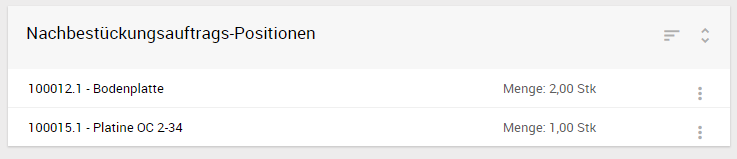
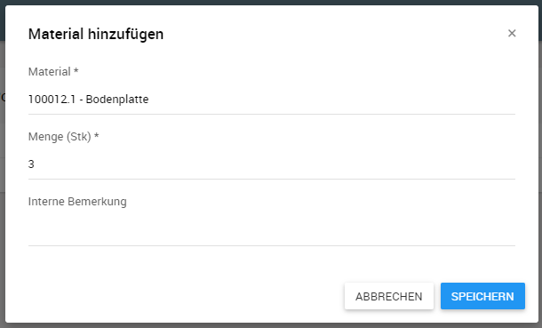
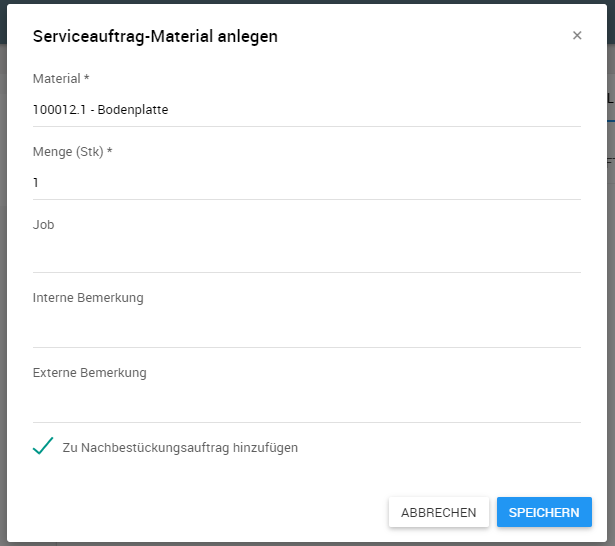

# Nachbestückungsaufträge{#replenishment-order}

Mit Hilfe von Nachbestückungsaufträgen können Bedarfe im zugeordneten Lager des Technikers (z.B. KFZ) mit dem notwendigen Material direkt im Anschluss an den Verbrauch wieder aufgefüllt werden.

## Übersicht

Eine Übersicht über den aktuellen Nachbestückungsauftrag kann über den Menüpunkt *Nachbestückung* aufgerufen werden.

Hier werden alle Artikel der Auftrags mit deren Menge aufgelistet und, sofern erfasst, ein Kommentar zur jeweiligen Position. Diese Liste kann bei Bedarf umsortiert oder gefiltert werden, wenn ein bestimmter Artikel gesucht wird.

Über das Kontextmenü der einzelnen Einträge können deren Mengen bearbeitet oder komplett wieder aus dem Nachbestückungsauftrag entfernt werden.

## Neue Positionen hinzufügen

Über die Plus-Schaltfläche kann ein neuer Artikel zum Nachbestückungsauftrag hinzugefügt werden.

Neben einer Artikel-Volltextsuche und der Angabe der gewünschten Menge ist es möglich eine interne Bemerkung für den Innendienst einzutragen.

### Hinzufügen und Aktualisieren von Positionen während der Einsatzbearbeitung

Wenn verbrauchtes Material bereits während der Bearbeitung eines Arbeitseinsatzes im Nachbestückungsauftrag hinzugefügt oder aktualisiert werden soll, kann direkt in der Erfassungsmaske die Checkbox *Zu Nachbestückungsauftrag hinzufügen* bzw. wenn bereits hinzugefügt *In Nachbestückungsauftrag aktualisieren* ausgewählt werden.

Die Unterbrechung der Auftragsbearbeitung und ein manueller Wechsel in den Nachbestückungsauftrag ist somit nicht erforderlich.

## Abschluss

Der aktuelle Nachbestückungsauftrag kann über die Pfeil-Schaltfläche abgeschlossen werden.

Alle Nachbestückungspositionen sind anschließend schreibgeschützt und jeder weitere Artikel wird einem neuen Nachbestückungsauftrag hinzugefügt. Der abgeschlossene Auftrag kann vom Innendienst im SMS eingesehen werden und wird diesem zusätzlich per E-Mail als PDF-Bericht gesendet.