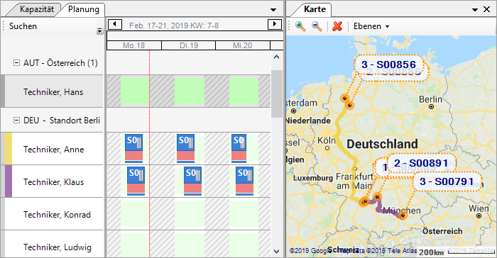

#### Kartendarstellung

Die Kartendarstellung der Aufträge visualisiert Arbeitseinsätze räumlich und hilft dem Planer dabei, die Routen der Techniker optimal zu gestalten.

Zum Einblenden der Kartendarstellung, wird unter Menü → Profil → Kartendarstellung angeklickt:

Die Karte enthält verschiedene Ebenen deren initiale Sichtbarkeit per Konfiguration gesteuert werden kann. Innerhalb der Ebenen werden Markierungen je nach aktuellem Zoomlevel zusammengefasst um die Übersicht zu gewährleisten. Durch Selektion im Auftragsvorrat, im Planungshorizont und in der Benutzerliste können Markierungen hervorgehoben werden um deren Position schnell zu erkennen. Farben und Größe der Markierungen sind konfigurierbar. Markierungen bieten ein Rechtsklickmenü an, über welches Browserlinks zu den jeweiligen Elementen in das SMS aufgerufen werden können.

Mit dem roten _X_ können alle vorhandenen Hervorhebungen (aus Auswahl von Aufträgen, Ressourcen oder Einsätzen) gelöscht werden.

Befinden sich mehrere Markierungen einer Ebene an gleichen oder fast gleichen Positionen wird eine automatische Verschiebung vorgenommen um Überlappungen zu vermeiden. Dabei werden die Markierungen kreisförmig angeordnet.

##### Ressourcen

Die Ebene _Ressourcen_ zeigt, falls die entsprechenden Daten vorhanden sind, die aktuelle Position (hier grün) der Ressourcen sowie deren Heimatadresse (hier braun). Die aktuell ausgewählten Ressourcen werden hervorgehoben.
Werden Ressourcen ausgewählt für die keine Position ermittelt werden konnte wird für einige Sekunden eine Warnung angezeigt (per Konfiguration abschaltbar).

Die Heimatadresse der Techniker kann in der Benutzerverwaltung des SMS eingestellt werden.

##### Aufträge

Die Ebene _Aufträge_ zeigt die Positionen von allen geladenen Aufträgen und hebt die aktuelle Auswahl im Arbeitsvorrat hervor. Dabei können einzelne Aufträge, aber auch Gruppierungen ausgewählt werden. Einzelne Markierungen können direkt per Maus in den Planungshorizont gezogen und eingeplant werden.
Werden Aufträge ausgewählt für die keine Position ermittelt werden konnte wird für einige Sekunden eine Warnung angezeigt (per Konfiguration abschaltbar).

Die Karte richtet sich automatisch nach den ausgewählten und hervorgehobenen Aufträgen aus (per Konfiguration abschaltbar).

##### Geräteakten
Die Ebene _Geräteakten_ zeigt alle Geräteakten im System für welche eine Position ermittelt werden konnte. Falls Serviceverträge vorhanden sind werden entsprechende Informationen im Tooltip angezeigt. Per Rechtsklick können Geräteakte und Serviceverträge im SMS per Browserlink aufgerufen werden.

Geräteakten können in zwei verschiedenen Markierungen dargestellt werden. Normal in Kaminrot und hervorgehoben mit grünem Punkt (unterhalb Mannheim) wenn die Geräteakte Teil eines Servicevertrags mit einem Wartungsplan ist, der vorzeitige Wartung erlaubt. Im SMS (per Rechtsklick erreichbar) kann bei Bedarf für den Servicevertrag, bzw. die Geräteakte ein Wartungsauftrag generiert werden. Dies ist z.B. dann hilfreich wenn ein Techniker aufgrund eines anderen Einsatzes in der Nähe ist.

##### Serviceobjekte
Die Ebene _Serviceobjekte_ zeigt alle Serviceobjekte im System für welche eine Position ermittelt werden konnte.

##### Technikerrouten
Die Ebene _Technikerrouten_ verbindet die ausgewählten Einsätze zu einer Route. Dabei wird zunächst die Luftlinie angezeigt, während im Hintergrund eine Route der Karte erzeugt wird. Werden Einsätze mehrerer Techniker ausgewählt wird für jeden Techniker eine Route angezeigt.

Neben der Ressource wird die Farbe dargestellt mit der die Route gezeichnet wurde. Eine fortlaufende Nummer pro Route zeigt die Reihenfolge der Einsätze. Sind Einsätze ausgewählt zu deren Aufträgen keine Position ermittelt werden konnte, so wird eine Warnung angezeigt und diese Nummer übersprungen. Die Route enthält dann nur Einsätze mit gültigen Positionen.
Per Rechtsklickmenü auf eine Ressource können alle Einsätze im Planungshorizont für diese Ressource auf der Karte als Route angezeigt werden.

Hält man den Mauszeiger über eine Route, wird die Distanz angezeigt. Wird Google als Kartenquelle benutzt, erscheinen weitere Informationen wie z.B. die Fahrzeit. Für die Google Routenabfrage ist ein API-Schlüssel notwendig.

Hält man die Taste STRG (Steuerung) und klickt beliebige Markierungen an, so wird eine manuelle Route entlang der Ziele erstellt. Dies kann dabei helfen Fahrzeiten besser zu planen. Ausgewählte Markierungen werden mit einem schwarzen Kreis hervorgehoben.

