## Plantafel

### Plantafel- Prozessbeschreibung

Die L-mobile Plantafel ist eine Anwendung zur Unterstützung der Personal- und Ressourceneinsatzplanung mit einer grafischen Oberfläche und ergänzenden Tools. Die Anwendung benötigt die L-mobile Basis SMS oder das aus einem ERP-System bereit gestellte Datenmodell und kann  mit dem Modul Mobiler Techniker Client optional erweitert werden.

### Plantafel- Installation

**Plantafel - Installation und Benutzer**

Die Installation der Plantafel kann über zwei verschiedene Wege erfolgen:

1. Im L-mobile SMS unter dem Menübereich Service

Durch das Anklicken des Menüpunktes "Plantafel" wird der Download auf den Desktop gestartet. Nach der Installation steht auf dem Desktop über das Symbol "Plantafel" ein direkter Zugriff zur Verfügung. Alternativ kann nach der Erstinstallation auch über den Menüpunkt "Plantafel" im SMS die Plantafel-Oberfläche gestartet werden.

2. Bei einer direkten Kopplung mit einem ERP-System wird die Installation durch den entsprechend berechtigten Administrator auf dem Desktop vorgenommen.

Um auf die Plantafel zugreifen zu können, benötigen Benutzer die Rolle Administrator oder Einsatzplaner. Diese werden den Benutzern vom Administrator in der L-mobile SMS Benutzerverwaltung zugeteilt.

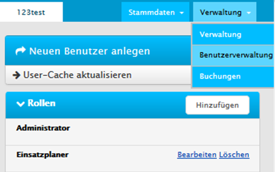

Viele Elemente der Plantafel können zusätzlich frei konfiguriert werden. Darüber hinaus werden bei vielen Bereichen weitere Informationen auf Anforderung angezeigt.

### Plantafel- Übersicht

#### Plantafel - Übersicht der Elemente

Die wichtigsten Standardelemente der L-mobile Plantafel sind wie folgt:

- Menüzeile
- Personen und Ressourcen
- Planungsansicht
- Planungsvorrat und Nebenzeiten
- Kapazitätsdiagramm
- Kartendarstellung
- Einsatzliste

Alle diese Elemente, außer der Planungsansicht, können ein- und ausgeblendet werden. Sie können auch beliebig innerhalb der Anwendungsansicht platziert werden. Beim Verschieben der Elemente mit der Maus, linke Taste gedrückt halten, es wird eine Platzierungshilfe angezeigt, in der der Benutzer den gewünschten Bereich (oben, unten, rechts, links, Mitte) wählen kann:

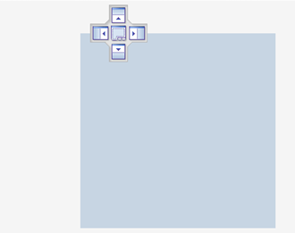

Nach dem Platzieren, können die Ränder der Elementenflächen mit dem Mauszeige (Pfeile) weiter in Breite und Höhe angepasst werden. 

#### Planungsansicht und Planung auf der Plantafel

**Planungsansicht**

Im Bereich "Planung" werden die Ressourcen den Auftragseinsätzen im Kalender zugeordnet.

**Ressourcen**

Die Plantafel ermöglicht es, den Überblick über alle zu planenden Ressourcen im gewählten Zeitraum zu behalten - sowohl Techniker, als auch z.B. Subunternehmer, Maschinen und viel mehr. Diese Ressourcen können sowohl nach Standorten als auch nach Teams (Funktionen) gruppiert werden. Die Anzeige kann zwischen Vor- und Nachname umgeschaltet und sortiert werden. Dies stellt der berechtigter Benutzer unter Profil/ Einstellungen Planung und Auftragsvorrat (Profileinstellung) / Personen um.

Unter Profil/ Ressourcen zu Profil hinzufügen können fehlende Ressourcen hinzugefügt und unnötige aus dem Profil gelöscht werden:

Um in der Liste der angezeigten Ressourcen zu filtern, werden Suchworte im Feld "Suchen" eingetragen und mit der Eingabetaste bestätigt.

Zum Löschen der Auswahl, Klicken Sie Schaltfläche *Löschen* an.

  

#### Planungsvorrat {#scheduler.pipeline}

Hier werden die zu  planenden Aufträge dargestellt. Dabei kann die Liste nach unterschiedlichen Kriterien wie z.B. Auftragsart, Maschinentyp, Maschinenstatus o.ä. gruppiert werden. Neue Elemente können optional erweitert werden. Die Gruppierungen werden mit Plus- und Minuszeichen auf- bzw. zugeklappt. Ergänzt wird der Planungsvorrat durch die Darstellung von nicht auftragsbezogenen Nebenzeiten und Abwsesenheiten.

**Planungsvorrat-Suche**

Um in der Liste der angezeigten Aufträge zu filtern, werden Suchworte im Feld "Suchen" eingetragen und mit der Eingabetaste bestätigt.

Zum Löschen der Auswahl, Klicken Sie Schaltfläche *Löschen* an.

  

**Abwesenheiten / Nebenzeiten**

Die Zeitarten, die nicht auftragsbezogen sind, werden unter "Abwesenheit" ganz oben im Planungsvorrat angezeigt. Die Liste dieser Zeitarten kann vom berechtigten Benutzer (Administrator) in der L-mobile SMS unter Verwaltung der entsprechenden Zuordnungstabelle angepasst werden.

**Planungsvorrat-Filter**

Die Standardfilter vom Arbeitsvorrat sind wie folgt:

- Priorität
- Standort
- Auftragstyp
- Installationsart
- Installationsgruppe
- Installationsstatus

Diese Filter stellt der berechtigte Benutzer unter Profil/ Einstellungen Planung und Auftragsvorrat (Profileinstellung) / Planungsvorrat-Filter um. Dafür werden die Filtergruppe mit dem Pluszeichen aufgekappt und selektiert.

**Planungsvorrat-Gruppen**

Die Standardgruppen vom Arbeitsvorrat stellt der berechtigter Benutzer unter Profil/ Einstellungen Planung und Auftragsvorrat (Profileinstellung) / Planungsvorrat-Gruppen um. Dafür werden die Gruppen auf der linken Seite ausgewählt und mit den Pfeiltasten nach links verschoben, wo mit den Tasten, die nach oben und unten zeigen, die Reihenfolge der Gruppierungen festgelegt wird.

**Aufträge verteilen / einplanen**

Die Aufträge (und Abwesenheiten) werden aus dem Planungsvorrat mit der rechten Maustaste auf den entsprechenden Techniker und Arbeitstag gezogen. Dabei ist es möglich nur einen oder mehrere Serviceeinsätze bei einem oder unterschiedlichen Techniker zu erstellen, d.h. der Auftrag darf mehrmals verteilt werden.

**Einsätze bearbeiten**

Es gibt zwei Möglichkeiten für die Feinplanung:

1. Direkt auf der Planungsansicht den Einsatz mit der Maus verschieben und dessen Größe anpassen, oder

2. im Menü/ Eigenschaften der jeweiligen Einsätze. Mit einem Doppelklick oder mit der rechten Maustaste/Menü/ Eigenschaften öffnet sich folgendes Eingabefenster:

Hier kann der Benutzer das Datum, Uhrzeiten bzw. Dauer des Einsatzes verändern.

Unter dem Punkt Status wird der Einsatz an den Techniker "freigegeben" bzw. die Freigabe widerrufen, als auch als feststehender Termin "fixiert". 

Unter den Informationen werden Details zum Einsatz für die Einsatzplaner (interne Informationen) oder den Techniker (Informationen für den Techniker) eingetragen.  Falls eine automatische Übertragung der Technikerinformationen auf alle Arbeitseinsätze dieses Auftrags  erwünscht ist, muss das Häkchen im Feld  
selektiert werden.

Unter der Änderungshistorie werden Änderungen in der Planung des gewählten Einsatzes angezeigt. Hier kann nachverfolgt werden wann welcher Einsatzplaner Änderungen vorgenommen hat und welcher Techniker jeweils auf welches Datum geplant wurde.:

**Planbalken/ Etiketten einstellen**

Eine konfigurierbare Beschriftung der Planbalken erfolgt mit Hilfe einer individuellen Konfiguration unter Menü/ Extras/ Einstellungen/ Farben & Tooltips/ Serviceeinsatz Einstellungen/ Beschriftung:

**Fähigkeiten**

Wurden bei der Auftragserstellung bestimmte Fähigkeiten (Skills) als Voraussetzung zur Erledigung festgelegt,  erscheint beim Anklicken des Auftrags bei den geeigneten Technikern in der Ressourcenübersicht rechts vom Namen ein Werkzeug-Symbol.

Wurde in der Vergangenheit ein Techniker bereits bei dem selben Gerät zur Auftragsbearbeitung eingesetzt oder ist bereits ein Techniker diesem Auftrag zugeordnet, erscheint beim Anklicken des Auftrags bei den entsprechenden Technikern das "Technikersymbol"   . 
Beim Anklicken eines Technikers mit dem Mauszeiger werden weitere Informationen über den Techniker und seine Fähigkeiten eingeblendet.

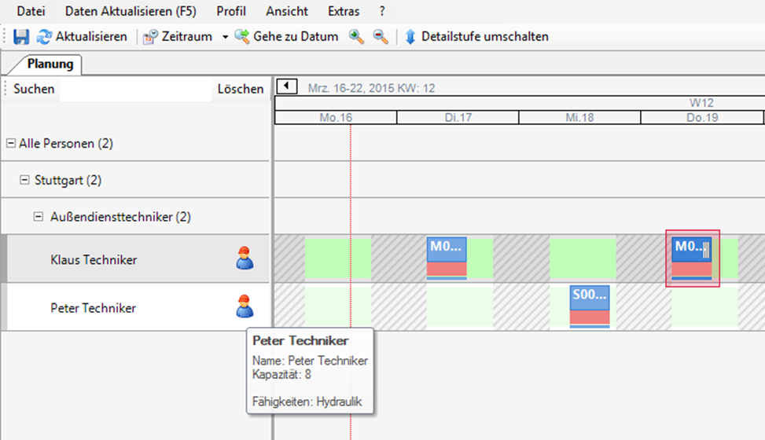

Die Liste und die Zuordnung der Fähigkeiten zu den Mitarbeitern erfolgt in der L-mobile SMS / Benutzerverwaltung vom berechtigten Benutzer (Administrator).

#### Kapazitätsdiagramm

Mit dem Kapazitätsgebirge können Sie die Auslastung einzelner Mitarbeiter, Gruppen oder ganzer Standorte im Blick behalten. Die Planung verändert dabei die Auslastungssituation in Echtzeit. Alle Nebenzeiten oder Abwesenheiten werden entsprechend Ihrer Kapazitätseinstellung mindernd oder neutral gewertet. 

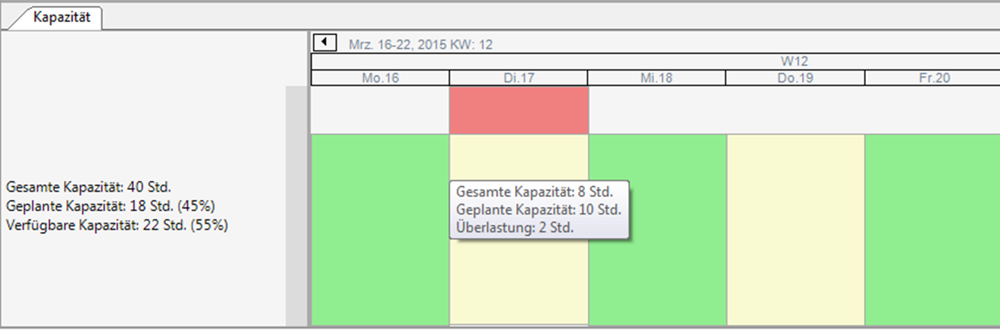

Zum Einblenden des Kapazitätsdiagram, wird unter Menü/ Profil/ Kapazitätsgebirge angeklickt:

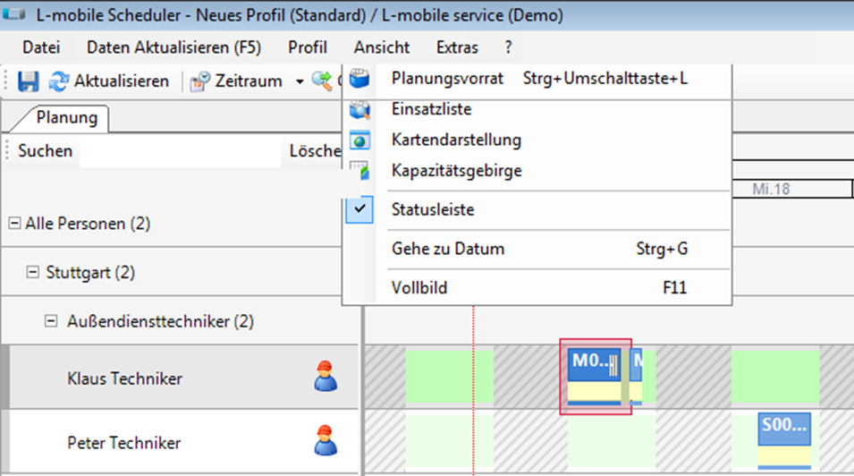

Zum Ausblenden des Kapazitätsdiagrams, wird die Schaltfläche angeklickt.

#### Einsatzliste

Die Einsatzliste zeigt Arbeitseinsätze als eine Liste, die im Standard eine Filterfunktion für eine Suche und Analyse beinhaltet.

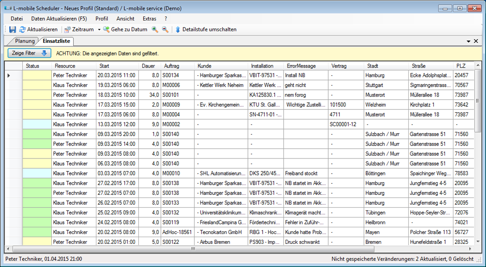

Zum Einblenden der Einsatzliste, wird unter Menü / Ansicht / Einsatzliste angeklickt:

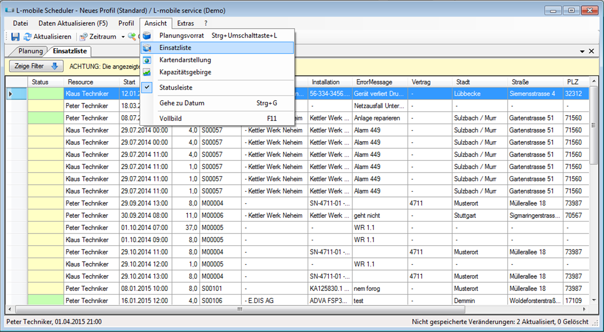

Taste "Zeige Filter"   blendet die vorangestellte Auswahl an Filterkriterien die über die Tasten "Suche" und "Zurücksetzen" gesteuert werden.

Mit dem Mausklick auf dem Spaltennamen ändert der Benutzer die Reihenfolge der Zeilen ab- bzw. aufsteigend. Die Farbe in der Spalte "Status" entspricht dem Status des Einsatzes (Siehe oben Plantafel/ Farben für den Zustand der Planung)



### Plantafel- Einstellungen

Unter dem Menü Datei kann der Benutzer folgende Funktionen finden:

- Speichern (auch über Menüschaltfläche )

- Seiteneinstellungen: für den Druck der Anzeige (die Anzeige der Anwendung ist auch mit der Maus an den Ränder der Gesamtfläche verschiebbar)

- Drucken: sichtbarer Bereich wird, wie unter Seiteneinstellungen definiert, gedruckt

- Beenden (auch über Windows-Schaltfläche  möglich)

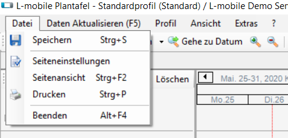

Weitere Schaltflächen:

-  Menüpunkt "Aktualisieren" (auch über Menüschaltfläche  )
-  Schaltfläche "Detailstufe umschalten"    zum Ein- und ausklappen der Ressourcen

**Planungshorizont einstellen**

- Menü Schaltfläche "Zeitraum"  hat eine Standardvorschlagsliste wie "diese Woche" oder "nächster Monat" zur Auswahl zum Anklicken, oder
- Menü Schaltfläche "Gehe zum Datum" öffnet den Kalender, um einen genauen Tag auszuwählen

 

- Menü Schaltflächen mit Zoomzeichen  vergrößern oder verkleinern die Kalenderansicht im Planungsbereich entsprechend der Zeichen
- Unter dem Menü/ Profil/ Profileinstellungen/ Planungseinstellungen können die obere und untere Grenzen vom Planungshorizont zwischen zwei Wochen und einem Jahr (im Standard) ausgewählt werden:

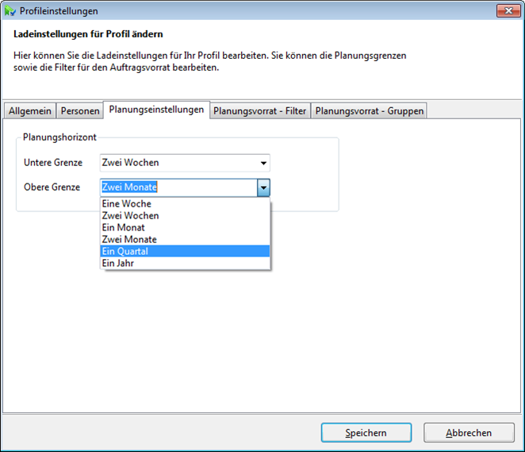 

#### Benutzerunterstützung auf der Plantafel - Tooltips und Farben

**Tooltips** sind Informationen, die beim Zeigen mit der Maus in einem separaten Fenster im Vordergrund eingeblendet werden.

Auf der L-mobile Plantafel gibt es zwei Arten der Tooltips:

(1) Tooltips mit Auftragsinformationen im Planungsbereich

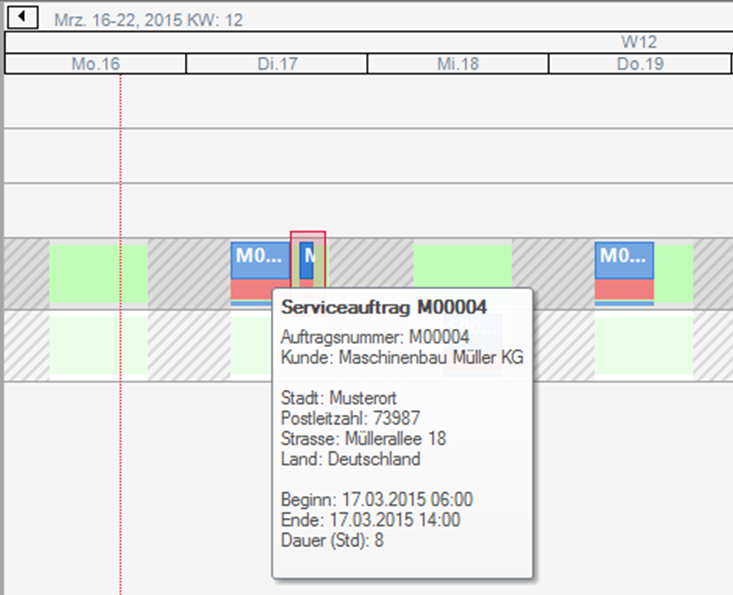

(2) Tooltips mit Auftragsinformationen im Planungsvorrat

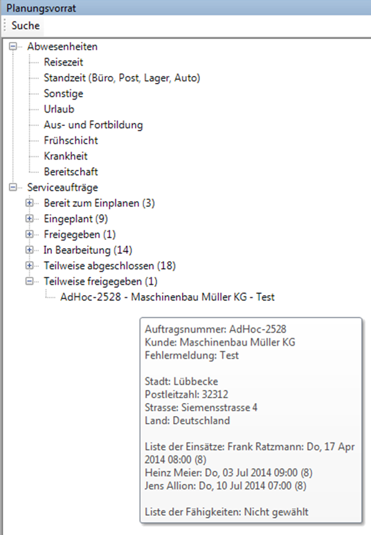

**Farben für den Zustand der Planung**

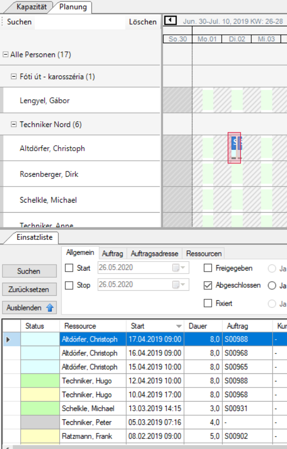

Unterschiedliche Zustände in der Planung werden durch unterschiedliche Farben der Planbalken deutlich:

- Rot – Eingeplant, ungespeichert - Planung simulieren
- Gelb – Eingeplant, gespeichert, für andere Disponenten/ Planer sichtbar
- Blau – Fixtermin, kann nicht mehr verändert werden
- Grün – Freigabe, Techniker bekommt diesen bei Nutzung des Mobilen Techniker Clients automatisch aufs Endgerät übermittelt und kann am Auftrag arbeiten.

**Plantafel – Farben und Tooltips einstellen**

Die Farben und Tooltips können unter Menü/ Extras/ Einstellungen angepasst werden:

#### Plantafel – Profile

**Plantafel - Definition der Profile**
Profile auf der Plantafel sind benutzerdefinierte Darstellungen der Planung, Ressourcen und Aufträge. Es können Standardprofile für die gesamte Organisation, Benutzergruppen oder einzelne Benutzer erstellt werden.
Über Profil/ Lade... werden verschiedene gespeicherte Ansichten der Plantafel aufgerufen:

Über Profil/ Speichern Unter... werden neue Ansichte der Plantafel erstellt:

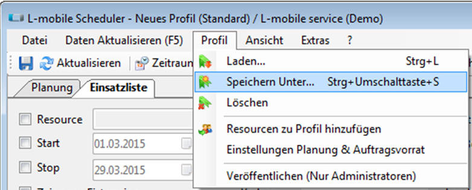

Dabei können berechtichte Benutzer auch neue Standardprofile beim Setzen des ensprechenden Häkchens erstellen:

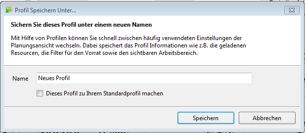

Über Profil / Löschen wird das aktuell geladen Profil gelöscht. Anschliessend wird das Standard-Profil des Benutzers geladen. Das Standard-Profil kann nicht gelöscht werden.

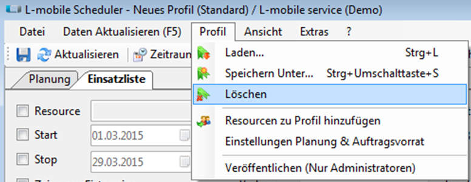

Über Profil/ Ressourcen zu Profil hinzufügen werden neue Ressourcen (z.B. Techniker) auf der Planungsansicht eingeblendet:

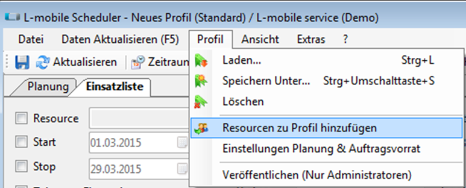

Dabei markieren Sie die Zeile der Ressource in der Tabelle und klicken anschliessend 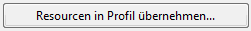 an.

### Teamplanung

Mit der Teamplanung ist es möglich mehrere Techniker zusammen auf einen Einsatz zu planen. Dazu werden mithilfe von Benutzergruppen Teams gebildet. Eine Hauptressource, welche pro Einsatz geändert werden kann, erhält den Einsatz stellvertretend für das Team zur weiteren Durchführung.
Für die Teamplanung muss das entsprechende Plugin für Plantafel und SMS aktiviert werden.

#### Teams und Hauptressourcen

Teams in der Plantafel entsprechen Benutzergruppen. Diese lassen sich im Backend in Verwaltung - Benutzergruppen erstellen und den Benutzern zuordnen.

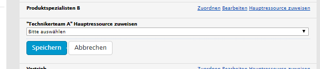

Pro Benutzergruppe sollte eine Hauptressource definiert werden, welche den Teameinsatz stellvertretend durchführt.

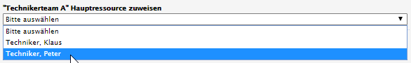

#### Planung
Einsätze können wie bisher per Drag & Drop geplant werden mit dem Unterschied, dass man direkt auf ein Team planen kann.
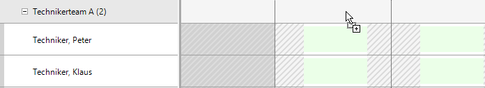
Der daraus resultierende Einsatz wird über alle Mitglieder des Teams dargstellt und kann nur auf Team-Ebene verschoben werden.
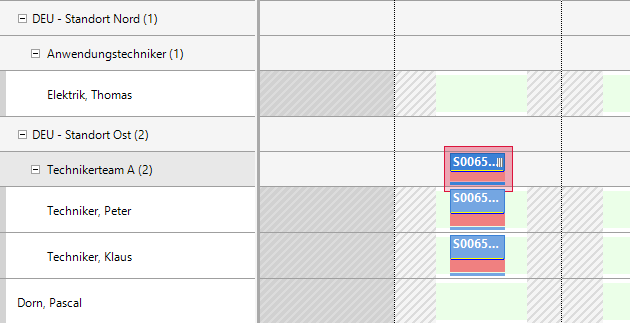
Ein Teameinsatz kann auch auf ein anderes Team umgeplant werden oder zu einem Einzeleinsatz auf einen Techniker gelegt werden.

Zusätzlich zur vordefinierten Hauptressource, welche standardmäßig bei der Planung verwendet wird kann die Hauptressource auch pro Teameinsatz geändert werden. Dazu kann man in den Einsatzeigenschaften entsprechend ein anderes Teammitglied auswählen. Weiterhin kann man in diesem Dialog weitere Techniker (auch team fremde) zum Einsatz hinzufügen oder entfernen. Team-fremde Techniker werden besonders hervorgehoben.
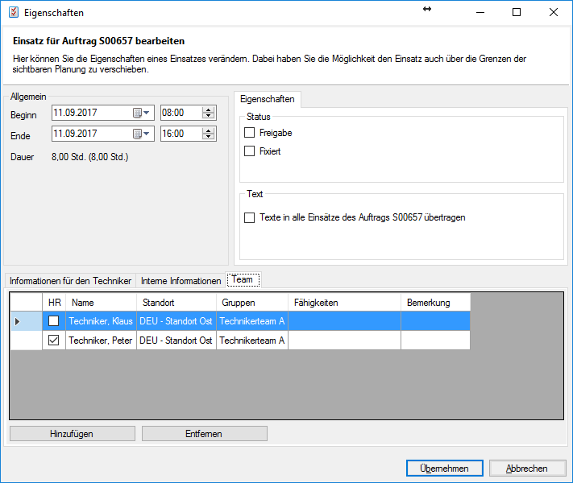

#### Techniker-Client
Im Techniker-Client sieht man in der Einsatzliste alle Techniker welche auch auf den Einsatz geplant wurden.
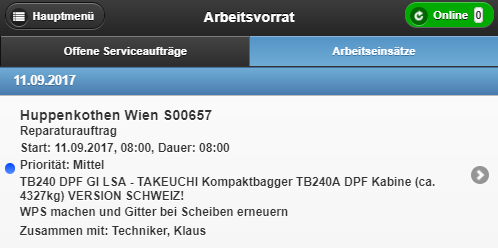

## Administration
Die Plantafel kann über das SMS administriert werden. Dazu findet man unter dem Menüpunkt _Verwaltung_ den Eintrag _Plantafel_ . Diese Funktionen sind der Projektentwicklung der L-mobile vorbehalten.

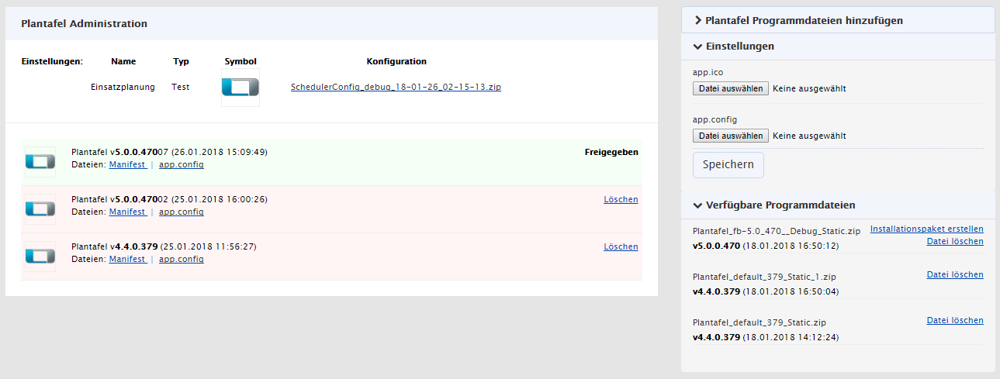

Im rechten Bereich können neue Dateien hochgeladen und Installationspakete erstellt werden. Im linken Bereich sind vorhandene Einstellungen und Installationspakete sichtbar.

### Programmdateien
Für neue Installationspakete werden Programmdateien benötigt. Diese können entweder über ein Formular hochgeladen oder auf dem Server im Unterordner `App_Data\Scheduler` der entsprechenden Webseite abgelegt werden. Als Dateiformat wird ein ZIP-Archiv erwartet.
Vorhandene Programmdateien können in der Verwaltung entfernt oder zu Installationspaketen umgewandelt werden.

### Einstellungen
Für die Plantafel kann ein Icon sowie ein Konfigurationspaket festgelegt werden. Beides geschieht per Formular-Upload. Als Icon wird ein Bild im ICO-Format erwartet. Die Konfiguration kann entweder einzeln als XML-Datei (z.B. `app.debug.config`) oder als ZIP-Archiv hochgeladen werden. Aus dem ZIP-Archiv werden die entsprechenden Konfigurationsdateien herausgefiltert und in ihrer Ordnerstruktur behandelt. Für ZIP-Archive muss den Konfigurationstyp (_Debug_ oder _Release_) ausgewählt werden. Anhand des Typs wird entschieden welche Konfigurationsdateien für die Transformation benutzt werden.

Die Ordnerstruktur kann z.B. so aussehen:

- `customer.lmobile`
  - `app.debug.config`
  - `app.release.config`
  - `app.debug.ico`
  - `Plugins`
    - `Einsatzplanung.Service`
      - `app.debug.config`
      - `app.release.config`

Weiterhin wird die Einstellung `Setup/Name` für den Namen des Pakets verwendet.

### Installationspaket
Aus den Programmdateien kann ein Installationspaket erstellt werden. Dies ist dann erlaubt, wenn die Version der Programmdateien gleich oder größer der aktuell freigegebenen Plantafel ist.
Für das Installationspaket wird die aktuelle Konfiguration und das Icon benutzt. Verschiedene Installationspakete können also unterschiedliche Konfigurationen und Icons haben.

Installationspakete müssen immer eine eindeutige Version haben. Wurde z.B. für Version _5.0.0.470_ bereits ein Installationspaket erstellt und man möchte nur die Konfiguration ändern, so läd man eine angepasst Konfiguration hoch und erstellt anschließend ein neues Installationspaket. Dabei wird eine Warnung angezeigt:
> Es gibt bereits ein Installationspaket basierend auf Version 5.0.0.470. Es wird automatisch eine höhere Versionsnummer erzeugt? Forfahren?

Bestätigt man diese, wird automatisch eine neue eindeutige Version festgelegt. Die Basis-Version wird in der Ansicht hevorgehoben.

Zu einem Installationspaket kann man das Manifest herunterladen, was zur Installation dient. Weiterhin findet man die benutzte Konfiguration und das Icon.

Mit dem Manifest kann ein Installationspaket getestet werden, ohne dass es für alle Plantafel-Benutzer freigegeben werden muss. 

Die Freigabe eines Installationspakets kann nur für Pakete mit höherer Version als das aktuell freigegeben Paket (sofern vorhanden) erfolgen. Freigegebene Installationspakete sind für Plantafel-Benutzer erreichbar - z.B. nach dem Login, oder im Menüpunkt _Service_ - und werden beim nächsten Start der Plantafel entsprechend aktualisiert.