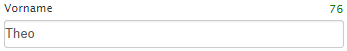

# Konzepte + Grundlagen {#concepts-design}

Zum besseren Verständnis und als Einführung in die Software werden wesentliche Grundlagen der L-mobile Crm/Service Anwendung erklärt. Es sollen in diesem Kapitel gerade so viele Informationen geliefert werden, dass der Leser des Dokumentes in der Lage ist diese Konzepte und Grundlagen in den folgenden Kapiteln zu erkennen.

## Modularer Aufbau

Die L-mobile Crm/Service Anwendung ist modular aufgebaut. Durch die Modulstruktur besteht die Möglichkeit durch Konfiguration der aktiven Module eine individuelle Anwendungsumgebung zu erhalten. Die Anzahl der Module ist dabei abhängig von der gewählten Lizensierung. Mit Aktivierung weiterer Module werden neue Funktions- und Anwendungsbereich in der Oberfläche aktiviert. Darüber hinaus können durch die Aktivierung von Modulen Prozessabläufe in der L-mobile Crm/Service Anwendung verändert werden.

## Konfiguration

Für jedes Modul steht eine Reihe von Konfigurationsmöglichkeiten bereit. Mit Hilfe der Konfiguration kann das Verhalten und Aussehen der L-mobile Crm/Service auf Ihre Bedürfnisse angepasst werden. So kann z.B. mit Hilfe der Konfiguration an vielen Stellen die Anpassung des Systems durch Programmierung vermieden werden.

---

Die möglichen Konfigurationsparameter werden pro Modul im Kapitel: Konfiguration dokumentiert

---

## Erp-Integration + Datenübernahme {#Erp-Integration}

Die L-mobile Crm/Service Anwendung kann in vielen Fällen mit Ihrem vorhandenen Erp-System integriert werden. Dazu werden bestimmte Inhalte aus dem vorhandenen Datenbestand in die L-mobile Crm/Service Umgebung synchronisiert. 

__Lesende Schnittstellen__ Mit Hilfe der lesenden Schnittstellen sind Sie in der Lage vorhandenen Daten unkompliziert in der L-mobile Crm/Service Anwendung zu übertragen. Dabei können Sie zu diesen Daten weitere Informationen erfassen.

__Schreibende Schnittstellen__ In der L-mobile Crm/Service Anwendung erfasste Daten können in strukturierter Form bereitgestellt werden, so dass eine Verarbeitung in Ihrem Erp-System erfolgen kann.

---

Es ist sinnvoll für jeden zu synchronisierenden Dateninhalt festzulegen aus welchem System die Daten *führend* stammen. Das bedeutet, dass dieses System die Autorität über die Daten erhält und Änderungen in diesem System Priorität über Änderungen in allen beteiligten Systemen erhalten.

---

## Gruppen und Sichtbarkeiten {#groups-visibility}

In der L-mobile Crm/Service Anwendung kann für viele Objekte eine individuelle Sichtbarkeit hinterlegt werden. Dabei kann in die folgenden Sichtbarkeiten unterschieden werden.

- Für alle Benutzer sichtbar
- Private Information, nur für den aktuellen Benutzer sichtbar
- Informationen für eine Menge von Benutzergruppen (Beispiel: Region A, Region B, etc.)
- Informationen für eine Menge von Benutzern (Beispiel: Peter und ich, Frank und Tobias, etc.)

Die Sichtbarkeit von Informationen steuert hier die Anzeige der Datensätze in der Anwendung. Sollten Sie keine Sichtbarkeit auf ein Objekt erhalten haben so werden alle mit diesem Objekt verbundenen Informationen für Sie ebenfalls ausgeblendet.

## Rollen und Berechtigungen {#roles-permissions}

Durch die Zuweisung von Rollen und Berechtigungen an die Benutzer erfolgt die Authorisierung für bestimmte Anwendungsfunktionen. Dabei können Pakete von Berechtigungen in Rollen zusammengefasst werden um diese schnell an eine breite Anzahl von Benutzern zuteilen zu können.

Beispiele für Rollen:

- Administrator (Systemverwalter)
- Leseberechtigung
- Rolle Vertriebsleiter (darf alle Funktionen ausführen)
- Rolle Aussendienstmitarbeiter (darf nur Informationen erfassen aber nicht löschen)

## Änderungsprotokoll

Für komplexe Objekte werden automatisch die folgenden Werte gespeichert:

- Datum der Erstellung
- Datum der letzten Modifikation
- Benutzer der Erstellung
- Benutzer der letzten Modifikation

----

**Technische Informationen** Für komplexe Objekte kann eine Protokollierung auf Feldebene aktiviert werden. Diese Option muss in der Projektumgebung konfiguriert werden.

----

## Internationalisierung / Mehrsprachigkeit

Die L-mobile Crm/Service Anwendung unterstützt zur Zeit deutsche, englische, französische und ungarische Oberflächen/Eingabesprachen. Die Eingabe der Daten kann in jeder beliebigen Sprache erfolgen. Die zugrunde liegenden Datenstrukturen sind für die Verwendung mit UTF-8 codierten Inhalten vorbereitet.

## Dynamische Oberflächen {#dynamic-ui}

L-mobile Crm/Service wird für verschiedene Anwendungsbereiche optimiert. Dazu gehören unter anderem der Aufruf an einem stationären Computer (Desktopbetrieb), mobilen Endgeräten mit kleineren Bildschirmen. Darüber hinaus existieren optimierte Oberflächen für bestimmte Nutzergruppen wie z.B. Personaldisponenten und Service-Technikern im Außendienst.

Im Folgenden werden die unterschiedlichen Modelle und zugrunde liegenden Konzepte näher vorgestellt.

## Layout - Desktop {#nav-desktop}

Die Anwendungsoberfläche von L-mobile Crm/Service zeigt sich auf einem stationären Computer als Browseranwendung. Dieses sogenannte "Backend" enthält wesentliche administrative Funktionen, ist aber auch eine Arbeitsumgebung  für den Innendienst. Mittelfristig werden die meisten Funktionen auch in dem Mobilen CRM (Material Client) vorhanden sein. Die Desktop-Oberfläche ist in die folgenden Bereiche unterteilt: 

- Navigationsbereich
- Anwendungsbereich
- Kontextfunktionen
- Kontextinformationen 

__Navigationsbereich__

Die Navigation in L-mobile Crm / Service erfolgt durch so genannte Registerkarten. Diese finden sich in einem separaten Navigationsbereich im oberen Teil der Seite. Dort stehen auch Informationen zum angemeldeten Benutzer zur Verfügung.

__(1)__ Anwendungsnavigation

Die Anwendungsnavigation auf beiden Seiten des Bildschirms wird genutzt um in den aktivierten Module zu navigieren. Hier finden sich die grundlegenden Funktionen der Module.

__(2)__ Historische Einträge

Um häufig genutzte Informationen schnell und unkompliziert zu erreichen haben Sie mit Hilfe der historischen Einträge die Möglichkeit auf die zuletzt geöffneten Seiten direkt zuzugreifen. Die Anzahl der angebotenen Einträge ist dabei abhängig von Ihrer Bildschirmgröße.

__(3)__ Informationen und Logout

In diesem Bereich haben Sie die Möglichkeit den angemeldeten Benutzer zu überprüfen sowie persönliche Einstellungen zu verändern. Administratoren finden hier die Möglichkeit grundlegende Einstellungen der gesamten Webseite zu verändern.

__Anwendungsbereich__

Im Anwendungsbereich werden die zentralen Inhalte einer gewählten Funktion dargestellt. Hier finden sich historische Einträge zum gewählten Inhalt die in der Regel durch vor- und zurückblättern durchsucht werden.

Der Anwendungsbereich kann in mehrere so genannte *Karteikarten* unterteilt werden. Dabei erfolgt eine Darstellung der verfügbaren Karten im Kopf des Anwendungsbereich.

__Kontextfunktionen__

Die Kontextfunktionen beziehen sich in der Regel auf die im Anwendungsbereich dargestellten Inhalte. Dabei wird optisch zwischen primären und sekundären Aktionen unterschieden. Die Aktionen stehen im aktuellen Benutzerkontext ggf. mit unterschiedlichen Ausprägungen zur Verfügung.

__Kontextinformationen__

Bei vielen Anwendungen sind weiterführende Informationen zum aktuell geladenen Anwendungsbereich notwendig. Als Beispiel soll hier die Aufgabenliste auf dem Dashboard genannt werden. Solche ergänzenden Informationen zur Anwendung werden innerhalb des Bereichs Kontextinformationen angezeigt. Meist ist ein direktes Verzweigen aus den Kontextinformationen in neue Anwendungen bzw. Funktionen möglich.

## Layout - mobile Endgeräte {#nav-mobile}

L-mobile Crm/Service reagiert auf die verfügbare Bildschirmfläche des Endgerätes mit dem die Anwendung aufgerufen wurde. Daher werden kleinere Endgeräte wie z.B. Smartphone und Tablets eine reduzierte meist einzeilige Oberfläche erhalten.

In der Benutzeroberfläche des Mobilen CRM sieht es beispielhaft so aus:

Beispiel Dashboard:

Beispiel Kontakt Details:

__Bedienung - einzeilige Darstellung__

Die mobile Benutzeroberfläche des L-mobile CRM bietet einige Bedienungshilfen. In der Navigationsleiste befindet sich eine Schaltfläche zum Öffnen der Menüfunktionen.

Darunter befinden sich Navigationshilfen, welche den Benutzer zu den Kontextfunktionen und Informationen führen und somit den Anwendungsbereich überspringen.

Umgekehrt kann die Navigation an den Seitenanfang mit der in den Kontextfunktionen bereitgestellten Schaltfläche *Zurück zum Anfang* erfolgen.

Beispiel im Mobilen CRM (Material Client):

## Brotkrümelnavigation

Oberhalb des Anwendungsbereiches zeigen Brotkrümel den Pfad zur aktuellen Seite. Die Navigation soll die Orientierung verbessern, indem sie Links zu übergeordneten Seiten anbietet.

Über die Verlaufs-Schaltfläche lässt sich zudem eine Liste der zuletzt aufgerufenen Seiten anzeigen.

## Liste {#structure-list}

Zu vielen Objekten der L-mobile Crm/Service Anwendung existiert eine so genannte *Listenansicht*. Mit Hilfe der Listenansicht kann die Gesamtzahl der vorhandenen Objekte eines bestimmten Typ durchsucht werden. Dabei stehen für die Suche unterschiedliche Möglichkeiten wie z.B. einfache oder erweiterte Filter sowie Schlagwörter zur Verfügung.

## Liste, Feldfilter {#structure-list-filter}

Zu jeder Liste kann eine Definition von Feldfiltern erfolgen. Diese Feldfilter helfen dabei die dargestellten Elemente der Liste nach den gewünschten Informationen weiter einzuschränken. Dabei stehen unterschiedliche Arten von Filtern zur Verfügung:

- Bei den einfachen Textfiltern handelt es sich um eine Volltextsuche, d.h. man kann nach teilen eines Wortes suchen.
- Filterfelder mit Vorschlagslisten, z.B. Einfache Vorschlagslisten, Zuordnungstabellen
- Benutzerfilter, optional mit Gruppenfilter
- Bereichsfilter, z.B. größer als, kleiner als
- Datumsbereichfilter, z.B. Letzter Monat, definierter Zeitraum

----

**Hinweis** Dabei werden alle gewählten Filterinhalte mit einer logischen **UND** Verknüpfung verbunden. Beispiel: Firmen mit Namen "A..." und Postleitzahl  "71..."

**Technischer Hintergrund** Die Feldfilter können in den Modulen der Software hinterlegt werden, so kann z.B. ein Modul die Filterliste um eigene Felder ergänzen.

----

## Liste, Lesezeichen {#structure-list-bookmarks}

Um wiederkehrende Suchabfragen innerhalb einer Liste abzubilden können so genannte Lesezeichen konfiguriert werden. Dabei können einfache Inhaltsabfragen mit komplexeren Unterabfragen kombiniert werden. Die Liste der verfügbaren Lesezeichen wird oberhalb der eigentlichen Liste ausgegeben und kann in unterschiedliche Kategorien unterteilt werden. Die Definition der Lesezeichen erfolgt zur Zeit nur im Quelltext der Anwendung und kann nicht durch den Benutzer verändert werden. Lesezeichen und Filter können jedoch vom Benutzer kombiniert werden. Hierbei wird nicht vom System geprüft, ob die kombinierten Filter widersprüchlich sind. Beispielsweise könnte ein Lesezeichen auf „Überfällige Projekte“ mit einem Filter auf das Fälligkeitsdatum das in der Zukunft liegt kombiniert werden.

## Liste, Diagramm {#structure-list-diagram}

Die Listenansicht von Objekten kann um eine Diagrammdarstellung erweitert werden. Dabei können verschiedene numerische Werte wie z.B. Anzahl oder Wert mit einem Intervall wie z.B. Datum der Erstellung, etc. in Relation gebracht werden. Die Darstellung erfolgt in erster Linie als Balkendiagramm. Zur besseren Visualisierung kann das Balkendiagram mit einem gestapelten Diagramm kombiniert werden um z.B. die Verteilung der Werte in einer weiteren Dimension wie z.B. Kategorien zu verdeutlichen. 

----

__Technischer Hintergrund__ Existieren auf einem Objekt Eigenschaften die sich in 2 Achsen darstellen lassen z.B. Wert und Fälligkeitsdatum können diese für die Diagrammausgabe koniguriert werden. Sobald ein solche Konfiguration existiert wird das Diagramm oberhalb der Liste angezeigt. Es kann mehr als 1 Wert für die Wertdarstellung nominiert werden. Die Anzeige der Werte ist dann im Diagramm umschaltbar.

----

## Liste, Karte {#structure-list-map}

Verfügen die in der Liste angezeigten Objekte über eine Ortsangabe, so besteht die Möglichkeit diese Objekte in einer Karte darzustellen. Dabei werden die Inhalte auf der Karte in so genannte *Cluster* zusammengefasst um die Übersicht in den verschiedenen Skalierungen zu erhöhen. 

Bei aktiver Kartendarstellung besteht die Möglichkeit durch Navigation in der Karte die Listenansicht abhängig vom angezeigten Ausschnitt zu filtern. Somit steht eine einfache Möglichkeit zur regionalen Suche in der Liste bereit.

## Liste, Kalender {#structure-list-calendar}

Bei Angabe mindestens einer Datums-Eigenschaft der angezeigten Objekte kann eine Kalenderdarstellung der Objekte erreicht werden. Dabei werden zu jedem Objekt wichtige Informationen in die Darstellung übernommen. Die so erstellten Kalender können mittels ICS (Internet Calendar Stream) Link auch in gängigen Programmen zur Kalenderverwaltung wie z.B. Microsoft Outlook, Apple Kalender, usw. abonniert und somit periodisch aktualisiert werden.

----

**Hinweis** Bei aktiver Kalenderdarstellung besteht die Möglichkeit in den Kontextaktionen einen Link zum Abonement der Kalenderdaten aufzurufen.

----

## Liste, Selektion + Massenaktionen {#bulk-actions}

In der Listenansicht ist es bei einigen Objekten möglich eine Aktion auf mehrere Objekte gemeinsam auszuführen. Dafür werden so genannte *Massenaktionen* in der Listenansicht angeboten. Um die Massenaktionen zu aktivieren verwenden Sie die Checkboxen vor den Listeneinträgen für eine individuelle Selektion

Möchten Sie eine größere Menge Datensätze der aktuellen Seite auswählen verwenden Sie die Schnellauswahl *Alle markieren*

Die Funktion *Alle markieren* bezieht sich dabei nur auf die aktuell angezeigte Seite der Listenansicht. Möchten Sie alle Ergebnisse z.B. einer Suche markieren erfolgt dies durch separates Umschalten der Markierung auf *Alle Suchergebnisse selektieren*

Die so selektierten Objekte können nun je nach Modul und zur Verfügung stehen Funktionen in der Listenansicht mit Hilfe von Massenaktionen verändert werden.

## Formulare {#structure-form}

Die Anlage oder Bearbeitung von Objekten erfolgt in so genannten *Formularen*. Diese Formulare ermöglichen es Dateninhalte strukturiert und unter Berücksichtigung von Konsistenzregeln zu erfassen oder zu bearbeiten.

## Detailansicht {#structure-details}

Zu vielen Objekten gehört die so genannte *Detailansicht*. In der Detailansicht werden alle vorhandenen Inhalte und Aktivitätsströme eines Objektes zusammengeführt. In der Detailansicht besteht häufig die Möglichkeit weitere Informationen zu einem Objekt zu erfassen oder bestehende Informationen zu bearbeiten.

## Vorschlagslisten + Wertehilfen {#autocompleter}

Bei der Eingabe von Daten ist es immer wieder erforderlich vorhandene Objekte zu referenzieren. Damit die Auswahl der Datensätze möglichst schnell und unkompliziert erfolgen kann gibt es in der L-mobile Crm/Service Anwendung verschiedene Formen von Vorschlagslisten und Wertehilfen bei der Dateneingabe.

__Einfache Vorschlagsliste__
Die einfache Vorschlagsliste erscheint bei der Eingabe in ein Textfeld und bietet mögliche Ergebnisse in einer Auswahlliste an. Dabei wird der komplette Name des Obkjektes durchsucht und die der Eingabe entsprechende Stelle hervorgehoben.

__Erweiterte Vorschlagsliste__
Die erweiterte Vorschlagsliste wird dann verwendet wenn die einfache Suche im Namen der Firma nicht ausreicht. Der Benutzer hat ebenso wie bei der einfachen Vorschlagsliste die Möglichkeit über einen Teil der Inhalte direkt durch die Eingabe in das Textfeld zu suchen.

Die Schaltfläche … öffnet die erweiterte Suchmaske. In dieser stehen Filtermöglichkeiten nach Eigenschaften sowie nach Schlagworten zur Verfügung. Durch die Auswahl eines Eintrag in der Liste erfolgt die Übernahme in das Textfeld.

---

Tip: Die Suchergebnisse können mit Hilfe der ↑ und ↓ Tasten durchgeblättert werden. Die *Space* Taste übernimmt das gewählte Element in das Formular.

---

__Zuordnungstabellen__
Die Eingabe feststehender Elemente erfolgt durch so genannte *Zuordnungstabellen*. Die Zuordnungstabellen bieten die Möglichkeit die Elemente mehrsprachig zu speichern. Durch die Auswahl eines eindeutigen Schlüssel besteht die Möglichkeit die gespeicherten Werte in die Sprache des Benutzers zu übersetzen.

Über den Menüpunkt *Verwaltung* - *Zuordnungstabellen* lassen sich alle Zuordnungstabellen auflisten und durchsuchen. Durch einen Klick auf eine der Tabellen können alle darin bereits vorhandenen Werte durchsucht und bearbeitet werden, oder es können neue Einträge angelegt werden.

---

**Wichtig:** Nur die Administrator Rolle darf Zuordnungstabellen verwalten. Beim Löschen von Werten aus den Zuordnungstabellen muss darauf geachtet werden, dass diese nicht in Verwendung sind. Vergebene Schlüssel sollten im nachhinein nicht mehr geändert werden. Andernfalls kann die Integrität der Daten schaden nehmen.

---

## Pflichtfelder + Regeln {#rules}

Die Eingabe von Daten kann direkt mit unterschiedlichen Regeln geprüft werden um schlechte Datenqualität bei der Eingabe zu erkennen. Dabei gibt es eine Reihe von Regeln die die L-mobile Crm/Service Anwendung im Standard prüft.

Beispiele für Regeln:

- Pflichtfelder
- Feldlänge
- Minimun und Maximum
- Inhalt z.B. gültige Telefonnummer oder Mail-Adresse
- etc.

## E-Mail Dropbox {#email-dropbox}

Ein Großteil der Kommunikation erfolgt heute in Form von E-Mail Nachrichten. Damit die Ablage dieser Informationen in der L-mobile Crm/Service Anwendung möglichst einfach und schnell erfolgen kann beinhaltet jede Installation eine so genannte *E-Mail Dropbox*. Mit Hilfe der E-Mail Dropbox kann jeder Benutzer in seinem täglichen Arbeitsfluss bestimmte Nachrichten an die L-mobile Crm/Service Anwendung weiterleiten.

Eine detaillierte Beschreibung erfolgt im Kapitel *E-Mail Dropbox*.

## Hintergrunddienste {#background-services}

Jedes Modul kann eine Reihe von Hintergrunddiensten in der L-mobile Crm/Service Anwendung definieren. Diese Hintergrunddienste werden verwendet um periodische Aufgaben im System auszuführen. Beispiele für Hintergrunddienste sind:

- Nachrichtenversand per E-Mail
- Überwachung des Volltextindex
- Verarbeitung von ausstehenden Aktionen
- etc.

Hintergrunddienste bestehen aus 2 Teilen: Dem eigentlichen Auftrag und dem so genannten *Auslöser*. Der Auslöser bestimmt wie oft und wann der Auftrag ausgeführt wird.

Eine Liste aller aktiven Hindergrunddienste und deren Auslöser lässt sich über den Menüpunkt *Verwaltung* - *Hintergrunddienste* aufrufen.

Über das Kontextmenü lassen sich einzelne Hintergrunddienste manuell starten, unabhängig von der geplanten nächsten Ausführung. Sofern bereits Ausführungen eines Dienstes geplant sind, können diese über die Aktion *Pause* verhindert werden.

## E-Mail Versand {#email-queue}

Da aus verschiedenen bereichen der Anwendung E-Mails generiert werden (z.B.: Service-Einsatzberichte, Spesenabrechnungen, ...) landen diese zunächst in einer E-Mail Warteschlange, um anschließend von einem [Hintergrunddienst](#background-services) an die Empfänger versendet zu werden. Eine Liste der sich in Warteschlange befindlichen, sowie die kürzlich erfolgreich versendeten E-Mails kann über den Menüpunkt *Verwaltung* - *E-Mail Warteschlange* angezeigt werden.

Sollte der E-Mail-Versand einmal fehlschlagen werden diese E-Mails in der Liste zusammen mit dem aufgetretenen Fehler angezeigt. Über eine [Massenaktion](#bulk-actions) kann ein erneuter Versand angestoßen werden.

## Anwendungslogs

Über den Menüpunkt *Verwaltung* - *Anwendungslogs* kann das vom System automaisch generierte Anwendungsprotokoll aufgerufen werden. Diese können gefiltert, durchsucht und zur Fehlersuche genutzt werden.
