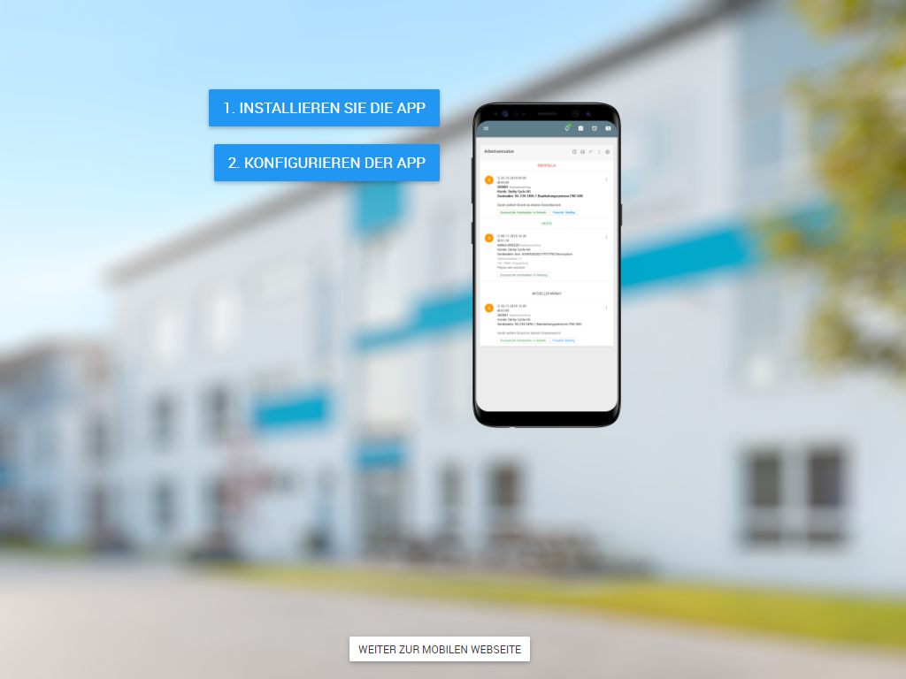
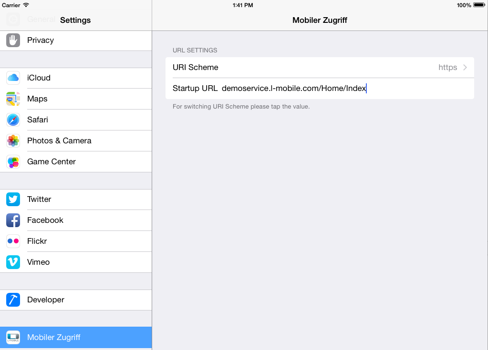

# Apps {#apps}

Beim Einsatz eines mobilen Endgerätes empfiehlt es sich hierfür die native L-mobile App zu verwenden. Diese steht derzeit für Android, Apple iOS und Windows (Phone) 10 zur Verfügung und bietet eine verbesserte Performance, sowie diverse Zusatzfunktionalitäten, die in Browsern nicht zur Verfügung stehen. 
Wird mit einem kompatiblen Endgerät die Anwendung in einem Browser aufgerufen, wird statt dem Login eine Seite angezeigt, welche auf diese App verweist.

Diese Seite beinhaltet eine Schaltfläche um die App zu installieren, welches über den Google Play Store (Android), über iTunes (Apple iOS) bzw. über Sideloading (Windows 10) realisiert ist. Hierüber können auch Updates der App bezogen werden.
Nach Installation der App ist ggf. als zweiter Schritt erforderlich die Servereinstellungen der App zu konfigurieren, damit diese künftig den korrekten Anwendungsserver anspricht. Über die Schaltfläche *Konfigurieren der App* wird die App automatisch konfiguriert und mit den geänderten Einstellungen gestartet.

Ist die Installation der App nicht oder erst zu einem späteren Zeitpunkt erwünscht kann über die Schaltfläche *weiter zur mobilen Webseite* direkt der Login aufgerufen werden.

## Alternative Konfiguration der Apple iOS App

Zusätzlich zur Konfigurationsseite besteht bei Geräten mit Apple iOS die Möglichkeit über die *Einstellungen* App die Konfiguration der L-mobile App anzupassen.

