# Objektdetails {#contact-details}
Zu vielen Objekten der L-mobile Crm/Service Anwendung stehen weiterführende Informationen zur Verfügung. Diese Informationen erreicht man in der Detaildarstellung. Der Aufruf der Detaildarstellung erfolgt dabei an vielen Stellen durch einen Verweis in der Oberfläche oder mit Hilfe der Listendarstellung.

Da viele der hier besprochenen Elemente in unterschiedlichen Objekten wiederholt werden erfolgt hier eine verallgemeinerte Darstellung. In späteren Kapiteln wird nur noch auf die Details der jeweiligen Objekte eingegangen um eine möglichst kompakte Dokumentation zu erreichen.

Beispiel: Für eine einzelne Firma können viele Informationen in der Detaildarstellung zusammengeführt werden. Das Ziel der Detaildarstellung ist es eine umfassende Sicht auf die Informationen der Firma zu erhalten.

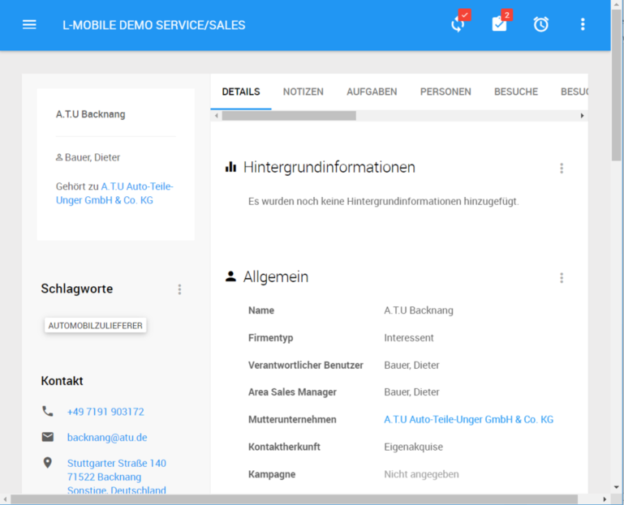

## Kopfdarstellung
Zu jedem Objekt können in der Kopfdarstellung die wichtigsten Informationen zusammengefasst werden. Dazu gehören unter anderem der Name, Kategorie, verantwortlicher Benutzer sowie je nach Objekttyp weitere wichtige Informationen.

Im Fall dieser Firma erhält der Benutzer im Kopfbereich Hinweise über den Namen der Firma, die Kategorie, die vergebenen Schlagwörter sowie den verantwortlichen Benutzer.

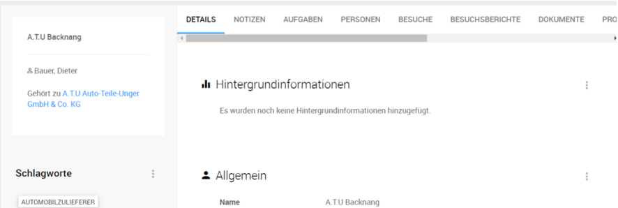

Darüber hinaus besteht in der Kopfansicht die Möglichkeit den *Anwendungsbereich* auf verschiedene Karteikarten umzuschalten. Im Basismodul stehen für das Objekt Firma 2 Karteikarten zur Verfügung:

- Notizen
- Beziehungen

---
Durch Aktivierung unterschiedlicher Module der L-mobile Crm/Service Anwendung variiert die Anzahl von *Karteikarten* in der Kopfdarstellung.

---

## Anwendungsbereich - Notizen

Zu vielen Objekten besteht die Möglichkeit einen Aktivitätsstrom in Form von Notizen zu erfassen. Dieser findet sich auf der Karteikarte *Notizen* und verfügt über folgende grundlegende Funktionen:

- Erfassen von neuen Notizen inkl. Dateien und Links
- Ausgabe der vorhandenen Notizen des Objektes (so genannter Aktivitätsstrom)
- Suche in den vorhandenen Notizen

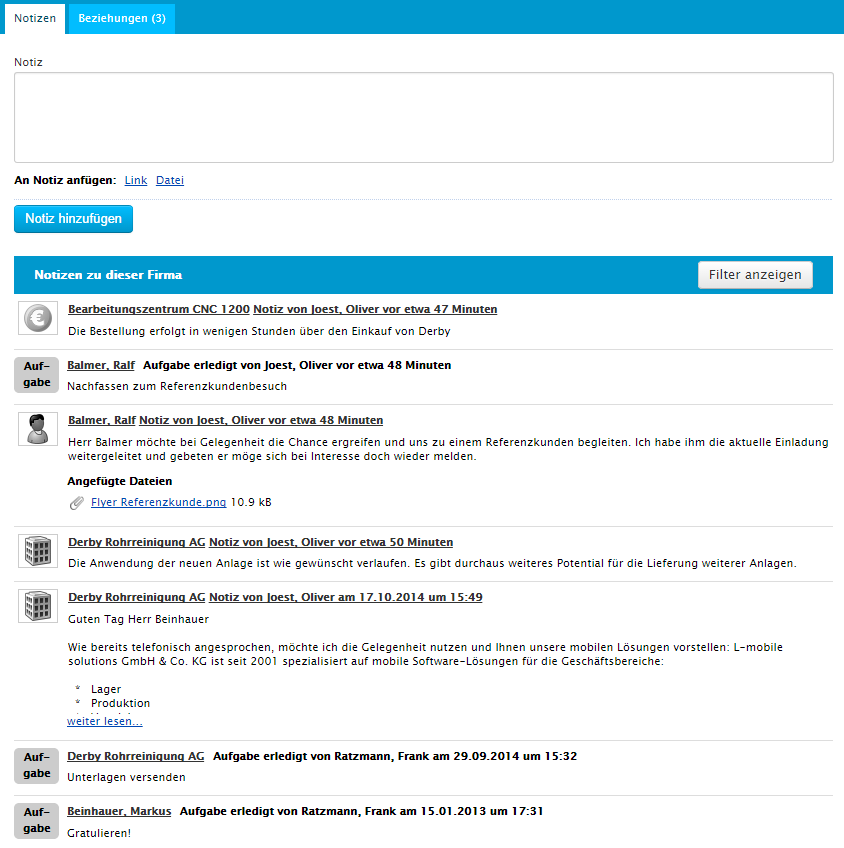

Die Anlage neuer manuell erfasster Notizen erfolgt über das Notizformular.

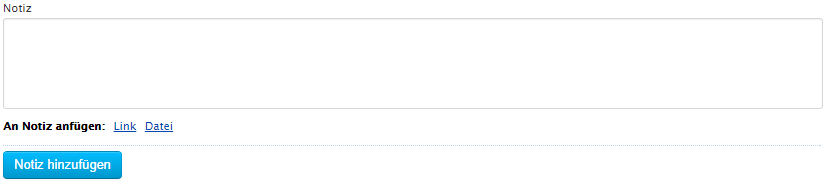

Bei der Anlage von Notizen besteht die Möglichkeit zusätzlich zum erfassten Text eine Reihe von Links oder Dateien mit der Notiz zu verknüpfen. Dabei unterscheiden sich die beiden Anhänge indem:

- Dateien von Ihrem Computer in die L-mobile Crm/Service Anwendung hochgeladen werden. Sie könnten die lokale Datei nach der Ablage in der Anwendung gefahrlos löschen
- Links als Verknüpfung zu einer vorhandenen Resource funktionieren. Links z.B. zu einer Projektdetailseite oder auch zu einer Datei die bereits im System vorhanden ist. Wenn das Projekt oder die Datei anschließend gelöscht wird kann man die Informationen auch nicht mehr über diesen Link aufrufen. 

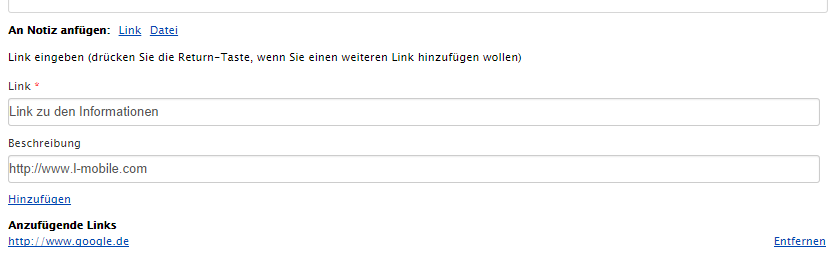

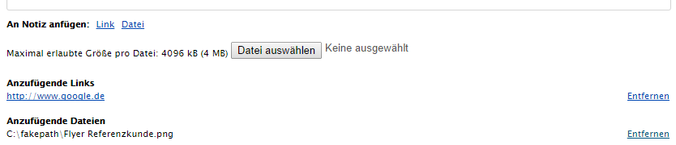

----
Abgeschlossene Aufgaben werden ebenfalls in die Notizliste aufgenommen. 

Notizen können auch mit Hilfe der E-Mail Dropbox erzeugt werden. Anhänge der E-Mail Nachricht werden ihrem Typ entsprechend als Datei oder Link mit der so angelegten Notiz verknüpft.

----

Um die Ladezeiten bei Objekten mit langer Historie optimal zu gestalten werden die Notizen auf mehrere Seiten aufgeteilt. Eine Seite beinhaltet in der L-mobile Crm/Service Anwendung 25 Einträge. Sollte diese Anzahl überschritten werden besteht die Möglichkeit die Notizliste im Anwendungsbereich mit Hilfe der Funktionen *Nächste Seite* und *Vorherige Seite* zu durchblättern.

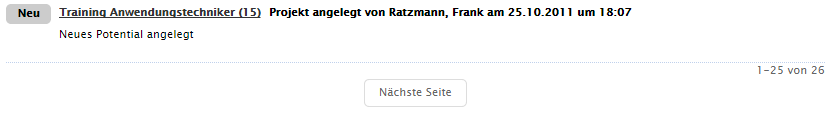

---
__Technischer Hintergrund__ Notizen sind kaskadierend aufgebaut, d.h. dass die Informationen aus tiefer in der Hierarchie gelegenene Objekten an höher gelegenenen Objekten angezeigt werden: Beispiel Firma + Person. In der Detaildarstellung der Person finden sich nur solche Notizen die zur Person erfasst wurden. In der Detaildarstellung der übergeordneten Firma finden sich Notizen zur Firma und aller darin enthaltenen Personen (Rundum-Sicht).

In letzter Instanz laufen alle Aktivitätsströme auf dem Dashboard zusammen.

---

## Notizen {#notes}
Notizen sind das zentrale Element zur Dokumentation innerhalb der L-mobile Crm/Service Anwendung. Aus den Notizen und ihren Beziehungen zu den im System gespeicherten Objekten entstehen die so genannten *Aktivitätsströme*. Diese geben dem Benutzer die Möglichkeit chronologische Ereignisse nachzuvollziehen. Eine Notiz verfügt dabei über verschiedene Metainformationen wie z.B.

- Autor
- Erstelldatum
- Information (d.h. Freitext)
- Art der Notiz
- Bezug zu einem Objekt (Firma, Person, u.a.)

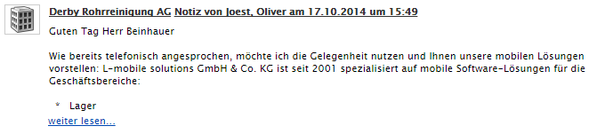

## Kontext - Schnellsuche nach Firmen + Personen
Im Kontextbereich eines Objektes steht Ihnen die Schnellsuche nach Firmen und Personen der L-mobile Crm/Service Anwendung zur Verfügung. Dabei können Sie ohne den Umweg über die Kontaktliste ein anderes Objekt finden und die zugehörige Detaildarstellung aufrufen.

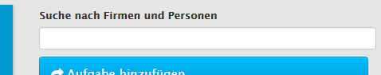

Wählen Sie einen Eintrag in der Liste und bestätigen Sie Ihre Auswahl mit der [RETURN] Taste um die Detaildarstellung des ausgewählten Objektes aufzurufen.

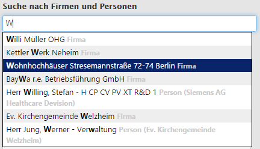

## Kontext - Aufgaben 
Zu vielen Objekten besteht die Möglichkeit Aufgaben anzulegen. Dabei wird die so angelegte Aufgabe mit einem Verweis auf das Objekt versehen um später einfacher in die aktuelle Detaildarstellung zurückzukehren.

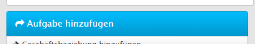

Im Aufgabenformular können verschiedene Informationen zur Aufgabenerstellung erfasst werden. Dazu gehören u.a.

- Beschreibung der Aufgabe
- Kategorie
- Fälligkeit (optional mit Uhrzeit)
- Zuständigkeit (Person, Gruppe oder Gruppe + Person)

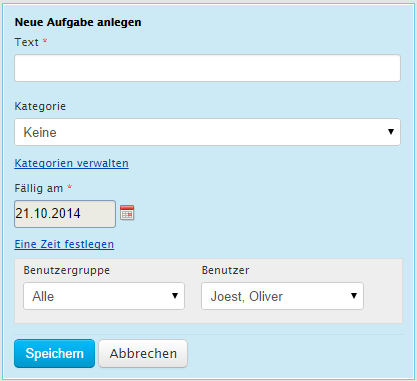

----
Die Liste der Aufgabentypen kann in den Zuordnungstabellen verwaltet werden

----

Eine Liste der aktuell offenen Aufgaben für das geöffnete Objekt wird im Kontextbereich der Detaildarstellung angeboten.

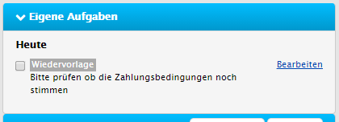

Die Ausgabe der Informationen erfolgt gruppiert nach Fälligkeit, dabei werden folgende Kriterien für die Gruppierung verwendet:

- Überfällig d.h. Fälligkeitstermin ist verstrichen
- Heute
- Morgen
- Kommmende Woche
- Später d.h. Fälligkeit > 1 Woche

Die Anzeige der Inhalte umfasst alle dem Benutzer zugewiesenen Aufgaben. Dabei werden auch solche Aufgaben angezeigt die einer der Benutzergruppen des angemeldeten Benutzers und keiner konkreten Person zugewiesen wurden d.h. so genannte *Poolaufgaben*.

Die Markierung der Aufgabe in der Checkbox führt zu einem sofortigen Abschluss der Aufgabe und Übertragung einer Notiz in den aktuellen Aktivitätsstrom.

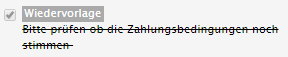

----
Wird eine Aufgabe in der L-mobile Crm/Service Anwendung einem konkreten Benutzer zugewiesen erhält dieser eine E-Mail Benachrichtigung mit einem Verweis auf die Detaildarstellung des aktuell gewählten Objektes sowie eine Zusammenfassung der in der Aufgabe enthaltenen Informationen.

----

## Kontext - BRAVO
Zu vielen Objekten besteht in der L-mobile Crm/Service Anwendung die Möglichkeit so genannte *BRAVO* Einträge zu bearbeiten. *BRAVO* steht dabei für den Ausruf der Zufriedenheit Ihrer Kunden das Ihnen keine wichtigen Details der Zusammenarbeit entgehen.

BRAVO Einträge dienen dazu wichtige Informationen dauerhaft zu einem Objekt sichtbar zu machen. Ihre Entsprechung in der physikalischen Welt wäre der Post-It mit besonders wichtigen Infos auf der Kundenakte. 

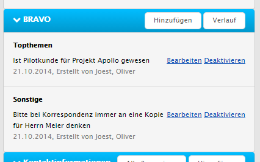

BRAVO Einträge können deaktiviert werden und werden dann nur noch im Verlauf der Einträge angezeigt. Neue BRAVO Einträge können mit Hilfe der Funktion *Hinzufügen* erstellt werden.

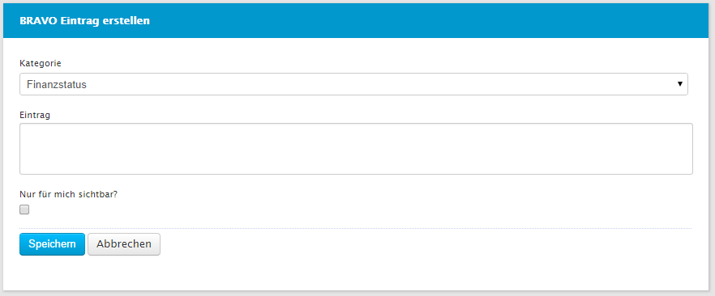

Die Verwaltung der BRAVO Einträge erlaubt es private Einträge vorzunehmen die nur für den aktuell angemeldeten Benutzer gelten. Über die Kategorien kann eine Zuordnung zu unterschiedlichen Prozessen erfolgen. Die Liste der Kategorien ist dabei über eine Zuordnungstabelle einstellbar.

----
Die wesentliche Unterscheidung zu Notizen besteht darin, dass Notizen durch Ihren chronologischen Charakter schneller in Vergessenheit geraten können. Sobald die Anzahl von Notizen für eine Seite erreicht ist werden die Informationen auf einer anderen Seite dargestellt.

----

## Kontext - Hintergrundinformationen
Zu vielen Objekten besteht in der L-mobile Crm/Service Anwendung die Möglichkeit Hintergrundinformationen zu verwalten. Diese Informationen werden abweichend zu den Notizen nicht chronologisch sondern als aktueller Zustand aufbewahrt.

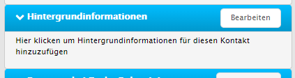

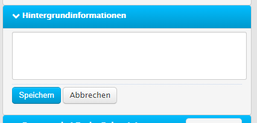