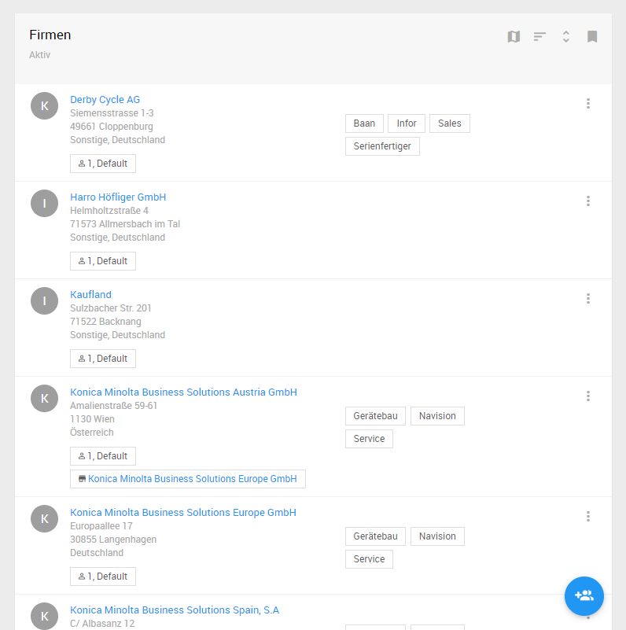
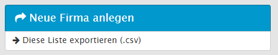

# Kontaktliste {#contact-list}
Das L-mobile CRM trennt die Kontakte nach Personen und Firmen auf. Dazu befinden sich im Tab "Kontakte" die Listen für Personen und Firmen.

## Suche in den Kontaktlisten

Die Kontaktliste beinhaltet Filter, sowie auch Lesezeichen. In kombination dieser können Kontakte präzise gefunden werden. Diese Filter und Lesezeichen sind durch ihren L-mobile Berater anpassbar.
Im Standardumfang sind die folgenden Filter und Lesezeichen vorhanden:

* Firmen: Filter
	- Name
	- Erp-Identifier
	- Firmentyp
	- Verantwortlicher Benutzer
	- Area Sales Manager
	- Telefon, Email, Fax, Web
	- Firma Gruppe 1-5
	- Land
	- Straße
	- Postleitzahl
	- Ort
* Firmen: Lesezeichen
	- Alle Aktiven
	- Alle Inaktiven
	- Kontakte ohne Notizen - letzte 30 Tage
	- Kontakte ohne Tags 
* Personen: Filter
	- Nachname
	- Vorname
	- Name
	- Erp-Identifier
	- Firma
	- Verantwortlicher Benutzer
	- Telefon, Email, Fax, Web
	- Position
	- Abteilung
* Personen: Lesezeichen
	- Alle Aktiven
	- Alle Inaktiven
	- Kontakte ohne Notizen - letzte 30 Tage
	- Kontakte ohne Tags 

> Die Erp-Identifier sind Firmen- und Personennummer, welche aus dem ERP System stammen können. Damit finden Sie die Firmen durch die Eingabe der Firmennummer.
Für die Suche nach Verantwortlichem Benutzer oder Area Sales Manager stehen alle aktiven Benutzer der L-mobile Crm/Service Umgebung zur Verfügung.

## Suche nach Schlagworten {#contact-filter-tags}
Die Suche nach Schlagworten ist eine einfache und flexible Möglichkeit die vorhandenen Kontakte in verschiedene Segmente zu unterteilen. Dabei werden alle in Kontakten verwendete Schlagworte zur Suche angeboten. Durch Auswahl eines einzelnen Schlagwortes werden die verfügbaren Kontakte gefiltert. Hierbei können beliebig viele Schlagworte auf einmal ausgewählt werden, um nur diejenigen Kontakte zu finden, die alle der ausgewählten Schlagworte hinterlegt haben.

----
Durch Auswahl der Schlagwörter können Sie schnell herausfinden wie oft dieses Schlagwort verwendet wurde.

----

## Suche mit Lesezeichen {#contact-filter-bookmarks}
Die Liste von Kontakten wird hierbei mit einer Reihe vorhandenere Lesezeichen durchsucht. Dabei kann der der Status (aktiv/inaktiv) sowie weitere Informationen wie die Aktivität (Kontakte ohne Notizen - lezte  30 Tage) berücksichtigt werden.

## Kontakte exportieren {#contact-action-export}
Die Liste der Kontakte kann jederzeit als formatierte Liste exportiert werden. Dazu steht in den Kontextfunktionen die Schaltfläche _Kontakte exportieren_ zur Verfügung. Diese erzeugt eine Csv (kommagetrennte Liste) Datei zur weiteren Verarbeitung in z.B. Excel oder anderen Programmen.

---
Die gewählten Sucheinstellungen werden auf den Export der Kontakte angewendet.

Diese Exportfunktion steht bisher nur im Backend zur Verfügung.

---

## Neue Person anlegen {#add-a-person}
Ein Ziel der L-mobile Crm/Service Anwendung ist möglichst vollständige Aktivitätsströme für die einzelnen Objekte einzufangen. Daher ist es oft wünschenswert die erfolgte Kommunikation nicht nur pro Firma sondern je individuellem Mitarbeiter der Firma zu erfassen. Dies hat den Vorteil, dass genauer differenziert werden kann welche Informationen zwischen welchen beteiligten Personen kommuniziert wurden.

Hinweis: es gibt die Dropbox Funktion, die es ermöglicht dass Nachrichten als Notiz zu einer Person bzw. anderen Kontakten oder Projekten in der L-mobile Anwendung gespeichert werden können. Siehe Kapitel *E-Mail Dropbox*.

Darüber hinaus bietet das Objekt Person die Möglichkeit weiterführende Informationen wie z.B. Titel, Abteilung und Kommunikationsdaten zu speichern.

Die Anlage neuer Personen erfolgt über die Funktion _Neue Person anlegen_ und führt den Benutzer zu einem Formular für die Erfassung der benötigten Daten.

---
Die Verknüpfung der Person mit einer Firma erfolgt über das Eingabefeld Firma. 

---

## Neue Firma anlegen {#add-a-company}
Neue Firmen werden mit Hilfe der Funktion *Neue Firma anlegen* erstellt. Dabei können verschiedene Informationen zu einem Unternehmen in einem strukturierten Formular erfasst werden. Dazu gehören u.a.

- Firmentyp
- Adressinformationen
- Hintergrunddaten z.B. Umsatzgröße, Mitarbeiterzahl, etc.

Das Eingabefeld für den Firmentyp kann bei der Erfassung vorbelegt werden. Bei einer Installation der L-mobile Crm/Service Anwendung mit vorhandener Erp-Integration kann es sinnvoll sein bestimmte Firmentypen wie z.B. Interessenten nur in der L-mobile Crm/Service Anwendung zu führen.

Für eine spätere Auswertung der Datensätze lässt sich zu den Firmendaten eine *Herkunft* definieren. Diese Herkunft kann mit Hilfe von Kampagnen sogar noch erweitert werden. Ziel der Erfassung dieser Informationen ist es möglichst genau zu erfahren aus welchen Kanälen (und ggf. Kampagnen) die Kontakte zu bestimmten Unternehmen stammen.

Mit dem Feld *Mutterunternehmen* kann eine Firma in eine hierarchische Beziehung zu einer übergeordneten Firma gebracht werden. Dabei erfolgt die Verknüpfung in diesem Fall streng hierarchisch von unten nach oben. Die so zugeordneten Datensätze erscheinen in den Details der *Mutter* bzw. wird in jedem *Kind* ein Verweis auf die Mutter angeboten.

