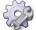





# Anmeldung an das System {#login}

Sie starten die Anwendung durch Aufruf der Adresse unter der die Anwendung für Sie bereitgestellt wurde. Nachdem Sie die Seite in Ihrem Browser geöffnet haben erfolgt die Anmeldung mit Hilfe des bereitgestellten Anmeldeformulars.

---
__Hinweis__ Die Anmeldung erfolgt wahlweise über die integrierte L-mobile Benutzerverwaltung (via E-Mail und Passwort) oder über die Integration eines LDAP Servers. In diesem Fall erfolgt die Anmeldung mit Ihren bekannten Windows Anmeldedaten und dem auf dem LDAP System zugeordneten Passwort.

---

Wenn Ihr Benutzer Zugriff auf verschiedene Clients des L-mobile CRM/Service hat, gelangen Sie nach der Anmeldung in die Clientauswahl. Je nach aktiven Plugins können Sie Auswahl zwischen Mobiles CRM, Backend, Techniker-Client und der elektronischen Plantafel

# Dashboard {#dashboard}

Das Dashboard ist die zentrale Anlaufstelle des Crm/Service Systems. Hier findet sich eine chronologische Auflistung der im System angefallenen Informationen. Dabei werden die Informationen in einen Aktivitätsstrom zusammengefasst. Dieser Aktivitätsstrom setzt sich aus einzelnen Informationen zusammen die auf dem Dashboard konsolidiert werden.

Zu jeder Information werden unterschiedliche Metadaten angezeigt:

- Zu welchem Objekt gehört die Information
- Welche Art von Information wurde erfasst
- Wer hat die Information erfasst/ausgelöst
- Wann wurde die Information erfasst/ausgelöst

---
__Hinweis__ In der Liste der Informationen werden nur Informationen zu Objekten angezeigt auf die der aktuell angemeldete Benutzer Zugriff hat. Bei einer vorhandenen Einschränkung der Sichtbarkeit von Objekten erfolgt ebenso eine Einschränkung der Informationen im Dashboard.

---

Für die individuellen Informationsarten werden unterschiedliche Symbole verwendet. Je nach Menge der aktivierten Module im L-mobile Crm/Service System kann die Darstellung hier unterschiedlich ausfallen.

Symbol|Bedeutung
------:|:-----
 | Notizen zu Firmen
 | Notizen zu Personen
 | Notizen zu Projekten
 | Notizen zu Servicefällen (bei aktivem Servicemodul)
 | Notizen zu Serviceaufträgen (bei aktivem Servicemodul)
 | Vermerk über neu angelegte Datensätze
 | Statusänderungen
 | Erledigte Aufgaben

Im Mobilen CRM (Material Client) gibt es diese chronologische Auflistung noch nicht.

Dort sieht das Dashboard so aus:

<!-- BEGIN MANUAL -->





















<!-- END MANUAL -->
