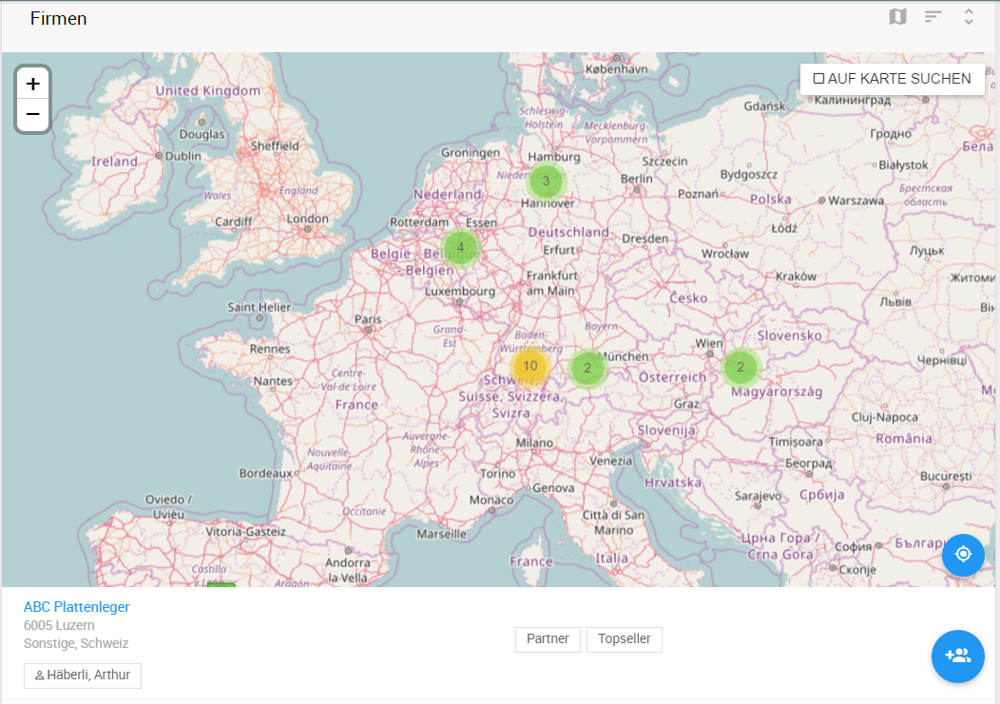
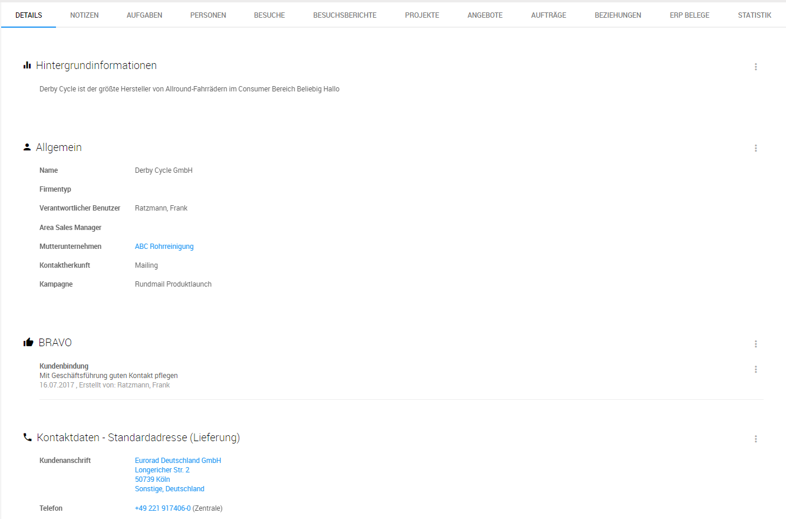

## Kontakte - Firma

### Listenansicht Firmen

In der Listenansicht *Firmen* werden gespeicherte Unternehmen angezeigt und können mit Hilfe der Suchparameter   im Popup Fenster in der Schnellzugriffsleiste unter anderem nach Firmenname, ERP-Identifier, Firmentyp usw. durchsucht werden.

Die Listenansicht enthält u.a. die Firmeninformationen zu Firmenname, Adresse, Kontaktdaten, sowie Verschlagwortung. Die Sortierung erfolgt durch die beiden Schaltflächen  wobei man das sortierende Feld und die Sortierreihenfolge bestimmen kann.

#### Kartendarstellung

Über die Schaltfläche lassen sich die Kartendarstellung aktivieren, und die Firmen anhand der hinterlegten Adresse auf der Karte anzeigen. Zur Übersicht werden naheliegende Firmen in Gruppen mit Angabe der Firmenzahl dargestellt. Durch Anklicken des Gruppenzeichens wird die Ansicht auf den Gruppenbereich gezoomt. Durch wird man zum eigenen Standort zurückgeführt.

Mit der Aktivierung der Schaltfläche *AUF KARTE SUCHEN* (äquivalent zu Umkreissuche) wird die Firmen-Liste unterhalb der Karte ausschließlich auf die sichtbaren Firmen eingeschränkt.

#### Neue Firma anlegen

in der Listenansicht lassen sich je nach Rechteeinstellung des Anwenders über die Schaltfläche neue Firmen anlegen. Mit * gezeichneten Felder sind Pflichtfelder. 

### Firmenakte

#### Layout

Die Firmenakte bietet dem Anwender eine detaillierte Auskunft über alle hinterlegten Informationen.  Im linken Bereich werden der Firmenname, verantwortlicher Ansprechpartner, sowie der zugehörige Mutterkonzern bzw. die zugehörige Muttergesellschaft dargestellt.

Durch das Register können Details zu den jeweiligen Themen im Informationsbereich aufgerufen werden.

**Schlagworte** können für eine Kategorisierung der Kontakte individuell eingesetzt werden. Über das Aktionsmenü  und *Schlagwort hinzufügen* lassen sich neue Schlagworte hinzugefügt werden. Vorhandene Schlagwörter lassen sich durch Anklicken blau markieren (mehrfach Auswahl möglich) und über das Aktionsmenü und *Löschen* wieder entfernen.

#### Register - Details

Das Register Details ist die Standardansicht einer Firmenakte. Hier werden Hintergrundinformationen, Allgemeine Firmendaten, sowie Kontaktdaten bzw. Firmenadressen hinterlegt. 

Durch das Aktionsmenü können je nach Benutzerberechtigung die Einträge bearbeitet werden.

##### Adressen

Die Adressübersicht lässt sich erweitern durch *Alle x anzeigen*. Neue Adressen lassen sich zu dem über den Schnellzugriff anlegen. 

Im Bearbeitungsmodus u.a. beim Anlegen der Adresse werden Register für Adresse, Telefon, Fax usw. angezeigt. Diese können nacheinander ausgefüllt werden.

Es lassen sich auch mehrere Telefonnummern durch  hinterlegen oder mit löschen. Mit *Speichern* bestätigt man die Änderungen.

Zur Firma lassen sich beliebig viele Adressen hinzufügen, wobei es nur eine Standardadresse geben kann. Diese lässt sich bei bestehenden Adressen nachträglich einstellen durch den Menüpunkt *zur Standardadresse machen*. 

##### Branchen

Über den Abschnitt *Branchen* lässt sich eine Firma einer oder mehreren Branchen gemäß der [Klassifikation der Wirtschaftszweige in der Europäischen Gemeinschaft](https://ec.europa.eu/eurostat/ramon/nomenclatures/index.cfm?TargetUrl=LST_CLS_DLD&StrNom=NACE_REV2&StrLanguageCode=DE&StrLayoutCode=) zuordnen. Die Firmenliste kann anschließend über die Branchenzuordnungen gefiltert werden.

#### Register - Notizen

Notizen protokollieren relevante Aktivitätsereignisse zum Kunden, Ansprechpartner, Projekt und Vertriebsthemen. 
Folgende Aktionstypen werden im Historienverlauf durch Icons unterschieden und abgebildet:

- Benutzernotiz 
- Aktion - Auftrag geschlossen 
- Aktion - neuer Auftrag 
- Aktion - Aufgabe erstellen/abschließen 

Notizen lassen sich durch  erstellen.

Es lassen sich Dokumente hinzufügen in dem man ergänzend zum Notiztext auf Dateianhang (2) klickt eine Datei aus dem Laufwerkverzeichnis auswählt und mit *speichern* das Dokument und den Notizeintrag bestätigt.

Notizen lassen sich über das Aktionsmenü wieder bearbeiten.

#### Register - Aufgaben

Im Register Aufgaben werden alle direkt, oder über Person/Projekt/Auftrag/Angebot indirekt, verknüpfte Aufgaben in Form der Listenansicht angezeigt. Mehr Informationen siehe Kapitel *Aufgaben*.

#### Register - Personen

Im Register Personen werden alle direkt zur Firma hinterlegten Personenkontakte hinterlegt. Über die Schaltfläche  können neue Personen zur Firma hinzugefügt werden.

#### Register - Besuche

Im Register Besuche werden die Kundentermine aus der Tourenplanung angezeigt. Wichtige Eckdaten in dieser Listenansicht sind:

- Firmenname
- Adressinformationen (hinterlegte Adresse zur Firma)
- Besuchsziel (auch Besuchsgrund oder messbares Ziel von dem Besuch) 
- Datum und Uhrzeit des Besuchs

Über die Schaltfläche können neue Besuchstermine angelegt werden, wobei die Verknüpfung zum Kunden bereits übernommen wird. 

Hinweis: Beim Besuchsziel kann der Anwender einen Vorschlag (z.B. Kundenbetreuung) auswählen oder die Option Eigenes Ziel angeben auswählen und eigenes Besuchsziel eingeben.

Der Anwender kann bei noch nicht eingeplanten Terminen das Datum für den Besuch über die Schaltfläche  einstellen oder bei einem bereits eingeplanten Termin anpassen.

Weitere Funktionen zur Besuchsplanung, siehe Kapitel Sales - Tourenplanung.

#### Register - Projekte, Angebote, Aufträge

Die Register Projekte, Angebote, Aufträge enthalten ähnlich wie das Register Aufgaben die verknüpften Datensätze zu der jeweiligen Firma.

Beim Anlegen von einem neuen Datensatz im einzelnen Register mit der Schaltfläche wird im Bearbeitungsmodus das Objekt automatisch zur Firma verknüpft. 

Mehr Informationen zur Listenansichten siehe in einzelnen Kapiteln zu Projekten, Angeboten, Aufträgen.

#### Register - ERP Belege

Im Register ERP Belege werden alle kundenbezogenen Belege abgebildet. Diese ermöglichen dem Mitarbeiter eine schnelle Übersicht über kaufmännische Kundenaktivitäten und Eckdaten zu Belegen:

- Abrufaufträge (Abrufauftragsnummer, Firma, Auftragsstatus, Auftragsvolumen, Beschreibung, Warenmenge)
- Gutscheine (Gutschriftnummer, Firma, Status, Gutschriftbetrag, zugehörige Auftragsnummer)
- Lieferscheine (Lieferscheinnummer, Firma, Status, zugehörige Auftragsnummer, Lieferscheindatum)
- Rechnungen (Rechnungsnummer, Firma, Status, Rechnungsbetrag, zugehörige Auftragsnummer, Lieferscheindatum)
- Kundenaufträge (Kundenauftragsnummer, Firma, Status, Auftragswert, Beschreibung, Druckdatum)
- Angebote (Angebotsnummer, Firma, Status, Angebotswert, Angebotsdatum, zugehörige Auftragsnummer)

Die Belege sind nach Belegtyp sortiert, wobei nur der aktuellste Beleg angezeigt wird. Bei Bedarf können weitere Belege über die Schaltfläche Zeige alle XBelegeX eingeblendet werden.

Über die Schaltfläche  und Im ERP öffnen kann der Anwender die Details zum Beleg-Vorgang im ERP System öffnen.

#### Register - Statistik

Die Umsatz- und Absatzstatistik ist über den Reiter Statistik in Firmen aufrufbar und zeigt graphisch die auftragsbezogenen Kennzahlen aus dem ERP System zum Kunden.

## Kontakte - Personen

### Listenansicht Personen

In der Listenansicht *Personen* werden alle aktiven Personen angezeigt. Diese können mit Hilfe der Suchparameter   im Popup Fenster in der Schnellzugriffsleiste unter anderem nach Vor-/Nachname, Firma, usw. durchsucht werden. Die Sortierung erfolgt durch die beiden Schaltflächen  wobei man das sortierende Feld und die Sortierreihenfolge bestimmen kann.

Die Auflistung der Personen umfasst den Namen, die zugehörige Firma, Kontaktdaten, Position im Unternehmen, sowie den verantwortlicher Ansprechpartner.  Zur schnellen Identifizierung der Person werden die Initialen des Mitarbeiters zusammengeführt im Icon dargestellt z.B.  für Peter Andernach.

#### Neue Person anlegen

In der Listenansicht lassen sich je nach Rechteeinstellung des Anwenders über die Schaltfläche eine neue Person anlegen.

Mit * gezeichneten Felder sind Plichtfelder. Um eine Adresse der Person zuzuweisen muss man zuerst die Firma auswählen und aus den vorgeschlagenen Adressen die passende übernehmen oder eine neue Adresse hinterlegen.

**Hinweis:** Wenn Sie eine existierende Adresse übernehmen und in dem Bearbeitungsmodus Daten verändern, wird diese Adresse überschrieben.

### Personenakte

Die Personenakte ist äquivalent zur Firmenakte strukturiert. Sie enthält im Vergleich zur Firmenakte nur die Register *Details, Notizen, Aufgaben* und einen zusätzlichen Reiter, der andere Personen im selben Unternehmen auflistet. Die Erstellung von Notizen und Aufgaben in der Personenakte ordnet sich hierarchisch zur Person und der zugehörigen Firma ein.

**Hinweis:** Im Gegensatz zur Firma kann eine Person nur eine Adresse enthalten.