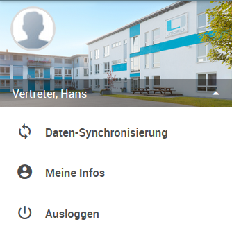

## Prozessbeschreibung

Das L-mobile CRM verfügt über einen mobilen Vertriebsclient, der alle vertriebsrelevanten Daten offline abbildet.

Mit modernster On-/Offline Technologie kann der Vertriebsmitarbeiter auch unabhängig von der Netzabdeckung Kontakte, Aufgaben, Projekte und Vertriebsaktivitäten pflegen. Papierloses Arbeiten vor Ort durch integrierte CRM-Funktionalität von Kunden- und Anlageninformationen und Vertriebsaktivitäten ermöglicht eine schnelle Vorbereitung für Kundenbesuche.

Mit dem Produktkonfigurator erhält der Kunde bereits beim vor Ort Besuch ein individuelles Angebot, welches direkt unterzeichnet und im Anschluss in einen ERP Auftrag verwandelt werden kann. Dies spart dem Mitarbeiter Zeit, dem Unternehmen Geld und bieten schnelle und bedarfsgerechte Kundenberatung. 

Der Vertriebsmitarbeiter kann, abhängig vom eingesetzten Endgerät offline via HTML5 Client lokal auf Basis einer lokalen Datenbank arbeiten und sobald eine Internet Verbindung (LAN, WLAN, Edge, 3G) zur Verfügung steht bidirektional synchronisieren. Die Darstellung erfolgt in einem Browser, dessen Auflösung und Oberfläche sich an das jeweilige Endgerät anpasst. Folgende Geräte werden unterstützt:

1. Notebook MacOS, Windows 7 oder höher
2. Mobile Endgeräte (IOS 7.0 oder höher und Android 5.1 oder höher)

Die Verwendung der L-mobile App ist zu empfehlen, denn sie bietet gegenüber der Browser-Anwendung eine verbesserte Performance, sowie diverse Zusatzfunktionalitäten, die in Browsern nicht zur Verfügung stehen. Zusatzfunktionalitäten sind die Datensynchronisieren für den Offlinebetrieb, der Barcodescanner und die Erstellung von PDF-Berichten.

## Login

Der Zugang zum offline Client erfolgt über den Browser. Hierfür muss der Anwender die Rolle Vertriebsmitarbeiter haben.

Beispiel-URL: https://demo.l-mobile.com/sales

Es erscheint die Anmeldemaske. Der Vertriebsmitarbeiter nutzt entweder seine Email Adresse (L-mobile Anmeldung) oder seinen Windows-Account (AD Anmeldung) als Username. Nach Eingabe der Zugangsdaten und Bestätigung (*Pfeil*) erfolgt die Anmeldung. 

Anschließend wird eine Synchronisation durchgeführt, in der die Basisdaten aktualisiert werden. 
Bei schlechter Internetverbindung kann dieser Vorgang abgebrochen und zum späteren Zeitpunkt erneut ausgeführt werden.

## Layout - Desktop

Die Anwendungsoberfläche vom L-mobile Vertriebsclient ist in die folgenden Bereiche unterteilt: 

- Benutzer Funktionen 
- Navigationsbereich
- Anwendungsbereich
- Schnellzugriffsfunktionen

### Erweitertes Hauptmenü

Das erweiterte Hauptmenü für aktuellen Benutzer kann über den Pfeil aufgeklappt werden. Hier befinden sich administrative Funktionen:

- *Daten-Synchronisierung* führt eine erneute Daten-, sowie Dokumentensynchronisation.

- *Meine Infos* enthält das Profilbild des aktuellen Mitarbeiters und ermöglicht das Profilbild zu ändern. Mit der Eingabe der Verbindungsdaten für die E-Mail Dropbox lassen sich E-Mails im CRM archivieren, sofern die generierte Dropbox Email-Adresse im BCC Feld angegeben ist.

  

- *Ausloggen* initiiert eine Synchronisation und meldet anschließend den Benutzer ab.

### Hauptnavigation

Über die Hauptnavigation kann der Benutzer je nach Benutzerrechte und Funktionsumfang des Vertriebsclients folgende Themenbereiche aufrufen:

- *Dashboard:* für schnelle Suche von Firmen
- *Kontakte:* Liste aller Adressen mit erweiterter Suchfunktion und Sortiermöglichkeiten
- *Aufgaben:* Liste aller Aufgaben mit erweiterter Suchfunktion und Sortiermöglichkeiten
- *Projekte:* Liste aller Projekte mit erweiterter Suchfunktion und Sortiermöglichkeiten
- *Konfigurator:* Schnellzugriff für Produktkonfiguration ohne Eingabe vorherige Eingabe von Kunde und Projekt.
- *Vertrieb:* Liste mit Vertriebsinformationen zu Aufträgen und Angeboten

**Hinweis:**

Bei kleiner Auflösung wird die Hauptnavigation ausgeblendet und kann über die Schaltfläche 
ein- und durch  wieder ausgeblendet werden.

### Schnellzugriff

Die Schaltflächen für den Schnellzugriff befinden sich in der oberen Leiste rechts und ermöglichen:

- Wechsel zwischen Online- und Offline- Modus 

  

- Daten-Synchronisierung* führt eine erneute Daten-, sowie Dokumentensynchronisation  (die Zahl zeigt an wie viele Änderungen im Offline Betrieb stattgefunden). Nach dem Klicken der Schaltfläche erscheint die Info, wie lange die letzte Synchronisation her ist.  Sobald die Synchronisation abgeschlossen ist wird der Synchronisationsstatus auf 0 Änderungen zurückgesetzt.

- Pop-up Schnellansicht für aktuelle und *überfällige Aufgaben*  mit Kürzel für Aufgabentyp, Aufgabentext Erledigungsdatum/-Uhrzeit, sowie den Schlagwörtern. 

  

  Erledigte Aufgaben lassen sich in dieser Ansicht durch Klicken der grünen Checkbox auf geschlossen setzen. Unter *Alle Aufgaben* kann die Detailansicht für Aufgaben aufgerufen werden.

- *Suchansicht* ist nur in Listenansicht von Kontakten, Aufgaben, Projekten und Vertrieb eingeblendet und ermöglicht die Suche nach den vordefinierten Feldern.

## Dashboard

Das Dashboard ist standardmäßig die Startansicht und ermöglicht eine Schnellsuche von Firmen. Je nach Kundenwunsch kann das Dashboard mit zusätzlichen Ansichten, wie z.B. Auswertungen erweitert werden.

