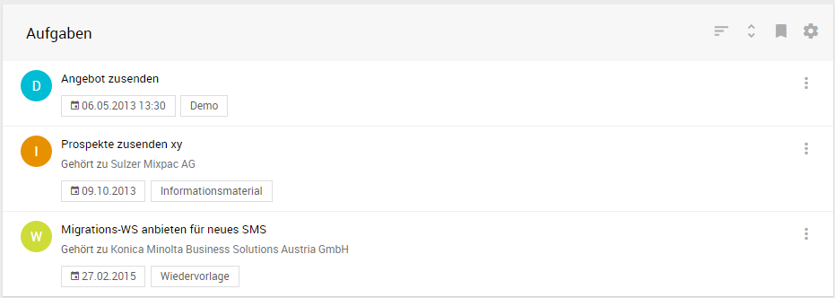
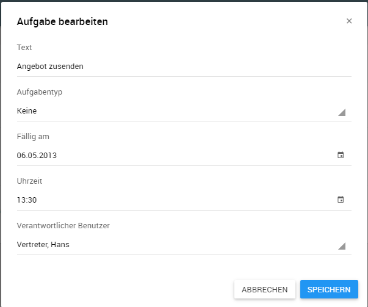
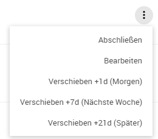
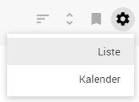
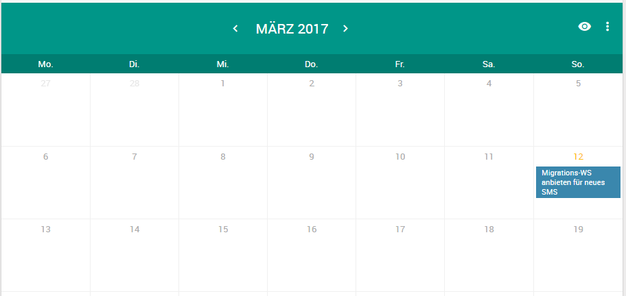

## Aufgaben

### Listenansicht - Offene Aufgaben

In der Listenansicht *Aufgaben* werden alle *offenen Aufgaben* angezeigt und können mit Hilfe der Suchparameter   im Popup Fenster in der Schnellzugriffsleiste unter anderem nach Text, Datum/Zeitraum, sowie Typ durchsucht werden.

Die Listenansicht enthält u.a. den Aufgabentext, das Enddatum, sowie den Typ. Der Typ wird aus Übersichtsgründen zusätzlich mit dem Kürzel-Icon für den Anfangsbuchstaben abgebildet. 

Die Typen sind im Standard für:

- Anruf (A)
- Demo (D)
- Fax (F)
- Informationsmaterial (I)
- Keine (K)
- Stammdaten (S)
- Treffen (T)
- Wiedervorlage (W)

Die Sortierung erfolgt durch die beiden Schaltflächen  wobei man das sortierende Feld bestimmen kann und die Sortierreihenfolge. Zusätzlich zum Listenfilter lassen sich zugleich die Aufgaben unter der Schaltfläche  nach eigenen oder allen Aufgaben filtern:

1. Nur meine Aufgaben (Aufgaben, die mir zugewiesen sind)
2. Zugewiesene Aufgaben (von mir an andere Anwender delegierte Aufgaben, zum Nachverfolgen des Fertigungsstands). 
3. Alle Aufgaben (Aufgaben von allen Mitarbeitern)

Für den 2. und 3. Fall wird die Listendarstellung um den Aufgabenverantwortlichen ergänzt.

#### Aufgaben anlegen und bearbeiten

Aufgaben lassen sich aus der Aufgabenliste heraus und in der Firmen-, Personen- und Projektakte anlegen.

In der Listenansicht der *Offenen Aufgaben* können die Aufgaben bearbeitet werden. 

Über das Aktionsmenü  und *Bearbeiten* gelangt man in den Bearbeitungsmodus. 

Zusätzlich zum Bearbeiten, lassen sich die Aufgaben direkt Abschließen bzw. das Fälligkeitsdatum um 1 Tag / 1 Woche / 3 Wochen nach hinten verschieben.

#### Kalenderansicht

Die Kalenderansicht ermöglicht übersichtliche Planung der Aufgaben. Man kann zwischen Listenansicht Aufgaben und Kalenderansicht über die Schaltfläche  wechseln.

Die Kalenderansicht lässt sich in über die Schaltfläche  zwischen Monats-, Wochen- sowie Tagesansicht umschalten. Auch in der Kalenderansicht lassen sich die Filter aus der oben genannten Filteransichten anwenden. Der Monatstag des aktuellen Datums wird orange gekennzeichnet. 

**Hinweis:** Die Aufgaben lassen sich in der Kalenderansicht nicht bearbeiten. Hierfür muss man wieder zurück in die Listenansicht wechseln.

### Listenansicht - Abgeschlossene Aufgaben

Die Listenansicht der Abgeschlossenen Aufgaben dient der Nachverfolgung der erledigten Aufgaben. Die Funktionalität dieser Ansicht ist äquivalent zur Listenansicht der *Offenen Aufgaben* bis auf den Unterschied, dass sich die Aufgaben nicht mehr bearbeiten lassen. 

**Hinweis:** Abgeschlossene Aufgaben lassen sich nicht mehr wiedereröffnen.