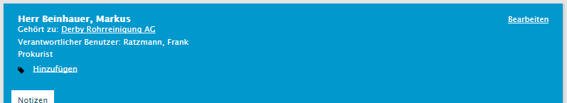
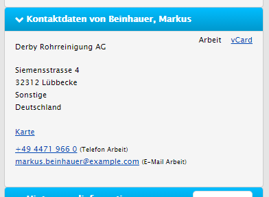
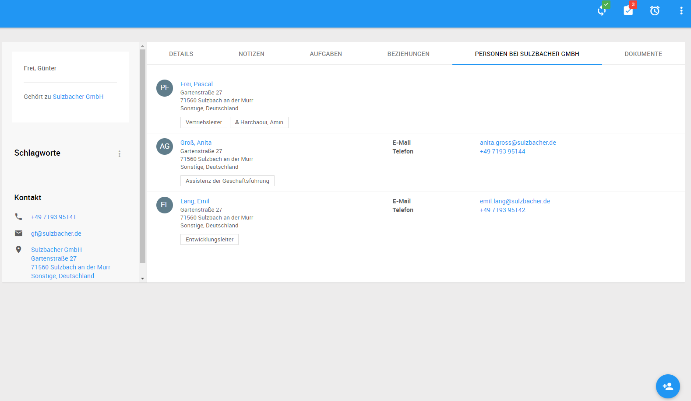

# Objektdetails - Person
Die Detaildarstellung einer einzelnen Person ermöglicht es Ihnen einen vollständigen Überblick über die Aktivitäten mit genau dieser Person zu erhalten. Dabei ist die Person ein so genannter *atomarer* Datensatz, d.h. hier werden im Gegensatz zu z.B. Firmen keine Informationen aus anderen Objekten mehr hinzugezogen.

## Kopfdarstellung - Zugehörigkeit
Die Firmenzuordnung von Personen erfolgt in der Kopfdarstellung einer Person. Über den darin enthaltenen Verweis kann die Detaildarstellung der Firma aufgerufen werden.

## Kontext - Kontaktinformationen
Der Kontextbereich von Personen beinhaltet einen Bereich der die zugeordnete Adresse sowie die individuellen Kontaktdaten der Person anzeigt. Auch hier ist der Download der Kontaktinformationen via *VCard* Format möglich um die Daten z.B. in Outlook zu übernehmen.

## Kontext - Weitere Personen bei dieser Firma
Um schnell auf andere Personen im selben Unternehmen zuzugreifen werden in der Detaildarstellung von Personen alle anderen Personen außer der aktuell geöffneten dargestellt.

Drüberhinaus gibt es eine Möglichkeit die Personenliste zu filtern:

