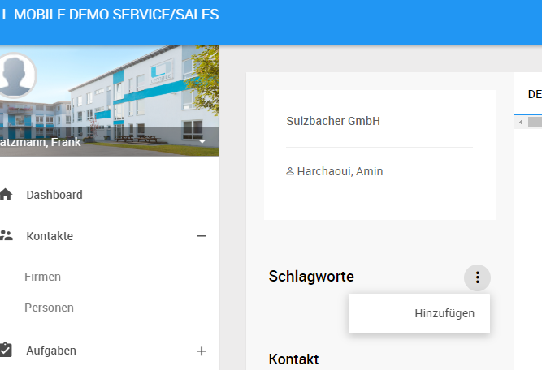
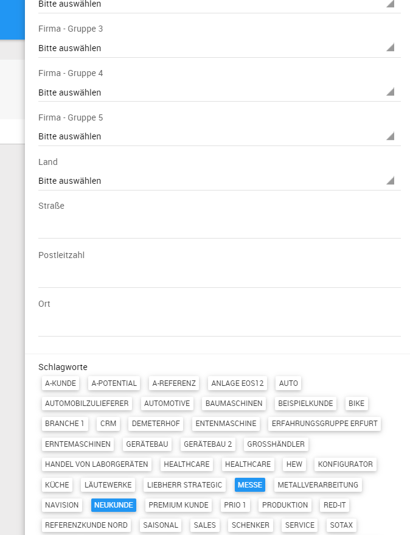

# Schlagwörter

Schlagwörter ermöglichen die in der L-mobile Crm/Service gespeicherten Objekte in dynamischen Kategorien zu ordnen. Dabei kann jedem Objekt eine beliebige Anzahl von Schlagwörtern zugeordnet werden mit denen das Objekt klassifiziert werden kann. Schlagwörter sind immer Objekt-spezifisch und klar abgegrenzt, d.h. dass die Schlagwörter die Sie zum Beispiel für Firmen vergeben nicht in anderen Modulen der L-mobile Crm/Service Anwendung zur Verfügung stehen.

----
Oft wird gewünscht, dass nur ein kleiner Kreis von ausgewählten Personen die Schlagwörter in der L-mobile Crm/Service Anwendung vorgibt und alle anderen Benutzer aus den von diesem Kreis vergebenen Schlagwörtern auswählen kann. Dies kann durch eine spezifische Rechtevergabe der beiden Benutzerberechtigungen:

- Schlagwort verknüpfen
- Schlagwort anlegen

erreicht werden.

----

Zur Vergabe von Schlagwörtern stehen Ihnen im Backend 2 Möglichkeiten zur Verfügung. Die individuelle Vergabe in der Detaildarstellung eines Objektes oder über eine Massenvergabe aus der Listendarstellung der Objekte heraus.

Bei der Vergabe der Schlagwörter in der Detaildarstellung werden die Schlagwörter mit dem geöffneten Objekt verbunden. Dabei kann jedes Schlagwort nur einmal mit dem Objekt verbunden werden. 

Soll eine große Menge von Objekten mit gleichartigen Schlagwörtern verknüpft werden ist die oben beschriebene Vorgehensweise nicht optimal, da jedes Objekt individuell geöffnet und die Verknüpfung vorgenommen werden muss. Für die Vergabe von Schlagwörtern an eine große Menge von Objekten steht daher in der Listenansicht die Massenfunktion *Tags hinzufügen* zur Verfügung.

Sind einer Menge von Objekten Schlagwörter zugeordnet, stehen diese in der Listendarstellung für die Suche zur Verfügung. Für die Aufnahme in die Suchkriterien aktivieren oder deaktivieren Sie einzelne Schlagwörter mit der linken Maustaste. Im Modus *Mehrfachauswahl* können die Schlagwörter miteinander zu einer komplexeren Suchabfrage kombiniert werden.

