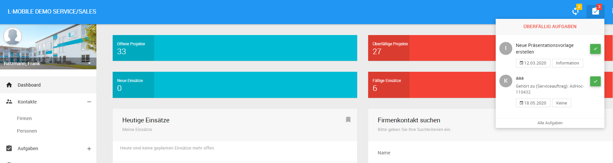
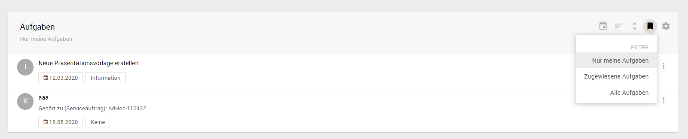
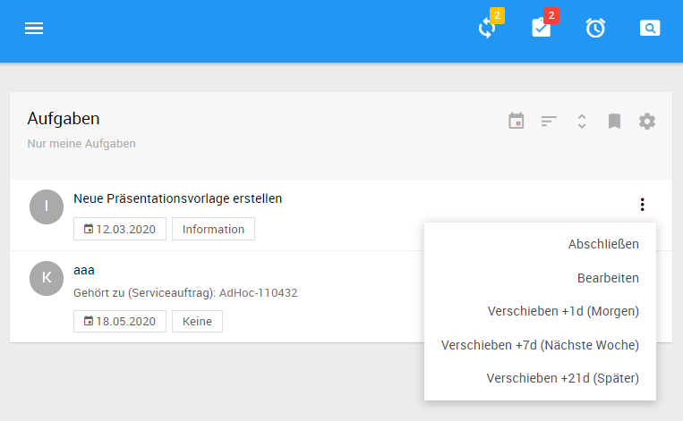
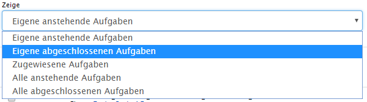
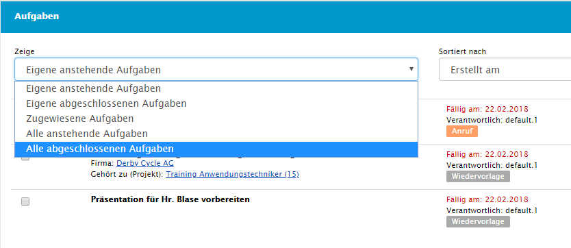

# Aufgaben {#tasks}
Die L-mobile Crm/Service Anwendung beinhaltet eine integrierte Aufgabenverwaltung. Aufgaben können genutzt werden um Arbeitsabläufe oder anstehende Arbeiten zu strukturieren und zu dokumentieren. Dazu können die Aufgaben den Objekten zugeordnet werden um den Bezug zu diesen herzustellen.

Aufgaben können delegiert werden oder ganzen Gruppen zugewiesen werden. Im Fall der Gruppenzuordnung ist die Gruppe dafür verantwortlich die Abarbeitung der Aufgaben intern weiter zu koordinieren.

## Aufgabe hinzufügen
Um Aufgaben zu erstellen steht die Funktion *Aufgabe hinzufügen* an vielen Stellen im System zur Verfügung. 

----
Wird die Funktion im Kontext eines Objektes aufgerufen erhält die so erstellte Aufgabe automatisch eine Referenz auf das Objekt. Wird die Aufgabe auf dem Dashboard oder in der Listendarstellung der Aufgaben angelegt bleibt die Aufgabe *anonym* und ist keinem speziellen Objekt zugeordnet.

----

Im Folgenden können die für die Aufgabe relevanten Daten in der Formulardarstellung erfasst werden. Dazu gehören u.a.

- Aufgabentext
- Aufgabenkategorie
- Fälligkeit ggf. auch mit Uhrzeit
- Zuständigkeit Gruppe, Gruppe + Person oder Person

Nach dem Speichern werden abhängig von der ausgewählten Zuständigkeit unterschiedliche Aktionen ausgeführt:

__Der angemeldete Benutzer ist zuständig__ 
In diesem Fall wird die Aufgabe in die Liste der offenen Aufgaben einsortiert.

__Eine Gruppe oder ein anderer Benutzer ist zuständig__
Es erfolgt eine Benachrichtigung im offenen Aufgabenbereich, dass die Aufgabe erfolgreich delegiert wurde. Zusätzlich zu der Benachrichtigung kann optional ein E-Mail Nachrichten-Versand an den zuständigen Benutzer erfolgen.

----
Abhängig von den angezeigten Informationen wird der Verweis auf das Objekt der Aufgabe angeboten. Ist das Objekt aktuell geöffnet wird kein Verweis auf das Objekt angeboten (dieser ist ja implizit bereits gegeben). Wird die Aufgabe ausserhalb des Objektes angezeigt wird der Verweis zum Aufruf der Detaildarstellung angeboten.

----

## Anstehende Aufgaben
Eine Liste der offenen d.h. anstehenden Aufgaben wird an 3 unterschiedlichen Stellen angeboten. Dabei erfolgt die Ausgabe in einer Listendarstellung der Aufgaben. 

- Wurde eine Kategorie in der Aufgabe hinterlegt erfolgt die Ausgabe der Kategorie sowie dem zugewiesenen Farbcode
- Aufgaben die dem angemeldeten Benutzer von anderen Benutzern zugewiesen wurden zeigen in der Ausgabe den Namen des Benutzers von dem die Aufgabe ursprünglich stammt
- Aufgaben mit Objektbezug zeigen einen Verweis auf die Detaildarstellung 

Je nach Kontext werden unterschiedliche Inhalte angezeigt:

__Darstellung auf dem Dashboard__
Auf dem Dashboard wird die Liste der Aufgaben ausgegeben - hier zunächst die Darstellung im Backend. Die Vorbelegung des Bookmarks ist standardmäßig "Eigene anstehende Aufgaben". Der Benutzer hat die Möglichkeit das Bookmark, sowie die Sortierung der Liste nach bedarf zu ändern.

__Darstellung im Objektkontext__
Im Kontextbereich der Detaildarstellung werden nur die Aufgaben für das aktuelle Objekt angezeigt.

__Darstellung in der Aufgabenliste__
Über den Navigationsbereich der L-mobile Crm/Service Anwendung kann die Funktion *Aufgaben* geöffnet werden. Hier werden weiterführende Bookmarks der Aufgaben angeboten:

- Eigene anstehende Aufgaben
- Eigene abgeschlossene Aufgaben
- Zugewiesene Aufgaben
- Alle anstehende Aufgaben
- Alle abgeschlossene Aufgaben

Hier finden sich ebenso wie im Dashboard die Liste aller Aufgaben. Zusätzlich können in der Aufgabenliste die Aufgaben präzise nach Text, Typ, Fällig am und vielem weiteren gefiltert werden.

Aus dem Kontextbereich können für den gewählten Benutzer neue Aufgaben angelegt und bestehende Aufgaben bearbeitet oder abgeschlossen werden.

## Abgeschlossene Aufgaben
Alle abgeschlossenen Aufgaben werden unter dem Bookmark "Alle abgeschlossene Aufgaben" aufgerufen werden.

Abgeschlossene Aufgaben werden chronologisch dargestellt. Dabei erfolgt für Aufgaben vor dem aktuellen Monat eine summarische Darstellung die durch Aufruf des Verweis pro Monat expandiert werden kann.

## Zugewiesene Aufgaben

Wurde im Auftragsformular eine abweichende Zuständigkeit definiert kann der Status der delegierten Aufgaben in der Kategorie zugewiesene Aufgaben nachverfolgt werden. Dazu wird das entsprechende Bookmark im Kopfbereich der Liste aktiviert.

Aufgaben welche anderen Mitarbeitern zugewiesen wurden lassen sich vom Ersteller abschließen oder erneut bearbeiten und zuweisen.

