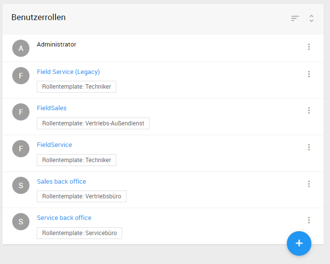

# Benutzerverwaltung, Rollen- und Benutzergruppenverwaltung {#user-manager.user-manager}
-
Die Benutzerverwaltung ist die zentrale Stelle, um Benutzer der *Desktopanwendung*, wie auch der *mobilen Endgeräte* zu verwalten. Die Benutzerverwaltung befindet sich im Hauptmenü *Verwaltung*. Direkt darunter befindet sich die Verwaltung für Benutzerrollen und Benutzergruppen.

## Aufgabe der Benutzerverwaltung
Die Aufgabe der Benutzerverwaltung geht über das Anlegen, Löschen und Bearbeiten der Benutzer hinaus. So besteht eine weitere Aufgabe in der Zugriffssteuerung auf Funktionen und Dateninhalt.

## Zugriffssteuerungsmodell {#user-manager.authorization-model}
Die Zugriffssteuerung ist über zwei Varianten möglich:

 1. Rollen, Berechtigungen für die Zugriffssteuerung auf Funktionen
 2. Benutzergruppen, Standorte für die Zugriffssteuerung auf Dateninhalte

*Erste Variante*

In der ersten Variante geht es im Kern um den Abgleich von Berechtigungen. Zum einen hat eine Funktion eine bestimmte Berechtigung. Zum anderen besitzt jeder Benutzer in der Regel eine Vielzahl verschiedener Berechtigungen. Möchte nun ein Benutzer eine Funktion ausführen, wird geprüft, ob dieser die Berechtigung der Funktion besitzt. Berechtigungen können Benutzern indirekt über Rollen zugeteilt werden.

*Zweite Variante*

Eine weitere Möglichkeit besteht in der Sichtbarkeitssteuerung der Dateninhalte. In dieser zweiten Variante werden nur Dateninhalte angezeigt, die für den angemeldeten Benutzer relevant sind. Dazu werden Benutzergruppen erstellt und diesen Benutzern zugeteilt.

## Benutzerbezogene Daten {#user-manager.user-data}
Für jeden Benutzer lassen sich benutzerbezogene Daten speichern. Neben den nicht weiter erklärungsnotwendigen Daten, wie Name, Emailadresse etc., gibt es weitere Daten, die folgend erklärt werden.

### Token {#user-manager.token}
Der Token ist ein Identifikationsschlüssel, der zur Autorisierung verwendet wird. Jeder Benutzer hat einen eindeutigen Token, der kein weiteres Mal in der Anwendung vorkommt.

Folgende Module verwenden die Autorisierung mittels Token:

- RSS-Feed abonnieren (bspw. in Menü: Servicefälle, Serviceaufträge, Projekte)
- Kalender abonnieren (bspw. in Menü: Projekte)
- Plantafel

Möchte ein Benutzer eines dieser Module verwenden, so muss dieser im Besitz eines Token sein.

----
**Hinweis** Der Token wird nicht automatisch beim Anlegen eines Benutzers erstellt, sondern erfolgt explizit durch die entsprechende Funktion in der Benutzerverwaltung. Wurde ein Token einmal erstellt kann das Zurücksetzen des Tokens lediglich erforderlich sein, wenn eine unautorisierte Person Zugang zu dem Token erhalten hat. Für diese unautorisierte Person ist es in diesem Fall bspw. möglich, Nachrichten aus RSS-Feeds zu lesen.
Nachdem der Token zurückgesetzt wurde, ist es erforderlich die Abonnements neu zu erstellen, da sich der Link geändert hat.

----

### Im Dienst bis
Diese Funktion bietet die Möglichkeit einen Benutzer nach dem Ablauf des ausgewählten Datums automatisch zu inaktivieren. Nach der Inaktivierung eines Benutzers kann sich dieser nicht mehr Anmelden und kann die Anwendung nicht mehr verwenden.
Mit dieser Funktion lässt sich bereits zu dem Zeitpunkt, wenn das Ausscheiden eines Mitarbeiters aus dem Unternehmen bekannt wird, das Datum dessen Inaktivierung festlegen.

----
**Hinweis** Diese Eingabe ist nur beim *Bearbeiten* eines Benutzers möglich und nicht bei *neuen Benutzer anlegen*.

----

### Sprache
Die Sprache kann für jeden Benutzer individuell eingestellt werden. Diese Einstellung wirkt sich auf die gesamte Anwendung, mit den mobilen Endgeräte, aus.

----
**Hinweis** Die kulturabhängige Formatierung von Datum und Zahlen ist abhängig von der im Browser eingestellten Sprache.

----

### Active Directory Kennung
Die Anmeldung am System kann entweder durch die L-mobile **integrierte Benutzerverwaltung** oder über Microsofts Verzeichnisdienst **Active Directory** erfolgen. Ist Zweites gewünscht, so ist es erforderlich, dass jeder Benutzer im *Active Directory* registriert wird und die *Active Directory Kennung* der Benutzer in das gleichnamige Eingabefeld in der L-mobile Benutzerverwaltung eingetragen wird. Ansonsten ist keine Anmeldung möglich.

----
**Hinweis** Standardmäßig ist die L-mobile integrierte Benutzerverwaltung aktiviert. Bitte wenden Sie sich an L-mobile, wenn Sie eine Umstellung auf *Active Directory* wünschen. Der Benutzer meldet sich nach der Umstellung auf *Active Directory* mit den im *Active Directory* hinterlegten Anmeldedaten an.

----

### Standard Lager (Plug-In: CRM/Service) {#user-manager.default-store}
Für die Bereitstellung von Ware kann jedem Mitarbeiter ein *Standard Lager* und *Standard lagerplatz* zugeordnet werden. Das *Standard Lager* ist hierarchisch über dem *Standard Lagerplatz* angesiedelt.

Ein Beispiel für *Standard Lager* ist *Servicelager*.

### Standard Lagerplatz (Plug-In: CRM/Service) {#user-manger.default-location}
An dem *standard Lagerplatz* kann Ware für den Mitarbeiter gelagert werden. Sehen Sie dazu auch das Kapitel [Standard Lager](#user-manager.default-location).

Ein Beispiel für *Standard Lagerplatz* ist *Servicewagen 5*.

### Rollen / Berechtigungen / Benutzergruppen
Bitte sehen Sie das entsprechende Kapitel [Rollen](#user-manager.rolls) und [Benutzergruppen](#user-manager.user-groups) hierzu.

## Benutzer {#user-manager.user}
Eine Auflistung aller Benutzer befindet sich im Anwendungsbereich der Benutzerverwaltung.

### Aktive / Inaktive Benutzer
Der Anwendungsbereich zeigt die registrierten Benutzer. Über die Lesezeichen-Schaltfläche können die angezeigten Benutzer nach *aktiven* und *inaktiven* Benutzer gefiltert werden.

Folgende Funktionen lassen sich auf jeden registrierten Benutzer anwenden:

- Details
- Passwort zurücksetzen
- Benutzer (De)aktivieren

### Details
Alle benutzerbezogene Daten können hier geändert werden. Dazu gehören Vorname, Name und Emailadresse, wie auch die Zugehörigkeit zu Rollen und Benutzergruppen und der Besitz von expliziten Berechtigungen.

### Passwort zurücksetzen
Es ist möglich das Passwort für jeden Benutzer zurückzusetzen. Dies kann beispielsweise erforderlich sein, wenn der Benutzer sein Passwort vergessen hat.

----
**Hinweis** Bitte beachten Sie die Passwort Restriktionen, wie die erforderliche Anzahl der Zeichen.

----

### Neuen Benutzer anlegen
In der Benutzerliste befindet sich die Schaltfläche zum Anlegen eines neuen Benutzers.

Weitere Informationen zu den möglichen Eingaben beim Anlegen eines Benutzer finden Sie im Kapitel [Benutzerbezogene Daten](#user-manager.user-data).

## User-Cache aktualisieren
Diese Schaltfläche befindet sich im Schnellzugriff über der Benutzerliste.

### Was ist der User-Cache?
Der User-Cache ist ein Speicher, in den alle Benutzer geladen werden. Möchte sich ein Benutzer anmelden, so wird im User-Cache nachgesehen, ob dieser dort registriert ist und die richtige Anmeldedaten eingegeben hat.

### Wann sollte ich den User-Cache aktualisieren?
Das Anlegen und Bearbeiten von Benutzern kann neben der Benutzerverwaltung auch direkt über Datenbankimports geschehen. Diese Änderungen bekommt die Anwendung nicht per se mit. Durch Ausführen der Funktion *User-Cache aktualisieren* wird der User-Cache neu, aus den Benutzerdaten aus der Datenbank, erstellt.

## Persönliche Benutzereinstellungen
Im Navigationsbereich befindet sich die Schaltfläche *Meine Infos* mit dieser jeder Benutzer persönliche Benutzereinstellungen vornehmen kann.

----
**Hinweis** Weitere Informationen zu den persönlichen Benutzereinstellungen finden Sie im Kapitel [Meine Infos](#my-info.my-info).

----

## Rollen {#user-manager.rolls}
Rollen bilden organisatorischen Einheiten des Unternehmens ab. Beispiele für Rollen sind *Adminstrator* oder *Service-Innendienst*. Mit diesen Rollen können dann wiederum Berechtigungen verknüpft werden, welche die Person, die über die Rolle verfügt zur ihrer Arbeit mit der Anwendung benötigt.

Dieses Kapitel befasst sich mit dem praktischen Teil der Zugriffssteuerung mit Hilfe von Rollen, z.B. wie neue Rollen hinzugefügt werden.

----
**Hinweis** Konzeptionelle Informationen zu dem Zugriffssteuerungsmodell finden Sie im Kapitel [Zugriffssteuerungsmodell](#user-manager.authorization-model)

----

Die Rollen sind unter *Verwaltung* - *Rollen und Berechtigungen* zu finden

### Vordefinierte Rollen
Im Auslieferungszustand der Anwendung gibt es bereits vordefinierte Rollen. Abhängig von den aktiven Plug-Ins können unterschiedliche vordefinierte Rollen vorhanden sein.
Grundsätzlich werden zwei verschiedene Arten von vordefinierten Rollen unterschieden. Es gibt vordefinierte Rollen, die Sie frei nach Ihren Bedürfnissen anpassen und auch löschen können. Diese Rollen stellen lediglich Beispiele dar, die Sie als Grundlage nehmen können. Zum anderen gibt es vordefinierte Rollen die per se mit Funktionen belegt sind. So ist beispielsweise ein Benutzer, der die Rolle *Techniker* hat in der Plantafel einplanbar (erfordert aktives Plug-In Sms.Einsatzplanung).

Die folgende Tabelle zeigt die Plug-Ins und die dazugehörigen vordefinierten Rollen.

Main | Crm.Service | Crm.Order / Crm.Visitreport | Sms.Einsatzplanung
--- | --- | --- | ---
Administrator* | Service-Innendienst | Vertriebsleitung | Einsatzplaner*
| Servicebüro | Vertriebs-Aussendienst | Disponent*
| Serviceleitung | Vertriebs-Innendienst | PT-Readonly*
| Techniker* | Vertriebsbüro

(*) Rollen mit erweiterter Funktionalität

Beschreibung zu Rollen mit erweiterter Funktionalität:

**Administrator**

Benutzer mit der Rolle Adminstrator besitzen alle Berechtigungen.

**Techniker**

Benutzer mit der Rolle Techniker können sich am mobilen Crm/Service Endgerät anmelden.

**Einsatzplaner**

Benutzer mit der Rolle Einsatzplaner können sich an der Plantafel anmelden.

**Disponent**

Benutzer mit der Rolle Disponent können Profile in der Plantafel nur betrachten.

**PT-Readonly**

Benutzer mit der Rolle PT-Readonly haben nur lesenden Zugriff auf die Plantafel.

**Berechtigungen**

Vordefinierte Rollen werden mit Berechtigungen vorbelegt, die für diese Rolle sinnvoll sind. Diese Berechtigungen können individuell angepasst werden. Die folgende Tabelle zeigt Beispiele *Vordefinierter Rollen* und Berechtigungen die diesen standardmäßig beim ersten Start der Anwendung hinzugefügt werden.

Vordefinierte Rolle | Plug-In | Berechtigung
--- | --- | ---
Vertriebsbüro | Crm.Order | Artikel löschen
Vertriebsbüro | Crm.Order | Artikel anlegen
Vertriebsbüro | Crm.Order | Artikel bearbeiten
Vertriebsbüro | Crm.Order | Auftrag anlegen
Vertriebsbüro | Crm.Order | Auftrag abschließen
Vertriebsbüro | Crm.Order | Auftrag versenden
Vertriebsbüro | Crm.Order | ...
Service-Innendienst | Crm.Service | Serviceauftrag anlegen
Service-Innendienst | Crm.Service | Serviceauftrag bearbeiten
Service-Innendienst | Crm.Service | Serviceauftrag Material anlegen
Service-Innendienst | Crm.Service | Serviceauftrag Material bearbeiten
Service-Innendienst | Crm.Service | ...

### Rollen hinzufügen
Über die Plus-Schaltfläche in der Rollenübersicht kann eine neue Rolle angelegt werden.

Vergeben Sie einen eindeutigen Namen für die neue Rolle und wählen Sie optional ein Rollentemplate aus, dessen Berechtigungen die neue Rolle bekommen soll.

### Bestehende Rollen bearbeiten
Eine bereits bestehende Rolle können Sie bearbeiten, indem Sie in der Listenansicht der Rollen die entsprechende Rolle auswählen.

Die im System verfügbaren Berechtigungen sind abhängig von den aktiven Modulen und werden nach Modul gruppiert dargestellt.

Wurde die Rolle aus einem Rollentemplate erstellt, werden die Änderungen die seitdem an der Rolle vorgenommen wurden farblich hervorgehoben.

Soll eine Rolle auf den Stand des Rollentemplates zurückgesetzt werden, kann diese über die Aktion *Zurücksetzen* auf den Ursprungszustand zurückgesetzt werden.

Im Reiter *Zugewiesene Benutzer* befindet sich eine Auflistung aller Benutzer in dieser Rolle. Von dort können weiter Benutzer der Rolle hinzugefügt, oder bestehende wieder entfernt werden.

## Benutzergruppen {#user-manager.user-groups}
Dieses Kapitel befasst sich mit dem praktischen Teil der Zugriffssteuerung mit Hilfe von Benutzergruppen, z.B. wie neue Benutzergruppen hinzugefügt werden.

----
**Hinweis** Konzeptionelle Informationen zu dem Zugriffssteuerungsmodell finden Sie im Kapitel [Zugriffssteuerungsmodell](#user-manager.authorization-model)

----

Im Kontextbereich lässt sich die Auflistung der Benutzergruppen aufklappen.

### Benutzergruppen hinzufügen
Im Kontextbereich wird nach dem Öffnen der Rollenliste die Schaltfläche *Hinzufügen* sichtbar.

Vergeben Sie einen eindeutigen Namen für die neue Benutzergruppe.

### Benutzergruppe zuordnen
Mit der Funktion *Zuordnen*, die sich rechts neben dem Eintrag der Benutzergruppe befindet, können Sie Mitarbeiter dieser Benutzergruppe zugordnen.

### Bestehende Benutzergruppen bearbeiten

Mit der Funktion *Bearbeiten*, die sich rechts neben dem Eintrag der Benutzergruppe befindet, können Sie den Namen der Benutzergruppe bearbeiten.

Es besteht die Möglichkeit, Techniker einer Benutzergruppe zuzuordnen und dabei die Haupt-Ressource zu definieren:

Diese Information beeinflusst die Team-Einsatzplanung. Siehe Kapitel Teamplanung

## Benutzerverwaltung / Standorte
Durch die Verwendung von Standorten ist es Ihnen möglich Ihre Unternehmenseinheiten standortabhängig abzubilden. Dazu können Sie in der Benutzerverwaltung Ihre Standorte definieren und diese Ihren Mitarbeitern zuordnen.
In diesem Kapitel wird die Erstellung von Standorten beschrieben. Die Zuordnung von Standorten zu Benutzern erfolgt ebenfalls in der Benutzerverwaltung. Bitte sehen Sie dazu das Kapitel [Benutzer](#user-manager.user).

Im Kontextbereich können Sie die Auflistung der Standorte aufklappen.

Es handelt sich im Anwendungsbereich Service typischerweise um Standorte für Techniker, die bei der Einsatzplanung zur Gruppierung genutzt wird. Z.B. können spezifische Profile mit Filter auf bestimmte Standorte hinterlegt werden, mit denen die Einsatzplaner arbeiten.

### Standorte hinzufügen
Im Kontextbereich wird nach dem Öffnen der Standortliste die Schaltfläche *Hinzufügen* sichtbar.

Vergeben Sie einen eindeutigen Namen für den neuen Standort. Wenn notwendig können Sie mit Hilfe der **Legacy Id** diesen Standort mit dem Standort in einem angeschlossen ERP-System koppeln. Ist dies nicht erforderlich, so können Sie dieses Eingabefeld leer lassen.
Mit Hilfe des Kontrollkästchen haben Sie die Möglichkeit einen Standort zu deaktivieren. Nach der Deaktivierung erscheint der Standort nicht weiter in der Plantafel.

### Bestehende Standorte bearbeiten / löschen
Mit der Funktion *Bearbeiten*, die sich rechts neben dem Eintrag des Standortes befindet können Sie diesen ändern.

## Benutzerverwaltung / Fähigkeiten
Unter Fähigkeiten werden technische Fähigkeiten, wie z.B. Kenntnisse in Elektrik, Hydraulik usw. verstanden.
Die Verwendung von Fähigkeiten bietet Ihnen bei der Einsatzplanung von Mitarbeitern einen großen Vorteil, denn Sie können dadurch sehr einfach den Mitarbeiter auswählen, der aufgrund seiner Fähigkeiten, für die Bearbeitung eines Auftrags am besten geeignet ist.

----
**Hinweis** Detailliertere Informationen finden Sie im Kapitel [Planungsvorrat](#scheduler.pipeline).

----

Im Kontextbereich lässt sich die Auflistung der Fähigkeiten aufklappen.

### Hinzufügen / Bearbeiten
Im Kontextbereich wird nach dem Öffnen der Fähigkeitenliste die Schaltfläche *Bearbeiten* sichtbar.

Nach dem Betätigen der Schaltfläche *Bearbeiten* öffnet sich ein Formular zum Hinzufügen und Bearbeiten von Fähigkeiten.

### Zuordnen
Betätigen Sie die Schaltfläche *Zuordnen* rechts neben der Fähigkeit, um dieser die Mitarbeiter zuzuordnen, die diese Fähigkeit besitzen.

## Konfiguration (Administration)
Die folgende Tabelle zeigt verschiedene Einstellungen die in der *web.Template.config* Datei vorgenommen werden können.

Parameter | Beschreibung
--- | ---
\<configuration> &ensp;\<connectionStrings> &emsp;\<add name="ActiveDirectory" connectionString="LDAP://example.com:389" /> &ensp;\</connectionStrings> <\configuration> | Verbindungszeichenfolge für ActiveDirectory
\<configuration> &ensp;\<appSettings> &emsp;\<add key="UseActiveDirectoryAuthenticationService" value="false" /> &ensp;\</appSettings> <\configuration> | Aktivierung von ActiveDirectory