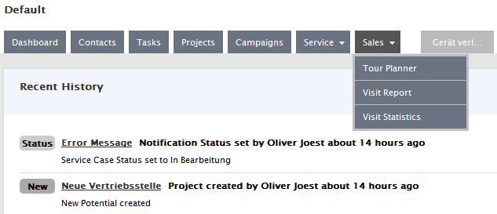
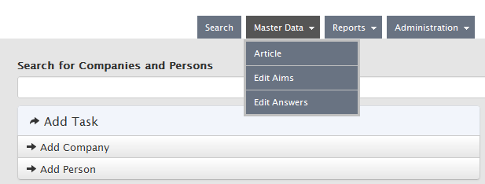
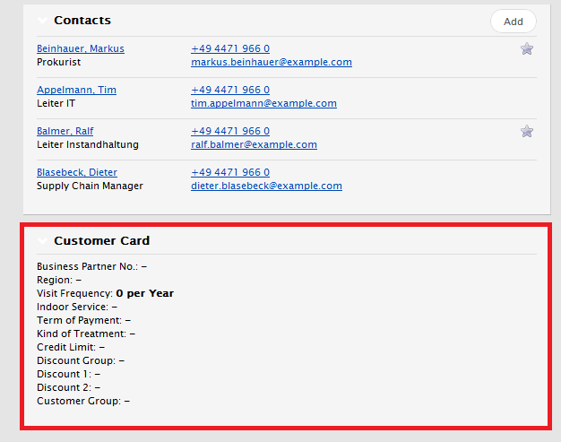

# Development in the customer plugin

## Create a new customer plugin

- Content
- Controllers
- Model
- Views

If necessary, create additional folders and sub-folders. The following folders are of particular importance:

- Database
Database This folder can contain two sub-folders:

- Create
Contains the SQL scripts (e.g. for creating tables) that are only executed when the plug-in is activated for the first time.

- Migrate
Contains the DB migrations. The migrations are carried out each time the plugin is activated. Strictly speaking, the name of this folder can be freely selected, since the migrations are only searched for and found using the migrate attribute.

When the plugin is activated for the first time, a table dbo_SchemaInfo_<PluginName> is created. The create scripts in the Create folder are only executed if this table does not exist. The scripts are executed in the order of their alphanumeric sorting, i.e. 1_Skript1.sql before 2_Skript.sql etc.

- add web.config

- Open project properties (right-click on project, select Properties in the context menu). Click the Web tab. Under Servers select “Use Custom Web Server” with URL http://crm.l-mobile.com . If you leave the setting at the default value "Use Visual Studio Development Server", an instance of the development server is started for each plug-in project.

- Create a plug-in class in the root directory, which is derived from the Plugin class in the CrmLibrary.Modularization namespace in CrmLibrary.dll.

- Provide this class with the plugin attribute from the same namespace. 

A parameter “Requires” can be transferred to the attribute, which indicates the dependencies of the current plug-in on other plug-ins in the form of a comma-separated list.

	[Plugin(Requires="Crm.MyFirstPlugin,Crm.MySecondPlugin")]
	public class MyThirdPlugin : Plugin
	{}

The name of the class can be freely chosen. The dependencies on other plugins are specified by specifying the project name or the name of the .dll file (without the .dll extension). Both are identical by default, but the name of the generated .dll file can be changed in the project properties.

## Routing

To register the plugin-specific routes in the root directory, create a class which is derived from RouteRegistrar and implements the IRouteRegistrar interface. Provide this class with the RouteRegistrar attribute (all from the CrmLibrary.Modularization.Registrars namespace). A Priority parameter can be passed to the attribute, which specifies the order in which the routes are registered. The order of registration is in descending order of priority, ie it would theoretically be possible for one plugin to overwrite the route of another plugin.

The routes are registered by overwriting the RegisterRoutes method of the RouteRegistrar base class.

Example

	[RouteRegistrar(Priority = 10)]
	public class VisitReportRouteRegistrar : RouteRegistrar, IRouteRegistrar
	{
	  endpoints.MapControllerRoute(
	    null,
	    "Customer.Example/{controller}/{action}/{id?}",
	    new { action = "Index", plugin = "Customer.Example },
	    new { plugin = "Customer.Example" }
	  );
	}

The name of the class can be freely chosen. The file name with the class definition is usually called Routes.cs, but can also be chosen as desired.

## Menus

If the plugin is to insert menu items, a class is required for each menu item, which MenuRegistrar derives from the namespace CrmLibrary.Modularzation and is identified with the menu attribute. Various parameters can be transferred to the menu attribute:

- **Category**
Is required if a menu item with submenu items is to be created. The categories of the submenu items must correspond to the title of the upper menu item.
- **Title**
The resource key used to translate the menu text.
- **RouteName**
The name of the route that is called when the link is clicked.
- **Url**
Instead of the route name, an url can optionally be specified. This would be necessary, for example, if the url should contain a query string.
- **Priority**
The priority defines the order in which the menu items are displayed.- **HasSubmenus**
Indicates whether a menu item has submenu items. At the moment only one level of submenu items is allowed.
- **RequiredPermission**
 Specifies the permissions a user must have in order to be able to select the menu item. If he does not have the authorization, the menu item is not visible. A comma-separated list of authorizations can be passed to the parameter. This is an OR link, ie the user must have at least one of the authorizations for the menu item to be visible.
- **RequiredRole**
Specifies the role that a user must have, similar to the authorization, so that the menu item is visible to him
Beispiel

	TODO: Insert Code snippet here

In order to add a submenu item to the main menu item “Master Data” or “Master Data”, “MasterData” must be specified as the category.

Example

	[Menu(Category = "MasterData", Title = "EditVisitPossibleAims",
             RouteName = "VisitAims", Priority = 70,
             RequiredPermission = "EditVisitPossibleAims")]
	public class VisitAimsSubMenu : MenuRegistrar
	{}

	[Menu(Category = "MasterData", Title = "EditVisitReportPossibleAnswers",
             RouteName = "VisitReportPossibleAnswers", Priority = 60,
             RequiredPermission = "EditVisitReportPossibleAnswers")]
	public class VisitReportPossibleAnswersSubMenu : MenuRegistrar
	{}

## ActionFilter

A plugin can dynamically add ActionFilter to action methods, also to existing methods of the main program or other plugins. For this purpose, an implementation of the abstract class ActionFilterRegistrar must be written, which must also be identified with the attribute [ActionFilterRegistrar]. The abstract methods RegisterActionFilters and GetActionFilterType are to be implemented, whereby GetActionFilterType must return the concrete type of the ActionFilter to be registered.

Example
       
	[ActionFilterRegistrar]
	public class TaskListActionFilterRegistrar : ActionFilterRegistrar
	{
		public override IEnumerable<IActionFilterCriteria> RegisterActionFilters()
		{
			var taskListActionFilterCriteria = new ControllerActionCriteria();
	
			taskListActionFilterCriteria
				.AddMethod<ServiceOrderController>(c => c.Details(null));
			taskListActionFilterCriteria
				.AddMethod<ServiceCaseController>(t => t.Details(default(int)));
	
			return taskListActionFilterCriteria.AsEnumerable();
		}
	
		public override Type GetActionFilterType()
		{
			return typeof(TaskListActionFilter);
		}
	}

## Prevent deletion of lookups

There are cases in which an entry in a lookup table must not be deleted because the lookup value is being used by another entity. Examples are the project status or the project category. If you were to delete a project status or a project category that is used by a project, an exception would occur if an attempt is made to access the lookup property of the project instance.

To prevent used lookups from being deleted, a derivation of the base class UsedLookupsProviderBase must be implemented and given the attribute [UsedLookupsProvider]. The class implements the abstract method GetUsedLookupKeys, which must return a list of the lookup keys used, which must not be deleted.

Example

	[UsedLookupsProvider]
	public class ServiceUsedLookupsProvider : UsedLookupsProviderBase
	{
		public override IEnumerable<object> GetUsedLookupKeys(Type lookupType)
		{
			if (lookupType == typeof(Skill))
			{
				return GetInstance<IServiceOrderService>().GetUsedSkills();
			}
		
			return new List<string>();
		}
	}

The extension method ILookup.IsUsed can then be used in the code to check whether a specific lookup instance can be deleted or not.

Example

	[HttpPost]
	public virtual ActionResult DeleteLookup(ILookup lookup)
	{
		if (lookup.IsUsed())
		{
			return Json(new { errorMessage = "LookupDeletionDenied".GetTranslation() });
		}
		…
	}

## Events

With the help of events it is possible for a plugin to expand the functionality of the basic program. The extension is only possible at predefined points in which the main program (or another plugin) publishes an event.

The event is an instance of a class derived from CrmEvent with any properties that are evaluated by an event handler to be written by the user

Example
       
	TODO: Update code example
	public class CompanyDeletedEvent : CrmEvent
	{
		// Ids of the deleted companies
		public IList<int> CompanyIds { get; protected set; }
		
		public CompanyDeletedEvent(params int[] companyIds)
		: this(new List<int>(companyIds))
		{ }
		
		public CompanyDeletedEvent(IList<int> companyIds)
		{
			CompanyIds = companyIds;
		}
	}

This event can be published with the help of the EventAggregator class:

	TODO: Update code example
	public void DeleteCompany(int companyId)
	{
		var company = companyRepository.Get(companyId);
		if (company == null) return;
		
		companyRepository.Delete(company);
		
		CrmEventAggregator.Publish(new CompanyDeletedEventArgs(companyId));
	}

In order to intercept and process the event, an event handler must be implemented, which expects an object of the event to be processed as the only parameter and must be provided with an EventHandlerAttribute:

	TODO: Update code example
	[ConcreteType(typeof(IProjectService))]
	public class ProjectService: IProjectService
	{
		[EventHandler(typeof(CompanyDeletedEvent), typeof(IProjectService))]
		public void OnCompanyDeleted(CompanyDeletedEvent e)
		{
			var projectsToDelete = from p in projectRepository.GetAll()
									where p.Parent != null 
									&& e.CompanyIds.Contains(p.Parent.Id)
									select p;
			foreach (var project in projectsToDelete)
			{
				projectRepository.Delete(project);
			}
		}
		
		...
	}

In the example, when a company is deleted in the EventHandler, which can be located in a project plug-in, for example, all projects associated with the company are deleted.

The EventHandler must be located within a class registered with the IoC container. In the example, the class ProjectService is registered as a specific type of the IProjectService interface.

The EventHandler attribute expects the type of event to be processed as the first parameter and the type of the interface under which the class was registered with the IoC container as the second parameter.

Note: An EventHandler for a specific CrmEvent class also receives all events derived from it.

Example

The OnCrmEvent method of the NoteService class receives all events and checks for each received event whether there is an associated implementation of the NoteGenerator class. If such a NoteGenerator exists, it creates a note about the event (see section NoteGenerator).

	[ConcreteType(typeof(INoteService))]
	public class NoteService : INoteService
	{
		[EventHandler(typeof(CrmEvent), typeof(INoteService))]
		public void OnCrmEvent(CrmEvent e)
		{
			var noteGenerators = Exports.Container.GetNoteGenerators();
			foreach (INoteGenerator noteGenerator in noteGenerators)
			{
				if (noteGenerator.EventType != e.GetType())
				continue;
				
				var note = noteGenerator.GenerateNote(e);
				
				SaveNote(note);
			}
		}
	}
	
### NoteGenerator

If a note is to be generated for an event, a concrete derivation of the abstract NoteGenerator class must be implemented. The type parameter TCrmEvent corresponds to the event for which the note is generated. The concrete implementation must overwrite the method GenerateNote, which receives the event as an input parameter and uses it to generate and return a Note object.

Example

	[NoteGenerator(typeof(ProjectCreatedEvent))]
	public class ProjectCreatedNoteGenerator : NoteGenerator<ProjectCreatedEvent> 
	{
		public override Note GenerateNote(ProjectCreatedEvent e)
		{
			var project = e.Project;
		
			var note = new ProjectCreatedNote
			{
				IsActive = true,
				ContactId = project.Id,
				Text = ProjectStatus.Open.Key
			};
		
			return note;
		}
	}

## PluginRenderActions

A plugin can inject its own PartialView into views of the main program or other plugins at predefined extension points. The extension points are to be defined using the PluginRenderActions method, to which the name of the extension point is to be passed as the first parameter.

Example of an extension point
       
       <% Html.PluginRenderActions("CompanySidebarExtensions"); %>
       
A method must be implemented within a controller class which returns the view to be injected and which must be marked with the attribute [PluginRenderAction]. The attribute expects a comma-separated list of the names of the extension points at which the view is to be injected as the only parameter.

Example

	public class CompanyExtensionController : Controller
	{
		[RenderAction("CompanySidebarExtensions", "CompanyMobileExtensions")]
		public virtual ActionResult CustomerCard(int id)
		{
			var model = new CrmModelItem<Company>
			{
				Item = companyService.GetCompany(id)
			};
			
			return View("CustomerCard", model);~~~~
		}
	}
 

### List of available PluginRenderActions

**CrmSite**
	
View															|Category
----------------------------------|----------------------------
**Company/Details.aspx**					|CompanyHeaderRightInfo
																	|CompanyTabHeader
																	|CompanyTab
																	|CompanySecondaryAction
																	|CompanyContextExtensions
																	|CompanySidebarExtensions
**Company/Edit.aspx**							|CompanyEditSidebarExtensions
**Contact/BulkControls.ascx**			|ContactSearchBulkActions
**Contact/BulkInfoArea.ascx**			|ContactSearchBulkInfoArea
**Contact/ListActions.ascx**			|ContactSidebarContextExtensions
**Dashboard/Index.aspx**					|DashboardSidebar
**Person/Details.aspx**						|PersonSecondaryActions
																	|PersonContextExtensions
																	|PersonSidebarExtensions													
**Project/Details.aspx**					|ProjectExtensions
**Shared/SourceSelectBox.ascx**		|ContactSource
**User/Details.aspx**							|UserDetailsMapSidebarExtensions
	
**Crm.Service**

View																									|Category
------------------------------------------------------|-------------------------------------------
**ServiceOrderMaterial/ServiceOrderMaterialEdit.ascx**|ServiceOrderMaterialEditorExtensions
**ServiceOrderTime/ServiceTimeEdit.ascx** 						|ServiceOrderTimeEditorExtensions
**Shared/ServiceOrderMaterialNew.ascx** 							|ServiceOrderMaterialEditorExtensions
**Shared/ServiceOrderTimeNew.ascx** 									|ServiceOrderTimeEditorExtensions

## Extension Properties

With the help of extension properties, a plugin can extend the edit view of an entity. For this purpose, EntityExtension is derived from the generic class, whereby TEntity defines which entity is to be extended.

example

	public class CompanyExtension : EntityExtension<Company>
	{
		//  Here is the definition of the extension properties
	}

In the simplest case, the extended property is a simple string that is to be stored in the database under the property name. The column must be in the table to which the extended entity was mapped.

example

	public class CompanyExtension : EntityExtension<Company>
	{
		public string CreditLimit 
		{
			get { return GetValue<string>("CreditLimit"); }
			set { SetValue("CreditLimit", value); }
		}
	}
      
In this case, a CreditLimit column must be added to the Crm.Contact table via DB migration. The associated NHibernate mapping is generated automatically in the NHibernateInitializer.AddExtensionDynamicComponentMappings method. The method calls GetValue and SetValue within the getter and setter method are necessary to save the assigned values ​​in a dictionary, which is required by NHibernate.

The properties can be given different attributes:

- **DatabaseAttribute**
The DatabaseAttribute has two properties: ColumName and Ignore. Using ColumnName, the property can be mapped to a DB column whose name is not identical to the property name.

example

	[Database(Column = "CompanyKreditlimit")]
	public string CreditLimit 
	{
		get { return GetValue<string>("CreditLimit"); }
		set { SetValue("CreditLimit", value); }
	}
		
If you set Ignore = true, the property for the mapping is completely ignored. This is necessary, for example, for lookup properties (see below), which appear as a dropdown list on the UI, but should not be mapped to the DB, since only the lookup key is saved for lookups.

example

	public class CompanyExtension : EntityExtension<Company>
	{
		[LookupKey]
		public string IndoorServiceKey 
		{
			get { return GetValue<string>("IndoorServiceKey"); }
			set { SetValue("IndoorServiceKey", value); }
		}
		
		[Database(Ignore = true)]
		public IndoorService IndoorService { 
		get 
		{
			return LookupManager.Instance.Get<IndoorService>(IndoorServiceKey);
		}
	}

- **LookupKeyAttribute**
The LookupKeyAttribute identifies a lookup key. Properties with this attribute are not rendered on the surface, but are filled via the drop-down list of the associated lookup property. According to the naming convention, the name of the lookup key property must correspond to the name of the lookup property with the extension “Key” (see example above).

- **LookupFilterAttribute**
This attribute can be used to filter the list of lookup values ​​in the drop-down list. The attribute has two properties:

*MethodName*
NMethodName Name of a property of the type Func <bool, TLookup>, which must be implemented within the EntityExtension class.

*LookupType*
Type of the lookup property to be filtered.

Beispiel

	public class CompanyExtension : EntityExtension<Company>
	{
		[LookupKey]
		public string VisitFrequencyTimeUnitKey
		{
			get { return GetValue<string>("VisitFrequencyTimeUnitKey"); }
			set { SetValue("VisitFrequencyTimeUnitKey", value); }
		}
		
		[LookupFilter(MethodName = "OnlyTimeUnitsWithTimeUnitsPerYear",
		LookupType = typeof(TimeUnit))]
		[Database(Ignore = true)]
		public TimeUnit VisitFrequencyTimeUnit
		{
			get 
			{
				return LookupManager.Instance
						.Get<TimeUnit>(VisitFrequencyTimeUnitKey);
			}
		}
		
		// Methods
		public bool OnlyTimeUnitsWithTimeUnitsPerYear(TimeUnit timeUnit)
		{
			return timeUnit.TimeUnitsPerYear.HasValue;
		}
	}

- **ReadOnlyExtensionPropertyAttribute**
Properties with this attribute are mapped to the DB, but cannot be edited, ie no input fields are rendered. The columns must be filled in some other way, e.g. by importing data. They are pure display fields. For examples see View CustomerCard.ascx in the JaegerLacke plugin.

- **UIAttribute**
 This attribute can be used to influence the display of the input field. The attribute has the following properties:

*Caption*
Defines the resource key which is used for localizing the label of the input field, i.e. which is transferred to the Html.Localize method. Without this specification, the property name is used as the resource key.

*Row*
Extension Properties with the same Row value are rendered on one row.

*ColumnsPerRow* 
Specifies how many columns the row is divided into. This can be used to influence the size of the input fields

Example:

		public class CompanyExtension : EntityExtension<Company>
		{
			[UI(Caption = "VisitsNeeded", Row = 1, ColumsPerRow = 4)]
			public int VisitFrequencyValue
			{
				get { return GetValue<int>("VisitFrequencyValue"); }
				set { SetValue("VisitFrequencyValue", value); }
			}
		}

## Validation

Before an entity is stored in the database, it must be validated. There are two types of validation errors:

- Attachment failure
- Business Rules Violation

A binding error occurs, for example, if an attempt is made to enter a string “abc” in the text field of a property of the type int. If an entity is to be validated for binding errors, a ModelBinder must be implemented for this entity, which is derived from CrmModelBinder:

	[ModelBinderFor(typeof(Company))]
	public class CompanyModelBinder : CrmModelBinder
	{
		public override object BindModel(ControllerContext controllerContext,
				ModelBindingContext bindingContext)
		{
			var company = base.BindModel(controllerContext, bindingContext) as Company;
			return company;
		}
	}

A format "hh [: mm]" is expected for properties of the TimeSpan or Nullable type (information in square brackets is optional). If the permissible value is to be restricted to a range between 0 and 24 hours, the corresponding property must be provided with the DayRestriction attribute:

	public class Visit : EntityBase<int>
	{
		public virtual int CompanyId { get; set; }
		public virtual string CompanyName { get; set; }
		public virtual DateTime Date { get; set; }
		[DayRestriction]
		public virtual TimeSpan? Time { get; set; }
	}

Binding errors are added to the BindingRuleViolations collection of the EntityBase class.

For the review of the business rules, classes are to be introduced which are derived from the generic class Rule, where TEntity indicates the entity to which the business rule relates. The Rule class defines three abstract or virtual (overwritable) methods:

	public abstract class Rule<TEntity> : Rule
		where TEntity : class
	{
		protected abstract RuleViolation CreateRuleViolation(TEntity entity);
		public abstract bool IsSatisfiedBy(TEntity entity);
		
		protected virtual bool IsIgnoredFor(TEntity entity)
		{
			return false;
		}
	}

IsIgnoredFor defines whether this business rule should be ignored for the current entity. This is the case, for example, for notes that are not assigned to any entity. In this case, it is not necessary to check for the existence of the ContactId:
	
	public class ContactIdMustExist : Rule<Note>
	{
		protected override bool IsIgnoredFor(Note note)
		{
			return note.ContactId == null;
		}
		…
	}

IsSatisfiedBy implements the actual business logic and should return true if the current entity is valid, false otherwise:

	public class ContactIdMustExist : Rule<Note>
	{
		private readonly IContactService contactService;
		
		public override bool IsSatisfiedBy(Note note)
		{
			return contactService.DoesContactExist(note.ContactId.Value);
		}
	}

The CreateRuleViolation method creates an object of the RuleViolation type if the business rule returns a validation error. An overload of the RuleViolation method can be used to create this object:

	public class ContactIdMustExist : Rule<Note>
	{
		protected override RuleViolation CreateRuleViolation(Note note)
		{
			return RuleViolation(note, n => n.ContactId, "Contact");
		}
	}

The error message can be controlled via the ErrorMessageKey or RuleClass properties of the RuleViolation class. If there is an ErrorMessageKey, the resource file is searched for a key "RuleViolation.", Eg "RuleViolation.AccountInactive". If there is no ErrorMessageKey, the RuleClass is used to generate the key, eg "RuleViolation.Required".

The RuleClass is passed to the constructor of the Rule base class. This is a value of the RuleClass enumeration:

	public class ContactIdMustExist : Rule<Note>
	{
		public ContactIdMustExist(IContactService contactService)
		: base(RuleClass.MustExist)
		{
			this.contactService = contactService;
		}
	}
	
For frequently used business rules, there are already some base classes that make implementation easier. These can be found in the namespace CrmLibrary.Validation.BaseRules of CrmLibrary.dll.

Example:

	public class TextRequired : RequiredRule<Note>
	{
		public TextRequired()
		{
			Init(n => n.Text);
		}
	}

## Client-side validation

By default, the complete validation takes place on the server side, ie the user entries are sent to the server, where the validation rules are checked and if a rule is violated, an HTML page with the error messages is rendered and sent back to the client. To save yourself this server round trip, there is the option of activating a client-side validation based on the jquery.validate.js plug-in using the HtmlHelper extension method ClientSideValidation.

Note: Client-side validation has so far only been implemented for certain, frequently occurring rules (e.g. RequiredRule, MaxLengthRule, etc.). In addition, a round trip to the server is always necessary for certain rules, for example to check the uniqueness of a name in the database.

The ClientSideValidation method has several overloads.

	string ClientSideValidation<TEntity>(this IHtmlHelper htmlHelper)
	
	string ClientSideValidation<TEntity>(this IHtmlHelper htmlHelper,
											string formSelector)
	
In the first variant, the HTML page is searched for a FORM tag whose fields are validated. The second overload enables a restriction to a specific form with the help of a jQuery selector:
	
	<%= Html.ClientSideValidation<Person>(".person-edit") %>

A JavaScript tag is rendered into the page for client-side validation. There is a template Content / js / templates / validation.js for this. Valid JavaScript is generated from this using the following code within the ClientSideValidation method:
	
	var sb = new StringBuilder();
	sb.AppendLine("");
	sb.Replace("[[form_selector]]", formSelector);
	sb.Replace("[[rules_as_json]]", rulesAsJson.ToString(","));
	sb.Replace("[[messages_as_json]]", messagesAsJson.ToString(","));
	
	return sb.ToString();

RulesAsJson and messagesAsJson are Json objects that describe the rules and associated error messages. These are required by the jquery.validate plugin.

## Overriding business rules

A plugin can override a business rule for an entity. The override is based on the entity type, class name and priority. The default priority is 0.

Example:

The main program defines a business rule for the Name property of the project entity:

	public class NameMaxLength : MaxLengthRule<Project>
	{
		public NameMaxLength()
		{
			Init(c => c.Name, 120);
		}
	}

A plugin can override this rule with the following class:

	public class NameMaxLength : MaxLengthRule<Project>
	{
		public override int Priority
		{
			get { return 10; }
		}
		
		public NameMaxLength()
		{
			Init(c => c.Name, 20);
		}
	}

## Background agents

Background agents are background processes that run at regular time intervals. They must derive from the base class BackgroundServiceBase and implement the abstract method Run and be provided with the attribute [BackgroundService]. The Run method contains the logic of the background agent and is called periodically. The standard time interval is 5 minutes. If a different time interval is to be specified, this must be defined in the OnInitializeSettings method. Additional configuration data can also be specified here, which are required by the background agent. These specifications are written into the DB table BackgroundServiceSetting during the first execution and can be changed later on the admin page of the Crm application.

Example

	[BackgroundService]
	public class MessageSender : BackgroundServiceBase
	{
		protected override void Run()
		{
			SendMessages();
		}
		
		protected override void OnInitializeSettings()
		{
			SetSetting("Interval", TimeSpan.FromSeconds(61).TotalSeconds.ToString());
			SetSetting("Host", "127.0.0.1");
			SetSetting("Port", "25");
		}
		
		…
	}
	
Note: If the Run method is to be debugged when the application is started, the RunOnFirstStartUp property must be set to true in the constructor. In this case, the Run method is executed synchronously when the program is started (ie not as a background thread).

## FAQ

**How is a plugin activated / deactivated?**
Via the site settings or site settings, plugins can be activated and deactivated under the Properties or Properties tab.
 
**Where are the activated plugins stored in the database?**
 In the table Crm.Site. The ActivePlugins column contains the names of the active plugins in the form of a comma-separated list.

**How are the DB structures required by a plugin created?**
When a plugin is activated for the first time, all create scripts in the Database / Create subdirectory of the plugin are executed. The scripts are executed in the lexical order of their filename. A SchemaInfo table for the plugin is also created in which the migrations are saved. After running the create scripts, the migrations are carried out in the Database / Migrate folder and their migration number is saved in the SchemaInfo table. Each time the plug-in is activated again, only those migrations are carried out whose migration number is not in the SchemaInfo table. In other words, if you have written a new migration and want to use it, the plug-in must be deactivated and then reactivated in order to execute the migration.

----
**Note** The check whether the plug-in is being activated for the first time is carried out using the plug-in's SchemaInfo table. The create scripts are only executed if this table does not exist.

----

**How are Selenium tests for plugins written?**
In order to be able to test a plugin, the plugin must be activated. The IsPluginActive, ActivatePlugin and DeactivatePlugin methods are available in the SeleniumTest class for this purpose. The setup method should check whether the plug-in to be tested is active. If not, it should be activated by calling ActivatePlugin.

Example:

	[TestFixture]
	public class ExpenseTests : SeleniumTest
	{
		[SetUp]
		public void SetUp()
		{
			if (!IsPluginActive("Crm.Service"))
			{
				ActivatePlugin("Crm.Service");
			}
			GoToUrl("/Crm.Service/Expense", DefaultUserToken);
			…
		}
	}

**How is a new note type defined in a plugin?**
Note types must derive from the base class Note and override the IsSystemGenerated property. For notes generated by the system (e.g. when completing a task) this property should return the value true, otherwise false. System-generated notes are marked by a rectangle with rounded corners and an identifier text (eg "Task" or "Task"). The color of the rectangle and the text are set using the ImageColor and ImageTextKey properties. For non-system-generated notes, a url for an image must be specified using the ImageVortualUrl property

Example

	public class OrderStatusChangedNote : Note
	{
		public override bool IsSystemGenerated { get { return true; } }
		public override string ImageTextKey { get { return "Status"; } }
	}

A subclass mapping for the new note type must be specified as the NHibernate mapping. The different note types are differentiated using the DiscrimatorValue.

	public class OrderStatusChangedNoteMap : SubclassMapping<OrderStatusChangedNote>
	{
		public OrderStatusChangedNoteMap()
		{
			DiscriminatorValue("OrderStatusChanged");
		}
	}

**How can a lookup be extended by a plugin?**
If a lookup is to be expandable by plugins and the lookup values ​​are to be accessed in the code (i.e. the lookup values ​​are known at development time and are not created by the user via the user interface), the value of a lookup object can be checked using static methods.

Example

	[Lookup("[SMS].[ServiceOrderDispatchStatus]")]
	public class ServiceOrderDispatchStatus : Lookup<string>
	{}
	
	// Extension methods
	public static class ServiceOrderDispatchStatusExtensions
	{
		public static bool IsScheduled(this ServiceOrderDispatchStatus status)
		{
			return status.Key == "Scheduled";
		}
		
		public static bool IsReleased(this ServiceOrderDispatchStatus status)
		{
			return status.Key == "Released";
		}
	}

The lookup values ​​"Scheduled" and "Released" are known at development time. If a plugin introduces a new value, a new extension method can be implemented in the plugin:

	public static class PluginServiceOrderDispatchStatusExtensions
	{
		public static bool IsInSomeNewStatus(this ServiceOrderDispatchStatus status)
		{
			return status.Key == "IsInSomeNewStatus";
		}
	}

The advantage of this procedure compared to the definition of static properties in the main program is that lookup values ​​defined in the plugin can be addressed with the same syntax as the lookup values ​​defined in the main program. If the lookup values ​​of the main program are defined with the help of static properties, this would not be possible because the lookup class cannot be extended.