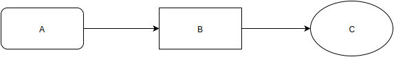

# Documentation with the Nudoc tool
Nudoc is a commandline application that wraps a [Markdown Extra](https://michelf.ca/projects/php-markdown/extra/) parser, a Razor template [engine](https://github.com/Antaris/RazorEngine) as well as a Html to pdf [conversion library](https://github.com/tuespetre/TuesPechkin) to produce nicely formatted Pdf files.

I use it to write technical documents. The default output is Html. Optionally it generates a Pdf document from the Print stylesheeted version of your Html.

The provided default templates are just a starting point. These may be personalized for custom, e.g. client specific documents and the like.

## Directory Layout
Nudoc uses the following directory layout for your document.

~~~~~
in							--> contains the document's chapters
	chapter1
		img					--> optional image files for this chapter
		chapter1.md			--> markdown content for this chapter
	chapter2
		chapter2.md
		
style						--> optional css styles
js							--> optional js scripts
template					--> optional razor templates for conversion

out							--> your doc ends up here

toc.txt						--> reference of all chapters and their order
nudoc.config				--> configuration for the build process
~~~~~

## Usage
Initializing a new directory for nudoc, this creates a sample document and config files

~~~~~
C:\>nudoc --init --init-dir "c:\documentation"
Initializing to c:\documentation....
~~~~~

Create document, add --pdf for Pdf output in addition to Html

~~~~~
C:\>nudoc --config "c:\documentation\nudoc.config" --build
Check environment...
Cleaning...
Removing c:\documentation\out...
Parse toc ...
Copy dependencies...
Processing input files...
Generating document...
~~~~~

For quick preview Nudoc contains an integrated web server module that allows you to preview your documentation file from the browser and rebuild it every time you reload the page

~~~~~
C:\>nudoc --config "c:\documentation\nudoc.config" --servce
Check environment...
Listening to http://localhost:8080/
Press any key to stop...
~~~~~

If you want to customize the default Html template, Js files or Css style you can edit the files in ./template, ./style or ./js to suit them to your needs.

If Nudoc throws an error most likely your --config parameter is wrong or the nudoc.config file format is not correct.

## Flowcharts
Charts should be created using draw.io](https://draw.io) and saved as SVG (Scalable Vector Graphics). This way they can be easily resized and printed in high quality.
See this SVG in the image folder of this file to see an example.

Please save the original SVG or Xml File alongside the output. This way anybody else can edit your diagram if needed.

## Tips
- Nudoc scans your files for %Title: %Author: and %Version: lines. Authors will be combined into an array, the others two are exclusive (last found will be used)
- You can place a # in front of a TOC entry to disable a chapter
- [Markdown language highlighting](https://www.dropbox.com/s/mx9vaoilpyja1x6/userDefineLang.xml?dl=0) is available in my dropbox, copy this file to %APPDATA%\Notepad++ and restart your notepad++ instance.

## Requirements
- Nudoc comes IL merged with all dependencies, so just xcopy it to a convenienet location and you should be fine
- .Net Framework 4.5
- If you want to start Nudoc from everywhere put the folder where it resides into your PATH variable

## Where to find it
- Download it from my dropbox [shared folder](https://www.dropbox.com/sh/qs7km0vspwc8k8j/AADroQWbHfKacrlvmHxPnID4a?dl=0)
- Get it as part of Crm/Service default build artifacts from [ci.l-mobile.com](http://ci.l-mobile.com)
- Build it from code using Crm.Documentation.CommandLine project

~~~~~
hg clone hg clone https://svn.l-mobile.com/Crm#default
~~~~~

## Stylesheet

### Structure
Make sure your documentation has a meaningful and simple structure that the reader may follow. In general there are few rules of thumb to make sure your documentation will simplify the usage of L-mobile products for the end user:

- **From simple to complex:** Structure your texts from simple to complex content.
- **Logical order:** Structure your steps, paragraphs and the overall document in a meaningful way.
- **Helpful headings:** Use headings with meaningful content to help structure the document.
- **Targeted references:** Use references wherever necessary, but make sure they are targeted to the most precise location.

### Language and tone

- **Not So Imperative:** As a rule of thumb, avoid the word "must" and unnecessarily imperative statements in general. E.g., instead of "Commands must be run from a cmd or powershell prompt," try "You can run commands either from a cmd or powershell prompt."
- **Keep things simple:** Use short and useful sentences.
- **Avoid passive voice:** Past-tense passive voice is to be avoided. E.g., "the pause event fires when..." rather than "the pause event is fired when..." Rule of thumb: banish verbs ending in "ed". Passive voice is more appropriate for reference doc, you should still avoid it when there's a better active-voice alternative:
- Avoid em dash clauses--they unnecessarily break up the text--and parenthical statements (which can also be distracting). If you do include either, remove spaces around the dashes (punctuate fragments outside of paren's). (Punctuate full sentences inside of parens.)

### Specification
Before you start to produce content for the technical documentation, make sure you understand your audience. Some questions to get you guided:

- Which advantages does the user have from using the product?
- How will the product be used?
- Which knowledge does a potential user have?
- Which knowledge does a potential user need?

In a perfect world you will deliver the required informations to your user as short, reliable and simple as possible. Please read your documentation after producing it and if possible let a potential user follow your documentation. Improve the parts where the user did not succeed or got stuck in the process.

### Structure and Flow

- **Valid Heading Structure:** One title only (an A-head) at the top of the page. No jumps to C-heads. Do not follow a heading with a subheading with no intervening introductory text.
- **Flatten Content:** Use B-heads to divide each page's content. Please avoid C-heads. Readers tend to lose context once content gets that nested. Think: "blog post."
- **Consistent Headings:** Try to match verb tense in headings. That is, if one is task-based and reads "Adding a Platform," the other should be "Developing for Android" rather than "Android Development"
- **Listings:** Use numbered lists for sequential procedures or ranked content only, otherwise use bullet lists. Precede lists with text that introduces them, preferably ending with a colon (:). Do not allow single-item lists. Use bullet lists only to indicate a clear set of choices that you first introduce, not as a substitute for a series of regular paragraphs. Avoid nested lists, for the same reason you avoid C-heads. Do not indent top-level lists.
- **Punctuating and Formatting Lists:** Append periods to bullet and number list items that consist of full sentences. No periods when bullet items are sentence fragments, except in bullet lists that need internal consistency. To improve readability, add vertical space around top-level bullet/numbered list items that consist of full sentences. OK to vertically collapse lists of short, easily scannable items.
- **Topic/Comment Lists:** For bullet lists that provide short topics followed by comments, bold the topic, then merge the comment on the same line, separated with a colon unless the topic features trailing punctuation. This list item provides an example. Bolded Topic Text Follows Same Init-Cap Rule as Headings.
- **Highlight user interface elements:**: Use *italic* for on-screen items, such as the names of menu items, buttons, and check boxes.
- **Notes:** Bold and all-cap NOTE: with horizontal lines outside, always at the end of a paragraph, never mid-paragraph. Do not incorporate this font change into a sentence as in "Note that..." but OK to start a sentence: "Note that..." when the information is less consequential.

	----
	**NOTE** The following sentence clarifies some of the aspects of the paragraph above.

	----
	
- **Warnings/Tips:** As an alternative to NOTE:, use WARNING: for serious matters, or TIP: to pass along useful tricks or context.
- **Minimize Notes:** Avoid too many notes and warnings, as it implies a haphazard development environment with too many variable factors that divert the reader's attention. Try to clarify variations on a procedure within the text. Try to focus attention on information specific to the software, not on background knowledge.

### Screenshots
- Screenshots should be created with (Awesome Screenshot)[http://awesomescreenshot.com]
- Save your screenshots in png format, don't compress the files
- Please don't alter the original screenshot (e.g. add markers or borders), this makes the process of creating multi language documentations much easier
- Please use english names for your Screenshots, e.g. menu_dispatch_list.png

To highlight a certain area on the screen please use visual context, crop the image so that the most important information is visible with a little bit of sourrounding UI. That way you can easily direct the focus of your reader to the necessary area. If the area is part of a bigger screen, try to create a bigger picture first and reuse individual parts of it by cropping and explaining them separately.

### Table of content
- Use a static destination address tag which is not language depending. E.g. Use as Header: ## Rollen {#user-manager.rolls} instead of plain ## Rollen.
  See as well [Links](#stylesheed.links).

### Links {#stylesheed.links}
- Use titles in link text, never 'click here'. Consider using the link's domain name as a substitute.
- Domain names are OK as a link's display text, but not full scheme-qualified URLs. No bare URLs in text outside of code.
- Link to headers by using static destination address tags as link text. Example for link text: #stylesheed.table-of-content
  Scheme of link text: #document_name.header-link-text
  

### German - Wiederkehrende Begriffe für einfachere Wiedererkennung
- Listenansicht (für GenericLists)
- Formularansicht (für das Bearbeiten und Anlegen)
- Kontextaktionen (für Primary und Secondary Actions)
- Kontextinformationen (für den Sidebarbereich)
- Navigationsbereich (für Hauptnavigation)
- Anwendungsbereich (für die primären Inhalte der Seite)

### German - Anti-Patterns
- Anwendung statt Software, Produkt, etc.
- Formular statt Dialog
- Ausführen statt Klicken
- Schaltfäche statt Button
- Modul statt Plugin
- Lesezeichen statt Bookmark
- Geladen statt Download
- Verweis oder Referenz statt Link
