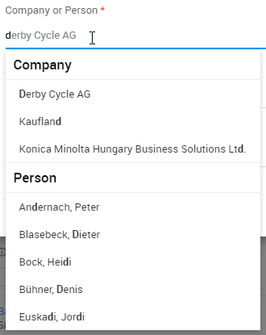
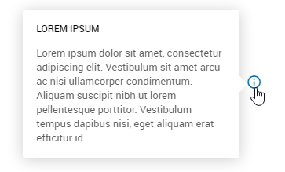

# Custom knockout binding handlers

You're not limited to using knockouts built-in bindings like `click`, `value`, and so on, there are already some custom binding handlers waiting for you.

## autocomplete

The `autocomplete` binding extends an `<input>` element with an autocompleter that sets the value of an observable from a selection.

### Example

```html
<input type="text" class="typeahead form-control" data-bind="
	autocomplete: ParentId,
	autocompleteOptions: { 
		source: 'Main_Company',
		columns: ['LegacyId', 'Name'],
		orderBy: ['Name'],
		display: 'Name',
		key: 'Id',
		limit: 5,
		customFilter: function(query) { return query.filter(function(company){ return company.CompanyTypeKey == '101'; })},
		onSelect: function(company){ $data.ParentName(company.Name); }
	}">
```

### Parameters

- Main parameter

  When selecting an option from the the autocompleter will be set to the `value` parameter. Any previous value will be overwritten.

  If this parameter is an observable value, the binding will update the element's value whenever the value changes. If the parameter isn't observable, it will only set the element's value once and will not update it again later.

- `autocompleteOptions`
  - `key`

    Similar to `optionsValue` parameter of the `options` binding, this parameter can be set to specify which of the selected objects' properties should be used to set the `value` attribute on the input element.

  - `source`

    The source parameter and should be a string with the name of the table, the autocompleter should use to find suggestions.

  - `joins`

    In case one table is not enough for the autocompleter, the optional `joins` parameter accepts an array of strings of properties to join. These have to be defined in the client side database model.

  - `limit`

    Optional limit of suggestions, default value is 10.

  - `columns`

    An array of columns of the table specified in the `source` parameter which should be contained in the filter query.

  - `orderBy`

    An array of columns to order by.

  - `confirmChange`

    An optional function which will be called when the selected element is changed. Can be used to display a confirmation message.

  - `customFilter`

    An optional parameter with a function which will always be called on the filter query before returning the suggestions. This can also be used to further manipulate the query (i.e. orderByDescending).

  - `display`

    Can be used to either specify a property name of the suggested objects, or a function with your own arbitrary logic for computing the displayed text in terms of the represented object.

  - `onSelect`

    An optional parameter which can be used to specify a function to call when a suggestion of the autocompleter is selected or when the user sets the input to null.

  - `onResult`

    An optional parameter which can be used to do additional work depending on the result of the search. The function is expected to return nothing or a promise.

  - `rateLimit`

    An optional parameter which can be used to specify a limit in milliseconds to debounce database queries. By default 250 ms.

### Searching multiple tables
If you want to search multiple tables you have to setup `autocompleteOptions` a little differently. You have to add a `array` called `sources` containing objects similar to the single table definition.
- `sources`
  - `key` (see above)
  - `source` (see above)
  - `joins` (see above)
  - `columns` (see above)
  - `orderBy` (see above)
  - `customFilter` (see above)
  - `display` (see above)
  - `header` The autocompleter will group the results and displays a heading above each result set. You just need to set the resource key, it will be translated.
- `limit`, `rateLimit`, `onSelect`, `confirmChange` are not specified for each source.

### Example

```html
<input type="text" class="typeahead form-control" data-bind="
	autocomplete: ParentId,
	autocompleteOptions: { 
		limit: 5,
		onSelect: function(company){ $data.ParentName(company.Name); },
		sources: [
			{ source: 'Main_Company', columns: ['LegacyId', 'Name'], orderBy: ['Name'], display: window.Helper.Company.getDisplayName, key: 'Id', header: 'Company' },
			{ source: 'Main_Person', columns: ['LegacyId', 'Firstname', 'Surname'], orderBy: ['Surname'], key: 'Id', display: Helper.Person.getDisplayName, header: 'Person' }
		]
	}">
```


## autosize

The `autosize` binding causes the associated `<textarea>` element to automatically adjust its height on keyboard or window resize events.

### Example

```html
<textarea class="form-control fg-input" data-bind="value: value, autosize: true"></textarea>
```

### Parameters

- Main parameter

  A value that controls whether or not the associated textarea element automatically adjust its height.

  Non-boolean values are interpreted loosely as boolean. For example, `0` and `null` are treated as `false`, whereas `21` and non-`null` objects are treated as `true`.

  If your parameter references an observable value, the binding will update the autosize behavior whenever the observable value changes. If the parameter doesn’t reference an observable value, it will only set the state once and will not do so again later.

## colorPicker

The `colorPicker` binding is used to enhance an element with the [Bootstrap Colorpicker](https://farbelous.io/bootstrap-colorpicker/).

### Example
```html
<button class="btn btn-default btn-sm waves-effect" data-bind="colorpicker: myObservable">
  <i class="zmdi zmdi-palette"></i>
</button>
```

### Example with additional colorpicker options
```html
<button class="btn btn-default btn-sm waves-effect" data-bind="colorpicker: { value: myObservable, options: { align: 'left' } }">
  <i class="zmdi zmdi-palette"></i>
</button>
```

### Parameters

- Main parameter

  The main parameter should be an observable with a value of either `null`, or a color as hexadecimal string. Whenever a color from the colorpicker is
  selected, the observable will be updated with the hexadecimal string representing the selected color. Optionally the parameter can be an object with a `value` and an `options` property to set any of the [available configuration options](https://itsjavi.com/bootstrap-colorpicker/v2/) to the colorpicker.


## datePicker

The `datePicker` binding is used to enhance an `<input>` element with the [Bootstrap Datepicker](http://eonasdan.github.io/bootstrap-datetimepicker/). The binding handler will utilize [Moment.js](https://momentjs.com/) to format and parse Date objects.

### Example

```html
<input type="text" class="form-control date-picker" data-bind="datePicker: dateFrom" placeholder="Click here">
<input type="text" class="form-control date-picker" data-bind="datePicker: dateFrom, datePickerOptions: { pickTime: true }" placeholder="Click here">
<input type="text" class="form-control date-picker" data-bind="datePicker: dateFrom, datePickerOptions: { pickTime: true, onlyTime: true }">
<input type="text" class="form-control date-picker" data-bind="datePicker: dateFrom, datePickerOptions: { config: { minDate: new Date(2010, 4, 5), showClear: false, showTodayButton: true } }" placeholder="Click here">
```

### Parameters

- Main parameter

  The main parameter should be an observable with a value of either `null`, a `Date` object or a timespan string. Whenever a date from the datepicker is
  selected, the observable will be updated with the `Date` object representing the selected date, `null` if the selection was cleared, or the timespan as string when a duration is selected.

- datePickerOptions

  The parameter `datePickerOptions` is a plain object with the following properties:
  - `pickTime` set to `true` provides an easy way to pick a time (without a date)
  - `pickDuration` set to `true` provides an easy way to pick a duration (like `pickTime` but bound to an observable which contains the duration as a timespan string)
  - `onlyTime` set to `true` provides an easy way to pick a time (without a date). Difference between `pickTime` and `onlyTime` is if this property is set to `true`, then stored value will contain only time in hh:mm format
  - `config` allows you to set parameters to datepicker directy, please refer to [Bootstrap Datepicker Options](https://eonasdan.github.io/bootstrap-datetimepicker/Options/)

## dateRange

The `dateRange` binding is used to display a formatted range of two Date objects as any element's text (e.g. `h1`, `p`, `a`, `span`, etc.), omitting redudant month and year information. The binding handler utilizes [Globalize.js](https://github.com/globalizejs/globalize) to format the Date objects.

### Example

```html
<small data-bind="dateRange: { 
start: moment(selectedDate()).startOf('isoWeek'), 
end: moment(selectedDate()).endOf('isoWeek') 
}"></small>
```

### Parameters

- Main parameter

  The main parameter should be an object with the following properties:

  - `start`

    A date or moment object used as the start of the date range.

  - `end`

    A date or moment object used as the ebd of the date range.

## dateText

The `dateText` binding is used to display a formatted Date object as any element's text (e.g. `h1`, `p`, `a`, `span`, etc.). The binding handler utilizes [Globalize.js](https://github.com/globalizejs/globalize) to format the Date objects.

### Example

```html
<span data-bind="dateText: OrderDate"></span>
```

### Example 2: Specifying a custom pattern

```html
<span data-bind="dateText: { value: new Date(), pattern: { time: 'short' } }">
```

### Example 3: Use time ago format

```html
<span data-bind="dateText: { value: CreateDate, pattern: { datetime: 'medium' }, useTimeAgo: 'Day'}"></span>
```

### Parameters

- Main parameter

  The binding handler sets the text of the element to a formatted string of the parameters date. If the parameter is an observable value, the binding will update the element's text whenever the value changes. If the parameter isn't observable, it will only set the text once and will not update it again later.

  The default pattern the date will be formatted is `date: 'medium'` which is for example dd.MM.yyyy  or MM/dd/yyyy. To specify a custom pattern, a object can be used as the main parameter with the following properties:

  - `value`

    The Date or an observable with a Date value, see above

  - `pattern`

    A pattern supported by the [Globalize.js date formatter](https://github.com/globalizejs/globalize/blob/master/doc/api/date/date-formatter.md)

  - `defaultText`

    A String that will be rendered if `value` is null or undefined.

  - `useTimeAgo`

    When using this parameter it will give back a time ago string within the period given as value to the parameter. The date values out of this boundary will have default date format.  
    Values that can be used for this parameter:
    - 'Hour': Gives back dates in time ago format within 1 hour to the current date
    - 'Day': Gives back dates in time ago format within 1 day to the current date
    - 'Week': Gives back dates in time ago format within 1 week to the current date
    - 'Month': Gives back dates in time ago format within 1 month to the current date
    - 'Year': Gives back dates in time ago format within 1 year to the current date

    Any other value given to this parameter will result in a full time ago string (no limit, uses x years ago format at max)

## dropzone

The `dropzone` binding is used to display a dropzone for file uploads. The user has the possibility to upload a file per drag and drop or just by clicking on the dropzone.

### Example 1: Use the dropzone to upload one file

```html
<div class="dropzone" data-bind="dropzone: { url: '#', fileResource: FileResource, acceptFile: 'application/pdf', maxFiles: 1}"></div>
```

### Example 2: Use the dropzone to upload multiple files

```html
<div class="dropzone" data-bind="dropzone: { url: '#', files: FileResources, acceptFile: 'application/pdf', maxFiles:null }"></div>
```

### Parameters

For the use of the drop zone there are several parameters that define the behavior of the drop zone:

- `url`

  always should be '#' because the upload is handled in the JavaScript and there is no request to the server

- `fileResource`

  should be defined if the user should be able to upload exactly one file. This parameter should be a file resource object.

- `files`

  should be defined if the user should be able to uplaod multiple files. This parameter expects an empty array which will be filled with file resource objects.

- `acceptFile`

  A String which defines, which files are accepted in the dropzone, e.g. application/pdf, image/jpeg, image/png, image/gif. To accept all files just pass an empty string

- `maxFiles`

  An integer defining the maximum number of uploadable files. If this parameter is not defined, there is no limit

- `name`

  A string which helps to identify the dropzone element. Useful when multiple dropzone elements defined in a form. 

## durationText

The `durationText` binding is used to display a formatted [moment duration object](https://momentjs.com/docs/#/durations/) or a [ISO8601 string](https://en.wikipedia.org/wiki/ISO_8601#Durations) as any element's text (e.g. `h1`, `p`, `a`, `span`, etc.).

The default template the duration will be formatted is `hh:mm`. To specify a custom template, a object can be used as the main parameter with the following properties:

- `value`

  The duration object or string, see above

- `template`

  A template supported by the [Moment Duration Formatter](https://github.com/jsmreese/moment-duration-format#template)

- `defaultText`

  A String that will be rendered if `value` is null or undefined.

### Example

```html
<span data-bind="durationText: TaskDuration"></span>
```

### Example 2: Specifying a custom template

```html
<span data-bind="durationText: { value: TaskDuration, template: 'hh:mm:ss' }"></span>
```

### Parameters

- Main parameter

  The binding handler sets the text of the element to a formatted string of the main parameter. If the parameter is an observable value, the binding will update the element's text whenever the value changes. If the parameter isn't observable, it will only set the text once and will not update it again later.

## fileInput

The `fileInput` binding is a two-way binding for `<input type="file" />` elements.

### Example

```html
<input type="file" data-bind="fileInput: { 
	content: user().Avatar, 
	blob: avatarBlob,
	content: user().Base64Avatar,
	name: avatarFilename,
	contentType: avatarContentType,
	size: avatarFileSize,
	compressionQualityLevel: window.Helper.Image.CompressionQualityLevel.Good
}">
```

### Parameters

- Main parameter

  The main parameter should be an object which can have any of the following optional properties:

  - `blob`

    When specified, the selected file content will be set as a blob to the parameters observable value.

  - `content`

    When specified, the selected file content will be set as base64 to the parameters observable value.

  - `name`

    When specified, the selected file name will be set to the parameters observable value.

  - `contentType`

    When specified, the selected file content type will be set to the parameters observable value.

  - `size`

    When specified, the selected file size in bytes will be set to the parameters observable value.

  - `compressionQualityLevel`

    When specified, the selected file will be compressed with this quality, otherwise 'Good' (60%) compression is the default.

## fileResource

The purpose of the `fileResource` binding is to bind a FileResource object to a link, to either open in on the device, or be able to download / save it on the device (via HTML5s `download` attribute).

This binding handler changes its behavior depending on the environment: In the Cordova app for Android it will use native Android functions via cordova plugins, in the Cordova app for iOS it will use native iOS functions. If the Crm.Offline plugin is available it will check if the files are offline available and replace the `href` values with blob-URLs.

### Example 1: Opening a file resource in a new tab

```html
<a href="#" data-bind="fileResource: $data.FileResource" target="_blank">
	Open File
</a>
```

### Example 2: Downloading a file resource

```html
<a data-bind="fileResource: $data.FileResource, attr: { download: FileName }">
	Save File
</a>
```

### Parameters

- Main parameter

  The main parameter should be a file resource object.

  If this parameter is an observable value, the binding will update whenever the observable changes.

## fileSize

The purpose of the `fileSize` binding handler is to display numbers representing a file size in bytes. The formatted values will be set as the element's text. For formatting with the correct decimal separator, [Globalize.js](https://github.com/globalizejs/globalize) is utilized, also the formatted value will always have 2 fraction digits.

### Example

```html
<li>
  <span data-bind="fileSize: Length"></span>
</li>
```

### Parameters

- Main parameter

  The binding handler sets the text of the element to a formatted string of the parameters value. If the parameter is an observable, the binding will update the element's text whenever the value changes. If the parameter isn't observable, it will only set the text once and will not update it again later.

### Note

`NaN` and `null` values will be displayed as 0,00 KB.

## flotChart

The `flotChart` binding is a one-way binding for displaying objects in a chart using the [Flot](http://www.flotcharts.org/ library.

### Example

```html
<div data-bind="flotChart: { data: data, options: options }" class="flot-chart m-l-20 p-r-30" style="width: 100%; height: 300px;"></div>
<div class="flc-bar m-l-20 m-r-20"></div>
```

### Parameters

- Main parameter

  The main parameter should be an object with the following properties:

  - `data`

    An array of data series which must be in the [Flot data format](https://github.com/flot/flot/blob/master/API.md#data-format).

  - `options`

    An optional options object which will be passed to the flot library, for a list of all supported options please consult the [Flot API documentation](https://github.com/flot/flot/blob/master/API.md#plot-options).

## fullCalendar

The `fullCalendar` binding is a one-way binding for feeding the [FullCalendar](https://fullcalendar.io/) with an observable array of arbitrary objects, passing a mapping function to convert these objects to FullCalendar compatible objects.

### Example

```html
<div class="full-calendar">
	<div id="calendar-widget" data-bind="fullCalendar: {
		items: items,
		getEvent: getTimelineEvent.bind($data),
		start: timelineStart,
		end: timelineEnd
	}"></div>
</div>
```

### Parameters

- Main parameter

  The main parameter should be an object with the following properties:

  - `items`

    An array of items which should be displayed in the calendar.

    If this parameter is an observableArray, the calendar will update the events whenever the observableArray changes.

  - `getEvent`

    A function mapping the passed object to a [FullCalendar Event Object](https://fullcalendar.io/docs/event_data/Event_Object/).

  - `editable`

    Optional parameter which determines whether the events on the calendar can be modified. By default `false`

  - `firstHour`

    Optional parameter which determines the fist hour that will be visible in the scroll pane. By default `7`

  - `selectable`

    Optional parameter which allows a user to highlight multiple days or timeslots by clicking and dragging. By default `false`

  - `selectHelper`

    Optional parameter whether to draw a "placeholder" event while the user is dragging. By default `false`

  - `start`

    This parameter should be used to pass an observable, which will be updated with the first visible day in the calendar whenever the user changes the displayed view. It can be used to trigger lazy loading of displayed elements. Note that in the monthly view this is often before the 1st day of the month, because most months do not begin on the first day-of-week.

  - `end`

    This parameter should be used to pass an observable, which will be updated with the last visible day in the calendar whenever the user changes the displayed view. It can be used to trigger lazy loading of displayed elements.

## lookupValue

The purpose of the `lookupValue` binding is to display the translated text of a lookup for an observable which contains the lookup key only.

### Example

```html
<span data-bind="lookupValue: SourceTypeKey, lookups: $root.sourceTypes()"></span>
```

### Parameters

- Main parameter

  The main parameter should be a lookup key. If the parameter is an observable value, the binding will update the element's text whenever the value changes. If the parameter isn't observable, it will only set the text once and will not update it again later.

- `lookups`

  An array containing the lookups which will be used by the binding handler to find the correct lookup text for the key.

- `prefix`

  An optional parameter which can be used to specify a string the displayed text will be prefixed with. If the parameter is an observable value, the binding will update the displayed prefix whenever the value changes.

- `suffix`

  An optional parameter which can be used to specify a string the displayed text will be suffixed with. If the parameter is an observable value, the binding will update the displayed suffix whenever the value changes.

- `defaultValue`

  An optional parameter which can be used to specify a string that will be used in case no corresponding lookup value is found. If the parameter is an observable value, the binding will update the displayed value whenever it changes.

- `defaultValue`

  An optional parameter which can be used to specify a string that will be used in case no corresponding lookup value is found. If the parameter is an observable value, the binding will update the displayed value whenever it changes.

## map

The `map` binding is a one-way binding for displaying objects on a map using the [Leaflet](http://leafletjs.com/) library.

### Example

```html
<div data-bind="map: { 
                elements: items,
                tileLayerUrl: 'http://{s}.tile.osm.org/{z}/{x}/{y}.png'
                }" class="map whitebox" style="height: 500px">
</div>
```

### Parameters

- Main parameter

  The main parameter should be an object with the following properties:

  - `elements`

    An array of elements to be displayed on the map. If the parameter is an observableArray, the map will be updated whenever the array changes. If the parameter isn't observable the binding will initialize the map with the elements once and will not update it later.

    To be displayed correctly on the map, each of the elements should have at least a *Latitude* and a *Longitude* property or the latitude and longitude parameters need to be passed. A *IconName* property is optional and will fallback to *marker_pin3*

  - `tileLayerUrl`

    A tile layer is required for Leaflet, otherwise it will just display a gray map. The URL from the example can be used for free.

  - `latitude`

    An optional parameter which can contain a function to calculate the latitude to use for an item.

  - `longitude`

    An optional parameter which can contain a function to calculate the longitude to use for an item.

## mapLink

The `mapLink` binding is a one-way binding for displaying links to google map for an *Address* object.

### Example

```html
<a data-bind="mapLink: company().StandardAddress">Open in Google Maps</a>
```

### Parameters

- Main parameter

  The main parameter should be an *Address* object or an object with at least a *Street*, *ZipCode* and *City* property.

## money

The purpose of the `money` binding handler is to display numbers or strings representing a money value. The formatted values will be set as the element's text. For formatting with the correct decimal separator, [Globalize.js](https://github.com/globalizejs/globalize) is utilized, also the formatted value will always have 2 fraction digits.

### Example

```html
<li>
  &euro;&nbsp;<span data-bind="money: Price"></span>
</li>
```

### Parameters

- Main parameter

  The binding handler sets the text of the element to a formatted string of the parameters value. If the parameter is an observablethe binding will update the element's text whenever the value changes. If the parameter isn't observable, it will only set the text once and will not update it again later.

### Note

`NaN` and `null` values will be displayed as 0,00.

## mProgress

The `mProgress` binding handler attaches a material design loading indicator using [Mprogress.js](https://github.com/lightningtgc/MProgress.js) to an element.

### Example

```html
<div data-bind="mProgress: loading">
  Hello world
</li>
```

### Parameters

- Main parameter

  The main parameter should be an observable with a value of either `true` or `false`. The progress bar will be displayed while the value is `true` and is hidden while it is `false`.

## noRequiredPermission

The `noRequiredPermission` binding is exactly the same as the `requiredPermission` binding, except that it inverts the result of the permission check. For more details, see documentation for the `requiredPermission` binding.

### Example 1

```html
<div class="pmb-block pmo-block" data-bind="noRequiredPermission: { name: 'View', group: 'Tag' }">
	You do not have the permission to see the tags.
</div>
```

### Parameters

- Main parameter:

  The main parameter should be an object with the following properties:

  - `name`

    The permission name required to hide the contained markup.

  - `group`

    The permission group required to hide the contained markup.

## popover

The `popover` is a one-way binding for enhancing links or buttons with bootstraps [popover](http://getbootstrap.com/javascript/#popovers) functionality.

### Example

```html
<a href="#" tabindex="0" role="button" data-bind="visible: Hint, popover: { title: Title, content: Hint }">
	<i class="f-20 zmdi zmdi-info-outline"></i>
</a>
```


### Parameters

- Main parameter

  The main parameter can either be a string, which will be used as the text displayed in the popover.

  The main parameter can also be an object with the following properties:

  - `content`

    The text content to be displayed in the popover.

  - `title`

    An optional title for the popover element.

  - `placement` (optional)

    Determines where the popover appears. default: `auto left`

  - `trigger` (optional)

    Determines when the popover disappears. default: `focus`

  If one of the parameters is an observable, the binding will update the text, whenever it changes. Additionally if one of the parameters is a resource key, the binding handler will try to get the translated string instead.

## requiredPermission

The `requiredPermission` binding causes a section of markup to appear in your document (and to have its `data-bind` attributes applied), only if the current user has a specific permission.

### Example 1

```html
<div class="pmb-block pmo-block" data-bind="requiredPermission: { name: 'View', group: 'Tag' }">
	<div class="pmbb-header">
		<h4>Tags</h4>
		...
	</div>
	<!-- ko foreach: tags -->
	<button class="btn btn-xs m-5 waves-effect" data-bind="text: Name, click: $parent.toggleTag, css: $parent.getTagButtonClass($data)"></button>
	<!-- /ko -->
</div>
```

### Example 2

Sometimes you may want to control the presence/absence of a section of markup *without* having any container element that can hold an `requiredPermission` binding. For example, you might want to control whether a certain `li` element appears alongside siblings that always appear:

```html
<ul class="dropdown-menu dropdown-menu-right">
  <li>
    <a href="#" data-toggle="modal" data-target="#smModal" data-bind="attr: { 'data-route': 'Main/Contact/AddTag/' + contact().Id() }">
    	Add
    </a>
  </li>
  <!-- ko requiredPermission: { name: 'Remove', group: 'Tag' } -->
    <li data-bind="visible: selectedTags().length > 0">
      <a href="#" data-bind="click: removeSelectedTags">
      	Delete
      </a>
    </li>
  <!-- /ko -->
</ul>
```

### Parameters

- Main parameter:

  The main parameter should be an object with the following properties:

  - `name`

    The permission name required to view the contained markup.

  - `group`

    The permission group required to view the contained markup.

## selectpicker

The `selectpicker` binding is used to enhance an `<select>` element with the [bootstrap-select](https://silviomoreto.github.io/bootstrap-select/) plugin. The binding handler will call `.selectpicker("refresh")` when the options of the selectlist change.

### Example
```html
<select class="form-control" multiple="multiple" name="MySelectList" data-bind="options: myOptions, selectedOptions: selectedOptions, optionsText: 'Name', selectpicker: true">
</select>
```

### Parameters

- Main parameter

  If an observable is passed as the main parameter, the refresh method of the selectpicker will be called to update the UI whenever the observable changes.

## signaturePad

The `signaturePad` binding is used to enhance a `<input type="hidden" />` with the [jQuery SignaturePad plugin](https://github.com/thread-pond/signature-pad).
### Example
```html
<input type="hidden" data-bind="signaturePad: SignatureJson" />	
```

### Parameters

- Main parameter

  The main parameter should be an observable containing the JSON representation of the signature as saved by the signature pad plugin. Whenever the user draws on the canvas, the observable holding the JSON will be updated. If the observable already contains a JSON of a signature, then the *regenerate* function of the SignaturePad API will be called to display the signature.

### Note

For additional functionality take a look at the signaturePad component.

## tooltip

The `tooltip` binding handler initializes a [bootstrap tooltip](https://getbootstrap.com/docs/3.3/javascript/#tooltips) on an element.

### Example

```html
<li data-bind="tooltip: true" data-placement="bottom" title="Filter">
	<a data-trigger="#filter" href="#">
		<i class="tm-icon zmdi zmdi-search-in-page"></i>
	</a>
</li>
```

### Parameters

- Main parameter

  The main parameter should either be an observable with a value of `true` or an object containing [options](https://getbootstrap.com/docs/3.3/javascript/#tooltips-options) to be passed to the tooltip.

## translatedText

The `translatedText` binding translates a given resource key into the current users default language, or to a custom language and sets the text of the element (e.g. `h1`, `p`, `a`, `span`, etc.) to the translated text.

### Example 1

```html
<h1 data-bind="translatedText: 'Company'"></h1>
```

### Example 2: Translating to a specific language

```html
<span data-bind="translatedText: { key: 'Company', language: currentLanguage }"></span>
```

### Parameters

- Main parameter

  The main parameter can either be a string, which will be used as a translation key, or an observable which will be unwrapped and then used as a translation key. If the parameter is an observable, the binding will update the text, whenever the observable changes.

  The main parameter can also be an object with the following properties:

  - `key`

    The translation key as a string or observable (see above)

  - `language`

    The language in two letter iso language format. This parameter can also either be a string, or an observable. If the parameter is an observable, the binding will update the text, whenever it changes.

  - `args`

    Optional array of arguments to replace placeholders like {0}, {1}, etc.

## translatedTitle

The `translatedTitle` binding translates a given resource key into the current users default language, or to a custom language and sets the `title` attribute of the element (e.g. `h1`, `p`, `a`, `span`, etc.) to the translated text.

Examples are similar to the translatedText.

## translatedAriaLabel

The `translatedAriaLabel` binding translates a given resource key into the current users default language, or to a custom language and sets the `aria-label` attribute of the element (e.g. `h1`, `p`, `a`, `span`, etc.) to the translated text.

Examples are similar to the translatedText.

## translatedDataWmlSpeechCommand

The `translatedDataWmlSpeechCommand` binding translates a given resource key into the current users default language, or to a custom language and sets the `data-wml-speech-command` attribute of the element (e.g. `h1`, `p`, `a`, `span`, etc.) to the translated text.

Use case is only for the Realware HTM-1 glass to enable voice commands.

Examples are similar to the translatedText.

## userAvatar

The `userAvatar` binding implements the very important functionality to fetch the avatar of a given user and sets it as the `src` of an `` element or the `background-image` css attribute of a `<div>` element. **If you use this binding in a list, especially take care of the parameter given, as it can lead to a lot of database requests.**

### Example

```html
<div class="tvh-user pull-left">
	
</div>
```

### Parameters

- Main parameter

  The main parameter can be a string of the username or an observable user. If it is the username, the user will be fetches from the database.

### Note

When the username is not found, the image will not be displayed at all.

When the username is found but the user has no custom avatar, the default avatar will be displayed.

## userDisplayName

The `userDisplayName` binding can be used to display the display name for any username. **This binding handler should be used with care, as it will access the database for every binding.**

### Example 1

```html
<div class="media-body p-t-5">
	<strong class="d-block" data-bind="userDisplayName: CreateUser"></strong>
	<small class="c-gray" data-bind="dateText: CreateDate"></small>
</div>
```

### Example 2
```html
<div class="media-body p-t-5">
	<strong class="d-block" data-bind="userDisplayName: { UserName: CreateUser, Users: $root.users }"></strong>
	<small class="c-gray" data-bind="dateText: CreateDate"></small>
</div>
```

### Parameters

- Main parameter

  The main parameter can be a string with the username of the user whose display name should be displayed or an object containing the username and an array of users. If the latter is used, the handler will first try to find the user in the provided array and make a query only if the user could not be found.

  If the username is an observable value, the binding will update the display name whenever the value changes. If the parameter isn't observable, it will only set the display name once and will not update it again later.

## select2autocompleter

The `select2autocompleter` binding extends an `<select>` element with an autocompleter that sets the value of an observable from a selection.

### Example

```html
<select class="form-control " name="VisibleToUserIds"  multiple="multiple"  data-bind="select2autocompleter: 
{ data: selectedUsersToDisplay(),autocompleteOptions: { orderBy: ['LastName'], table: 'Main_User',mapDisplayObject: UserMaptoDisplay,customFilter: UserFilterQuery}} 
			,selectedOptions: selectedUserIds ">
 		</select>
```

### Parameters

- Main parameter

  When selecting an option from the the autocompleter will be set to the `data` parameter.

  If this parameter is an observable value, the binding will update the element's value whenever the value changes. Example of data : [{id: "german.1", text: "1, German"}, {id: "hungarian.1", text: "1, Hungarian",selected: true}] or [{Value: "german.1", Text: "1, German"}, {Value: "hungarian.1", Text: "1, Hungarian",selected: true}]

- `autocompleteOptions`
  - `table`

    table is the name of the database table and should be a string. If this field is null an array should be passed as a data parameter.
  - `orderBy`

    An array of columns to order by. if it is null the column Name will be used.
  - `customFilter`

    An optional parameter with a function which will always be called on the filter query . This function takes the query and term to filter on as parameters. if it is null the function will check if column Name contains the input text.
    example :
    function(query, term) {
    return query.filter(function(x) {
    return x.FirstName.toLowerCase().contains(this.term) ||
    x.LastName.toLowerCase().contains(this.term);
    },
    { term: term });}

  - `mapDisplayObject`

    function to select the displayed text and value of object found in the database. if it is null the default function will return the id as value and the field name will be displayed.
    example :
    function (objectList) {
    return $.map(objectList,
    function (u) {
    return {
    id: u.Id,
    text: u.DisplayName
    };
    });

    };

  - `onResult`

    An optional parameter which can be used to do additional work depending on the result of the search. The function is expected to return nothing or a promise.

  - `onSelect`

    An optional parameter which can be used to specify a function to call when a suggestion of the autocompleter is selected or when the user sets the input to null.

  - `placeholder`

    The placeholder value will be displayed until a selection is made. The default value is "Please select"

  - `templateResult`

    An optional parameter with a function which will be used for rendering the results. Can return html or plain text.

  - `templateResultId`

    An optional parameter with the id of an element which will be used as a knockout template for rendering the results

  - `noResults`

    The text message that will be displayed when no result is found. The default value is "NothingFound"

  - `onSelect`

    An optional parameter which can be used to specify a function to call when a suggestion of the autocompleter is selected or when the user sets the input to null.

  - `joins`

    In case one table is not enough, the optional `joins` parameter accepts an array of strings of properties to join.

  - `confirmChange`

    An optional function which will be called when the selected element is changed. Can be used to display a confirmation message.

- `allowClear`

  An optional boolean parameter to enable or disable the clearing of the select list. The default value is `true`.

- `default`
  An optional default (preselected) value of the select list. If not specified the binding handler will try to resolve it with the value of the `data` parameter which might require an additional database query.

- `nested`

  An optional parameter that group the results by ParentId, creating a nested structure that will be render in the dropdown. The default value is `false`

- `nestedProperty`

  A parameter that defines the property that will be use to nest the elements. Is mandatory to use this binding if the `nested` binding is set to true

## text

This binding is an extension to knockout's built-in `text` binding.

### Example 1

```html
<span class="text-muted" data-bind="text: { value: serviceOrderTime.Comment }"></span>
```

### Example 2

```html
<span class="text-muted" data-bind="text: { value: serviceOrderTime.Comment, expand: true }"></span>
```

### Example 3
```html
<span class="text-muted" data-bind="text: { value: serviceOrderTime.Comment, expand: true, limit: 200 }"></span>
```

### Example 4
```html
<span class="text-muted" data-bind="text: { value: serviceOrderTime.Comment, expand: true, limit: 200, whiteSpace: none }"></span>
```

### Parameters

- Main parameter

  The main parameter is the string to be displayed. If this is the only parameter given the binding will act as the default knockout `text` binding.

- `expand`

  Controls if the text should be expandable or not. Default value is false.

- `limit`

  Sets the amount of characters to display when `expand` is set to true. If not set default value is 300 characters.

- `whiteSpace`

  Equals with _white-space_ css property. It is _pre-line_ by default to keep text formats but any valid values of this css property can be used.

- `wordBreak`

  Equals with _word-break_ css property. It is _break-word_ by default to avoid UI overflow of long words but any valid values of this css property can be used.