# Custom knockout components

[Knockout components](http://knockoutjs.com/documentation/component-overview.html) are a powerful, clean way of organizing your UI code into self-contained, reusable chunks. They were introduced in Knockout v3 and there are already some components you can use.

## addressBlock

The `addressBlock` component formats and displays an *Address* entity.

### Example

```html
<address-block params="address: standardAddress,
                       lookups: lookups,
                       showNames: false">
</address-block>
```

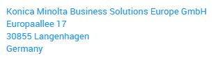

### Parameters

- `address`

  The address object to be displayed.

- `lookups`

  An object with arrays of lookups to be used to display the lookup values of the address. Required by the components are

  - `regions`
  - `countries`

- `showCommunicationData`

  An optional boolean parameter which toggles the display of the Emails, Faxes, Phones and Websites of the address. By default `false`

- `showNames`

  An optional boolean parameter which toggles the display of the *Name1*, *Name2* and *Name3* properties of the address. By default `true`

- `showLink`

  An optional boolean parameter which will put the displayed address inside a link to Google Maps. By default `true`

- `currentUserDropboxAddress`

  Optional parameter what expects the currentUserDropboxAddress ko.computed reference passed from viewModel

## addressEditor

The `addressEditor` component is a complete editor for an address and the related communication data (*Phones*, *Faxes*, *E-Mails* and *Websites*).

### Example

```html
<address-editor params="companyId: ParentId(),
                        contactId: Id(),
                        onLoad: $root.onLoadAddressEditor.bind($root),
                        editMode: 'person',
                        person: person">
</address-editor>
```

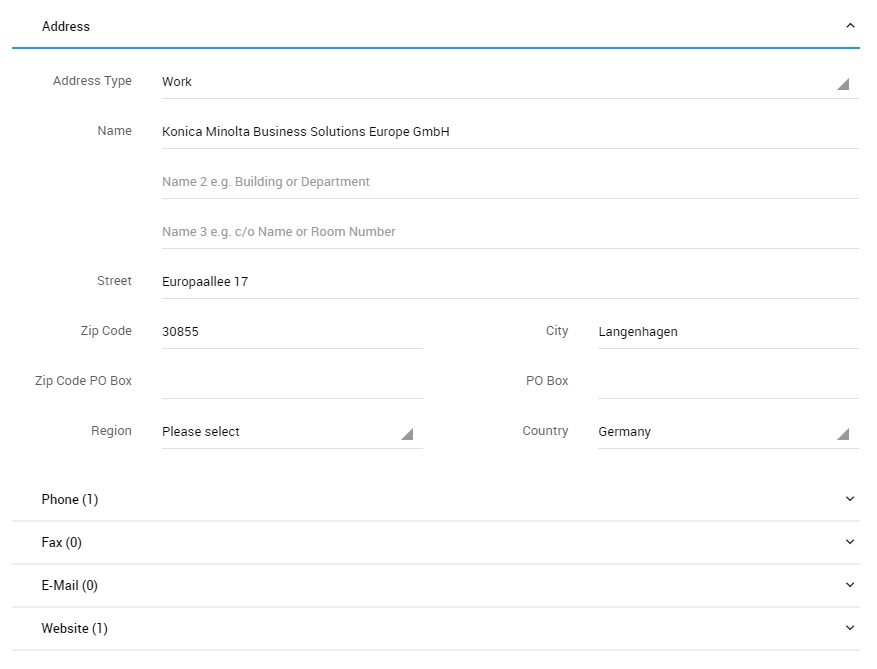

### Parameters

- `onLoad`

  An optional parameter which the address editor will call when initializing, passing itself as the only parameter. This can be used to let the address editor show validation errors (`showValidationErrors`) when the user hits the _save_ button or ask if the edited address is changes (`isAddressChanged`).

- `companyId`

  The contact id, the address is related to.

- `contactId`

  The contact id which will be used for new communication data.

- `editMode`

  An optional parameter which should be set to _person_  when editing the address and communication data related to a person.

- `person`

  This parameter is only needed when `editMode` is set to _person_ and the person does not yet exist in the database - e.g. when creating a person.

- `addressId`

  The id of the address to edit, or null if a new address should be created.

- `lookups`

  Optionally, the lookups required by the address editor can be passed as a parameter. If the parameter is omitted the component will read the lookups from the database. The required lookups are:

  - `AddressType`
  - `Region`
  - `Country`
  - `PhoneType`
  - `FaxType`
  - `EmailType`
  - `WebsiteType`

## addressSelector

The `addressSelector` component displays a dropdown list for an array of addresses.

### Example

```html
<div class="form-group" data-bind="validationElement: DeliveryAddressId">
  <div class="fg-line select">
    <label class="fg-label control-label"><%= Html.Localize("DeliveryAddress") %></label>
      <address-selector params="addressId: DeliveryAddressId,
                                lookups: $root.lookups,
                                addresses: $root.addresses"/>
      </div>
    <small class="help-block" data-bind="validationMessage: DeliveryAddressId"></small>
  </div>
```

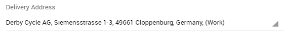

### Parameters

- `addresses`

  An array of addresses to display in the select list

- `allowAddNewAddress`

  Optional parameter which adds an option to create a new address into the select list. This parameter is used by the `addressEditor` component. By default `false`.

- `addressId`

  This parameter can be an observable and contains the id of the address that will be preselected. If you are not using `onAddressSelect` it is expected that `addressId` is an observable and it will be updated on address selection.

- `lookups`

  The lookups required to format the displayed addresses. The required lookups are:

  - `AddressType`
  - `Region`
  - `Country`

- `onAddressSelect`

    Optionally a callback function can be passed, which will be called with the address id when the selection changes. If `allowAddNewAddress` is `true` it will pass an empty GUID if the user selects _Add an Address_. If the user selects _Please Select_ it will pass `null` or `undefined`. `onAddressSelect` allows you to cancel the address selection - e.g. when you want to let the user confirm the change. For this to work you have to return a `promise`. If you use `onAddressSelect`, it is expected that you update your observables yourself (especially `addressId`).

## barcode scanner

The `barcode-scanner` component displays a button which triggers a barcode scanner. If there is no barcode scanner available then the button is not getting rendered. 

### Example

```html
<!-- ko component: { name: "barcode-scanner", params: { value: value, source: () => database.CrmArticle_Article.filter('it.ArticleTypeKey === this.articleTypeKey', { articleTypeKey: 'Material' }), column: 'BarCode', id: 'Id' } } -->
<!-- /ko -->
```


### Parameters

- `value`

  An observable where the barcode scanning result will be written to.

- `source`

  Optional parameter which can be specified together with `column`. If specified then after a barcode was scanned a query on the queryable returned by the function passed as the `source` will be executed with an additional filter on the column passed as `column`. The result will then be written to the `value` observable instead of the barcode.

- `column`

  Optional parameter, see `source`.

- `id`

  Optional parameter which can be specified together with `source` and `column`. If specified then the value of the `id` property will be written to the observable instead of the entire entity.

## contactData

The `contactData` component displays an address and the related communication data.

### Example

```html
<div data-bind="foreach: {data: addresses, as: 'address' }">
  <contact-data params="caption: 'Address #' + ($index() + 1),
                        address: address,
                        lookups: $root.lookups,
                        canDelete: true,
                        makeStandardAddress: $root.makeStandardAddress.bind($root),
                        loading: $root.loading">
  </contact-data>
</div>
```

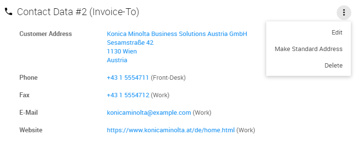

### Parameters

- `caption`

  The caption displayed above the address

- `address`

  The address object to be displayed

- `lookups`

  An object with arrays of the lookups required to display the data, these are:

  - `addressTypes`
  - `phoneTypes`
  - `faxTypes`
  - `emailTypes`
  - `websiteTypes`

- `canDelete`

  An optional boolean parameter whether the address should be deletable. By default `false`

- `makeStandardAddress`

  An optional function parameter which is called when the "Make Standard Address" action is selected. If the parameter is omitted, the action won't be displayed.

- `loading`

  An optional observable parameter which will be updated with the loading state.

- `editParameters`

  An optional string parameter which will be appended to the edit action link.

- `phones`

  Optionally specifies which phones should be displayed. If the parameter is omitted, the *Phones* property of the address will be used.

- `faxes`

  Optionally specifies which faxes should be displayed. If the parameter is omitted, the *Faxes* property of the address will be used.

- `emails`

  Optionally specifies which emails should be displayed. If the parameter is omitted, the *Emails* property of the address will be used.

- `websites`

  Optionally specifies which websites should be displayed. If the parameter is omitted, the *Websites* property of the address will be used.

- `contactType`

  Optionally specifies which contact type this contact data belongs to. Is used for the related permission checks. By default `Company`.

## dateFilter

The `dateFilter` component allows selecting a date range and is used by generic list filters.

### Example

```html
<div data-bind="component: { 
  name: 'date-filter', 
  params: { 
	allowFutureDates: false,
	allowPastDates: true,
	caption: 'Birthday',
    value: filter
  }
}"></div>
```

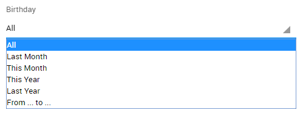

### Parameters

- `allowFutureDates`

  adds future dates to the select list ("Next 3 months", "Next month") and allows selecting future dates from the datepickers shown when selecting "From ... to ..."

- `allowPastDates`

  adds past dates to the select list ("Last month", "Last year")

- `caption`

  The caption displayed above the select list

- `value`

  The observable which will be updated with the selected date / date range

## emptyStateBox

The `emptyStateBox` is an emotional component for displaying empty states in any context.


### Example

```html
<empty-state-box params="mood: 'happy',
                         title: 'ContactTasksEmptyStateTitle',
                         text: 'NoTasksLeftInfo'"
                 data-bind="visible: tasks().length === 0">
</empty-state-box>
```

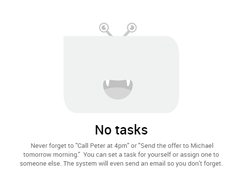

### Parameters

- `mood`

  The optional mood parameter supports the three moods *happy*, *sad*, and *excited*. If defined, a L-mon in that mood will appear.

- `title`

  The optional title parameter will display a `h2` title for the empty state. This parameter can also be a resource key, the component will try to translate it into the current user's language.

- `text`

  The optional text parameter will display the text of the empty state. This parameter can also be a resource key, the component will try to translate it into the current user's language.

## floatingActionButton

The purpose of the `floatingActionButton` component is to represent the primary action of the current context as explained in the [Material design guidelines](https://material.io/guidelines/components/buttons-floating-action-button.html).

### Example

```html
<floating-action-button 
                        data-route="Main/Note/EditTemplate" 
                        data-toggle="modal" 
                        data-target="#modal" 
                        params="title: 'AddNote'">
</floating-action-button>
```


### Parameters

- `href`

  The value the href attribute of the action button.

- `icon`

  The icon of the action. By default *plus*. This should be an icon from the [Material Design Iconic Font](http://zavoloklom.github.io/material-design-iconic-font/index.html) and will be prefixed with *zmdi-*.

- `title`

  The title of the action. By default *T_AddNew*. This parameter can also be a resource key, the component will try to translate it into the current user's language.

### Support for multiple actions

If you want to support multiple actions you need so use a slightly different definition. If you only provide one child `li` element, then the main button will automatically be replaced by the only child.
```html
<floating-action-button params="{ multiButtonMainIcon: 'plus' }">
	<li>
		<a href="#" data-mfb-label="<%= Html.Localize("AddBusinessRelationship") %>" data-route="Main/Relationship/EditTemplate/" data-toggle="modal" data-target="#modal">
			<i class="zmdi zmdi-accounts-alt"></i>
		</a>
	</li>
    <li>
	    <a href="#" data-mfb-label="<%= Html.Localize("AddProjectRelationship") %>" data-route="Main/Relationship/EditTemplate/" data-toggle="modal" data-target="#modal">
		    <i class="zmdi zmdi-file"></i>
	    </a>
    </li>
</floating-action-button>
```
  
## flotChart

The flotChart component uses the flotChart binding handler to feed a [Flot chart](http://www.flotcharts.org/).

### Example

```html
<flot-chart params="source: database.CrmProject_Project, 
                    mapAndGroupBy: mapAndGroupByFunc, 
                    axisXLabel: 'Date', 
                    axisYLabel: 'Value'">
</flot-chart>
```
```js
mapAndGroupByFunc = function(query) {
  return query
    .map(function(it) {
       return {
         d: it.CategoryKey,
         x: (it.DueDate / 1000).strftime("%Y", "unixepoch"),
         y: it.Value.sum()
       };
    })
    .groupBy("it.CategoryKey")
    .groupBy(function(it) { return (it.DueDate / 1000).strftime("%Y", "unixepoch") });
};
```

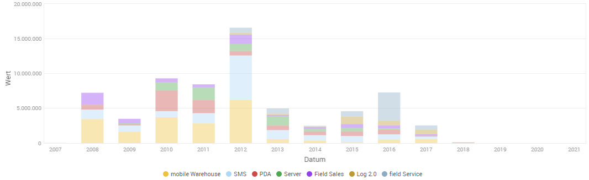

### Parameters

- `source`

  A JayData queryable which will be used as the source of the displayed data.

- `mapAndGroupBy`
  A function performing the mapping and the grouping. The mapping is expected to result in an object with the following properties:

  - `d` The label of the result
  - `x` The value on the x-axis
  - `y` The value on the y-axis
  
  For the grouping, usually only two groupBy function calls are required, the property of the x-axis and the property of the y-axis.

- `axisXLabel` An optional parameter with the caption of the x-axis. This parameter can also be a resource key, the component will try to translate it into the current user's language.

- `axisYLabel` An optional parameter with the caption of the y-axis. This parameter can also be a resource key, the component will try to translate it into the current user's language.

- `height` An optional parameter to specify a custom height for the chart.

- `unit` An optional parameter to specify the displayed unit of the elements.

- `options` An optional options object which will be passed to the flot library, for a list of all supported options please consult the [Flot API documentation](https://github.com/flot/flot/blob/master/API.md#plot-options).

## formElement

The purpose of the formElement component is to display any type of form element with the correct markup required by bootstrap and the material admin theme.

### Example

```html
<form-element params="value: DueDate, caption: 'DueDate', type: 'datePicker'"></form-element>
<form-element params="value: Value, caption: 'Value', type: 'text'"></form-element>
<form-element params="value: SourceTypeKey, caption: 'SourceTypeKey', type: 'select'">
	<select class="form-control" data-bind="value: value, options: $root.sourceTypes, optionsText: 'Value', optionsValue: 'Key'">
    </select>
</form-element>
<form-element params="value: BackgroundInfo, caption: 'BackgroundInfo', type: 'textarea'"></form-element>
```

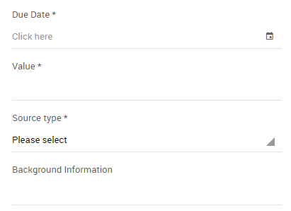

### Parameters

- `caption`

  The caption displayed as the label of the form element. This parameter can also be a resource key, the component will try to translate it into the current user's language.

- `type`

  The type of the input which should be rendered, currently supported are:

  - `email`
  - `password`
  - `select`
  - `text`
  - `textarea`
  - `datePicker`
  - `checkbox`
  - `number`
  - `durationPicker`
  - `timePicker`
  - `fileResource`
  - `select2`

- `value`

  The observable which should be bound to the form elment. If the parameter is a validated observable, rule violations will be displayed above the element. Also if the validated observable has a required rule, a required marker will be displayed next to the label.

- `accept`

  Optional parameter where accepted file formats can be defined for file inputs.

- `disable`

  Optional value or observable which determines if the input should be disabled.

- `placeholder`

  Display a placeholder (for keyboard input fields).

- `quantityStep`

  Optional parameter which set increasement or decreasement step of number inputs.

- `min`

  Optional parameter which set minimum value of number or money inputs.

## fullCalendar

The fullCalendar component uses the fullCalendar binding handler to feed a [FullCalendar](https://fullcalendar.io/) widget with an observable array of arbitrary objects. Additionaly the component supports rendering custom markup inside the toolbar of the calendar.

### Example

```html
<full-calendar params="items: items, getEvent: getTimelineEvent.bind($data), start: timelineStart, end: timelineEnd">
  <ul class="actions actions-alt">
    <li class="dropdown">
      <a href="#" data-toggle="dropdown">
        <i class="zmdi zmdi-eye"></i>
      </a>
      <ul class="dropdown-menu dropdown-menu-right">
        <li>
          <a href="#">Display creation date</a>
        </li>
        <li>
          <a href="#">Display last modification date</a>
        </li>
      </ul>
    </li>
    <li class="dropdown">
      <a href="#" data-toggle="dropdown">
        <i class="zmdi zmdi-more-vert"></i>
      </a>
      <ul class="dropdown-menu dropdown-menu-right">
        <li class="active">
          <a data-view="month" href="#">Month</a>
        </li>
        <li>
          <a data-view="agendaWeek" href="#">Week</a>
        </li>
        <li>
          <a data-view="agendaDay" href="#">Day</a>
        </li>
      </ul>
    </li>
  </ul>
</full-calendar>
```

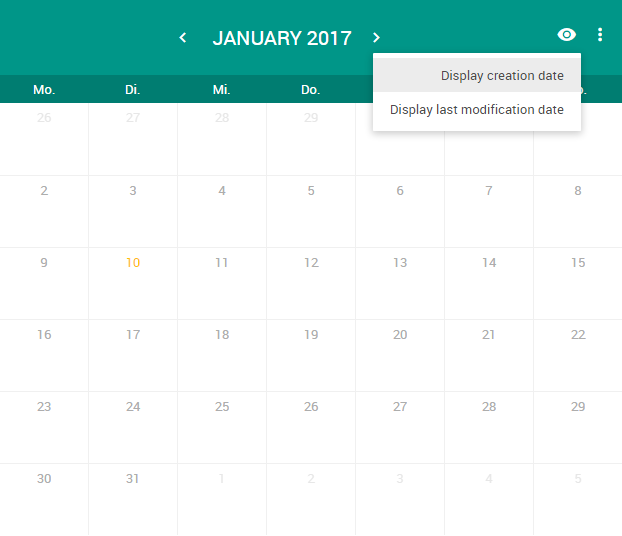

### Parameters

- `items`

  An array of items which should be displayed in the calendar.

  If this parameter is an observableArray, the calendar will update the events whenever the observableArray changes.

- `getEvent`

  A function mapping the passed object to a [FullCalendar Event Object](https://fullcalendar.io/docs/event_data/Event_Object/).

- `editable`

  Optional parameter which determines whether the events on the calendar can be modified. By default `false`

- `firstHour`

  Optional parameter which determines the fist hour that will be visible in the scroll pane. By default `7`

- `loading`

  Optional parameter which can be an observable toggling the loading state of the calendar.

- `selectable`

  Optional parameter which allows a user to highlight multiple days or timeslots by clicking and dragging. By default `false`

- `selectHelper`

  Optional parameter whether to draw a "placeholder" event while the user is dragging. By default `false`

- `start`

  This parameter should be used to pass an observable, which will be updated with the first visible day in the calendar whenever the user changes the displayed view. It can be used to trigger lazy loading of displayed elements. Note that in the monthly view this is often before the 1st day of the month, because most months do not begin on the first day-of-week.

- `end`

  This parameter should be used to pass an observable, which will be updated with the last visible day in the calendar whenever the user changes the displayed view. It can be used to trigger lazy loading of displayed elements.

## inline editor

The `inline-editor` components allows to have a quick edit of the items in generic lists.

In the item template actions, a new actions must be define in order to show or hide the editor.
The setEditing defined in the generic list viewmodel, will receive the viewModel and the item as parameters, to set the isEditing. Which will show or hide the inline editor.

```html
<li data-bind="if: $parents[2].setEditing">
  <a href="#" data-bind="click: $parents[2].setEditing.bind($data, $parents[2])">
    @(Html.Localize("Edit"))
  </a>
</li>
```

### Example

```html
 <div class="inline-editor" data-bind="if: $parent.isEditing && $parent.isEditing() === Id() ">
  <inline-editor params="context: $data ">
   <div class="row">
    <div class="col-xs-6">
     <form-element params="value: Name, caption: 'Name', type: 'text'"></form-element>
    </div>
    <div class="col-xs-6">
     <form-element id="SourceTypeKeyInlineEditor" params="value:SourceTypeKey, caption: 'SourceTypeKey', type: 'select'">
      <select name="SourceTypeKeyInlineEditor" class="form-control" data-bind="select2autocompleter: { data: value, autocompleteOptions: Helper.Lookup.getAutocompleteOptions('Main_SourceType')}"> </select>
     </form-element>
    </div>
   </div>
   <div class="row">
    <div class="col-xs-6">
     <form-element id="ParentIdInlineEditor" params="value: ParentId, caption: 'ParentId'">
      <select name="ParentIdInlineEditor" class="form-control" data-bind="select2autocompleter: { data: value, autocompleteOptions: { table: 'Main_Company', orderBy: ['Name'], joins: Helper.Company.getAutocompleteJoins(), customFilter: Helper.Company.getSelect2Filter, mapDisplayObject: Helper.Company.mapDisplayNameWithAddressForSelect2 } }"> </select>
     </form-element>
    </div>
    <div class="col-xs-6">
     <form-element id="ProductFamilyKeyInlineEditor" params="value: ProductFamilyKey, caption: 'ProductFamily'">
      <select name="ProductFamilyKeyInlineEditor" class="form-control" data-bind="select2autocompleter: { data: value, autocompleteOptions: { table: 'CrmArticle_ProductFamily', orderBy: ['Name'], mapDisplayObject: function (c) { return { id: c.Id, text: c.Name, item: c }; }, key: 'Id'} }"> </select>
     </form-element>
    </div>
   </div>
   <div class="row">
    <div class="col-xs-6">
     <form-element id="PriorityKeyInlineEditor" params="value:PriorityKey, caption: 'Priority', type: 'select'">
      <select name="PriorityKeyInlineEditor" class="form-control" data-bind="select2autocompleter: { data: value, default: Helper.Lookup.getLookupValue($root.lookups.priorities, value), autocompleteOptions: Helper.Lookup.getAutocompleteOptions('CrmProject_PotentialPriority')}"> </select>
     </form-element>
    </div>
   </div>
  </inline-editor>
 </div>
```
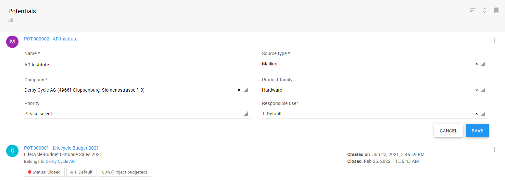

### Parameters

- `context`

  The ko context used inside the component.

- `onInit`

  An optional function that will be called **only once** when the editor is done initializing. The function is called with the editor viewmodel as parameter.

- `onBeforeSave`

  An optional function that will be called when the save button was hit, but before any saving to database begins. This can be used for advanced validations. The function is called with the editor viewmodel as parameter and should return a promise. If the promise is rejected the saving will be stopped.

- `onSave`

  An optional function that will be called right before saving to database. The function is called with the editor viewmodel as parameter. This is the point where you should attach attach entities to the database if needed. You can return a promise.

- `onAfterSave`

  An optional function that will be called after saving to database is done. The function is called with the editor viewmodel as parameter.

- `onCancel`

  An optional function that will be called when the cancel button was hit. The function is called with the editor viewmodel as parameter.


## miniChart

The `miniChart` component displays a small dashboard widget.

### Example

```html
<div class="col-sm-3">
  <mini-chart params="caption: 'NewDispatches', count: Helper.Dispatch.getNewDispatchesCount, color: 'cyan', url: '#/Crm.Service/ServiceOrderDispatchList/IndexTemplate?status=new'"></mini-chart>
</div>
<div class="col-sm-3">
<mini-chart params="caption: 'DueDispatches', count: Helper.Dispatch.getDueDispatchesCount, color: 'red', url: '#/Crm.Service/ServiceOrderDispatchList/IndexTemplate?status=due'"></mini-chart>
</div>
```

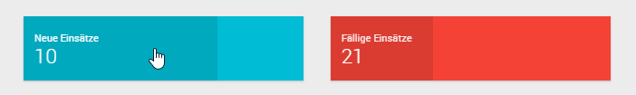

### Parameters

- `caption`

  The caption or the resource key of the caption to be displayed.

- `count`

  A function returning a promise resolving with the amount to be displayed.

- `color`

  Optional parameter with the background color of the widget.

- `url`

  To URL to navigate to when clicking the widget.

## pmbb

The `pmbb` component (pmb-block) can be used to display a block inside a details page, which can be toggled between view-mode and edit-mode.

### Example

```html
<pmb-block params="icon: 'account', caption: 'General', context: { project: project }">
  <pmbb-view>
    <!-- ko with: project -->
    <pmbb-view-entry params="caption: 'Name'">
      <span data-bind="text: Name"></span>
      <span class="c-gray" data-bind="translatedText: 'Unspecified', ifnot: Name"></span>
    </pmbb-view-entry>
    <pmbb-view-entry params="caption: 'DueDate'">
      <span data-bind="dateText: DueDate"></span>
      <span class="c-gray" data-bind="translatedText: 'Unspecified', ifnot: DueDate"></span>
    </pmbb-view-entry>
    <pmbb-view-entry params="caption: 'ResponsibleUser'">
      <span data-bind="userDisplayName: ResponsibleUser"></span>
      <span class="c-gray" data-bind="translatedText: 'Unspecified', ifnot: ResponsibleUser"></span>
    </pmbb-view-entry>
    <pmbb-view-entry params="caption: 'SourceTypeKey'">
      <span data-bind="lookupValue: SourceTypeKey, lookups: $root.sourceTypes()"></span>
      <span class="c-gray" data-bind="translatedText: 'Unspecified', ifnot: SourceTypeKey"></span>
    </pmbb-view-entry>
    <!-- /ko -->
  </pmbb-view>
  <pmbb-edit>
    <!-- ko with: project -->
    <pmbb-edit-entry params="caption: 'Name', validationElement: Name">
      <input type="text" class="form-control" data-bind="value: Name">
    </pmbb-edit-entry>
    <pmbb-edit-entry params="caption: 'DueDate', validationElement: DueDate">
      <input type="text" class="form-control date-picker" data-bind="datePicker: DueDate" placeholder="Click here">
    </pmbb-edit-entry>
    <pmbb-edit-entry params="caption: 'ResponsibleUser'">
      <select class="form-control" data-bind="value: ResponsibleUser, options: $root.users, optionsCaption: 'Please select', optionsText: 'DisplayName', optionsValue: 'Id'">
      </select>
    </pmbb-edit-entry>
    <pmbb-edit-entry params="caption: 'SourceTypeKey'">
      <select class="form-control" data-bind="value: SourceTypeKey, options: $root.sourceTypes, optionsText: 'Value', optionsValue: 'Key'">
      </select>
    </pmbb-edit-entry>
    <!-- /ko -->
  </pmbb-edit>
</pmb-block>
```

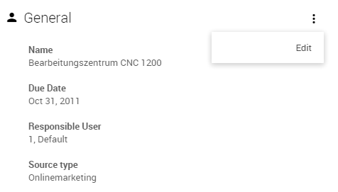

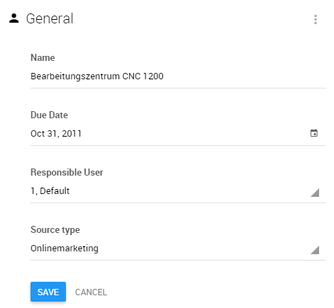

### Parameters

The `<pmb-block>` itself accepts the following parameters:

- `icon`

  The icon of the action. By default *plus*. This should be an icon from the [Material Design Iconic Font](http://zavoloklom.github.io/material-design-iconic-font/index.html) and will be prefixed with *zmdi-*.

- `caption`

  The caption displayed on top of the block. This parameter can also be a resource key, the component will try to translate it into the current user's language.

- `context`

  The ko context used inside the component. Can be a single observable, or an array of observables.

- `css`

  Optional additional css class(es) for the block.

- `condition`

  An optional boolean condition whether the block can be switched into edit mode. If this parameter is an observable value, the binding will update the element's value whenever the value changes. If the parameter isn't observable, it will only set the element's value once and will not update it again later. By default the edit mode can always be enabled.

- `onInit`

  An optional function that will be called **only once** when the block is done initializing. The function is called with the block's viewmodel as parameter.

- `onBeforeSave`

  An optional function that will be called when the save button was hit, but before any saving to database begins. This can be used for advanced validations. The function is called with the block's viewmodel as parameter and should return a promise. If the promise is rejected the saving will be stopped.

- `onSave`

  An optional function that will be called right before saving to database. The function is called with the block's viewmodel as parameter. This is the point where you should attach attach entities to the database if needed. You can return a promise.

- `onAfterSave`

  An optional function that will be called after saving to database is done. The function is called with the block's viewmodel as parameter.

- `onCancel`

  An optional function that will be called when the cancel button was hit. The function is called with the block's viewmodel as parameter.

- `showHeader`

  An optional boolean condition whether the header of the block should be displayed. If this parameter is an observable value, the binding will update the element's visibility whenever the value changes. If the parameter isn't observable, it will only set the element's visibility once and will not update it again later. By default the header will always be shown.

- `buttons`

  An optional array, each element should contain an object with the following properties: 
  1. `css`: optional string
  2. `text`: optional string
  3. `click`: optional function
  4. `requiredPermission`: optional object

  These buttons will be rendered under the Edit button of the pmb-block.

The `<pmbb-view-entry>` elements inside the `<pmbb-view>` container element accept the following parameters:

- `caption`

  The caption of the entry. This parameter can also be a resource key, the component will try to translate it into the current user's language.

The `<pmbb-edit-entry>` elements inside the `<pmbb-edit>` container element accept the following parameters:

- `caption`

  The caption of the entry. This parameter can also be a resource key, the component will try to translate it into the current user's language.

- `validationElement`

  An optional parameter which will be passed to the [validationElement](https://github.com/Knockout-Contrib/Knockout-Validation/wiki/Validation-Bindings#validationelement) binding of the entry.

  _Please note_: validations on `ExtensionValues` only works when context set as follows:
```html
  <!-- ko with: $data.ExtensionValues -->
    <pmbb-edit-entry id="InitiatorGroup" params="caption: 'CustomerInitiatorGroups', validationElement: InitiatorGroupKey">
        <select class="form-control" data-bind="select2autocompleter: { data: InitiatorGroupKey, autocompleteOptions: { table: 'CustomerName_InitiatorGroup', mapDisplayObject: Helper.Lookup.mapLookupForSelect2Display, onSelect: $root.onCustomerInitiatorSelectEdit.bind($root,$root.currentUser()) } }, value: InitiatorGroupKey">
        </select>
    </pmbb-edit-entry>
<!-- /ko -->
```

## signaturePad

The `signaturePad` component is based on the `signaturePad` binding handler used to bind an observable to the input of a [jQuery SignaturePad plugin widget](https://github.com/thread-pond/signature-pad). Unlike the binding handler, this component can not only save the JSON representation of the signature, but also the name of the signee and the date the signature was done.

### Example

```html
<signature-pad params="signature: Signature,
                       signatureDate: SignatureDate,
                       signatureName: SignatureName">
</signature-pad>
```

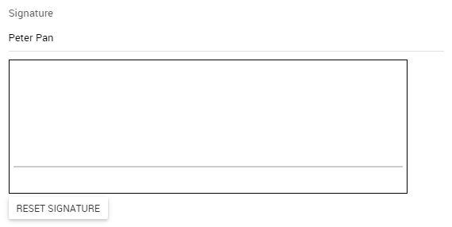

### Parameters

- `signature`

  The observable used to save the JSON representation of the signature to, or regenerate an existing signature from. This is the value passed to the `signaturePad` binding handler.

- `signatureDate`

  The observable which will be updated with the current date as soon as the signature is done. When the signature is reset, the value of the observable is set to `null`.

- `signatureName`

  The observable which will be updated with the name entered in the text input above the signature pad.

## note
The `note` component displays the text of a note. It checks if the note is system generated and will display a localized generated text or the actual text saved to the note.

To generate the text, registered providers are used. To register one, call `window.Main.ViewModels.NoteViewModel.registerDisplayTextProvider`. The provider is called with a plain javascript note object and is expected to return a promise that will resolve to the generated text.

### Example I
```
<span data-bind="component: { name: 'note', params: { note: theNote } }"></span>
```
### Example II
If the current $data is the actual note, you can just use:
```
<span data-bind="component: 'note'"></span>
```