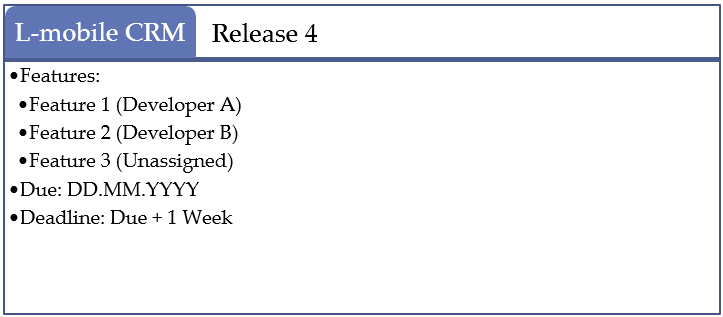
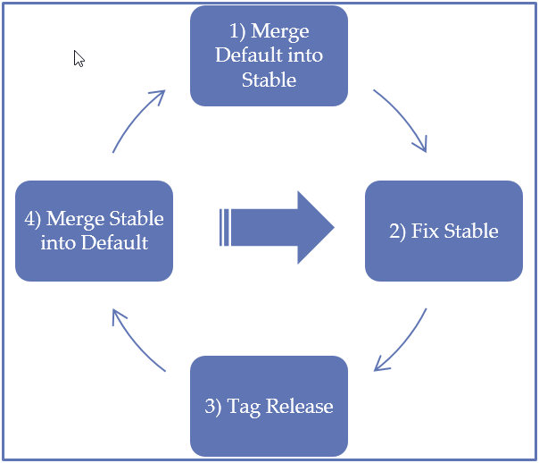
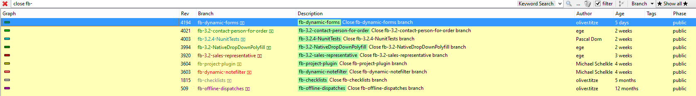
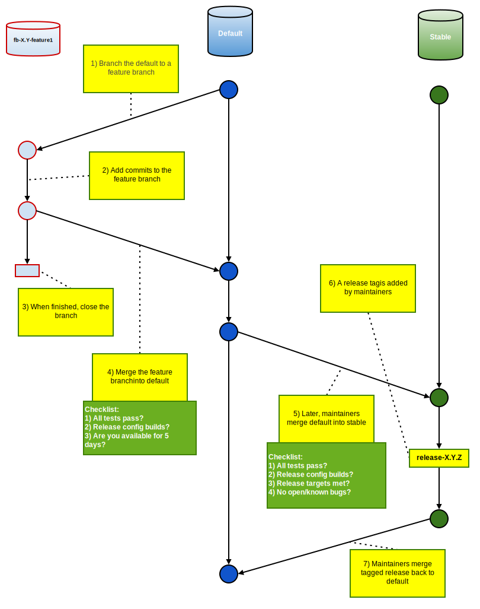
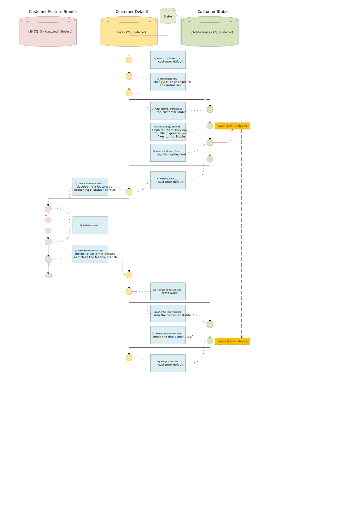

# Source Control
In this section, you'll find the source control practices that all developers are required to follow.

## Good to Know
Some remarks about interpreting the rules
.
* The rules mentioned in the branching section are enforced
* Project managers can add a tag to signal last deployed state in a customer branch
    * _i.e. deployment-lmobile_

### General rules of thumb

* Do not be afraid to open branches
* Be afraid when committing to main branches
* Be afraid when merging to main branches
* Do not be afraid to ask

## Concepts
Here are some concepts to get started

### Releases
Releases are the safe-to-install points in the development. L-mobile software will be maintained under numbered releases. The numbering system is in the format X.Y.Z where:

* X is the major release number, which indicates a 
    * Core change which is backwards incompatible
    * Change-set, which is not offered as a free upgrade to a previous version
    * Milestone, which marks an identifiable completeness of the product
* Y is the minor release number, which indicates the inclusion of an additional, single feature over the previous minor release.
* Z is the build (or revision) number, which may indicate that something broken in the last revision is fixed in this revision. It should be fairly easy to upgrade to a release with only the revision number different. 

In the source code management system, releases are tagged as such: release-X.Y.Z but revision can be omitted (release-X.Y) when there is none for the given release.

### Release Targets
Release targets are the plans for a major (X) or a minor (Y) version change. They have a due date, and may also have a hard deadline to cover the worst case scenarios. They are declared and discussed in the team meetings. Every change included in the target is added to issue tracker with the proper release field. A release target is finalized in an email message, after the team meetings. Later additions can occur by creating a “Feature Request” issue in the tracker. Unissued features cannot be merged to the default branch.

## Branching
Branches are used to separate and organize the changes in the source code.

----
**Warning** `Default` branch doesn't accept commits other than bug-fixes, merges and merge-fixes since October 2013. All, even the small, features must be developed in a feature branch.

----

Branches are used to separate and organize the changes in the source code.

All branches, except `Stable` and `Default`, have their base major and minor version number in their name. This makes it easier when grafting bug-fixes and merging them to other branches.

## Branches for the main development cycle
These branches are where you go if you are working on the base CRM features.

----
**Warning** `Default` branch doesn't accept commits other than bug-fixes, merges and merge-fixes since October 2013. All, even the small, features must be developed in a feature branch.

----

### Default
Here is where all the feature branches merge. There is a single `Default` branch. 

----
**Warning** `Default` branch doesn't accept commits other than bug-fixes, merges and merge-fixes since October 2013. All, even the small, features must be developed in a feature branch.

----

Here is where all the feature branches merge. There is a single `Default` branch. 

----
**Important** __No commits other than bug-fixes and merges are allowed.__

----

* Build: `Default` branch should always be buildable under the “Debug” and "Release" settings.
* Automated tests: All automated tests need to pass. When broken, they need to go back to working state in 5 days.
* Bugs: Known bugs are not tolerated, and need to be fixed in 5 days. If the bug appears on `Stable` too, it needs to be fixed there and then merged / grafted back to `Default`.
* Merging to `Default`, requires a developer to pledge his/her availability to support and maintain the `Default` branch for 5 days.

### Stable
The branch which is the base for new deployments. There is a single `Stable` branch. 

----
**Important** __No commits other than tag-additions, bug-fixes and merges are allowed.__

----

* Build: Any point of revision in `Stable` needs to be buildable under the “Debug” and "Release" settings.
* Automated tests: All automated tests need to pass. __Committing to `Stable` is strictly not allowed with a broken build or unit tests.__
* Bugs: Known bugs are not tolerated. Any newly discovered bugs, if present, must be fixed here. (Other than those marked with “Won’t Fix” in the issue tracker).
* Merging to `Stable`, requires a developer to pledge his/her availability to support and maintain the `Stable` branch for 5 days.

### Feature Branches
The branches where new features are developed.

----
**Warning** Feature branches have their target version in their name, instead of the version of their parent. This is an exception.

----

The branches where new features are developed. They ultimately merge to the `Default` branch and also may merge to other feature branches (including customer feature branches) but nothing else. __They should be closed as soon as they are merged to the relevant branches.__

* Build: Can be broken.
* Automated tests: Can be not passing. No test can be changed unless the logic changes. New tests can be added.
* Bugs: All bugs are tolerated. 
* Branch naming convention: `fb-X.Y-(feature_name)`

## Branches for the customer development cycle
Somewhat the same as the main development cycle model, adapted for the customers.

### Customer Default Branches
Here is where all the customer feature branches merge.

* Identical to the `Default`, except…
    * Can’t be merged to the `Default` or `Stable` in any way.
    * Will be merged to the customer's stable, before a deployment.
* Branch naming convention: `cb-X.Y-(customer_name)`

### Customer Stable Branches
The branches that actually got / gets to be deployed to customer production systems

* Identical to the `Stable`, except…
    * Can’t be merged to the `Default` or `Stable` in any way.
    * Will be merged to the customer's default after a bugfix.
* Branch naming convention: `cb-stable-X.Y-(customer_name)`

### Customer Feature Branches
The branches that new features are developed for customers, that are deployed to test systems

* Mostly identical to a feature branch, except…
    * If needs to be merged to the `Default` too (apart from being merged to the customer default), needs to be branched as a Feature Branch and generalized first, before being merged to `Default`.
    * Only a single plugin-specific portion of the CRM code can be changed. If customer needs more than one plugin, they need to live in separate Customer Feature Branches until they are merged.
* Branch naming convention: `cfb-X.Y-(customer_name)-(feature_name)`
												
## Other Branches
Probably you'll rarely work with these

### Experimental Branches
The branches where “proof-of-concept” features are developed

* Not regulated in any way – No guarantees of any stability
* Unlikely to merge to `Default`.
* When it is decided that an experimental will be picked up for a release, it first needs to be converted to a feature branch and comply with all of its rules.
* Branch naming convention: `experimental-X.Y-(feature_name)`
* After one month of inactivity, an experimental branch can be closed by anyone.

### Merge Branches
The branches where big feature branches merge together, before merging to the `Default`.

* Created only when two feature branches are likely to conflict.
* Will merge to `Default` and be closed as soon as the solution builds in the release config and the tests pass.
* Branch naming convention: `merge-(feature_1_name)-(feature_2_name)`

### Bugfix Branches
Created when a lot of small bug-fixes about a specific part of the application will be applied.

  * It can be branched off from stable and merged back to stable, and stable only.
  * Named as `bugfix-X.Y-(broken_feature_or_bug_name)`
    * example: *bugfix-3.2-order*

## Operations
Explanations of some common operations in Mercurial, along with the cases when to use them and L-mobile specific conventions.

### Commit
Make changes and publish them. There is a single rule, when committing:

----
**Important** Make it atomic! (I was very close to making this text huge and blinking. It is THAT important.)

----

Your commits should be easy to summarize, better when only in one sentence.

**Good Examples:**

  * Bugfix(334512): Button for deleting a contact now works.
  * Feature(348234): Generic Lists can now be sorted
  * Adds missing files to the repository for rendering Generic Lists (introduced at rev. 348234).

**Bad Examples:**

  * It works!!11 *(What works?)*
  * Fixed stuff. *(Stuff??)*
  * Fixed Generic Lists *(Which part? There must have been an issue for it, right?)*
  * Saved the world. *(Which world? Joke aside, please don't do this. By the way, the maintainer of this documentation is exempt from this.)*
  
### Merge {#operations-merge}
Merge changes in different branches. Merging may seem like the simplest operation but it is also the source of the mythical `Merge Errors`. Many common scenarios require at least a merge to complete.

Developers need to know and take care of the following when merging:

* When a conflict happens, take your time to review the changes. Fixing bugs later takes more time.
* You can use a different merge tool (other than kdiff, for example winmerge). Choose as you wish. 
* Before pushing the merge, make sure that the solution builds in the release mode.
* Make sure again. Clean the bin folder. Rebuild. Click a few buttons maybe? Do tests pass?
* Do not change the failing tests. Change the failing code. If the logic has changed, consult with the test author.
* Don't merge to `Stable`, `Default` or any customer's `Stable` or `Default`, if you won't be there to fix it if anything goes wrong for 5 days.
    * This is not a hard limit. If you are making a small change, you can use some common sense. Just be responsible.
																																				
**Helpful resources**

* Resolving Conflicts [video](http://www.youtube.com/watch?v=3kyAbHiUqZQ)
* Documentation on merging [here](http://tortoisehg.bitbucket.org/manual/2.9/commit.html#merging)

### Graft
Copying a the change-set from a single commit to another branch. Grafting is copying a the change-set from a single commit to another branch. It can be used on the following cases:

* A bug-fix is done on the customer branch. It is later discovered that the same bug also exists at `Stable`.
* A core system change made in a feature branch is needed by other feature branches. (Even though for this change itself, there must have been a separate feature branch but we don't live in a perfect world.)
* A bug-fix in the `Stable` is needed immediately at another branch.
* Porting a feature from a customer-feature-branch to a feature branch

The same checklist used while merging is also valid for grafts. See [merge](#operations-merge) operation.

## Roles
There are different roles for working in the repository.

### Maintainers
Maintainers are developers with the special task of making sure that a stable version of the software exists. 
The usual of a maintainer is as follows:

* Merge the Default into the Stable when either
    * All features in a release are complete 
    * A minor or major release needs to be published 
* Fix the Stable until it really is stable, when doing so, for each bug, they need to:
    * Fix it
    * Commit change
    * Tag by incrementing the bug-fix number (Z)
    * Merge Stable into Default
* Merge the closed feature branches into the Default

Maintainers are responsible for the stability of the releases. Ensuring stability can be achieved by automatic or manual testing. Maintainers are free to adopt any testing practices to increase efficiency.
If and when automatic tests are written and they are passing, developers have to keep them passing. In feature branches, new tests can be added to ensure that the maintainers can easily detect if the additional feature still works.

### Useful information for maintainers

**Find all closed branches**

In tortoise search bar, you can type:

	closed() and not parents(branch('default')) and keyword('fb-')
	
to get this result

	
### Developers
There is nothing to see here yet.

### Project Managers
There is nothing to see here yet.

## Common Scenarios
Here are some common scenarios developers face when using source control and ways to deal with those.

----
**Note** The svg code in these documents can be edited easily by using software such as https://draw.io.

----

### Developing a feature
You can follow these steps when developing a simple feature:

### FAQ

**What if it takes too long for my feature branch to be available in the stable? My customer can't wait!**

You can merge the feature branch directly to a `Customer Feature Branch`. In this case, all the burden of testing and maintaining the feature for the customer will be on you. As merging keeps history information of the individual changes, when stable is ready, there will be no problems for merging it in the future to get additional changes.

### Development for Customers

