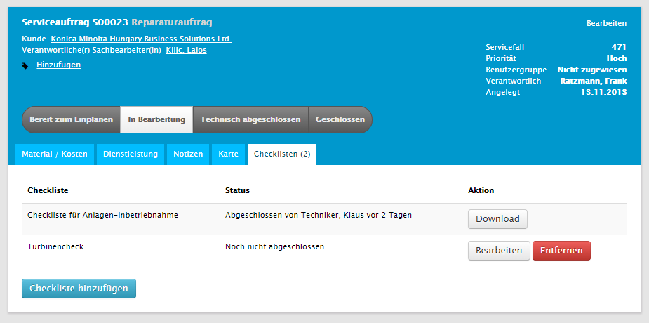
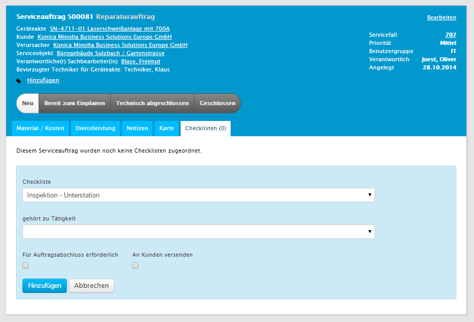
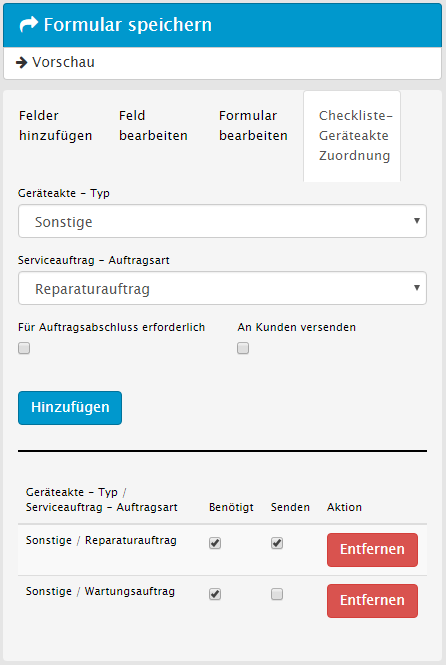

# Checklisten {#smschecklists}

Das Modul Checklisten integriert die [dynamischen Formulare](#dynamische-formulare) in die Serviceprozesse und erlaubt es beliebige Checklisten zu definieren und mit Serviceaufträgen zu verknüpfen.

## Checklisten zuordnen {#smschecklists-checklisten-zuordnen}

In der Detailansicht eines Serviceauftrags findet man über den Reiter *Checklisten* eine Übersicht der dem Auftrag zugeordneten Checklisten sowie deren momentaner Bearbeitungstatus. Sofern Rückmeldungen zu Checklisten vorhanden sind, kann an dieser Stelle auch eine Kopie als PDF heruntergeladen werden.

Weiterhin können dem Auftrag an dieser Stelle beliebig viele weitere Checklisten über die Schaltfläche *Checkliste hinzufügen* zugeordnet werden.

Beim Hinzufügen einer Checkliste stehen, neben der Möglichkeit diese einer bestimmten Tätigkeit zuzuordnen, folgende Optionen zur Verfügung:

__Für den Auftragsabschluss erforderlich__ Über diese Checkbox kann entschieden werden, ob die Checkliste zwingend (vollständig) ausgefüllt werden muss, bevor der Auftrag abgeschlossen wird.

__An Kunden versenden__ Soll die Checkliste nach dem Ausfüllen zusammen mit dem Servicebericht als PDF an den Kunden versendet werden, so kann diese Checkbox ausgewählt werden.

## Automatische Zuordnung {#smschecklists-automatische-zuordnung}

Zu jeder Checkliste können Regeln hinterlegt werden, wann diese z.B. Wartungsaufträgen automatisch zugeordnet werden sollen. Die Zuordnung findet hierbei über den Geräteaktentyp und die Auftragsart des Serviceauftrags statt, d.h. sobald ein Serviceauftrag für eine Geräteakte manuell oder automatisch erstellt wird, werden alle Checklisten automatisch an den Auftrag angefügt, zu denen eine passende Kombination an Geräteaktentyp und Serviceauftragsart hinterlegt wurde.

Auch bei den Regeln für die automatische Zuordnung kann sowohl festgelegt werden, ob die Checklisten jeweils für den Auftragsabschluss erforderlich sind, und auch ob die ausgefüllte Checkliste an den Einsatzbericht mit angefügt werden soll.