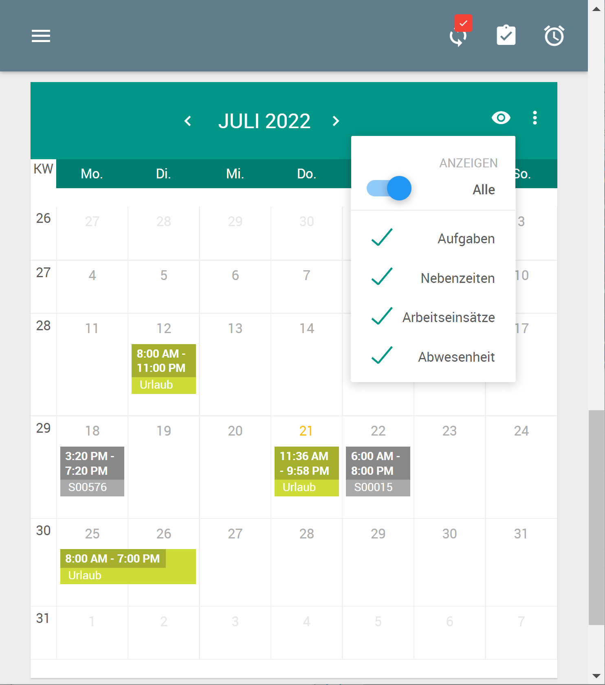

# Einsatzplanung Connector

## Allgemein

Das Plugin *Sms.Einsatzplanung.Connector* dient zur Anbindung der grafischen Einsatzplanung.

## Darstellung von Abwesenheiten
Abwesenheiten, welche in der grafischen Einsatzplanung eingeplant werden, können in den Kalender-Ansichten im mobilen Client angezeigt werden. Diese Option kann über den Punkt *Abwesenheit* aktiviert werden.
Das Auswahlfeld zum Anzeigen von Abwesenheiten kann auch über entsprechende Konfiguration (in den App-Settings) komplett deaktiviert werden.

